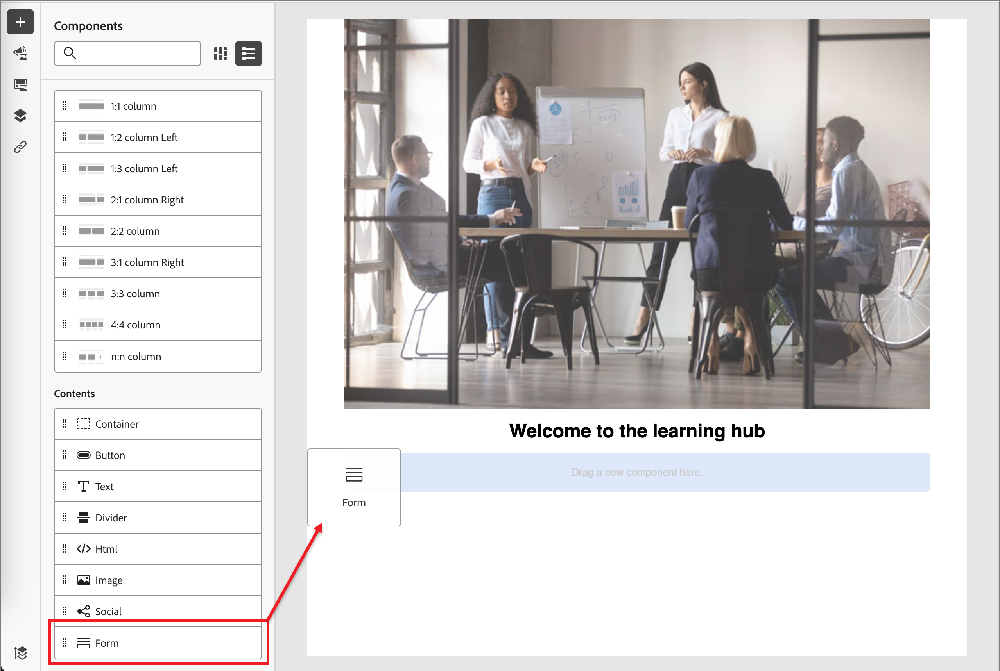

# 內容製作 — 新增表單

表單是可重複使用的元件，可被Adobe Journey Optimizer B2B edition中的多個登入頁面和登入頁面範本參照。 這是欄位區塊和提交按鈕，可以預先建立並快速插入，讓頁面設計更快更一致。

下列範例概述在設計頁面時新增表單的步驟。

1. 在&#x200B;**[!UICONTROL 內容]**&#x200B;區段下，拖曳&#x200B;**[!UICONTROL 表單]**&#x200B;專案並將其放到頁面設計空間的結構元件中。

   {width="600"}

   >[!TIP]
   >
   >若要新增表單，使其佔據電子郵件內的整個水準版面，請新增1:1欄結構，然後將表單拖放至其中。

1. 按一下元件工具列中的&#x200B;_表單_&#x200B;圖示，或使用右側的&#x200B;**[!UICONTROL 內嵌表單]**&#x200B;屬性來選取已發佈的表單。

   {width="600"}

1. 如果您要覆寫表單的預設&#x200B;**[!UICONTROL 後續追蹤型別]**，請根據您的頁面或範本需求變更設定。

   這也稱為表單的&#x200B;_感謝頁面_，此設定會決定訪客提交表單時會發生什麼情況：

   * **[!UICONTROL 停留在頁面]** — 選擇此選項可在提交表單時讓訪客停留在相同頁面。

   * **[!UICONTROL 登陸頁面]** — 選擇此選項可選取任何Journey Optimizer B2B edition或Marketo Engage登陸頁面作為後續追蹤。

   * **[!UICONTROL 外部URL]** — 選擇此選項可指定任何URL作為後續頁面。 訪客提交表單後，瀏覽器會載入指定的URL。

     >[!TIP]
     >
     >如果您希望使用表單下載檔案，您可以指定託管檔案的URL。 透過此設定，提交按鈕可作為下載按鈕運作。

   {width="280"}

1. 如果您要依裝置型別限制表單顯示，請變更&#x200B;**[!UICONTROL 顯示選項]**&#x200B;設定：

   * **[!UICONTROL 僅在案頭裝置上顯示]**
   * **[!UICONTROL 僅在行動裝置上顯示]**
   * **[!UICONTROL 在所有裝置上顯示]** （預設）

1. 如有需要，請選取右側面板中的&#x200B;**[!UICONTROL 樣式]**&#x200B;索引標籤，以設定頁面中的表單邊界。
