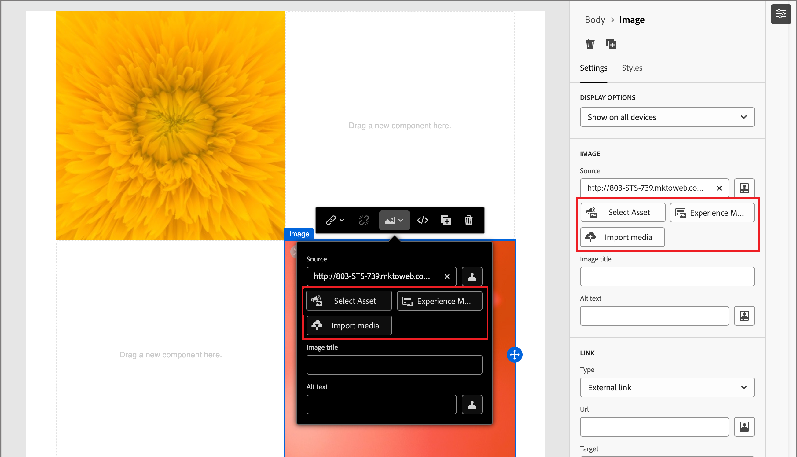

# 內容製作 — 資產

在視覺內容編輯器中，選取左側顯示的&#x200B;_Assets_&#x200B;圖示。

>[!NOTE]
>
>如果您有Experience Manager Assetsas a Cloud Service以及預設Adobe Marketo Engage Design Studio的訂閱，您必須在建立電子郵件、電子郵件範本或視覺片段時選擇[影像來源](../user/content/assets-overview.md#choose-an-asset-source)。 不過，您也可以在開啟內容設計工具進行編輯之前選取影像來源。

下列範例概述將資產新增至範本內容的步驟：

1. 若要開啟資產庫，請按一下&#x200B;_Assets_&#x200B;圖示。

   從資產選取器中，您可以直接選取儲存在來源資料庫中的資產。

1. 將影像資產拖放至結構元件中，以新增資產。

   {width="800" zoomable="yes"}

   如需有關使用來源型別中的資產的詳細資訊，請參閱[將資產新增至您的內容](../user/content/assets-overview.md#add-assets-to-your-content)。

1. 在畫布上選取現有的影像資產，然後在影像來源工具中按一下&#x200B;**[!UICONTROL 選取資產]**，以取代現有的影像資產。

   {width="700" zoomable="yes"}
