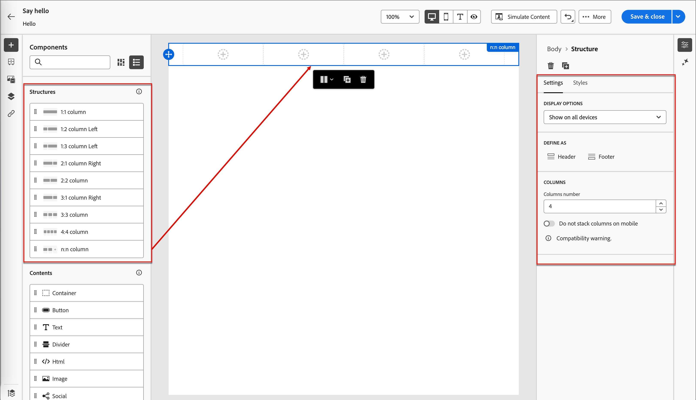

# 內容製作 — 元件

1. 若要開始您的內容設計，請從&#x200B;**[!UICONTROL 結構]**&#x200B;拖曳一個專案，然後將其放到畫布上。

   視需要從&#x200B;_[!UICONTROL 結構]_&#x200B;新增任意數目的專案，並編輯右側窗格中每個專案的設定。

   >[!TIP]
   >
   >選取&#x200B;_[!UICONTROL n:n資料行]_&#x200B;元件以定義您所選擇的資料行數目（介於3到10之間）。 您也可以移動欄下方的箭頭來定義每欄的寬度。

   {width="800" zoomable="yes"}

   每個欄大小不能小於結構元件總寬度的10%。 只能移除空白欄。

   如需使用和格式化這些元件的詳細資訊，請參閱&#x200B;_[結構元件](../user/content/structure-components.md)_。

1. 展開&#x200B;**[!UICONTROL 內容]**&#x200B;區段，並視需要新增內容元件至一或多個結構元件。

   {width="800" zoomable="yes"}

   * [容器](../user/content/content-components.md#container)
   * [按鈕](../user/content/content-components.md#button)
   * [文字](../user/content/content-components.md#text)
   * [分隔線](../user/content/content-components.md#divider)
   * [影像](../user/content/content-components.md#image)
   * [社交](../user/content/content-components.md#social)
   * [表單](../user/content/content-components.md#form) （僅登入頁面）

1. 如有需要，您可以在&#x200B;_[!UICONTROL 設定]_&#x200B;或&#x200B;_[!UICONTROL 樣式]_&#x200B;標籤中為每個元件進行其他自訂。

   例如，您可以變更每個元件的文字樣式、邊框間距或邊界。

1. 若要新增條件式內容並根據條件式規則將內容調整至目標設定檔，請選取內容元件，然後按一下元件工具列中的「**[!UICONTROL 啟用條件式內容]**」圖示。

   如需詳細資訊，請參閱&#x200B;[_條件式內容_](../user/content/conditional-content.md)。
