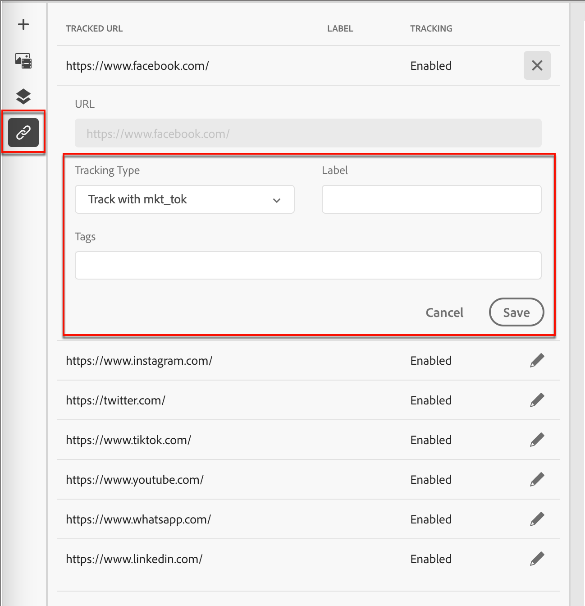

# 內容製作 — 連結追蹤

1. 按一下左側的&#x200B;_[!UICONTROL 連結]_&#x200B;圖示（）以顯示您要追蹤內容中的所有連結URL。

1. 如有需要，請按一下&#x200B;_編輯_ （ ）圖示，並修改&#x200B;**[!UICONTROL 追蹤型別]**&#x200B;或&#x200B;**[!UICONTROL 標籤]**。

   您也可以為連結新增&#x200B;_標籤_。

{width="500"}
