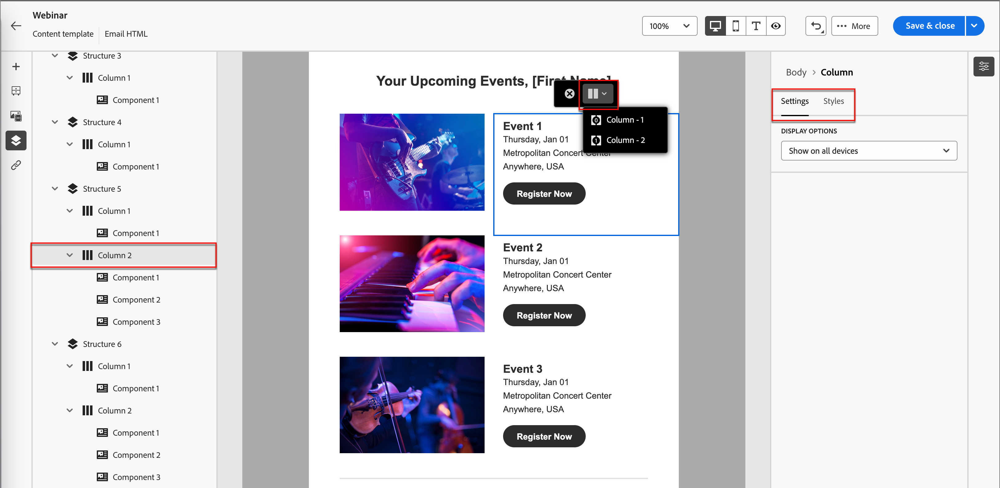

# 內容製作 — 導覽

當您在視覺化設計空間中使用內容時，可以使用導覽樹狀結構來存取元件、欄和內容元素。 按一下左側的&#x200B;_[!UICONTROL 導覽樹狀結構]_&#x200B;圖示（）以顯示樹狀結構。

{width="800" zoomable="yes"}

下列範例概述在具有欄的結構元件內調整邊框間距和垂直對齊的步驟。

1. 直接在畫布中選取結構元件中的欄，或使用左側顯示的&#x200B;_導覽樹狀結構_。

1. 在欄工具列中，按一下&#x200B;_[!UICONTROL 選取欄]_&#x200B;工具，然後選擇您要編輯的工具。

   您也可以從結構樹中選取它。 該欄的可編輯引數會顯示在右側的&#x200B;_[!UICONTROL 設定]_&#x200B;和&#x200B;_[!UICONTROL 樣式]_&#x200B;索引標籤中。

   在視覺化設計工具中顯示的{width="800" zoomable="yes"}

1. 若要編輯欄屬性，請按一下右側的&#x200B;_[!UICONTROL 樣式]_&#x200B;索引標籤，並根據您的需求加以變更：

   * 針對&#x200B;**[!UICONTROL 背景]**，視需要變更背景顏色。

     清除透明背景的核取方塊。 啟用&#x200B;**[!UICONTROL 背景影像]**&#x200B;設定，以使用影像做為背景，而非純色。

   * 針對&#x200B;**[!UICONTROL 對齊]**，請選取&#x200B;_上_、_中_&#x200B;或&#x200B;_下_&#x200B;圖示。
   * 針對&#x200B;**[!UICONTROL 內距]**，定義所有邊的內距。

     若要微調內距，請選取&#x200B;**[!UICONTROL 每一邊不同的內距]**。 按一下&#x200B;_鎖定_&#x200B;圖示以中斷同步處理。

   * 擴充&#x200B;**[!UICONTROL 進階]**&#x200B;區段以定義資料行的內嵌樣式。

   {width="700" zoomable="yes"}

1. 如有需要，請重複這些步驟來調整元件中其他欄的對齊與邊框間距。

1. 儲存您的變更。
