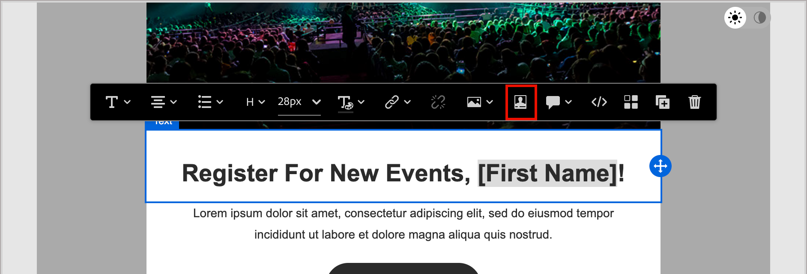
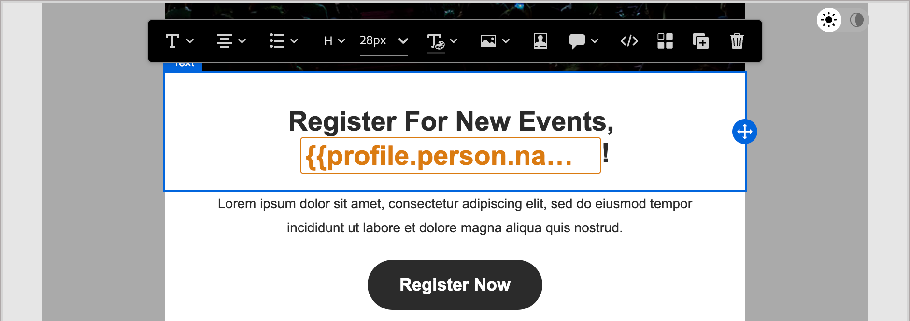

# 內容製作 — 個人化

Journey Optimizer B2B edition使用內嵌簡單語法，可讓您建立包含大括弧`{{}}`括住之個人化內容的運算式。 您可以在相同的內容或欄位中新增多個運算式，不受限制。

例如，您可以將個人化運算式新增為`Hello {{lead.firstName}} {{lead.lastName}}`。 處理內容時，Journey Optimizer B2B edition會以Experience Platform資料庫中包含的資料取代運算式。 第一個範例會變成&#x200B;_Hello John Doe_。

如需在Journey Optimizer B2B edition中使用個人化工具的更完整資訊，請參閱[內容個人化](../user/content/personalization.md)。

>[!NOTE]
>
>Journey Optimizer B2B edition在電子郵件中遵循個人化權杖的&#x200B;_駝峰式大小寫_&#x200B;語法，以比對其他Adobe Experience Platform應用程式以獲得一致的體驗。 此權杖格式與[Handlebars範本化語言](https://handlebarsjs.com/guide/#what-is-handlebars){target="_blank"}完全相容。 在此變更前新增的任何Token都會自動更新。

以下範例概述使用人員和系統權杖個人化內容的步驟。 它反映了[簡化架構](../user/simplified-architecture.md)上布建的Journey Optimizer B2B edition環境可用的變更。

1. 選取文字元件，然後按一下工具列中的&#x200B;_新增個人化_ （ ）圖示。

   {width="600"}

   此動作會開啟&#x200B;_編輯Personalization_&#x200B;對話方塊。

1. 按一下標籤旁的加號( **+** )以新增標籤。

   如果您想要新增具有遞補字元的語彙基元（當該欄位無法供潛在客戶使用時顯示的預設文字），請按一下&#x200B;_更多_&#x200B;圖示( **...**)，然後選擇&#x200B;**[!UICONTROL 插入具有遞補文字]**。

   {width="700" zoomable="yes"}

1. 新增任何其他您要加入的代號或其他靜態文字。

1. 按一下&#x200B;**[!UICONTROL 儲存]**。

   個人化指令碼會顯示在視覺化設計區域中。 您可以視需要進行變更來選取它。

   {width="600"}
