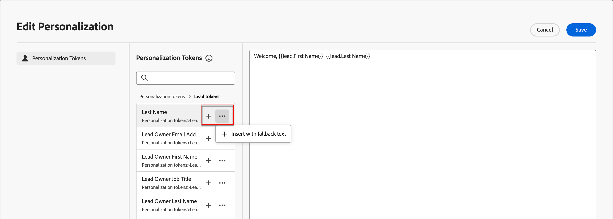

# 內容製作 — 個人化

Journey Optimizer B2B edition使用內嵌簡單語法，可讓您建立包含雙大括弧`{}`括住個人化內容的運算式。 您可以在相同的內容或欄位中新增多個運算式，不受限制。

範例：

* `Hello {{profile.person.name.firstName}} {{profile.person.name.lastName}}`

* `Hello {{profile.person.name.fullName}}`

處理內容時，Journey Optimizer B2B edition會以Experience Platform資料庫中包含的資料取代運算式。 第一個範例會變成&#x200B;_Hello John Doe_。

以下範例概述使用銷售機會/帳戶屬性和系統權杖進行內容個人化的步驟。

1. 選取文字元件，然後按一下工具列中的&#x200B;_新增個人化_&#x200B;圖示。

   {width="600"}

   此動作會開啟&#x200B;_編輯Personalization_&#x200B;對話方塊。

1. 按一下&#x200B;**+**&#x200B;或&#x200B;**...**，將權杖新增至空白空間。

   {width="700" zoomable="yes"}

1. 按一下&#x200B;**[!UICONTROL 儲存]**。
