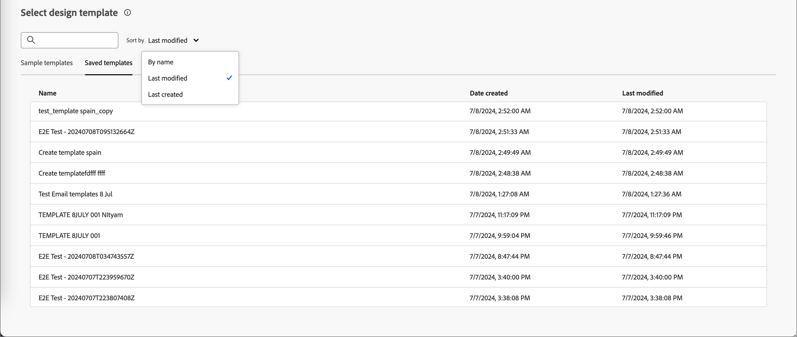
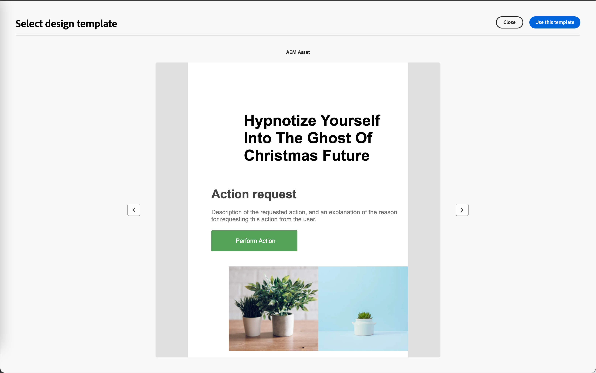
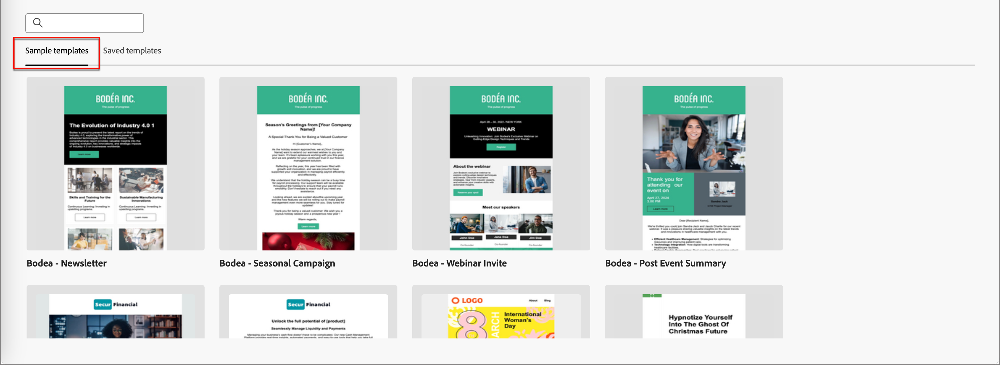

# 內容製作 — 選取電子郵件範本

您可以選擇以下選項：

* **範例範本**。 Journey Optimizer介面提供20個立即可用的電子郵件範本，供您選擇。

* **儲存的範本**。 使用您使用&#x200B;_[!UICONTROL 範本]_&#x200B;功能表從頭建立或使用&#x200B;_[!UICONTROL 另存為內容範本]_&#x200B;選項從歷程中的電子郵件儲存的已儲存自訂範本。

使用&#x200B;_[!UICONTROL 選取設計範本]_&#x200B;區段來開始從範本建立您的內容。 您可以使用範例範本或儲存的Journey Optimizer B2B Edition執行個體自訂電子郵件範本。

>[!BEGINTABS]

>[!TAB 儲存的範本]

在&#x200B;_設計您的範本_&#x200B;首頁上，預設會選取&#x200B;_範例範本_&#x200B;索引標籤。 若要使用自訂範本，請選取&#x200B;**[!UICONTROL 儲存的範本]**&#x200B;索引標籤。

隨即顯示在目前沙箱中建立的所有電子郵件範本清單。 您可以依&#x200B;_[!UICONTROL 名稱]_、_[!UICONTROL 上次修改時間]_&#x200B;和&#x200B;_[!UICONTROL 上次建立時間]_&#x200B;來排序它們。

{width="800" zoomable="yes"}

從清單中選取您想要的範本。

選取後，這會顯示範本的預覽。 在預覽模式中，您可以使用向右和向左箭頭，在單一類別的所有範本（範例或已儲存，視您的選擇而定）之間導覽。

{width="800" zoomable="yes"}

當顯示符合您要使用的內容時，請按一下預覽視窗右上角的&#x200B;**[!UICONTROL 使用此範本]**。

此動作會將內容複製到視覺化內容設計工具中，以便您視需要編輯內容。

>[!TAB 範例範本]

Adobe Journey Optimizer B2B Edition提供&#x200B;_現成可用的電子郵件範本_&#x200B;選項，可用來建立電子郵件和電子郵件範本。

{width="800" zoomable="yes"}

>[!ENDTABS]