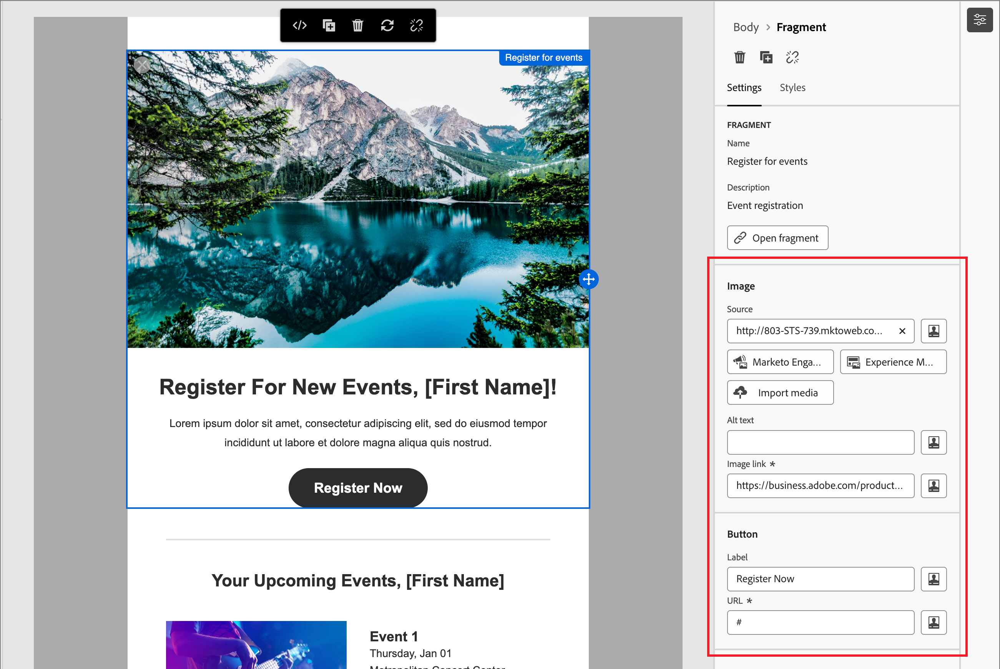

# 內容創作 - 使用視覺片段

視覺片段是一個可重複使用的設計元件，可由 Journey Optimizer B2B 版Adobe Systems多個內容資產引用。 它通常是可以預先創建並快速插入的內容塊，以使創作更快、更一致。

以下示例概述了在創作內容時添加片段的步驟。

1. 要打開片段清單，請選擇 _片段_ 圖示  ）。

   您可以：

   * 對清單進行排序。
   * 瀏覽、搜尋或篩選列表。
   * 在縮圖檢視和清單視圖之間切換。
   * 重新整理清單以反映任何最近建立的片段。

   {width="700" zoomable="yes"}

1. 將任何片段拖放到結構元件中。

   編輯者 在電子郵件結構的節/元素內轉譯片段。

   >[!TIP]
   >
   >若要添加片段，使其佔據電子郵件中的整個水平佈局，請添加 1：1 列結構，然後將片段拖放到其中。

   片段內容在結構中動態更新，以显示內容在內容中的显示方式。

>[!BEGINSHADEBOX]

**可自定義片段中的可編輯欄位**

視覺片段可以包含可自定義的可編輯欄位。 自定義欄位允許您在將片段合併到內容時修改参数，並在不影響原始片段的情況下創建自定義體驗。 片段作者可以 [設計用於自定義](../user/content/fragment-authoring.md#enable-fragment-customization) 文本、圖像和按鈕元件的片段。 如果包含的片段包含具有可编辑字段的元件，您可以更改預設值以針對您的內容對其進行自定義。

1. 選擇片段元件。

   右側顯示的設定包含欄位和可編輯欄位以及預設值。

   {width="700" zoomable="yes"}

1. 請視需要變更任何可編輯欄位。

>[!ENDSHADEBOX]
