# 程式碼片段

<!-- Content authoring steps for reuse -->

## 意圖資料設定 {#intent-data-note}

>[!NOTE]
>
>為您的Journey Optimizer B2B edition執行個體設定意圖資料時，即會包含該資料。 它還需要一個或多個已發佈的歷程&#x200B;**或**&#x200B;建立的購買群組。 如需有關意圖偵測模型以及如何提交關鍵字、產品和類別的詳細資訊，請參閱[意圖資料](../user/admin/intent-data.md)。

## AEM Assets授權注意事項 {#aem-assets-licensing-note}

>[!NOTE]
>
>AEM Assets as a Cloud Service授權和Dynamic Media授權是整合的先決條件。 確定已啟用[Dynamic Media withOpen API](https://experienceleague.adobe.com/en/docs/experience-manager-cloud-service/content/assets/dynamicmedia/dynamic-media-open-apis/dynamic-media-open-apis-overview){target="_blank"}。 整合僅限於來自&#x200B;_傳遞層_&#x200B;的存放庫。 如果您使用&#x200B;_作者階層_&#x200B;且想要轉換它，請連絡Adobe Experience Manager支援。 
>根據您的合約和設定，在設計視覺內容時，可以直接從Adobe Experience Manager Assets B2B edition存取Adobe Journey Optimizer as a Cloud Service 。

## 內容製作 — 元件 — 結構步驟 {#structures-step}

1. 若要開始您的內容設計，請從&#x200B;**[!UICONTROL 結構]**&#x200B;拖曳一個專案，然後將其放到畫布上。

   視需要從&#x200B;_[!UICONTROL 結構]_&#x200B;新增任意數目的專案，並編輯右側窗格中每個專案的設定。

   >[!TIP]
   >
   >選取&#x200B;_[!UICONTROL n:n資料行]_&#x200B;元件以定義您所選擇的資料行數目（介於3到10之間）。 您也可以移動欄下方的箭頭來定義每欄的寬度。

   {width="800" zoomable="yes"}

   每個欄大小不能小於結構元件總寬度的10%。 只能移除空白欄。

## 內容製作 — 元件 — 內容步驟 {#contents-step}

1. 展開&#x200B;**[!UICONTROL 內容]**&#x200B;區段，並新增您所需數量的元素至一或多個結構元件。

   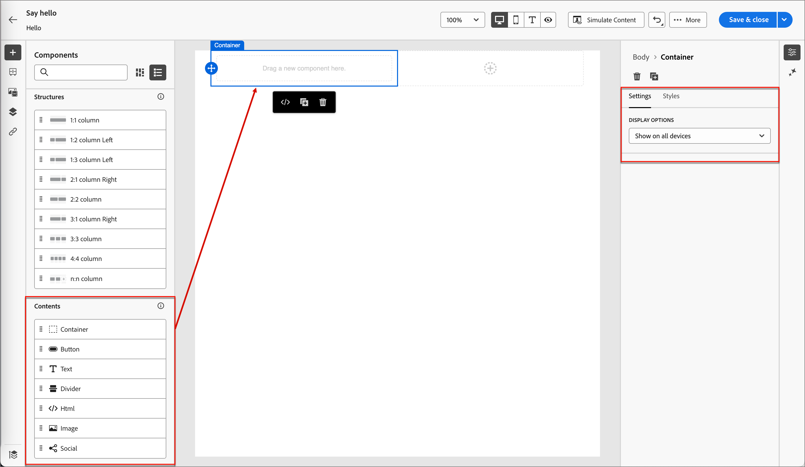{width="800" zoomable="yes"}
   <!--
   reference to the contents elements--->

## 內容製作 — 元件 — 設定步驟 {#settings-step}

1. 如有需要，您可以在&#x200B;_[!UICONTROL 設定]_&#x200B;或&#x200B;_[!UICONTROL 樣式]_&#x200B;標籤中為每個元件進行其他自訂。

   例如，您可以變更每個元件的文字樣式、邊框間距或邊界。

## 內容製作 — 資產步驟 {#assets-step}

1. 您可以從&#x200B;_資產_&#x200B;選取器中直接選取儲存在資產庫中的資產。

   連按兩下包含資產的資料夾。 將專案拖放至結構元件中。

   如需有關使用來源型別中的資產的詳細資訊，請參閱[將資產新增至您的內容](../user/content/assets-overview.md#use-assets-for-content-authoring)。

   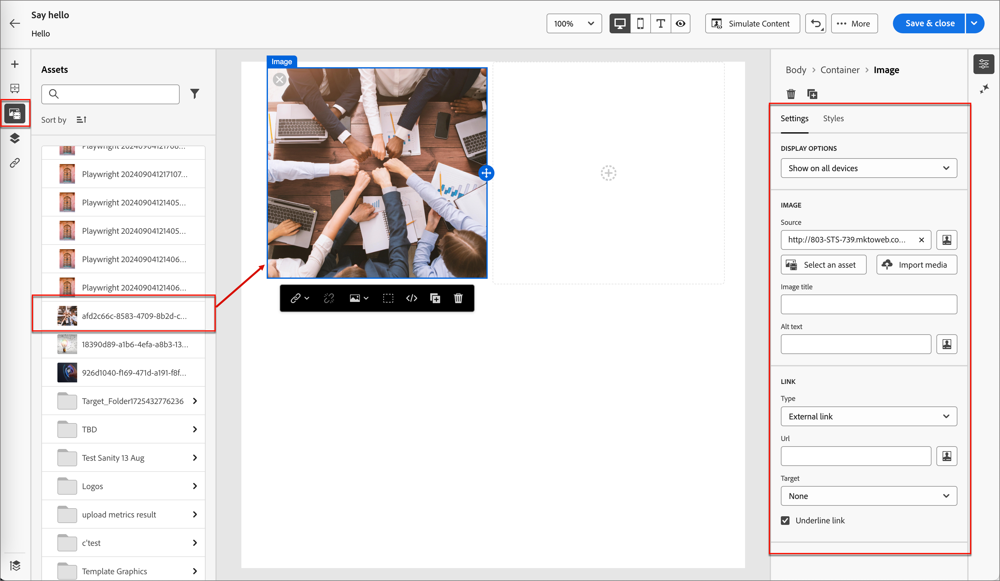{width="800" zoomable="yes"}

## 內容製作 — 個人化步驟 {#personalization-step}

1. 插入個人化欄位，從設定檔屬性、對象會籍、內容屬性等自訂內容。

## 內容製作 — 啟用條件內容步驟 {#dynamic-content-step}

1. 按一下&#x200B;**[!UICONTROL 啟用條件內容]**&#x200B;以新增動態內容，並根據條件規則將內容調整至目標設定檔。

## 內容製作 — 連結追蹤步驟 {#links-tracking-step}

1. 從左窗格中選取&#x200B;**[!UICONTROL 連結]**&#x200B;索引標籤，以顯示您所追蹤內容的所有URL。

   您可以修改&#x200B;_追蹤型別_&#x200B;或&#x200B;_標籤_，並視需要新增標籤。

## 內容元件 — 進階樣式 {#styles-advanced}

若要使用值套用其他CSS相容屬性，請使用&#x200B;**[!UICONTROL 進階]**&#x200B;樣式設定。 您可以變更現有屬性的值，或新增屬性。 樣式會使用父 — 子元件（元素）的CSS繼承模型套用至元件。

顯示的屬性反映目前為元件定義的樣式。 您可以根據[CSS定義](https://www.w3schools.com/CSSref/index.php){target="_blank"}變更值。 按一下&#x200B;_新增_ (**+**)圖示，為元件新增樣式屬性。

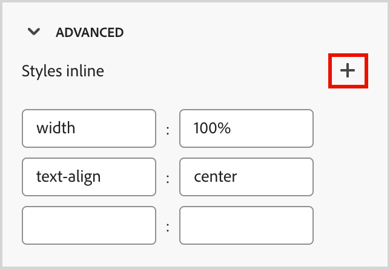{width="250"}

## 內容元件 — 水準對齊樣式 {#styles-alignment-h}

展開&#x200B;**[!UICONTROL 對齊]**&#x200B;區段，然後選擇您要使用的水準對齊：左對齊、置中或右對齊。 此樣式會轉譯為標準`text-align` CSS樣式，並影響元件在容納元件中的放置方式。

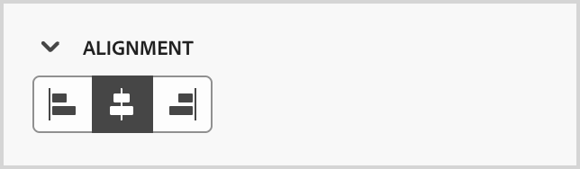{width="250"}

## 內容元件 — 垂直對齊樣式 {#styles-alignment-v}

展開&#x200B;**[!UICONTROL 對齊]**&#x200B;區段，然後選擇您要使用的垂直對齊：上、中或下。 此樣式會轉譯為標準`vertical-align` CSS樣式，並影響容納元件內的定位。

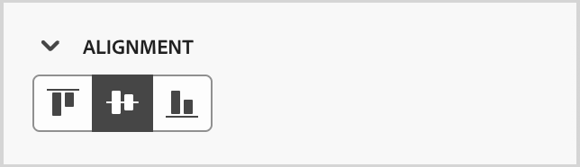{width="250"}

## 內容元件 — 水平與垂直對齊樣式 {#styles-alignment-h-v}

展開&#x200B;**[!UICONTROL 對齊]**&#x200B;區段，然後選擇您要使用的水平與垂直對齊。 對齊樣式會影響HTML元件在容納元件（結構或容器）中的定位方式。

水準對齊方式會轉譯為標準`text-align` CSS樣式，您可以選擇左、中或右。 垂直對齊方式會轉譯為標準`vertical-align` CSS樣式，您可以選擇上、中或下。

HTML元件的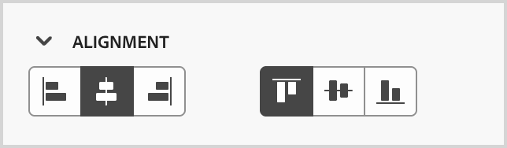{width="300"}

## 內容元件 — 背景樣式 {#styles-background}

在右側面板中選取&#x200B;_[!UICONTROL 樣式]_&#x200B;索引標籤後，請使用&#x200B;**[!UICONTROL 背景]**&#x200B;區段來定義元件的背景顏色。

選取核取方塊，然後按一下顏色方塊，從選擇器中選擇顏色。 您可以輸入已知的RGB、HSL、HSB或十六進位值來選擇顏色。 或者，您可以使用顏色滑桿和顏色欄位來選取顏色。

{width="300"}

## 內容元件 — 邊框樣式 {#styles-border}

1. 在已選取&#x200B;_[!UICONTROL 樣式]_&#x200B;標籤的右側面板上，展開&#x200B;**[!UICONTROL Border]**&#x200B;區段並設定選項以顯示元件的邊框：

1. 將切換開關向右移動以啟用邊框顯示選項，並根據您的設計條件進行設定：

   * 若要設定&#x200B;**[!UICONTROL 邊框顏色]**，請選取核取方塊，然後按一下顏色方塊以從選擇器中選擇顏色。 您可以輸入已知的RGB、HSL、HSB或十六進位值來選擇顏色。 或者，您可以使用顏色滑桿和顏色欄位來選取顏色。

   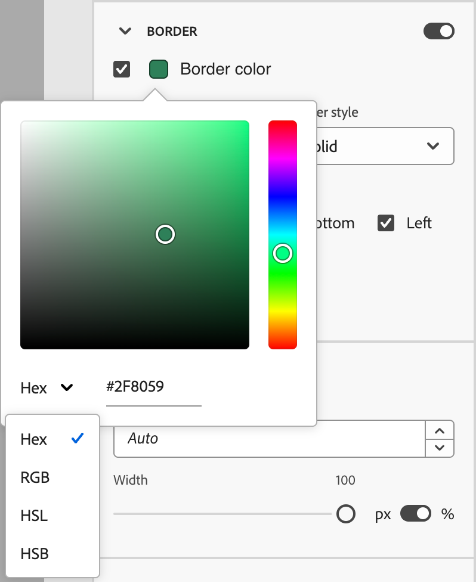{width="300"}

   * 若要設定&#x200B;**[!UICONTROL 邊框大小]** （線條寬度），請按一下向上和向下箭頭圖示以增加或減少畫素數量。

   * 若要設定&#x200B;**[!UICONTROL 邊框樣式]**，請從標準CSS `border-style`值清單中選擇一個值。

   * 若要決定顯示邊框的位置，請選取每個&#x200B;**[!UICONTROL 邊框位置]**&#x200B;核取方塊。

   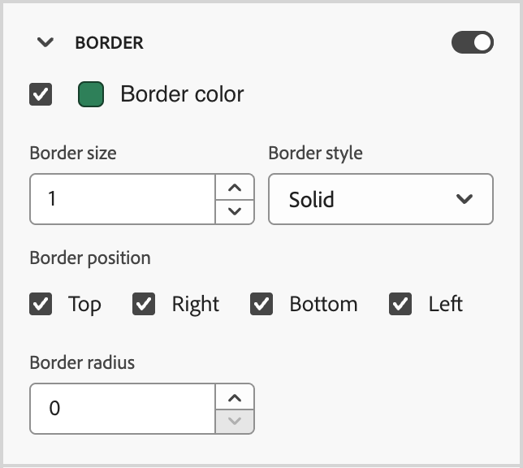{width="250"}

1. 對於&#x200B;**[!UICONTROL 邊框半徑]**，請根據您想要的轉角曲線設定數值。

   值為0 （預設）會產生方形轉角。

## 內容元件 — 邊界樣式 {#styles-margin}

在已選取&#x200B;_[!UICONTROL 樣式]_&#x200B;標籤的右側面板上，展開&#x200B;**[!UICONTROL 邊界]**&#x200B;區段，並設定結構元件內邊界間距的選項。 此樣式會復寫CSS `margin`引數，該引數會控制元件邊框之外的空間，將元件與其他元件分開。 它會在元件周圍建立間隙，以影響其定位和周圍內容的版面。

根據您的設計需求設定邊界值（畫素）。 您可以單獨設定元件所有側、上邊框、左右邊或每一側的邊界：

* **所有邊** — 若要設定一個值以套用至所有邊，請清除每個邊的&#x200B;**[!UICONTROL 不同邊界]**&#x200B;核取方塊。 按一下向上和向下箭頭圖示，以增加或減少畫素數量。

  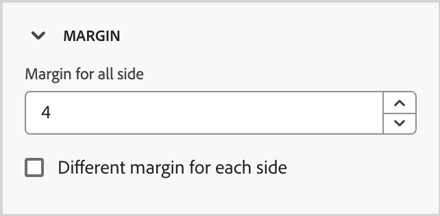{width="250"}

* **上下邊界** — 若要將上下邊界設定為相同的值，請在上下設定之間設定&#x200B;_鎖定_&#x200B;圖示。 按一下向上和向下箭頭圖示，以增加或減少畫素數量。

* **左右邊界** — 若要將左右邊界設定為相同的值，請在左右設定之間設定&#x200B;_鎖定_&#x200B;圖示。 按一下向上和向下箭頭圖示，以增加或減少畫素數量。

  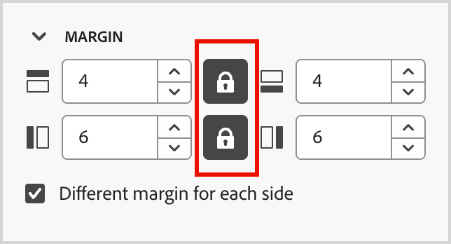{width="250"}

* **獨立** — 若要將每個邊界設定為獨立值，請在上下設定之間以及左右之間設定&#x200B;_解除鎖定_&#x200B;圖示。 針對各個設定，按一下向上和向下箭頭圖示，以增加或減少畫素數量。

  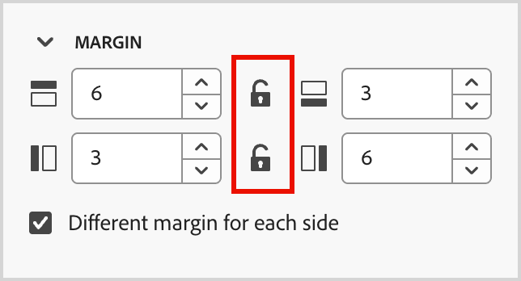{width="250"}

## 內容元件 — 邊框間距樣式 {#styles-padding}

在已選取&#x200B;_[!UICONTROL 樣式]_&#x200B;標籤的右側面板上，展開&#x200B;**[!UICONTROL 內距]**&#x200B;區段，並設定結構元件內距的選項。 此樣式會復寫CSS `padding`引數，該引數是元件內容與其邊框之間的空間。 內距提供內部間距，可用來控制內容與元件邊框之間的距離。

根據您的設計需求，設定以畫素為單位的填補值。 您可以單獨設定元件所有側、上邊框、左右邊或每一側的邊框間距：

* **所有邊** — 若要設定一個值以套用至所有邊，請清除&#x200B;**[!UICONTROL 每個邊不同的內距]**&#x200B;核取方塊。 按一下向上和向下箭頭圖示，以增加或減少畫素數量。

  {width="250"}

* **上下間距** — 若要將上下間距設定為相同的值，請在上下設定之間設定&#x200B;_鎖定_&#x200B;圖示。 按一下向上和向下箭頭圖示，以增加或減少畫素數量。

* **左右間距** — 若要將左右間距設定為相同的值，請在左右設定之間設定&#x200B;_鎖定_&#x200B;圖示。 按一下向上和向下箭頭圖示，以增加或減少畫素數量。

  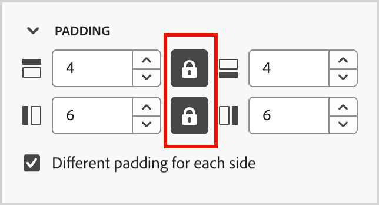{width="250"}

* **獨立** — 若要將每一邊的填補設定為獨立值，請在上下設定之間以及左右之間設定&#x200B;_解除鎖定_&#x200B;圖示。 針對各個設定，按一下向上和向下箭頭圖示，以增加或減少畫素數量。

  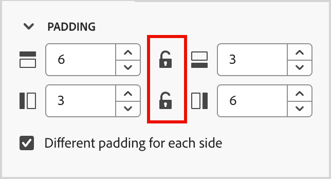{width="250"}

## 內容元件 — 大小樣式 {#styles-size}

在已選取&#x200B;_[!UICONTROL 樣式]_&#x200B;標籤的右側面板上，展開&#x200B;**[!UICONTROL 大小]**&#x200B;區段並設定元件高度和寬度的選項：

* **[!UICONTROL 高度]** — 按一下向上和向下箭頭圖示，以增加或減少畫素數量。 空白值(Auto)是預設值，會根據元素的內容調整元素的高度。

* **[!UICONTROL 寬度]** — 使用切換功能以畫素或百分比設定寬度。

   * 若為百分比寬度，請使用滑桿來設定百分比值。 百分比會根據包含區塊的內容方塊來決定元素大小，其中不包含邊框間距和邊框。 例如，值50會將元素寬度設定為其所包含區塊內容寬度的50%。

     使用百分比的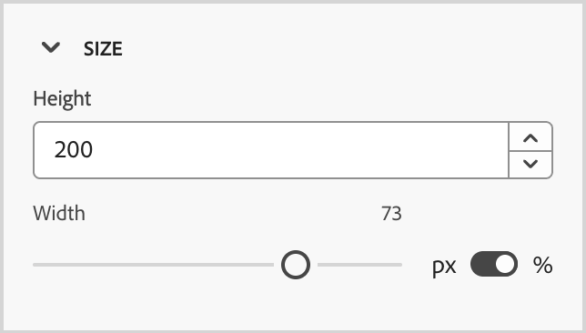{width="250"}

   * 針對以畫素為基礎的寬度，按一下向上和向下箭頭圖示，以增加或減少畫素數量。 空白值(Auto)是預設值，會根據元素內容調整元素寬度。

     使用畫素的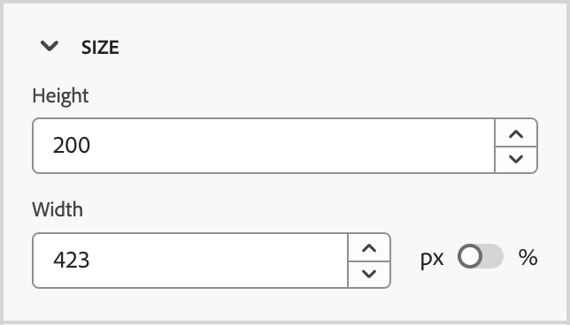{width="250"}

## 內容元件 — 文字樣式 {#styles-text}

在已選取&#x200B;_[!UICONTROL 樣式]_&#x200B;索引標籤的右側面板上，展開&#x200B;**[!UICONTROL 文字]**&#x200B;區段並設定元件文字樣式的選項：

* **[!UICONTROL 字型系列]** — 按一下向下箭號圖示，選取元件中文字的字型系列。

* **[!UICONTROL 字型大小]** — 按一下向上和向下箭號圖示，以增加或減少字型大小，或輸入值。 對於輸入的值，您可以使用小數。

* **[!UICONTROL 行高]** — 按一下向上和向下箭號圖示，以增加或減少行高，或輸入值。 對於輸入的值，您可以使用小數。

  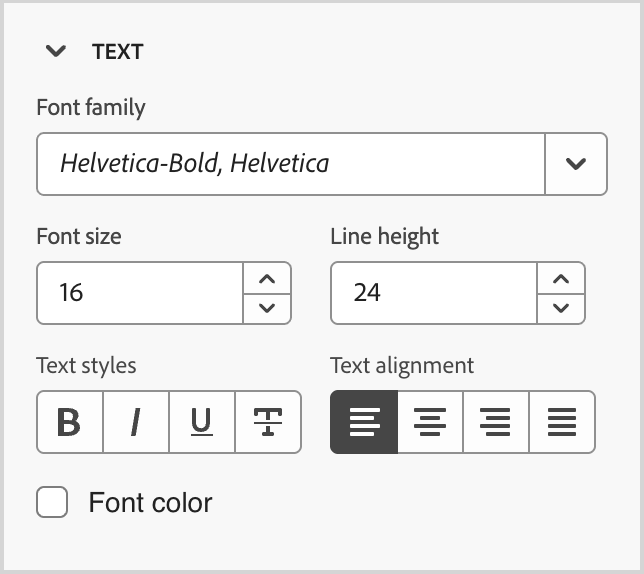{width="250"}

* **[!UICONTROL 文字樣式]** — 選取文字樣式的圖示： _粗體_、_斜體_、_加底線_&#x200B;或&#x200B;_刪除線_。

* **[!UICONTROL 文字對齊方式]** — 選取水準文字對齊方式的圖示： _左_、_置中_、_右_&#x200B;或&#x200B;_對齊_。

* **[!UICONTROL 字型顏色]** — 按一下顏色方塊，從選擇器中選擇字型顏色。 您可以輸入已知的RGB、HSL、HSB或十六進位值來選擇顏色。 或者，您可以使用顏色滑桿和顏色欄位來選取顏色。

  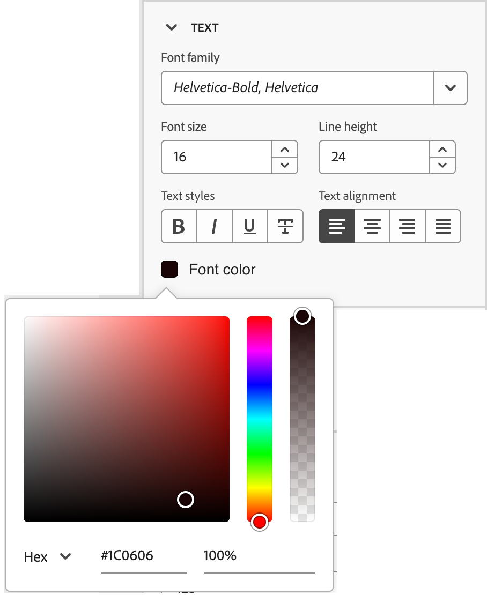{width="300"}

## 內容 — 影像選取範圍 — Marketo DAM {#me-dam}

選擇此型別以瀏覽並從Journey Optimizer B2B edition資料庫或連線的Market Engage執行個體選取影像資產。

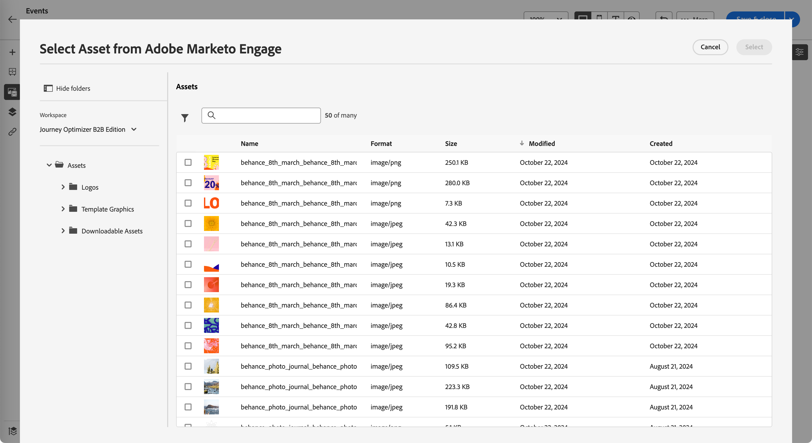{width="700" zoomable="yes"}

從對話方塊中，您可以從選取的存放庫中選擇影像。 按一下&#x200B;**[!UICONTROL 選取]**&#x200B;以新增資產。

有多種工具可協助您找到所需的資產：

* 按一下左上方的&#x200B;_篩選器_&#x200B;圖示，以根據您的條件篩選顯示的專案。

* 在&#x200B;_搜尋_&#x200B;欄位中輸入文字，以篩選顯示的專案以符合資產名稱。

  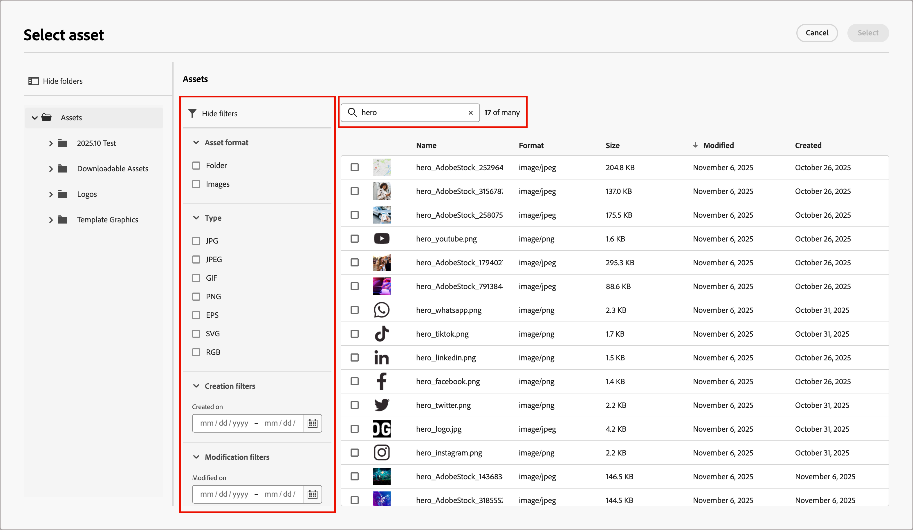{width="700" zoomable="yes"}

## 內容 — 影像選取範圍 — AEM Assets {#aem-assets-dam}

選擇此型別以瀏覽並從[設定的Experience Manage Assets存放庫](../user/admin/configure-aem-repositories.md)中選取影像資產。

在&#x200B;_[!UICONTROL 選取Assets]_&#x200B;對話方塊中，使用可用的工具選擇影像，以找出您需要的資產，然後按一下&#x200B;**[!UICONTROL 選取]**：

* 變更右上角的&#x200B;**[!UICONTROL 存放庫]**。

* 按一下右上角的「**[!UICONTROL 管理資產]**」，在其他瀏覽器分頁中開啟Assets存放庫，並使用AEM Assets管理工具。

* 按一下右上角的&#x200B;_檢視型別_&#x200B;選擇器，將顯示變更為&#x200B;**[!UICONTROL 清單檢視]**、**[!UICONTROL 格線檢視]**、**[!UICONTROL 相簿檢視]**&#x200B;或&#x200B;**[!UICONTROL 瀑布檢視]**。

* 按一下&#x200B;_排序順序_&#x200B;圖示，以變更升序與降序之間的排序順序。

  {width="700" zoomable="yes"}

* 按一下&#x200B;**[!UICONTROL 排序依據]**&#x200B;功能表箭頭，將排序條件變更為&#x200B;**[!UICONTROL 名稱]**、**[!UICONTROL 大小]**&#x200B;或&#x200B;**[!UICONTROL 已修改]**。

* 按一下左上方的&#x200B;_篩選器_&#x200B;圖示，以根據您的條件篩選顯示的專案。

* 在&#x200B;_搜尋_&#x200B;欄位中輸入文字，以篩選顯示的專案以符合資產名稱。

  {width="700" zoomable="yes"}

## 內容 — 影像上傳 {#image-upload}

選擇此型別從您的系統選取檔案，並將其匯入Journey Optimizer B2B edition資產庫。

在&#x200B;_[!UICONTROL 上傳影像]_&#x200B;對話方塊中，將檔案從您的系統拖放至檔案方塊。 檔案大小上限為100 MB。

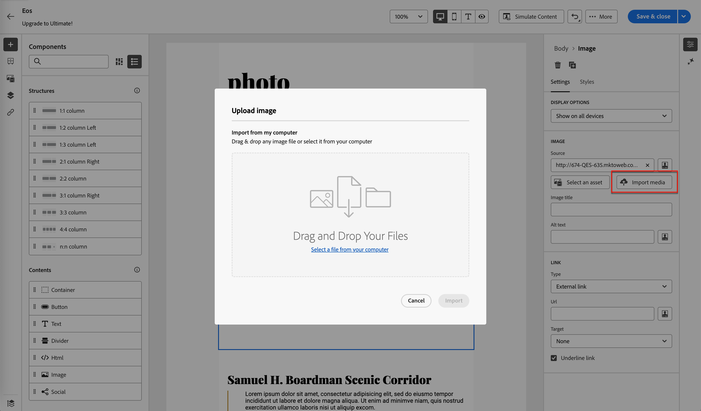{width="450"}

所選影像的檔案名稱會顯示在對話方塊中。 資產檔案名稱必須是唯一的（跨資料夾），如果已存在同名的檔案，則會顯示訊息。 名稱最多可包含100個字元，且不能包含特殊字元（例如`;`、`:`、`\`和`|`）。

按一下&#x200B;**[!UICONTROL 匯入]**。

## 參與分數活動 — Marketo {#engagement-activities-me}

| 活動名稱 | 說明 | 每日最大頻率計數 | 預設模型活動權重 |
| --- | --- | --- | --- |
| [!UICONTROL 出席活動] | 成員參加一項活動 | 20 | 60 |
| [!UICONTROL 電子郵件已點按] | 成員點按電子郵件中的連結 | 20 | 30 |
| [!UICONTROL 電子郵件已開啟] | 成員開啟電子郵件 | 20 | 30 |
| [!UICONTROL 表單已填寫] | 成員在網頁上填寫並提交表單 | 20 | 40 |
| [!UICONTROL 精彩時刻] | 成員有一個精彩時刻 | 20 | 60 |
| [!UICONTROL 連結點選次數] | 成員點按網頁上的連結 | 20 | 40 |
| [!UICONTROL 頁面檢視次數] | 成員檢視網頁 | 20 | 40 |
| [!UICONTROL 登入事件] | 為事件註冊的成員 | 20 | 60 |
