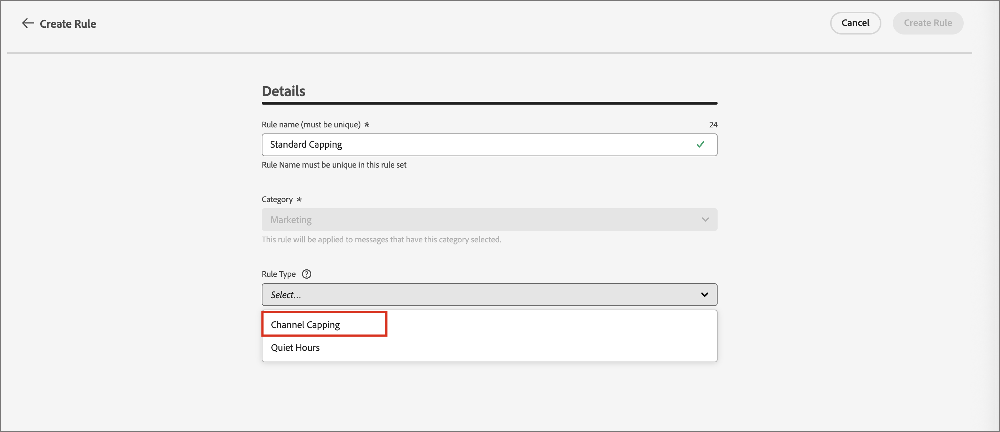

# 業務規則 {#business-rules}

>[!CONTEXTUALHELP]
>id="ajo-b2b-prime_business_rules_rule_sets"
>title="規則集"
>abstract="使用規則集將頻率上限或暫停更新規則套用至不同類型的行銷傳播。 您也可以建立規則集，依照頻率上限規則，將部分客群排除在歷程以外。"

商業規則可讓您的組織定義多個規則，並將多個規則分組到規則集中，以便行銷人員可視需求將其套用至電子郵件。 這提供了更精細的精細度，以限制客戶在特定時間範圍內可以進入的頻率及歷程數，或根據通訊型別控制使用者接收訊息的頻率。

您可以建立兩種型別的規則集：

* **管道**&#x200B;規則集套用規則至通訊管道。 它們可讓您設定：

  * **頻率上限規則** — 範例： *每天不傳送超過一封電子郵件、簡訊、推播、直接郵件或WhatsApp通訊。*
  * **安靜時數規則** — 範例： *請勿在早上8點 — 晚上9點的時段以外傳送電子郵件訊息。*

* **歷程**&#x200B;規則集將專案與並行上限規則套用至歷程。 （Beta版本尚未支援。）

>[!PREREQUISITES]
>
>若要使用商業規則，您需要下列CX Enterprise許可權：
>
>* **[!UICONTROL 檢影片率規則]**：存取和檢視商業規則。
>* **[!UICONTROL 管理頻率規則]**：建立、編輯或刪除商業規則。

## 存取及管理規則集 {#access-manage}

若要存取所有現有的規則集，請展開左側導覽中的&#x200B;**[!UICONTROL 管理]**，然後選取&#x200B;**[!UICONTROL 商業規則]**。

{width="800" zoomable="yes"}

### 全域和自訂規則集 {#global-custom}

第一次存取&#x200B;_規則集_&#x200B;時，預設規則集已預先建立且作用中： **_[!UICONTROL 全域規則集]_**。 這是全域規則集，您可以套用它來控制使用者跨一或多個通道接收訊息的頻率。 此規則集中定義的規則會套用至所有選取的管道。

{width="700" zoomable="yes"}

除了此預設規則集外，您可以建立自己的自訂規則集，並將其套用至歷程或管道節點，以使用特定的上限和無訊息小時規則。

### 開啟規則集 {#open-rule-set}

按一下規則集名稱，即可檢視和編輯其規則定義。 該規則集中包含的所有規則都會列出。 使用右上方的&#x200B;_更多功能表_ ( **...** )來啟用、停用或刪除它。

![使用[更多]功能表來啟用或停用規則集](./assets/business-rules-activate-rule-set.png){width="700" zoomable="yes"}

### 編輯規則 {#edit-rules}

對於規則集中的任何草稿規則，按一下規則名稱旁的&#x200B;_編輯_ （  ）圖示以編輯規則設定。 您也可以按一下&#x200B;_更多功能表_ ( **...** )圖示來啟動或刪除規則。

{width="500" zoomable="yes"}

若要停用規則，請按一下使用中規則旁的&#x200B;_停用_ （  ）圖示。 在確認對話方塊中，按一下&#x200B;**[!UICONTROL 停用]**。 狀態變更為&#x200B;**_[!UICONTROL 非使用中]_**，規則不適用於未來的訊息執行。 目前執行中的任何訊息都不會受到影響。

>[!NOTE]
>
>停用規則或規則集不會影響或重設個別設定檔的任何計數。

## 建立並啟用自訂規則集 {#create}

>[!CONTEXTUALHELP]
>id="ajo-b2b-prime_rule_set_domain"
>title="規則集網域"
>abstract="建立規則集時，您必須指定規則集當中的規則要針對通訊管道或是歷程強制執行頻率上限規則。"

>[!CONTEXTUALHELP]
>id="ajo-b2b-prime_rule_sets_category"
>title="選取訊息規則類別"
>abstract="啟動並套用至訊息時，和所選類別相符的所有頻率規則會自動應用至該訊息。 目前只有行銷類別可用。"

>[!CONTEXTUALHELP]
>id="ajob2b-prime_rule_type"
>title="規則類型"
>abstract="為您的管道規則集選取所需的規則類型：使用&#x200B;**頻率上限**&#x200B;類型，將上限規則套用至通訊管道。 例如，每天傳送的電子郵件或簡訊不得超過一則。 選取「**非傳送時間**」，定義基於時間的排除項目，確保在特定時段內不會傳送任何訊息。"

>[!CONTEXTUALHELP]
>id="ajo-b2b-prime_rule_sets_duration"
>title="重設上限頻率"
>abstract="選取用來重設上限計數器的日曆週期：每小時、每日、每週或每月。 計數器會在每個新週期開始時自動重設為 0。"

>[!CONTEXTUALHELP]
>id="ajo-b2b-prime_rule_set_rule_capping"
>title="規則頻率上限"
>abstract="設定規則的頻率上限。 根據規則集網域和「規則類型」欄位中的選擇，此欄位可以定義傳送至輪廓的訊息數量上限，或者輪廓可同時進入或註冊的歷程數量上限。"

>[!CONTEXTUALHELP]
>id="ajo-b2b-prime_journey_business_rules"
>title="規則集"
>abstract="選取要套用至自訂動作的規則集。"

>[!NOTE]
>
>您最多可以為管道網域建立10個規則集，並為歷程網域建立10個規則集，總共有20個規則集。

1. 展開左側導覽中的&#x200B;**[!UICONTROL 管理]**，然後選取&#x200B;**[!UICONTROL 商業規則]**。

1. 在&#x200B;_[!UICONTROL 規則集]_&#x200B;清單頁面上，按一下右上角的&#x200B;**[!UICONTROL 建立規則集]**。

   {width="400"}

1. 輸入規則集的唯一&#x200B;**[!UICONTROL 名稱]** （必要），並新增&#x200B;**[!UICONTROL 描述]** （選用）。

1. 選取規則集&#x200B;**[!UICONTROL 網域]**。

   * **[!UICONTROL 頻道]** — 套用上限規則或無訊息時數規則至通訊頻道。
   * **[!UICONTROL 歷程]** — 套用專案與並行上限規則至歷程。

   >[!IMPORTANT]
   >
   >此Beta版本尚未支援歷程規則。

1. 按一下&#x200B;**[!UICONTROL 儲存]**。

   {width="700" zoomable="yes"}

### 新增規則 {#add-rules}

建立規則集後，新增每個要包含的規則。

1. 按一下&#x200B;**[!UICONTROL 新增規則]**。

1. 根據用途設定規則引數。

   規則可用的引數取決於建立時選取的規則集網域。

   {width="700" zoomable="yes"}

   有關設定歷程和管道規則的詳細資訊，請參閱以下章節：

   <!-- * [Journey capping](../conflict-prioritization/journey-capping.md) -->
   * [依據頻道、通訊類型，設定頻率上限](#frequency-capping)
   * [無訊息時間](#quiet-hours)

1. 按一下&#x200B;**[!UICONTROL 建立規則]**&#x200B;以確認建立規則。

   新規則列在具有&#x200B;_草稿_&#x200B;狀態的規則集中。

1. 重複上述步驟，視需要為規則集新增更多規則。

   建立時，規則具有&#x200B;_[!UICONTROL 草稿]_&#x200B;狀態，且尚無法影響任何訊息。

   {width="700" zoomable="yes"}

1. 若要啟用規則集的規則，請按一下規則名稱旁的&#x200B;_更多功能表_ ( **...** )圖示，然後選擇&#x200B;**[!UICONTROL 啟用]**。

   在確認對話方塊中，按一下&#x200B;**[!UICONTROL 啟動]**。

### 啟動規則集 {#activate-rule-set}

啟用規則集即可套用至歷程或頻道訊息。 當規則集作用中時，您無法新增更多規則至其中。 您可以停用它以進行變更，然後再次啟用。

1. 從&#x200B;_規則集_&#x200B;清單頁面開啟規則集。

1. 按一下右上方的&#x200B;_更多功能表_ ( **...** )，然後選擇&#x200B;**[!UICONTROL 啟動規則集]**。

   ![按一下[更多]功能表以存取啟動動作](./assets/business-rules-activate-rule-set.png){width="700" zoomable="yes"}

1. 在確認對話方塊中，按一下&#x200B;**[!UICONTROL 啟動]**。

   >[!NOTE]
   >
   >完全啟用規則或規則集最多可能需要10分鐘。 您不需要修改訊息或重新發佈歷程，規則就能生效。

您可以根據規則集的網域設定，將作用中的規則集套用至訊息或歷程。

## 依據頻道的頻率限定 {#frequency-capping}

依頻道和通訊型別設定頻率上限，以限制設定檔收到多少訊息，並避免客戶因類似通訊而不知所措。 管道規則集會將上限規則套用至通訊管道。 例如，每天傳送的電子郵件或簡訊不得超過一則。

運用管道規則集，可讓您根據通訊型別設定頻率上限，以防止訊息相似的客戶超載。 例如，您可以建立規則集以限制傳送給客戶的&#x200B;_促銷通訊_&#x200B;數目，以及建立另一個規則集以限制傳送給客戶的&#x200B;_電子報_&#x200B;數目。 然後，您可以選擇套用促銷通訊或電子報規則集。

>[!IMPORTANT]
>
>為確保管道層級上限能正常運作，在建立歷程時，請務必選擇最高優先順序的名稱空間。 在[平台身分識別服務指南](https://experienceleague.adobe.com/zh-hant/docs/experience-platform/identity/features/identity-graph-linking-rules/namespace-priority){target="_blank"}之中進一步了解命名空間優先順序

### 建立管道上限規則 {#create-capping-rule}

>[!CONTEXTUALHELP]
>id="ajo-b2b-prime_rule_sets_channel"
>title="定義套用規則的管道"
>abstract="選取至少一個管道。 上限會以總計數套用在所有管道上。"

1. 選取您要新增上限規則的管道規則集，或建立新的管道規則集。

1. 在規則集頁面中，按一下&#x200B;**[!UICONTROL 新增規則]**&#x200B;並輸入規則的唯一名稱。

   >[!NOTE]
   >
   > _[!UICONTROL 類別]_&#x200B;欄位指定規則的傳訊類別。 目前此欄位是唯讀的，只有&#x200B;**[!UICONTROL 行銷]**&#x200B;類別可用。

1. 對於&#x200B;_[!UICONTROL 規則型別]_，請選擇&#x200B;**[!UICONTROL 頻道上限]**。

   已選取{width="700" zoomable="yes"}

1. 在&#x200B;**[!UICONTROL 上限計數]**&#x200B;欄位中，設定規則的上限值。

   根據您在其他欄位中的選擇，此值是每個月、周、日或小時可傳送到個別使用者設定檔的最大訊息數。

1. 對於&#x200B;**[!UICONTROL 重設上限頻率]**，選取是否要套用上限。

   頻率上限是根據所選的日曆期間。 它會在對應的時間範圍開始時重設。 選擇每個期間的計數器到期日：

   * **[!UICONTROL 小時]** — 頻率上限對所選小時數有效。 計數器會在每個時間範圍的開頭自動重設。 對於1小時的頻率上限，它每小時會重設一次，與UTC一小時的結尾重合。
   * **[!UICONTROL 每日]** — 每日頻率上限在23:59:59 UTC之前的該日有效，並在隔天的開頭重設為0。
   * **[!UICONTROL 每週]** — 頻率上限有效至該周星期六23:59:59 UTC。 無論規則是在何時建立，有效期都適用。 例如，如果規則是在星期四建立，則此規則的有效期直到星期六的23:59:59。
   * **[!UICONTROL 每月]** — 頻率上限在每月最後一天23:59:59 UTC之前有效。 例如，1月的每月到期日為01-31 23:59:59 UTC。

   >[!IMPORTANT]
   >
   >* 為確保準確性，請確保在編寫歷程時選擇最高優先順序的名稱空間。 在[平台身分識別服務指南](https://experienceleague.adobe.com/zh-hant/docs/experience-platform/identity/features/identity-graph-linking-rules/namespace-priority){target="_blank"} 之中進一步了解命名空間優先順序
   >
   >* 設定檔計數器值會在傳遞通訊時更新。 當您傳送大量通訊時，請考慮這一點，因為輸送量可能會導致收件者在啟動通訊後數分鐘甚至數小時收到電子郵件（若您同時傳送數百萬封通訊）。 如果收件者收到兩則緊密相連的通訊，則這一點很重要。 建議您儘可能將通訊間隔至少隔開兩個小時，讓收件者有充足的時間接收通訊，並相應地更新計數器值。

1. 使用&#x200B;**[!UICONTROL Every]**&#x200B;欄位來設定數小時、數天、數週或數月（視指定的時間範圍而定）的上限規則的頻率。

   請務必輸入符合所選取期間型別的值： _小時_&#x200B;為1-23，_每日_&#x200B;為1-30，_每週_&#x200B;為1-4，_每月_&#x200B;為1-3。

   當新的時間範圍開始時，計數器會自動重設為0。 對於兩天的頻率上限，此重設會在每兩天的UTC午夜發生。

1. 選取您要用於此規則的管道：

   * **[!UICONTROL 電子郵件]**
   * **[!UICONTROL 簡訊]** （目前不支援此Beta版本）
   * **[!UICONTROL 推播通知]** （此Beta版本目前不支援）
   * **[!UICONTROL 直接郵件]** （此Beta版本目前不支援）
   * **[!UICONTROL WhatsApp]** （此Beta版本目前不支援）

   已針對頻率上限規則選取{width="700" zoomable="yes"}

   如果您想要將上限套用至所有選取的色版，以作為總計數，請選取多個色版。

   例如，將上限設為5，然後選取電子郵件和簡訊頻道。 如果設定檔在選定期間已收到三封行銷電子郵件和兩封行銷簡訊，則此設定檔會從任何行銷電子郵件或簡訊的下一個傳送中排除。

1. 按一下&#x200B;**[!UICONTROL 儲存]**&#x200B;以確認建立規則。

   您的頻率規則已新增到具有&#x200B;_[!UICONTROL 草稿]_&#x200B;狀態的規則集。

1. 重複上述步驟，視需求將任意數量的規則新增至規則集。

1. 當上限規則已準備好套用至訊息時，請啟動規則和規則集。

### 套用管道上限規則集 {#apply-capping-rule}

1. 建立歷程時，為您為規則選取的管道新增其中一個傳送[動作節點](../marketing/action-nodes.md)，並編輯訊息的內容。

1. 在&#x200B;_[!UICONTROL 動作]_&#x200B;標籤上，將&#x200B;**[!UICONTROL 商業規則]**&#x200B;選項設定為具有頻率上限規則的規則集。

   ![商業規則選項設定為[動作]索引標籤上的頻率上限規則集](./assets/business-rules-frequency-capping-email-actions.png){width="600" zoomable="yes"}

   >[!NOTE]
   >
   >清單中僅提供已啟動的規則集。

   <!--Messages where the category selected is **[!UICONTROL Transactional]** will not be evaluated against business rules.-->

1. 在啟用您的歷程之前，請務必將其排程在日後至少10分鐘執行。

   這提供了在所選商業規則之設定檔上填入計數器值所需的時間。 如果您立即啟用歷程，規則集計數器值無法填入收件者的設定檔中，且訊息不會計入自訂規則集的頻率上限規則中。

<!-- 
1. You can view the number of profiles excluded from delivery in the [Customer Journey Analytics report](../reports/report-gs-cja.md), and in the [Live report](../reports/live-report.md), where frequency rules will be listed as a possible reason for users excluded from delivery.

-->

>[!NOTE]
>
>數個規則可套用至相同的管道，但一旦達到較低上限，設定檔將從下一次傳送中排除。

測試頻率規則時，建議使用新建立的測試設定檔，因為當設定檔的頻率上限達到時，就無法在下一個期間之前重設計數器。 停用規則可讓限定設定檔接收訊息，但不會移除或刪除任何計數器增量。

## 設定勿打擾時間 {#quiet-hours}

**_無訊息時數_**&#x200B;可讓您定義電子郵件、簡訊、推播和WhatsApp頻道的時間型排除專案。 此功能可確保在特定時段內不會傳送任何訊息，協助您遵守客戶偏好設定和合規性要求。

>[!NOTE]
>
>在目前的Beta版本中，歷程僅支援電子郵件和WhatsApp頻道。

您可以透過規則集套用無訊息時數，並將其指派給歷程中的個別管道動作，以精確控制。 透過簡化這些標準，您可以改善客戶體驗、節省時間，並確保遵守通訊規則：

* **不要喚醒您的客戶** - *正確的客戶、正確的頻道、正確的時間是許多行銷人員的信條*，因此時機是客戶歷程的關鍵部分是很合理的。 透過設定「無訊息時數」規則，品牌更能掌控連絡人何時收到訊息，確保他們在更有可能對您的訊息採取行動時收到訊息。
* **便利性** — 當您需要防止對象收到訊息而不需要停止整個歷程或行銷活動時，可以輕鬆地攔截跨行銷活動和歷程的通訊。
* **省時** — 透過建立&#x200B;**以時間為基礎的規則**&#x200B;在一個位置管理排除專案，而不是透過自訂運算式新增多個條件節點。\
  <!--* **Extra Safeguard** - Benefit from an extra safeguard in case audience criteria or time-window configurations were incorrectly set, ensuring individuals are still excluded when they should be.-->

>[!BEGINSHADEBOX]

**護欄和限制**

* **傳輸延遲** — 無訊息時數規則的更新可能需要最多12小時才能套用至已使用該規則的管道動作。
* **大量延遲** — 若是大量通訊，系統可能需要額外的時間，才能開始成功強制實施無訊息小時抑制。

>[!ENDSHADEBOX]

<!--* **Custom actions** – For custom actions, only quiet hours rules are enforced. If a rule set also includes other rules (e.g., frequency capping), those rules are ignored.-->
<!--* **Pre-suppression window** – The system begins suppressing communications 30 minutes before quiet hours start, ensuring that no messages are delivered once the quiet period begins.-->

### 建立無訊息小時規則 {#create-quiet-hour-rules}

>[!NOTE]
>
>安靜時間只能在&#x200B;**_自訂規則集_**&#x200B;中定義。 全域規則集不支援無訊息時間設定。

1. 選取您要新增規則的管道規則集，或建立新的管道規則集。

1. 在規則集頁面中，按一下&#x200B;**[!UICONTROL 新增規則]**&#x200B;並輸入規則的唯一名稱。

   >[!NOTE]
   >
   > _[!UICONTROL 類別]_&#x200B;欄位指定規則的傳訊類別。 目前此欄位是唯讀的，只有&#x200B;**[!UICONTROL 行銷]**&#x200B;類別可用。

1. 針對&#x200B;_[!UICONTROL 規則型別]_，選取&#x200B;**[!UICONTROL 無訊息時數]**。

   已選取{width="700" zoomable="yes"}

1. 在&#x200B;**[!UICONTROL 日期與時間]**&#x200B;區段中，定義何時套用無訊息時數：

   * 對於&#x200B;**[!UICONTROL 時區]**，請為對象中的所有收件者選擇標準時區，而不考慮其個別時區。

     若要使用每個設定檔的時區欄位，請選取&#x200B;**[!UICONTROL 使用收件者當地時區]**。

     >[!IMPORTANT]
     >
     >如果設定檔沒有時區值，則不會對該設定檔強制執行無訊息時數。

   * 按一下&#x200B;_行事曆_&#x200B;圖示，並指定應套用無訊息時間的時段。

     * **[!UICONTROL 每週]** — 選擇一週中的特定日期和時段。 您也可以強制執行規則&#x200B;**[!UICONTROL 全天]**。

     * **[!UICONTROL 自訂日期]** — 選擇行事曆和時程表中的特定日期。 您也可以強制執行規則&#x200B;**[!UICONTROL 全天]**。

     {width="450"}

   * 按一下「**[!UICONTROL 新增更多日期]**」按鈕，最多可新增五個不同的句號。

1. 在&#x200B;**[!UICONTROL 安靜時數期間的處理動作]**&#x200B;區段中，選擇在選取的時段內如何處理訊息：

   

   * **[!UICONTROL 佇列訊息]** — 訊息會在無訊息時段的完成時傳送，除非處於暫停狀態。

     >[!NOTE]
     >
     >如果訊息在設定檔中維持佇列狀態超過7天，將會捨棄該訊息。

   * **[!UICONTROL 捨棄訊息]** — 永不傳送訊息。

     >[!NOTE]
     >
     >如果您選取「**[!UICONTROL 捨棄]**」並將此規則套用至歷程動作，則會從訊息傳遞中移除設定檔並從歷程中退出。

1. 按一下&#x200B;**[!UICONTROL 儲存]**&#x200B;以確認建立規則。

   您的無訊息時數規則已新增至具有&#x200B;_[!UICONTROL 草稿]_&#x200B;狀態的規則集。

1. 重複上述步驟，視需求將任意數量的規則新增至規則集。

1. 當規則準備好套用至訊息時，請啟動規則和規則集。

### 將無訊息時間套用至歷程動作 {#apply-quiet-hours}

儲存規則並啟動規則集後，您可以將其套用至歷程中的管道動作。

1. 建立歷程時，為您為規則選取的管道新增其中一個傳送[動作節點](../marketing/action-nodes.md)，並編輯訊息的內容。

1. 在&#x200B;_[!UICONTROL 動作]_&#x200B;標籤上，將&#x200B;**[!UICONTROL 商業規則]**&#x200B;選項設定為具有無訊息小時規則的規則集。

   ![商業規則選項設定為[動作]索引標籤上的[無訊息時數]規則集](./assets/business-rules-quiet-hours-email-actions.png){width="600" zoomable="yes"}

   >[!NOTE]
   >
   >清單中僅提供已啟動的規則集。

1. 在您準備好時完成並發佈歷程。
