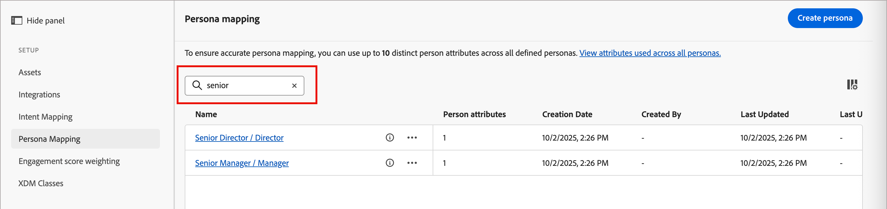
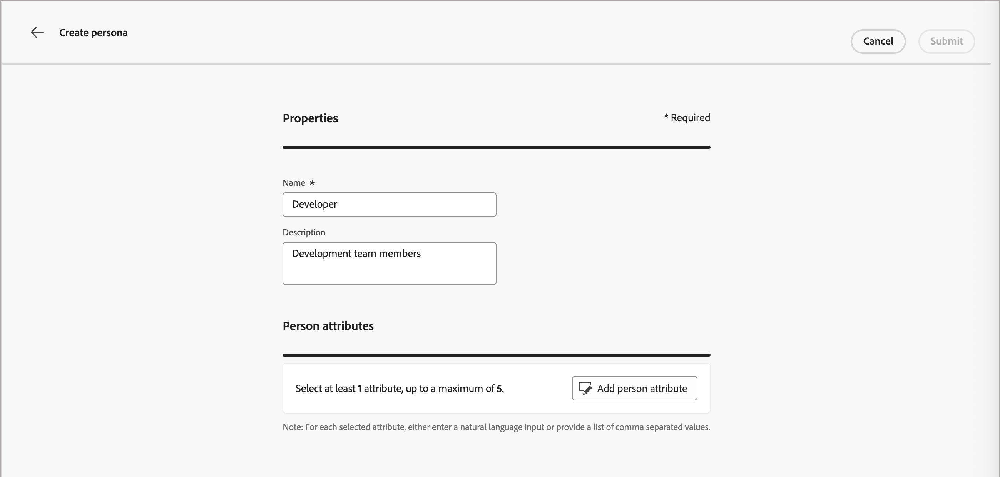

# 人物誌對應

<!-- not available until GA -->

角色是以帳戶為基礎的行銷(ABM)方法中的關鍵面向，角色可協助行銷人員根據目標帳戶中個人的特定需求、偏好和痛點調整策略。 行銷人員可以為每個角色建立詳細的設定檔，包括其背景、責任、痛點和偏好的通訊管道。 透過這些定義，管理員可以根據Journey Optimizer B2B Prime中的人員屬性來設定角色，以便人員清單和人員歷程可以使用簡化且一致的篩選來擷取這些角色。

在Journey Optimizer B2B Prime中，角色對應提供角色範本條件以外的額外功能：您可以使用&#x200B;**[!UICONTROL 衍生角色]**&#x200B;作為篩選條件，來篩選[人員清單](../audiences/people-lists.md)和[人員歷程](../marketing/person-journeys.md)。 _衍生角色_&#x200B;是系統根據所有已設定的角色定義來評估其屬性，以推斷個人記錄的角色。

角色定義和使用限制：

* 您最多可以在&#x200B;_[!UICONTROL 角色對應]_&#x200B;清單中定義20個角色。
* 每個角色在其定義中最多可以包含五個屬性。
* 在所有已定義的角色中，您最多可以使用10個不同的人員屬性。

>[!BEGINSHADEBOX]

**使用案例：職稱變化**

許多行銷和銷售團隊使用職稱作為識別帳戶中不同角色的方式。 但聯絡人的標題可能會不一致，且對類似角色使用許多變數。 建立人員清單篩選器或人員歷程對象條件時，會要求您為給定角色定義每個可能的相關職稱。 您可以簡化這些定義，並將擁有類似職稱的人員歸入一個推斷的角色之下，然後您可以篩選&#x200B;_衍生角色為產品管理_，而不是比對個別職稱值，藉此鎖定該角色。

>[!ENDSHADEBOX]

## 存取已設定的角色 {#access}

1. 在左側導覽列中，選擇&#x200B;**[!UICONTROL 管理]** > **[!UICONTROL 組態]**。

1. 按一下中繼面板上的&#x200B;**[!UICONTROL 角色對應]**&#x200B;以顯示角色清單。

   {width="800" zoomable="yes"}

   您可以從此頁面[建立](#create-a-persona)、[編輯](#edit-a-persona)或[刪除](#delete-a-persona)角色。

   角色對應清單以表格形式組織，並在頂端顯示最近更新的角色（依&#x200B;_[!UICONTROL 上次更新]_&#x200B;排序）。 您可以按一下右上角的&#x200B;_欄設定_ （  ）圖示，並選取或清除欄核取方塊來自訂顯示的表格。

   {width="300"}

1. 若要存取角色的詳細資訊，請按一下名稱。

### 預設角色

_角色對應_&#x200B;清單包含根據職稱屬性定義的五個預設角色。 您可以根據組織的需求編輯以下任何預設角色：

| 人物誌 | 職稱 |
| ------- | ---------- |
| CXO / EVP - CXO /執行副總裁 | CEO、CIO、CTO、CMO、CFO、策略執行副總裁 |
| SVP / VP — 資深副總裁/副總裁 | 行銷副總裁、銷售副總裁、營運副總裁、產品副總裁、IT副總裁 |
| 高級董事/董事 — 高級董事/董事 | 工程總監、資深產品總監、財務總監、客戶成功總監 |
| 資深經理/經理 — 資深經理/經理 | 資深行銷經理、IT經理、營運經理、銷售經理、人力資源經理 |
| 個人貢獻者 — 個人貢獻者 | 客戶主管、軟體工程師、行銷專家、客戶成功代表 |
| 分析師 — 分析師 | 業務分析師、資料分析師、市場研究分析師、財務分析師、營運分析師 |
| 開發人員 — 開發人員 | 前端開發人員、後端開發人員、完整棧疊開發人員、行動應用程式開發人員、DevOps工程師 |
| 專業人員 — 專業人員 | 人力資源專家、法律顧問、法規遵循人員、專案經理、採購專家 |
| 顧問 — 顧問 | 管理顧問、IT顧問、業務流程顧問、行銷顧問 |
| 其他 — 其他 | 產業專家、獨立顧問、自由顧問、主題專家 |

### 清單篩選

若要找到您想要的角色，請在搜尋列中輸入文字字串，依名稱比對角色。

{width="700" zoomable="yes"}

## 建立角色 {#create-a-persona}

1. 在左側導覽中，選擇&#x200B;**[!UICONTROL 管理]** > **[!UICONTROL 組態]**。

1. 按一下中繼面板中的&#x200B;**[!UICONTROL 角色對應]**。

1. 按一下&#x200B;**[!UICONTROL 建立角色]**。

1. 輸入角色唯一&#x200B;**[!UICONTROL 名稱]**&#x200B;和&#x200B;**[!UICONTROL 描述]** （選擇性）。

   {width="700" zoomable="yes"}

1. 選取用於比對角色的屬性。

   * 按一下&#x200B;**[!UICONTROL 選取人員屬性]**。

   * 在對話方塊中，選取每一個要對應的屬性的核取方塊（最多五個）。

     您可以按一下右上角的&#x200B;_欄設定_ （  ）圖示來自訂顯示的表格。

     若要依名稱篩選屬性清單，請在搜尋列中輸入文字字串。 您也可以按一下左上方的&#x200B;_篩選器_ （ ）圖示，依型別&#x200B;_標準_&#x200B;或&#x200B;_自訂_&#x200B;來篩選顯示的清單。

     {width="700" zoomable="yes"}

   * 按一下&#x200B;**[!UICONTROL 儲存]**。

     選取的屬性會填入&#x200B;_[!UICONTROL 角色屬性]_&#x200B;區段中。

1. 針對每個屬性，輸入您要與屬性比對的逗號分隔值。

1. 按一下&#x200B;**[!UICONTROL 提交]**。

## 編輯角色 {#edit-a-persona}

按一下角色名稱以存取及編輯角色的詳細資料。

您可以變更名稱或說明、新增屬性或更新屬性值。 完成變更後，按一下&#x200B;**[!UICONTROL 提交]**。

## 刪除角色 {#delete-a-persona}

刪除角色會將其從&#x200B;_角色對應_&#x200B;清單中移除，且無法再用於人員清單或人員歷程中的衍生角色篩選器。

1. 在&#x200B;_[!UICONTROL 角色對應]_&#x200B;頁面上，找出您要刪除的角色。

1. 在名稱旁，按一下省略符號(**...**) 圖示並選擇&#x200B;**[!UICONTROL 刪除]**。

1. 在確認對話框中，按一下「**[!UICONTROL 刪除]**」。

## 依衍生角色篩選 {#derived-persona-filter}

設定角色後，Journey Optimizer B2B Prime會根據定義的角色對應評估記錄的屬性，以衍生每個人員記錄的角色。 定義人員清單或人員歷程的對象時，您可以使用推斷的結果（_衍生角色_）作為篩選器。

衍生角色篩選器會顯示在&#x200B;**[!UICONTROL 特殊篩選器]**&#x200B;類別下方的篩選器面板中，與其他推斷的屬性（例如歷程成員資格）一起顯示。

### 人員清單

當您從靜態人物清單新增或移除成員時，或當您定義動態人物清單的成員資格規則時，您可以依衍生角色進行篩選，以鎖定其屬性符合特定已設定角色的所有人物。

**靜態清單 — 新增成員**

1. 開啟靜態清單，然後按一下右上方的&#x200B;**[!UICONTROL 新增人員]**。

1. 在篩選器對話方塊中，展開&#x200B;**[!UICONTROL 特殊篩選器]**，並將&#x200B;**[!UICONTROL 衍生角色]**&#x200B;拖曳到畫布上。

1. 在篩選條件中，選擇&#x200B;**[!UICONTROL 是]**，然後從清單中選取一或多個角色。

1. 按一下&#x200B;**[!UICONTROL 完成]**&#x200B;以套用篩選，並將相符的人員限定在清單中。

**動態清單 — 設定成員資格規則**

1. 開啟動態清單並選取&#x200B;**[!UICONTROL 規則]**&#x200B;標籤。

1. 按一下&#x200B;**[!UICONTROL 編輯規則]**。

1. 在篩選器對話方塊中，展開&#x200B;**[!UICONTROL 特殊篩選器]**，並將&#x200B;**[!UICONTROL 衍生角色]**&#x200B;拖曳到畫布上。

1. 在篩選條件中，選擇&#x200B;**[!UICONTROL 是]**，然後從清單中選取一或多個角色。

1. 按一下&#x200B;**[!UICONTROL 完成]**&#x200B;以儲存規則。

   當根據規則評估人員記錄時，會自動更新成員資格。

### 個人歷程

當您使用事件對象來設定人員歷程的對象時，可以使用「衍生角色」作為人員設定檔篩選器，以控制哪些人員進入歷程。

1. 按一下歷程畫布中的&#x200B;**[!UICONTROL 個人對象]**&#x200B;節點。

1. 在節點屬性面板中，選取&#x200B;**[!UICONTROL 事件對象]**&#x200B;作為對象型別。

1. 在&#x200B;**[!UICONTROL 個人資料篩選器]**&#x200B;下，按一下&#x200B;**[!UICONTROL 新增篩選器]**。

1. 展開&#x200B;**[!UICONTROL 特殊篩選器]**，並將&#x200B;**[!UICONTROL 衍生角色]**&#x200B;拖曳至篩選器畫布。

1. 在篩選條件中，選擇&#x200B;**[!UICONTROL 是]**，然後從清單中選取一或多個角色。

   只有衍生角色符合所選值的人員才符合進入歷程的資格。
