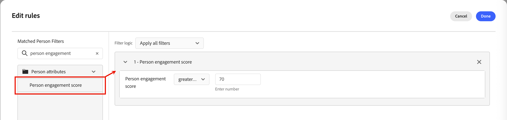
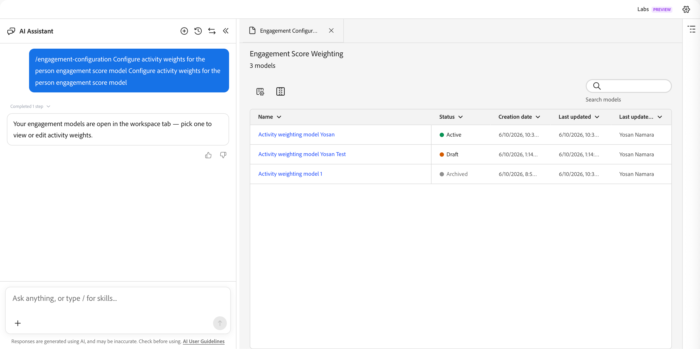

# 個人參與分數 {#engagement-scores}

>[!CONTEXTUALHELP]
>id="ajo-b2b-prime_person_engagement_score"
>title="個人參與分數"
>abstract="個人參與分數會根據個別潛在客戶最近的活動，反映其參與程度。"

個人參與分數是反映個別潛在客戶參與程度的數字。 分數是根據個人所執行的活動，而每個活動型別都包含加權值。 分數會在您的執行個體（租使用者）中標準化，以啟用一致的比較，並允許可操作的深入分析。

分數計算每天執行。 人員在過去30天內執行的任何參與加權活動都會影響分數。 有了此30天滾動期間，舊版活動會過期，而分數會隨著時間而降低（分數衰減）。 顯示的分數會四捨五入（例如，75.89999的分數會顯示為76）。

可在&#x200B;**[!UICONTROL 報表]**&#x200B;取得參與分數資料。

{width="800" zoomable="yes"}

人員參與分數是屬性，您可以在人員清單和人員歷程的分割路徑節點中，將其用作[篩選條件](#engagement-score-filter)。

## 用於參與計分的活動 {#activities}

參與分數不是&#x200B;_觸發式_。 這是評估所有潛在客戶的活動並重新計算分數的每日流程。 活動會使用&#x200B;_權重_&#x200B;來根據作用中加權模型通知分數，此模型會決定每個活動型別對整體分數的貢獻大小。

每個活動型別的每日頻率上限為20。 如果人員在一天內執行相同的活動超過20次，則該活動的計數上限為20。

| 活動名稱 | 方向 | 說明 | 預設權數 |
|---|---|---|---|
| 出席會議 | 傳入 | 高意圖面對面參與訊號 | 60 |
| 點按電子郵件 | 傳入 | 作用中點選=有意義的參與 | 30 |
| 點按銷售電子郵件 | 傳入 | 主動點選銷售推廣 | 30 |
| 按一下Marketo電子郵件 | 傳入 | 作用中點選=有意義的參與 | 30 |
| 與禮賓部互動 | 傳入 | 透過禮賓工具即時參與 | 60 |
| 參與禮賓室中的即時交談 | 傳入 | 即時交談=高購買意願 | 60 |
| 填寫Marketo表單 | 傳入 | 表單填滿=明確的潛在客戶意圖 | 40 |
| 關鍵時刻 | 傳入 | 高值行為觸發程式 | 60 |
| 新銷售機會 | 傳入 | 進入點 — 基線分數 | 30 |
| 開啟電子郵件 | 傳入 | 被動參與；低於點按 | 30 |
| 開啟Marketo電子郵件 | 傳入 | 被動參與；低於點按 | 30 |
| 開啟銷售電子郵件 | 傳入 | 被動參與；低於點按 | 30 |
| 閱讀WhatsApp訊息 | 傳入 | 被動讀取；較輕量通道 | 30 |
| 已接收轉寄給朋友的電子郵件 | 傳入 | 病毒訊號；輕度陽性 | 30 |
| 回覆銷售電子郵件 | 傳入 | 直接回覆=強大的購買訊號 | 40 |
| 請求行銷活動 | 傳入 | 自我啟動動作 — 高意圖 | 30 |
| 請求Marketo行銷活動 | 傳入 | 自我啟動動作 — 高意圖 | 30 |
| 已排程的禮賓會議 | 傳入 | 最高意圖轉換動作 | 60 |

>[!NOTE]
>
>參與分數活動會記錄在個人的Marketo Engage活動記錄中。 您可以在關聯的Marketo Engage執行個體中存取此記錄檔。 如需詳細資訊，請參閱Marketo Engage檔案中的[尋找人員](https://experienceleague.adobe.com/zh-hant/docs/marketo/using/product-docs/core-marketo-concepts/smart-lists-and-static-lists/managing-people-in-smart-lists/locate-the-activity-log-for-a-person){target="_blank"}的活動記錄。

## 評分邏輯 {#scoring-logic}

系統會套用多步驟標準化程式，針對您執行個體中的所有銷售機會產生一致的分數。

1. 識別具有相關權重和每日配額的所有&#x200B;_參與加權_&#x200B;活動型別，例如電子郵件點按次數、表單填寫和活動出席率。

1. 識別該人員在回顧期間（目前為30天）內執行的所有&#x200B;_參與加權_&#x200B;動作。

1. 標準化步驟1中識別的所有&#x200B;_參與加權_&#x200B;活動型別的活動型別權重，忽略回顧期間未發生的型別。

   此步驟使用&#x200B;_最小 — 最大標準化_，並減少未使用大部分活動型別之執行個體的活動型別權重的人工稀釋。

1. 套用每人每日頻率上限和活動型別。

   此步驟減少高容量、低價值活動對整體分數的影響。

1. 計算原始參與分數，方法是加總每個活動型別的每日活動，乘以相關的加權，然後在回顧期間的所有天數中加總結果。

1. 套用&#x200B;_乘冪轉換_ （平方根）以降低離群值的影響來穩定變異。

   此轉換可減少偏斜度並使資料中的圖案更加線性。

1. 套用&#x200B;_縮放標準化_&#x200B;轉換，以確保分數使用0到100的完整範圍。

## 依參與分數篩選 {#engagement-score-filter}

在定義人員清單的對象或在人員歷程中分段時，您可以使用人員參與分數作為篩選器。

_[!UICONTROL 個人參與分數]_&#x200B;篩選器會出現在&#x200B;**[!UICONTROL 個人屬性]**&#x200B;類別下的篩選器面板中。

### 人員清單 {#people-lists}

當您從[靜態人員清單](./people-lists.md#static-list)新增或移除成員時，或當您為[動態人員清單](./people-lists.md#dynamic-lists)定義成員資格規則時，您可以依人員參與分數篩選，以鎖定其屬性符合您評分條件的所有人員。

{width="700" zoomable="yes"}

**靜態清單 — 新增成員**

1. 開啟靜態清單，然後按一下右上方的&#x200B;**[!UICONTROL 新增人員]**。

1. 在篩選對話方塊中，展開&#x200B;**[!UICONTROL 人員屬性]**&#x200B;並將&#x200B;**[!UICONTROL 人員參與分數]**&#x200B;拖曳到畫布上。

1. 在篩選條件中，選擇運運算元並輸入值，以比對您要鎖定的分數。

1. 按一下&#x200B;**[!UICONTROL 完成]**&#x200B;以套用篩選，並將相符的人員限定在清單中。

**動態清單 — 設定成員資格規則**

1. 開啟動態清單並選取&#x200B;**[!UICONTROL 規則]**&#x200B;標籤。

1. 按一下&#x200B;**[!UICONTROL 編輯規則]**。

1. 在篩選對話方塊中，展開&#x200B;**[!UICONTROL 人員屬性]**&#x200B;並將&#x200B;**[!UICONTROL 人員參與分數]**&#x200B;拖曳到畫布上。

1. 在篩選條件中，選擇運運算元並輸入值，以比對您要鎖定的分數。

1. 按一下&#x200B;**[!UICONTROL 完成]**&#x200B;以儲存規則。

   當根據規則評估人員記錄時，會自動更新成員資格。

### 個人歷程 {#person-journeys}

當您在&#x200B;[_分割路徑_&#x200B;節點](../marketing/split-merge-paths-nodes.md)中設定人員歷程的區段時，您可以使用人員參與分數作為人員設定檔篩選器，以控制哪些人員進入歷程路徑。

分割路徑條件的{width="700" zoomable="yes"}

1. 按一下歷程畫布中的&#x200B;**[!UICONTROL 分割路徑]**&#x200B;節點。

1. 在右側的節點屬性面板中，按一下路徑的&#x200B;**[!UICONTROL 套用條件]**&#x200B;或&#x200B;**[!UICONTROL 編輯條件]**。

1. 在篩選對話方塊中，展開&#x200B;**[!UICONTROL 人員屬性]**&#x200B;並將&#x200B;**[!UICONTROL 人員參與分數]**&#x200B;拖曳到畫布上。

1. 在篩選條件中，選擇運運算元並輸入值，以比對您要鎖定的分數。

1. 按一下&#x200B;**[!UICONTROL 完成]**&#x200B;以儲存路徑的篩選器。

## 設定參與分數加權 {#configure-weighting}

在[!DNL Journey Optimizer B2B Prime]中，您可以直接從[AI助理聊天介面](../agents/chat-interface.md)設定參與分數加權。

如需參與分數模型、加權頻帶和活動權重的背景，請參閱[設定自訂參與分數加權](https://experienceleague.adobe.com/en/docs/journey-optimizer-b2b/user/admin/configurations/engagement-score-weighting)。

1. 從畫面左側開啟&#x200B;**[!UICONTROL AI小幫手]**&#x200B;聊天面板（聊天圖示）。

1. 在聊天輸入欄位中，輸入正斜線指令，然後輸入您的目的。 例如：

   `/engagement-configuration Configure activity weights for the person engagement score model`

   當您輸入`/`時，AI助理會顯示可用的斜線指令和技能清單。 參與設定命令直接路由到「參與分數加權」頁面。

   {width="700" zoomable="yes"}

1. 按一下&#x200B;_提交_ （向上鍵）圖示或按Enter。

   AI小幫手會處理要求，並在聊天面板旁邊的主要內容區域中開啟&#x200B;**[!UICONTROL 參與組態]**&#x200B;標籤。

### 檢閱參與分數加權清單 {#review-weighting-list}

標籤開啟後，_參與分數加權_&#x200B;頁面會在表格中顯示所有現有評分模型，其欄位如下：

| 欄 | 說明 |
|---|---|
| **名稱** | 模型名稱（按一下可開啟詳細資訊） |
| **狀態** | 「使用中」、「草稿」或「已存檔」 |
| **建立日期** | 建立模型的時間 |
| **上次更新時間** | 最近儲存時間戳記 |
| **上次更新者** | 上次儲存變更的使用者 |

{width="700" zoomable="yes"}

在任何指定時間，只有&#x200B;**一個**&#x200B;模型可以是[作用中]。 目前作用中的模型會套用至所有參與分數計算。

### 開啟評分模型 {#open-scoring-model}

按一下清單中任何模型的名稱，開啟其詳細資訊頁面。

詳細資訊頁面會顯示：

* 模型名稱和目前狀態徽章（_使用中_、_草稿_&#x200B;或&#x200B;_已封存_）
* 用於篩選活動清單的&#x200B;_搜尋_&#x200B;欄位
* 具有&#x200B;**[!UICONTROL 參與活動]**、**[!UICONTROL 加權]**、**[!UICONTROL 上次更新]**&#x200B;和&#x200B;**[!UICONTROL 上次更新者]**&#x200B;欄的完整活動表格

{width="700" zoomable="yes"}

對於已封存的模型，**[!UICONTROL Delete]**&#x200B;和&#x200B;**[!UICONTROL Duplicate]**&#x200B;會顯示在右上方。 對於草稿模型，也會顯示&#x200B;**[!UICONTROL 啟動]**。

### 編輯草稿模型的活動權重 {#edit-activity-weights}

草稿模型具有每個參與活動的可編輯&#x200B;_[!UICONTROL 加權]_&#x200B;選項。 若要變更重量，請執行下列動作：

1. 按一下清單中的草繪模型名稱。

1. 在活動表格中，找出您要更新的參與活動。

1. 按一下該活動的&#x200B;**[!UICONTROL 加權]**&#x200B;向下箭頭，然後選取適當的加權範圍（例如，`Important`、`Trivial`、`Minor`、`Normal`和`Vital`）。

   變更會自動儲存 — 不需要明確的「儲存」動作。

>[!NOTE]
>
>若要編輯活動或封存的模型，您可以複製它以建立新的草稿模型，然後編輯並啟動複製專案。 您無法就地編輯作用中的模型。

### 啟動草稿模型 {#activate-weighting-model}

啟動草稿模型會自動封存先前使用中的模型。 然後，新啟用的模型會套用至所有未來的參與分數計算。 當草稿模型設定了正確的活動權重時：

1. 按一下清單中的草繪模型名稱。

1. 按一下右上角的&#x200B;**[!UICONTROL 啟動]**。

1. 在對話方塊中確認。
