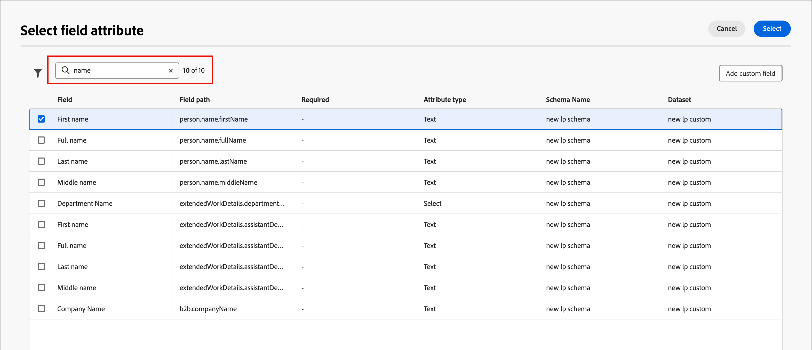
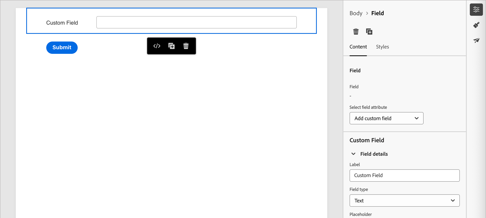
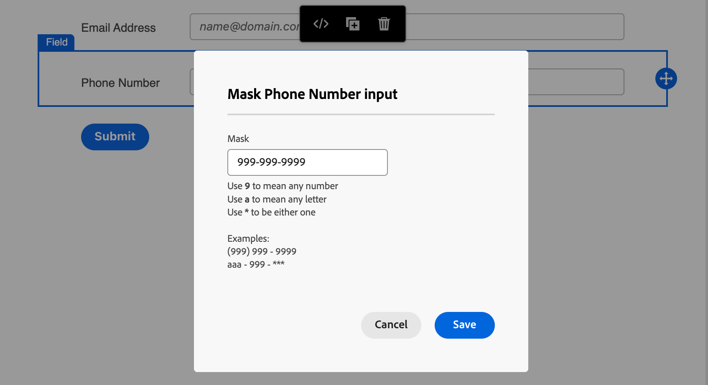
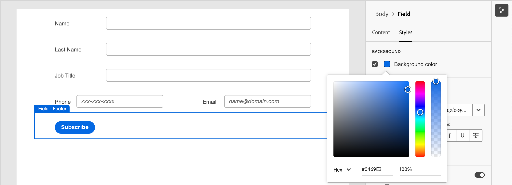
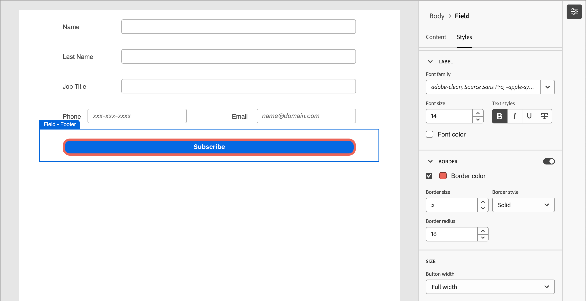

# 表單設計

在您[建立表單](./forms.md#create-forms)之後，視覺化設計空間會開啟具有預設基本表單定義的草稿。 在右側的&#x200B;_[!UICONTROL 摘要]_&#x200B;面板中，按一下&#x200B;**[!UICONTROL 編輯表單]**，並使用視覺化設計空間來定義表單樣式和欄位元件。

{width="700" zoomable="yes"}

依預設，_&#x200B;**提交**&#x200B;_&#x200B;按鈕（頁尾欄位）是表單的一部分，無法移除。 您可以選取表單中的按鈕/頁尾元件以[變更按鈕](#submit-button)的文字和樣式。

## 欄位 {#fields}

表單欄位用於擷取人員設定檔資料，這些資料可用於鎖定人員並將他們與帳戶和購買群組建立關聯。 使用欄位設計工具來建構欄位集和版面配置，以收集您帳戶型行銷活動所需的資料。

### 新增欄位 {#add-field}

1. 在左側的&#x200B;_[!UICONTROL 元件]_&#x200B;面板中，將&#x200B;**[!UICONTROL 欄位]**&#x200B;內容元件拖放到畫布上。

   {width="800" zoomable="yes"}

1. 針對&#x200B;_[!UICONTROL 選取欄位屬性]_，請選擇選項並設定欄位屬性。

   * **[!UICONTROL 選取欄位屬性]** — 使用此選項，根據表單預設集中定義的資料集結構描述選取屬性。

     在&#x200B;_[!UICONTROL 選取欄位屬性]_&#x200B;對話方塊中，選取您要用於欄位之屬性的核取方塊，然後按一下&#x200B;**[!UICONTROL 選取]**。

     {width="700" zoomable="yes"}

     例如，您可以設定電子郵件和公司。 當使用者完成並提交表單時，輸入的資訊會儲存到所選的資料集。

     若要將收集的資料與設定檔對應，請選取設定檔身分欄位。 身分欄位在屬性清單中標示為&#x200B;**[!UICONTROL 必要]** — 您可以篩選它們。

   * **[!UICONTROL 新增自訂欄位]**

     使用此選項，您可以定義自由欄位，而無需將其對應至連結資料集中的欄位。

     {width="600" zoomable="yes"}

   畫布上會填入所選屬性的預設欄位標籤。 **[!UICONTROL 欄位詳細資料]**&#x200B;會顯示在右側的面板中。

1. 如有需要，請變更&#x200B;**[!UICONTROL 標籤]**&#x200B;文字。

   此文字會顯示在表單中的欄位旁。 預設文字會從欄位屬性填入。

1. 根據欄位的資料型別設定&#x200B;**[!UICONTROL 欄位型別]**：

   | 欄位類型 | 使用情況 |
   | ---------- | ----- |
   | **[!UICONTROL 核取方塊]** | 使用此型別，讓訪客可以選取&#x200B;_true_ （已核取）或&#x200B;_false_ （未核取）值。 |
   | **[!UICONTROL 核取方塊群組]** | 使用此型別，讓訪客可以為多個專案選取&#x200B;_true_ （已核取）或&#x200B;_false_ （未核取）值。 |
   | **[!UICONTROL 貨幣]** | 使用此型別以允許代表為[!DNL Journey Optimizer B2B Prime]執行個體選取的預設貨幣型別的浮點欄位。 |
   | **[!UICONTROL 日期]** | 使用此型別將輸入限製為日期格式，並在欄位中提供行事曆選擇器。 |
   | **[!UICONTROL 雙倍]** | 雙精確度浮點變數儲存為IEEE 64位元（8位元組）浮點數。 |
   | **[!UICONTROL 電子郵件]** | 使用此型別將輸入限製為電子郵件地址格式。 |
   | **[!UICONTROL 數字]** | 使用此型別將欄位限製為數值。 |
   | **[!UICONTROL 無線電群組]** | 使用此型別可允許訪客選取一組選項之一。 |
   | **[!UICONTROL 選取]** | 使用此型別，可讓訪客使用下拉式清單選取一組選項之一。 |
   | **[!UICONTROL 滑桿]** | 使用此型別，可讓訪客使用滑桿設定數值。 |
   | **[!UICONTROL 電話]** | 將此型別用於電話號碼輸入欄位。 |
   | **[!UICONTROL 文字]** | 將此型別用於標準文字（字串）輸入欄位。 |
   | **[!UICONTROL 文字區域]** | 使用此型別支援較長的文字輸入。 |
   | **[!UICONTROL URL]** | 使用此型別將文字輸入限製為URL，包括標準URL通訊協定。 |

1. 根據選取的欄位型別，設定欄位輸入和驗證的其他選項。

   {width="800" zoomable="yes"}

   例如，_文字_&#x200B;欄位型別具有下列欄位輸入和驗證選項：

   * **[!UICONTROL 預留位置]** — 欄位的預留位置值，提供訪客該欄位應有的範例。

   * **[!UICONTROL 指示]** — 可協助訪客完成欄位的指示文字。 輸入您要顯示為&#x200B;_暫留文字_&#x200B;的欄位文字。

     >[!TIP]
     >
     >_指示與預留位置文字_ 
     >
     >使用這兩個屬性來引導訪客填寫欄位。 將指標暫留在欄位上時，指示文字會顯示為工具提示/快顯文字。 預留位置文字在欄位中顯示&#x200B;_變暗_，當訪客在欄位中輸入文字時，預留位置文字就會消失。 您可以使用這兩種方法，或只使用其中一種。

   * **[!UICONTROL 預設值]** — 使用此選項來指定欄位的預設值。

   * **[!UICONTROL 驗證訊息]** — 使用此選項來指定欄位的驗證訊息。 如果訪客為欄位輸入無效值，則會顯示此訊息。 _[!UICONTROL Standard]_&#x200B;訊息已預設設定。 選擇&#x200B;**[!UICONTROL 自訂]**&#x200B;並輸入您自己的訊息。

   * **[!UICONTROL 最大長度]** — 輸入欄位可輸入的最大字元數。

1. 視需要設定&#x200B;**[!UICONTROL 欄位行為]**：

   * **[!UICONTROL 必要]** — 選取核取方塊，讓欄位輸入成為提交表單的必要欄位。

   * **[!UICONTROL 區分大小寫]** — 選取核取方塊，讓欄位區分大小寫。

   * **[!UICONTROL 已啟用預填]** — 選取核取方塊以從設定檔資訊填入欄位（如果有的話）。

   * **[!UICONTROL 啟用輸入遮罩]** — 選取核取方塊，以使用輸入遮罩限制訪客的輸入。 例如，您可能希望訪客以特定格式輸入電話號碼。 在對話方塊中，使用`9`輸入任何數字的遮罩，`a`輸入任何字母，`*`輸入任一數字。

     {width="550" zoomable="yes"}的輸入遮罩

     按一下&#x200B;**[!UICONTROL 儲存]**&#x200B;以啟用指定的輸入遮罩。

### 變更欄位樣式 {#field-styling}

選取右側面板中的&#x200B;**[!UICONTROL 樣式]**&#x200B;索引標籤，以變更所選欄位的樣式。

* **[!UICONTROL 背景]** — 選取核取方塊以套用欄位的背景顏色。 預設顏色為白色。 按一下&#x200B;**[!UICONTROL 背景顏色]**&#x200B;方塊以開啟彈出式檢色器，並選擇欄位背景的顏色。

  {width="600" zoomable="yes"}

* **[!UICONTROL 標籤]** — 標籤樣式會控制欄位旁邊所顯示文字的視覺特性。 選擇相對於欄位的頂端或側邊標籤顯示。 您可以設定字型大小、行高、文字樣式及文字對齊方式。 按一下&#x200B;**[!UICONTROL 字型顏色]**&#x200B;方塊以開啟彈出式檢色器，並選擇標籤文字的顏色。

  {width="600" zoomable="yes"}

* **[!UICONTROL 邊框]** — 按一下&#x200B;**[!UICONTROL 邊框顏色]**&#x200B;方塊以開啟彈出式檢色器，並選擇邊框顏色。 您可以定義欄位的邊框，包括顏色和線條寬度。 清除核取方塊可移除顯示的欄位邊框。 您也可以變更邊角的邊框大小（畫素寬度）、樣式和半徑設定。

  {width="600" zoomable="yes"}

* **[!UICONTROL 大小]** — 選取大小設定以決定欄位的顯示寬度。 選擇&#x200B;_[!UICONTROL 全寬]_、_[!UICONTROL 半寬]_&#x200B;或&#x200B;_[!UICONTROL 自動]_。

* **[!UICONTROL 邊界]** — 設定欄位周圍的邊界（畫素）。 您可以在所有四個邊上設定相同的邊界，或選取&#x200B;**[!UICONTROL 每個邊不同的邊界]**&#x200B;核取方塊，分別設定水準邊界和垂直邊界。

* **[!UICONTROL 內距]** — 設定欄位周圍的內距（畫素）。 您可以在所有四個邊上設定相同的內距，或選取&#x200B;**[!UICONTROL 每個邊不同的內距]**&#x200B;核取方塊，以分別設定水準內距和垂直內距。

  {width="600" zoomable="yes"}

### 重新排序欄位 {#field-reorder}

您可以在視覺工作區中直接移動表單欄位。 按一下所選欄位右邊緣的&#x200B;_移動_&#x200B;工具，並將其拖曳到新位置。

新增[結構元件](./structure-components.md)至表單，並將欄位移動至欄，以群組這些元件並變更版面。 按一下所選欄元件左邊緣的&#x200B;_移動_&#x200B;工具，並將其拖曳至表單中的新位置。

{width="500"}

### 刪除或複製欄位 {#field-delete-duplicate}

按一下工具列或右側面板中的&#x200B;_刪除_&#x200B;圖示（）以刪除選取的欄位。 在確認對話框中，按一下「**[!UICONTROL 刪除]**」。

按一下工具列或右側面板中的&#x200B;_複製_&#x200B;圖示（）以複製選取的欄位。 新欄位會顯示在原始欄位的正下方。 按一下&#x200B;**[!UICONTROL 選取欄位屬性]**&#x200B;以設定欄位屬性。 視需要設定欄位型別、詳細資訊和樣式。

{width="600" zoomable="yes"}

## 提交按鈕 {#submit-button}

依預設，提交按鈕（頁尾欄位）是表單的一部分，無法移除。 選取表單中的按鈕/頁尾元件，以變更按鈕的文字和樣式。

### 編輯按鈕內容 {#button-content}

在右側面板中顯示&#x200B;_[!UICONTROL Content]_&#x200B;索引標籤時，變更&#x200B;**[!UICONTROL 按鈕文字]**&#x200B;欄位中的文字。 按鈕大小會調整以符合文字的長度。

{width="600" zoomable="yes"}

### 設定提交按鈕的樣式 {#button-styles}

選取右側面板中的&#x200B;**[!UICONTROL 樣式]**&#x200B;索引標籤，以變更所選按鈕/頁尾元件的樣式。

* **[!UICONTROL 背景]** — 選取核取方塊以套用按鈕的背景顏色。 藍色是預設顏色。 按一下&#x200B;**[!UICONTROL 背景顏色]**&#x200B;方塊以開啟彈出式檢色器，並選擇按鈕背景的顏色。

  {width="600" zoomable="yes"}

* **[!UICONTROL 標籤]** — 標籤樣式控制按鈕內文字的視覺特性。 您可以設定字型大小、行高、文字樣式及文字對齊方式。 按一下&#x200B;**[!UICONTROL 字型顏色]**&#x200B;方塊以開啟彈出式檢色器，並選擇標籤文字的顏色。

* **[!UICONTROL 邊框]** — 按一下&#x200B;**[!UICONTROL 邊框顏色]**&#x200B;方塊以開啟彈出式檢色器，並選擇邊框顏色。 您可以定義按鈕的框線，包括顏色和線條寬度。 清除核取方塊可移除顯示的按鈕邊框。 您也可以變更圓角邊框大小（畫素寬度）、樣式和半徑設定。

* **[!UICONTROL 大小]** — 選取大小設定以決定按鈕的顯示寬度。 選擇&#x200B;_[!UICONTROL 全寬]_、_[!UICONTROL 半寬]_&#x200B;或&#x200B;_[!UICONTROL 自動]_。 內距會根據大小和對齊設定進行調整。

  {width="600" zoomable="yes"}

* **[!UICONTROL 按鈕對齊方式]** — 當您選擇按鈕的&#x200B;_半寬_&#x200B;或&#x200B;_自動_&#x200B;大小時，請將對齊方式設定在左、右或中央。 內距會根據大小和對齊設定進行調整。

* **[!UICONTROL 邊界]** — 設定按鈕周圍的邊界（畫素）。 您可以在所有四個邊上設定相同的邊界，或選取&#x200B;**[!UICONTROL 每個邊不同的邊界]**&#x200B;核取方塊，分別設定水準邊界和垂直邊界。

* **[!UICONTROL 內距]** — 設定按鈕周圍的內距（畫素）。 您可以在所有四個邊上設定相同的內距，或選取&#x200B;**[!UICONTROL 每個邊不同的內距]**&#x200B;核取方塊，以分別設定水準內距和垂直內距。 如果您變更大小和對齊設定，邊框間距會隨之調整。

  {width="600" zoomable="yes"}

## 表單樣式 {#form-styling}

當您在結構或表單元件外部按一下時，可以變更表單元區的樣式。 表單元件（欄位和按鈕）會繼承在頂層定義的&#x200B;_內文_&#x200B;樣式，除非在欄位或按鈕/頁尾層級定義了其他樣式。

{width="600" zoomable="yes"}

### CSS樣式 {#css-styles}

新表單使用預設的CSS來設定樣式。 如果您想要透過修改CSS來變更樣式，可以複製樣式，然後使用樣式來定義表單的自訂CSS。

定義表單&#x200B;:_的自訂CSS(_T)

1. 按一下右側面板中的&#x200B;**[!UICONTROL 檢視CSS]**&#x200B;以檢視CSS程式碼。

   {width="450" zoomable="yes"}

1. 在捲動視窗中選取CSS程式碼，並將其複製到剪貼簿。

1. 按一下 **[!UICONTROL 關閉]**。

1. （選用）將複製的程式碼貼到您最愛的CSS工具中，並編輯CSS以反映您想要的樣式。

1. 按一下右側面板中的「**[!UICONTROL 新增自訂CSS]**」。

1. 將CSS程式碼貼到視窗中。

   {width="450" zoomable="yes"}

   您可以在此視窗中編輯貼上的文字。

1. 按一下&#x200B;**[!UICONTROL 儲存]**。

### 手動樣式設定 {#manual-styling}

變更右側面板中的設定，以定義整個表單的顯示。

* **[!UICONTROL 背景顏色]** — 選取核取方塊以在表單區域周圍套用背景顏色。 預設顏色為白色。 按一下顏色方塊以開啟彈出式檢色器，並選擇表單背景的顏色。

* **[!UICONTROL 檢視區背景]** — 選取核取方塊以將背景顏色套用至所有表單元件。 預設為無顏色（繼承自外部背景）。 按一下顏色方塊以開啟彈出式檢色器，並選取表單結構元件的顏色。

  {width="600" zoomable="yes"}

* **[!UICONTROL 文字]** — 選擇表單的&#x200B;**[!UICONTROL 字型系列]**，這會影響表單欄位的標籤、提示及預留位置文字。 它也會影響預設的提交按鈕文字。

* **[!UICONTROL 大小]** — 變更表單的大小（寬度） （以畫素為單位）。

* **[!UICONTROL 邊界]** — 設定表單元件周圍的邊界（畫素）。 您可以在所有四個邊上設定相同的邊界，或選取&#x200B;**[!UICONTROL 每個邊不同的邊界]**&#x200B;核取方塊，分別設定水準邊界和垂直邊界。

  {width="600" zoomable="yes"}
