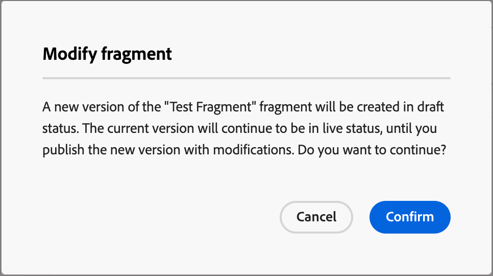

# 片段

片段是可重複使用的元件，可在[!DNL Journey Optimizer B2B Prime]的一或多個電子郵件和電子郵件範本中參照。 這通常是可以預先建立並快速插入電子郵件或電子郵件範本中的內容區塊（文字、影像或兩者）。 透過此功能，您可以預先建置多個自訂內容區塊，以供行銷團隊成員用於組合電子郵件內容，以改善設計流程。 常見的使用案例包括電子郵件的頁首/頁尾內容區塊、事件邀請橫幅和季節性問候。

>[!BEGINSHADEBOX]

**視覺片段**

視覺片段是預先定義的視覺化區塊，使用視覺化設計工具建置，可在多個電子郵件或電子郵件範本中重複使用。 [!DNL Journey Optimizer B2B Prime]的目前範圍及此檔案僅包含視覺片段。

>[!NOTE]
>
>[!DNL Journey Optimizer B2B Prime]中尚未支援運算式型片段。

>[!ENDSHADEBOX]

若要在工作流程中善用片段：

* _建立您自己的片段_ — 從草稿開始建立視覺化片段，或從視覺化內容設計空間將內容儲存為片段。
* _重複使用片段_ — 視需要在電子郵件或電子郵件範本內容中多次使用這些片段。

## 存取及管理片段 {#access-manage-fragments}

若要在[!DNL Journey Optimizer B2B Prime]中存取視覺化片段，請前往左側導覽並展開&#x200B;**[!UICONTROL 內容管理]**。 然後，選取&#x200B;**[!UICONTROL 片段]**。 此動作會開啟一個清單頁面，其中包含在表格中列出的執行個體中建立的所有片段。

{width="700" zoomable="yes"}

此表格是依&#x200B;_[!UICONTROL 已修改]_&#x200B;欄排序，最近更新的片段預設會排在頂端。 按一下欄標題，在升序和降序之間變更。

左側的檔案夾結構可讓您組織片段。 依預設，會顯示所有片段。 當您選取資料夾時，只會顯示所選資料夾中包含的片段和子資料夾。

### 片段狀態 {#fragment-status}

片段狀態決定其是否可用於電子郵件或電子郵件範本，以及您可以對其進行的變更。

| 狀態 | 說明 |
| ------ | ----------- |
| 草稿 | 當您建立片段時，它處於草稿狀態。 當您定義或編輯視覺設計空間時，它保持此狀態，直到您發佈它以用於電子郵件或電子郵件範本為止。 可用的動作：  <ul><li>編輯所有詳細資料<li>在視覺設計空間編輯<li>發佈<li>重複<li>刪除 |
| 已上線 | 當您發佈片段時，該片段將可用於電子郵件或電子郵件範本。 在視覺化設計空間中無法修改已發佈的片段內容。 可用的動作：  <ul><li>編輯說明<li>新增至電子郵件或範本<li>建立草稿版本<li>重複<li>刪除（若未使用） |
| 即時（含草稿） | 當您從即時片段建立草稿時，即時版本仍可用於電子郵件或電子郵件範本中，並且草稿內容可在視覺設計空間中修改。 如果您發佈草稿版本，草稿版本會取代目前的即時版本，而內容會更新到使用中的電子郵件和電子郵件範本中。 可用的動作：  <ul><li>編輯說明<li>新增至電子郵件或範本<li>在視覺化設計空間中編輯草稿版本<li>發佈草稿版本<li>重複<li>刪除（若未使用） |
| 已封存 | 片段已封存且未顯示在&#x200B;_片段_&#x200B;清單中。 |

### 篩選片段清單 {#filter-list}

若要依名稱搜尋片段，請在搜尋列中輸入文字字串以尋找相符專案。 選取[資料夾](#folders)時，搜尋將套用至該資料夾階層第一層級中的所有片段或資料夾。

{width="500" zoomable="yes"}

按一下&#x200B;_篩選器_&#x200B;圖示（）以顯示可用的篩選器選項，並變更設定以根據您指定的條件篩選顯示的專案。

### 自訂欄顯示 {#column-display}

按一下右上角的&#x200B;_自訂表格_&#x200B;圖示（），自訂您要顯示在表格中的欄。

在對話方塊中，選取要顯示的資料行，然後按一下&#x200B;**[!UICONTROL 套用]**。

{width="300"}

### 大量動作 {#bulk-actions}

您可以使用核取方塊選取多個片段，並將大量作業套用至所有片段。 可用的動作會顯示在清單頁面底部的大量動作列中。 可進行下列操作：

* **[!UICONTROL 移至資料夾]** — 將選取的片段移至資料夾。
* **[!UICONTROL 封存]** — 封存選取的片段。

您也可以按一下任何欄標題來排序片段清單，以及拖曳欄邊框以符合您需要的資料來調整欄大小。

## 建立內容片段 {#create-fragments}

您可以按一下右上角的&#x200B;**[!UICONTROL 建立片段]**，在[!DNL Journey Optimizer B2B Prime]中建立新的視覺片段。

1. 在&#x200B;_[!UICONTROL 建立片段]_&#x200B;頁面中，輸入有用的&#x200B;**[!UICONTROL Name]** （必要）和&#x200B;**[!UICONTROL Description]** （選用）。

   * 名稱 — 最多100個字元，必須是唯一的、不區分大小寫

   * 說明 — 最多300個字元

   * 允許使用Alpha、數值和特殊字元

   * 保留的字元是&#x200B;**_不允許_**： `\ / : * ? " < > |`

   {width="700" zoomable="yes"}

1. 按一下&#x200B;**[!UICONTROL 建立]**。

   視覺設計空間會以空白畫布開啟。

1. 使用內容設計工具建立視覺片段內容：

   * [新增結構和內容](./fragment-authoring.md#design-fragment)
   * [新增資產](./fragment-authoring.md#add-assets)
   * [導覽圖層、設定和樣式](./fragment-authoring.md#navigate-layers-settings-styles)
   * [將內容個人化](./fragment-authoring.md#personalize-content)
   * [編輯連結的URL追蹤](./fragment-authoring.md#edit-linked-url-tracking)

1. 隨時按一下&#x200B;**[!UICONTROL 儲存]**&#x200B;以儲存草稿片段。

1. 當您準備好讓片段可用於電子郵件或電子郵件範本時，請按一下[發佈]。****

## 檢視片段詳細資訊 {#view-details}

按一下清單頁面中任何片段的名稱，以開啟片段詳細資訊頁面。 您可以選擇編輯片段、重新命名片段或更新片段說明。 進行更新，然後按一下名稱或說明欄位外部以自動儲存變更。

>[!NOTE]
>
>如果電子郵件或電子郵件範本正在使用已發佈的片段，則您無法變更名稱或編輯內容。 如果您想對片段進行變更，可以建立草稿版本。

{width="700" zoomable="yes"}的詳細資料

按一下「**[!UICONTROL 編輯片段]**」以在視覺內容編輯器中開啟片段。

隨時按一下左上方的&#x200B;_上一步_&#x200B;箭頭以結束檢視，此箭頭會返回&#x200B;_片段_&#x200B;清單頁面。

## 檢視片段參考 {#references}

對於&#x200B;_即時_&#x200B;片段，您可以檢視目前參考（使用）該片段的資產清單。

1. 在片段詳細資訊頁面中，按一下「更多(**...**)」 圖示加以顯示。

1. 選取&#x200B;**[!UICONTROL 探索參考]**。

   _[!UICONTROL 片段使用方式]_&#x200B;頁面會顯示資產清單，其中片段目前在[!DNL Journey Optimizer B2B Prime]內使用，並跨越電子郵件和電子郵件範本。

   >[!IMPORTANT]
   >
   >無法刪除任何電子郵件或電子郵件範本目前正在使用的任何片段。

   根據類別顯示參考： _電子郵件_&#x200B;或&#x200B;_電子郵件範本_。 [!DNL Journey Optimizer B2B Prime]中的每個電子郵件都定義在人員歷程的&#x200B;_傳送電子郵件_&#x200B;動作節點中，因此使用片段的電子郵件上層歷程會顯示在參考中。

1. 按一下連結，開啟使用片段之對應的電子郵件或電子郵件範本。

## 使用資料夾管理片段 {#folders}

若要輕鬆導覽您的片段，您可以使用資料夾以更有效地將其組織到結構化階層中。 這可讓您根據組織需求將專案分類和管理。

選取&#x200B;_[!UICONTROL 根]_&#x200B;資料夾以顯示所有片段，包括位於所有子資料夾中的片段。 選取結構中的任何資料夾以顯示其內容。 在選取資料夾後，按一下「建立片段」以在該資料夾中建立新片段。

### 建立資料夾 {#folders-create}

1. 選取父資料夾（根或其他資料夾）後，按一下右上角的&#x200B;**[!UICONTROL 建立資料夾]**。

1. 輸入新資料夾的&#x200B;**[!UICONTROL 名稱]**，然後按一下&#x200B;**[!UICONTROL 儲存]**。

   新資料夾會顯示在所選父資料夾內的清單頂端。

   您可以按一下[更多]功能表( **...** )圖示來重新命名、移動或刪除資料夾。

### 行動資料夾 {#folders-move}

1. 按一下&#x200B;_其他功能表_ (**...**) 圖示來標籤您要移動之片段的名稱。

1. 選擇&#x200B;**[!UICONTROL 移至資料夾]**。

1. 在對話方塊中，導覽資料夾結構並選取您要移動片段的資料夾。

1. 按一下&#x200B;**[!UICONTROL 移動]**。

### 刪除資料夾 {#folders-delete}

1. 在資料夾結構中，選取您要刪除之資料夾的父系。

1. 按一下&#x200B;_其他功能表_ (**...**) 圖示來顯示要刪除的子資料夾名稱。

1. 選擇&#x200B;**[!UICONTROL 刪除資料夾]**。

## 編輯片段 {#edit-fragments}

對片段的編輯取決於其目前狀態：

* 當片段處於&#x200B;_草稿_&#x200B;狀態時，您可以編輯其任何詳細資訊和視覺內容。
* 當片段處於&#x200B;_即時_&#x200B;狀態時，您可以編輯片段說明，但不能編輯名稱。 除非您建立草稿，否則無法編輯視覺內容。
* 當片段處於具有現有草稿的&#x200B;_即時_&#x200B;狀態時，編輯詳細資料僅限於說明。 您也可以編輯草稿版本的視覺內容。

>[!BEGINTABS]

>[!TAB 草稿]

1. 從&#x200B;_[!UICONTROL 片段]_&#x200B;清單頁面，按一下片段名稱以開啟。

   視覺內容的預覽隨即顯示。

1. 視需要修改說明。

   具有草稿狀態的片段的{width="600" zoomable="yes"}

1. 若要變更視覺化設計空間中的內容，請按一下右上方的&#x200B;**[!UICONTROL 編輯]**。

   視需要使用視覺化設計工具：

   * [新增結構和內容](./fragment-authoring.md#design-fragment)
   * [新增資產](./fragment-authoring.md#add-assets)
   * [導覽圖層、設定和樣式](./fragment-authoring.md#navigate-layers-settings-styles)
   * [將內容個人化](./fragment-authoring.md#personalize-content)
   * [編輯連結的URL追蹤](./fragment-authoring.md#edit-linked-url-tracking)

   按一下「**[!UICONTROL 儲存]**」或「**[!UICONTROL 儲存並關閉]**」以返回片段詳細資料。

1. 當片段符合您的條件且您想要在電子郵件或電子郵件範本中使用時，請按一下&#x200B;**[!UICONTROL 發佈]**。

>[!TAB 已上線]

1. 從&#x200B;_[!UICONTROL 片段]_&#x200B;清單頁面，按一下片段名稱以開啟。

   接著會顯示視覺內容的預覽，片段詳細資訊位於右側。

1. 視需要修改說明。

1. 若要更新內容，請按一下右上方的&#x200B;**[!UICONTROL 修改]**。

1. 在對話方塊中，按一下&#x200B;**[!UICONTROL 確認]**&#x200B;以建立片段的草稿版本。

   {width="300"}

1. 按一下右上方的&#x200B;**[!UICONTROL 編輯]**。

1. 視需要使用視覺化設計工具來更新草稿中的內容：

* [新增結構和內容](./fragment-authoring.md#design-fragment)
* [新增資產](./fragment-authoring.md#add-assets)
* [導覽圖層、設定和樣式](./fragment-authoring.md#navigate-layers-settings-styles)
* [將內容個人化](./fragment-authoring.md#personalize-content)
* [編輯連結的URL追蹤](./fragment-authoring.md#edit-linked-url-tracking)

按一下「**[!UICONTROL 儲存]**」或「**[!UICONTROL 儲存並關閉]**」以返回片段詳細資料。

1. 當草稿片段符合您的條件且您想要讓變更可用於電子郵件或電子郵件範本時，請按一下&#x200B;**[!UICONTROL 發佈]**。

   當您發佈草稿版本時，草稿版本會取代目前的即時版本，而內容會更新到已使用草稿的電子郵件和電子郵件範本中。

>[!TAB 已上線（含草稿）]

有兩種方式可開啟草稿版本，以從&#x200B;_[!UICONTROL 片段]_&#x200B;清單頁面進行編輯：

* 按一下片段名稱旁的&#x200B;_草稿_&#x200B;圖示（）。

* 按一下片段名稱以開啟。 然後，按一下右上方的&#x200B;_更多功能表_ (***...***)圖示，並選擇&#x200B;**[!UICONTROL 開啟草稿版本]**。

將顯示草稿版本的視覺內容預覽。

更新草稿內容(_T):_

1. 按一下右上方的&#x200B;**[!UICONTROL 編輯]**。

1. 視需要使用視覺化設計工具：

   * [新增結構和內容](./fragment-authoring.md#design-fragment)
   * [新增資產](./fragment-authoring.md#add-assets)
   * [導覽圖層、設定和樣式](./fragment-authoring.md#navigate-layers-settings-styles)
   * [將內容個人化](./fragment-authoring.md#personalize-content)
   * [編輯連結的URL追蹤](./fragment-authoring.md#edit-linked-url-tracking)

   按一下「**[!UICONTROL 儲存]**」或「**[!UICONTROL 儲存並關閉]**」以返回片段詳細資料。

1. 當草稿片段符合您的條件且您想要讓變更可用於電子郵件或電子郵件範本時，請按一下&#x200B;**[!UICONTROL 發佈]**。

   當您發佈草稿版本時，草稿版本會取代目前發佈的版本，而內容會更新到已使用草稿的電子郵件和電子郵件範本中。

>[!ENDTABS]

## 重複片段 {#duplicate-fragments}

您可以使用以下任一方法復製片段：

* 從&#x200B;_[!UICONTROL 片段]_&#x200B;清單頁面，按一下&#x200B;_更多_&#x200B;圖示(**...**) 在片段名稱旁邊，並選擇&#x200B;**[!UICONTROL 複製]**。
* 在片段詳細資訊頁面的右上方，按一下&#x200B;_更多_ (**...**) 圖示並選擇&#x200B;**[!UICONTROL 複製]**。

在對話方塊中，輸入有用的名稱（唯一）和說明。 按一下&#x200B;**[!UICONTROL 複製]**&#x200B;以完成動作。

然後，重複的（新）片段會出現在位於相同資料夾中的&#x200B;_片段_&#x200B;清單中。

<!-- 

## Save a new fragment from email or template content {#save-as-fragment}

When you are creating/editing an email or email template in the visual content editor, you can choose to save all or parts of the content as a fragment so that it is available for reuse.

1. When you have some content to be saved as a fragment, click **[!UICONTROL More]** and choose **[!UICONTROL Save as Fragment]**.

1. Select the different elements to be included in the fragment.

   Select multiple structures by holding the Shift or Control button.

   You can only select structures that are adjacent to each other and the interface does not allow you to select non-adjacent elements.

1. With the content selected, click **[!UICONTROL Create]** at the top right.

1. In the dialog, enter a useful name and description for the fragment. Then click **[!UICONTROL Create]**.

   The new fragment is then displayed in the _Fragments_ listing page and is also available for use within emails and email templates.

-->

## 將視覺化片段新增至您的電子郵件或範本內容 {#add-to-content}

片段是專為重複使用而設計，可插入以用於電子郵件和電子郵件範本的製作。 您最多可以在電子郵件或範本中新增30個片段。 片段最多只能巢狀內嵌一個層級。

>[!BEGINTABS]

>[!TAB 新增片段至電子郵件]

1. 導覽至個人歷程，並開啟現有的&#x200B;_[!UICONTROL 傳送電子郵件]_&#x200B;動作節點或[新增一個節點](../marketing/action-nodes.md#add-an-action-node)。

1. 按一下&#x200B;**[!UICONTROL 編輯電子郵件內文]**&#x200B;以開啟或繼續[撰寫電子郵件內容](./email-authoring.md)。

1. 從&#x200B;**[!UICONTROL 結構]**&#x200B;功能表拖放專案，以提供片段的&#x200B;_結構_。

1. 若要開啟已發佈片段的清單，請按一下&#x200B;_片段_&#x200B;圖示。

   您可以：
   * 排序清單。
   * 瀏覽、搜尋及篩選清單。
   * 在卡片（縮圖）和清單檢視之間切換。
   * 重新整理清單以反映任何最近建立的片段。

   {width="600"}

1. 將任何片段拖放至結構元件預留位置。

   編輯器會在電子郵件結構的區段/元素中轉譯片段。

片段的內容會在結構內動態更新，以呈現內容在電子郵件中如何顯示的視覺效果。

>[!TIP]
>
>如果您希望片段佔據電子郵件內的整個水準配置，請新增[!UICONTROL 1:1欄]結構，然後將片段拖放至其中。

儲存電子郵件後，選取&#x200B;_[!UICONTROL 使用者]_&#x200B;索引標籤時，它就會顯示在片段詳細資訊頁面中。 新增到電子郵件的片段在電子郵件或範本中無法編輯 — 發佈的來源片段會定義內容。

>[!TAB 新增片段至電子郵件範本]

1. 從左側導覽列中展開&#x200B;**[!UICONTROL 內容管理]**，然後選取&#x200B;**[!UICONTROL 範本]**。

1. [建立新範本](./templates-create.md)，或開啟現有的電子郵件範本。

1. 在右側的範本屬性面板中，按一下&#x200B;**[!UICONTROL 編輯電子郵件內文]**。

1. 從&#x200B;**[!UICONTROL 結構]**&#x200B;功能表拖放專案，以提供包含片段的&#x200B;_結構_。

1. 若要開啟片段清單，請按一下左側的&#x200B;_片段_&#x200B;圖示。

   您可以：
   * 排序清單。
   * 瀏覽、搜尋及篩選清單。
   * 在卡片（縮圖）和清單檢視之間切換。
   * 重新整理清單以反映任何最近建立的片段。

   {width="600"}

1. 將片段拖放至結構元件中。

   編輯器會在電子郵件範本結構的區段/元素中轉譯片段。

>[!TIP]
>
>如果您希望片段佔據電子郵件範本內的整個水準配置，請新增&#x200B;_[!UICONTROL 1:1欄]_&#x200B;結構，然後將片段拖放到其中。

儲存電子郵件範本後，選取&#x200B;_[!UICONTROL 使用者]_&#x200B;索引標籤時，其會出現在片段詳細資訊頁面中。 新增到電子郵件範本的片段在範本中無法編輯 — 發佈的來源片段會定義內容。

>[!ENDTABS]

## 電子郵件和範本製作期間的片段動作 {#fragment-actions}

將片段新增至電子郵件或電子郵件範本時，無法在電子郵件或範本中編輯片段內容。 不過，您可以套用下列動作：

* **[!UICONTROL 刪除]** — 此動作會從目前的電子郵件或電子郵件範本內容移除片段（片段來源不受影響）。
* **[!UICONTROL 重新整理]** — 此動作會重新整理目前電子郵件或電子郵件範本中的片段內容。 當您想要反映新增到電子郵件或電子郵件範本後對片段的任何最近編輯時，重新整理會很有用。
* **[!UICONTROL 複製]** — 此動作會複製編輯器內相同電子郵件或電子郵件範本中的片段（使用相同的維度），並在其下方新增。
* **[!UICONTROL 開啟片段]** — 此動作會開啟新的瀏覽器索引標籤，其中包含片段編輯器頁面和詳細資訊。
* **[!UICONTROL 探索參考]** — 此動作會開啟片段使用方式頁面，您可以在此按型別檢視片段的使用方式。
* **[!UICONTROL 中斷繼承]** — 此動作會中斷來自來源的片段繼承（及其變更）。 使用此動作，在電子郵件或電子郵件範本中讓片段內容成為獨立且可編輯的內容。 此動作也會從原始片段的&#x200B;_使用者_&#x200B;參考中移除電子郵件或電子郵件範本。

在編輯器頁面上選取片段時，可以從右側的內容工具列和屬性面板中取得這些動作。

{width="600" zoomable="yes"}
