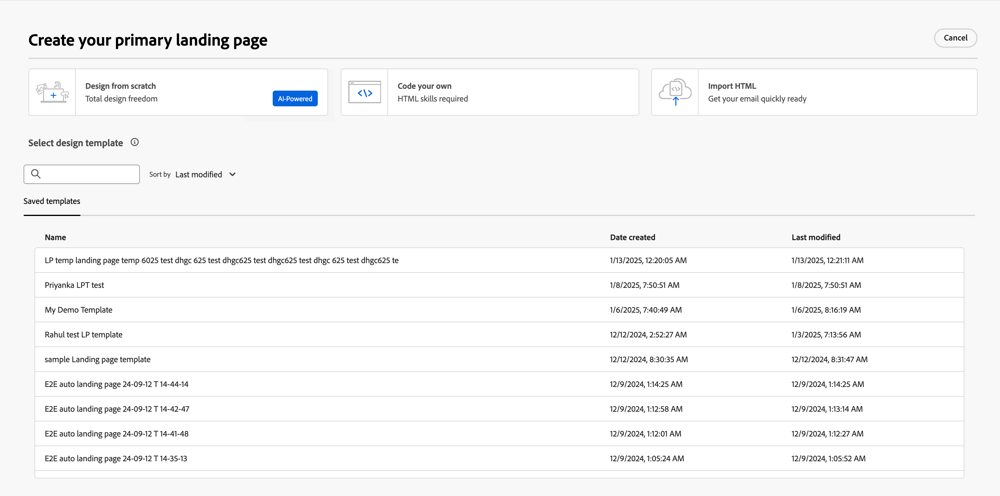
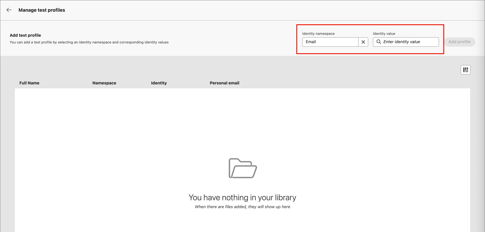

# 建立和發佈登陸頁面

行銷人員可以定義並發佈您要併入歷程的頁面。 新增登陸頁面時，您可以設定主要頁面及任何子頁面、設計內容、測試頁面及發佈頁面。

>[!BEGINSHADEBOX]

## 登陸頁面的先決條件 {#landing-page-prerequisites}

行銷人員必須具備下列設定和資產，才能建立登入頁面以支援其歷程：

* [登陸頁面子網域](../admin/configuration-presets-landing-pages.md#lp-subdomains) — 設定專用於託管登陸頁面的子網域。
* [登陸頁面預設集](../admin/configuration-presets-landing-pages.md#lp-presets) — 預設集會定義套用至登陸頁面的子網域和其他設定。
* [表單](./forms.md) （用於資料擷取使用案例） — 當您想要將表單內嵌在登陸頁面上並將資料提交到Experience Platform時，此為必要專案。

>[!ENDSHADEBOX]

## 建立登陸頁面 {#create-landing-page}

>[!CONTEXTUALHELP]
>id="ajo-b2b-prime_lp_create"
>title="定義和設定您的登陸頁面"
>abstract="若要建立登陸頁面，您需要選取一個預設集，然後設定主要頁面和子頁面，最後在發佈頁面之前進行測試。"

若要在歷程對象成員按一下特定連結時，將他們導向至已定義的網頁，請在[!DNL Journey Optimizer B2B Prime]中建立登陸頁面。

>[!IMPORTANT]
>
>在建立第一個登入頁面之前，請先完成登入頁面設定。 這包括設定子網域以託管登陸頁面，以及定義至少一個指定子網域和其他管道設定的預設集。 建立登入頁面時，您可以選取預設集。 如需管理員設定，請參閱[登入頁面設定](../admin/configuration-presets-landing-pages.md)。
>
>針對資料擷取使用案例，請先建立[表單](./forms.md)，再將其內嵌至登陸頁面。

建立登入頁面(_T):_

1. 前往左側導覽並選取&#x200B;**[!UICONTROL 內容管理]** > **[!UICONTROL 登入頁面]**。

1. 從登入頁面清單中，按一下&#x200B;**[!UICONTROL 建立登入頁面]**。

1. 輸入&#x200B;**[!UICONTROL Title]** （必要）和&#x200B;**[!UICONTROL Description]** （選用）。

   標題和說明條件：

   * **標題** — 最多100個字元。 必須是唯一的（不區分大小寫）。
   * **描述** — 最多300個字元。
   * 允許使用Alpha、數值和特殊字元。
   * 保留的字元是&#x200B;**_不允許_**： `\ / : * ? " < > |`

   {width="600"}

1. 選取&#x200B;**[!UICONTROL 預設集]**。

   管理員[建立登陸頁面預設集](../admin/configuration-presets-landing-pages.md#lp-presets)，以定義用於登陸頁面的子網域和其他設定。 選取預設集，然後按一下「**[!UICONTROL 檢視預設集]**」以檢閱其設定，並確認符合您的登陸頁面需求。

1. 按一下&#x200B;**[!UICONTROL 建立]**。

   主要頁面及其屬性隨即顯示。 瞭解如何[設定主要頁面設定](#configure-primary-page)。

   {width="700" zoomable="yes"}

1. 若要新增子頁面（例如，感謝或錯誤頁面），請按一下&#x200B;**+**&#x200B;圖示。

   每個登入頁面最多可新增兩個子頁面。

在您設定並設計主要頁面及任何子頁面後，請先測試您的登入頁面[&#128279;](#test-landing-page)，然後再發佈。

>[!CAUTION]
>
>即使頁面已發佈，您仍無法透過復制定義的URL並將其貼到網頁瀏覽器中來存取登入頁面。 使用預覽功能測試頁面，如[測試登入頁面](#test-landing-page)中所述。

## 設定主要頁面 {#configure-primary-page}

>[!CONTEXTUALHELP]
>id="ajo-b2b-prime_lp_primary_page"
>title="定義您的主要頁面設定"
>abstract="定義主要頁面，當收件者從電子郵件或網站等內容中按一下登陸頁面連結時，就會立即顯示該頁面。"

>[!CONTEXTUALHELP]
>id="ajo-b2b-prime_lp_access_settings"
>title="定義您的登陸頁面 URL"
>abstract="在本區段中，定義一個唯一的登陸頁面 URL。 URL 的第一部分需要您預先設定一個登陸頁面子網域作為您所選預設集的一部分。"

主要頁面是收件者按一下登入頁面連結（例如從電子郵件或網站）時立即顯示的頁面。

若要定義主要頁面設定(_T):_

1. 根據您的需求變更&#x200B;**[!UICONTROL 頁面名稱]**，預設為&#x200B;_主要頁面_。

1. 定義頁面URL的結束部分。

   您選取的預設集決定了URL的第一個部分。 管理員將[登陸頁面子網域](../admin/configuration-presets-landing-pages.md#lp-subdomains)設定為預設集的一部分。

   >[!CAUTION]
   >
   >登陸頁面URL必須是唯一的。
   >
   >您無法將此URL複製並貼到網頁瀏覽器以存取登入頁面，即使頁面已發佈亦然。 使用[測試登入頁面](#test-landing-page)中所述的預覽功能來測試它。

1. 如果您想要匿名登陸頁面，請停用&#x200B;**[!UICONTROL 需要已識別的使用者]**&#x200B;選項。

1. 按一下&#x200B;_行事曆_ （  ）圖示以設定&#x200B;**[!UICONTROL 頁面到期]**。

   選取到期日後，請選擇頁面到期時的動作：

   * **[!UICONTROL 重新導向URL]** — 輸入要做為重新導向之頁面的URL。

     {width="400"}

   * **[!UICONTROL 瀏覽器錯誤]** — 輸入要取代頁面的錯誤文字。

     {width="400"}

## 選擇內容設計型別 {#choose-design-type}

若要新增頁面的&#x200B;_[!UICONTROL 內容]_，請按一下&#x200B;**[!UICONTROL 開啟Designer]**。 設計程式從選擇您要如何開始開始：

* [從頭開始設計](#design-from-scratch)
* [匯入HTML](#import-html)

{width="800" zoomable="yes"}

在您選取您偏好的方法來開始登入頁面設計後，請使用視覺化設計工具來[完成頁面內容](./landing-page-design.md)。

### 從頭開始設計 {#design-from-scratch}

使用視覺內容設計空間來定義登入頁面的結構和內容。 透過使用簡單的拖放動作來新增和移動結構元件，您可以在數秒內設計頁面內容的版面配置和組織。

1. 從設計首頁選取&#x200B;**[!UICONTROL 從頭開始設計]**&#x200B;選項。

1. [新增結構和內容](./landing-page-design.md#structure-content-landing-page)至頁面。

1. [檢閱並編輯連結的URL追蹤](./landing-page-design.md#linked-url-tracking)。

1. [測試登入頁面](#test-landing-page)。

當您滿意內容時，請按一下[儲存]。**&#x200B;**

### 匯入HTML {#import-html}

<!-- originally  from   /help/_includes/content-design-import.md but copied and revised to omit the part about Marketo Engage assets and AEM assets -->

匯入的內容可以是：

* 包含內建樣式表的HTML檔案
* 包含HTML檔案、樣式表(.css)和影像的.zip檔案

  >[!NOTE]
  >
  >.zip 檔案結構沒有限制。 不過，參照必須是相對參照，而且符合.zip資料夾的樹狀結構。 影像一律會上傳至[資產存放庫](./digital-asset-management.md)。

若要匯入包含HTML內容的檔案(_T):_

1. 從設計首頁選取&#x200B;**[!UICONTROL 匯入HTML]**&#x200B;選項。

1. 拖放包含 HTML 內容的 HTML 或 .zip 檔案，然後按一下「**[!UICONTROL 匯入]**」。

{width="500"}

>[!NOTE]
>
>在HTML檔案中使用`<table>`標籤做為第一個圖層可能會造成樣式遺失，包括上層圖層標籤中的背景和寬度設定。

您可以視需要使用視覺化設計工具個人化匯入的內容。

## 檢查警報 {#check-alerts}

當您設計登入頁面內容時，如果關鍵設定遺失，警示會出現在右上方。

{width="250"}

如果沒有看見此按鈕，表示沒有偵測到的問題。

警報有兩種型別：

* **_警告_**&#x200B;參考建議與最佳實務的警告，例如：

   * `Placeholder links are present in the landing page body`：別忘了以有效連結取代預留位置。

   * `Text version of HTML is empty`：別忘了定義頁面內文的文字版本，當HTML內容無法顯示時會使用此版本。

   * `Empty link is present in page body`：檢查頁面中的所有連結是否正確。

* **_錯誤_**&#x200B;會阻止您測試或啟用歷程，只要這些錯誤尚未解決，例如：

   * `The landing page content is empty`：頁面內容是必要的。

## 測試登陸頁面 {#test-landing-page}

>[!CONTEXTUALHELP]
>id="ajo-b2b-prime_preview_lp_profiles"
>title="預覽和測試您的登陸頁面"
>abstract="在您定義登陸頁面設定和內容後，請使用測試輪廓來預覽該頁面。"

定義登入頁面設定和內容時，您可以使用測試設定檔來預覽頁面。 如果您已插入[個人化內容](./landing-page-design.md#personalize-content)，您可以使用測試設定檔資料檢查此內容在登入頁面中的顯示方式。

>[!PREREQUISITES]
>
>若要預覽和測試登入頁面，您必須擁有&#x200B;**[!UICONTROL 發佈訊息]**&#x200B;許可權，以及包含測試設定檔的已定義資料集。

1. 按一下&#x200B;**[!UICONTROL 預覽和測試]**&#x200B;以開啟測試設定檔選取專案。

   >[!NOTE]
   >
   >當您在視覺化設計空間時，也可以使用&#x200B;**[!UICONTROL 模擬內容]**。

1. 從&#x200B;_[!UICONTROL 模擬]_&#x200B;畫面選取測試設定檔。

   {width="700" zoomable="yes"}

   如果未列出您需要的設定檔，請按一下[管理測試設定檔] **，使用已知的測試設定檔電子郵件地址，並將其新增至清單。**

   +++新增測試設定檔

   針對&#x200B;**[!UICONTROL 身分識別名稱空間]**，按一下&#x200B;_選取_&#x200B;圖示（ ）並選擇用於測試設定檔的`Email`名稱空間。

   {width="700" zoomable="yes"}

   在&#x200B;**[!UICONTROL 識別值]**&#x200B;欄位中，輸入識別測試設定檔的電子郵件地址，然後按一下&#x200B;**[!UICONTROL 新增設定檔]**。 您可以重複此步驟以新增多個設定檔。

   {width="700" zoomable="yes"}

   按一下左上方的向後箭頭，返回&#x200B;_[!UICONTROL 模擬]_&#x200B;頁面。

   +++

1. 選取&#x200B;**[!UICONTROL 開啟預覽]**&#x200B;以測試您的登陸頁面。

   登入頁面預覽會在新標籤中開啟。 選取的測試設定檔資料會取代個人化元素。

   {width="600"}

1. 選取其他測試設定檔以預覽登陸頁面每個變體的呈現。

## 發佈頁面 {#publish-landing-page}

>[!PREREQUISITES]
>
>若要發佈登入頁面，您必須擁有&#x200B;**[!UICONTROL 發佈訊息]**&#x200B;許可權。 發佈之前，[檢查並解決所有警示](#check-alerts)。

當草稿頁面符合您的條件，而您想要讓它在您的歷程訊息中可供連結時，請按一下右上方的&#x200B;**[!UICONTROL 發佈]**。 在確認對話方塊中，再按一下&#x200B;**[!UICONTROL 發佈]**&#x200B;以進行確認。

{width="250"}

發佈登入頁面時，其會顯示在具有&#x200B;**_[!UICONTROL 已發佈]_**&#x200B;狀態的登入頁面清單中。 這表示其為即時狀態，並準備好用於透過歷程傳送的電子郵件或簡訊訊息。

您無法將URL複製並貼至網頁瀏覽器，以存取已發佈的登陸頁面。 您可以隨時使用[預覽函式](#test-landing-page)來測試它。
