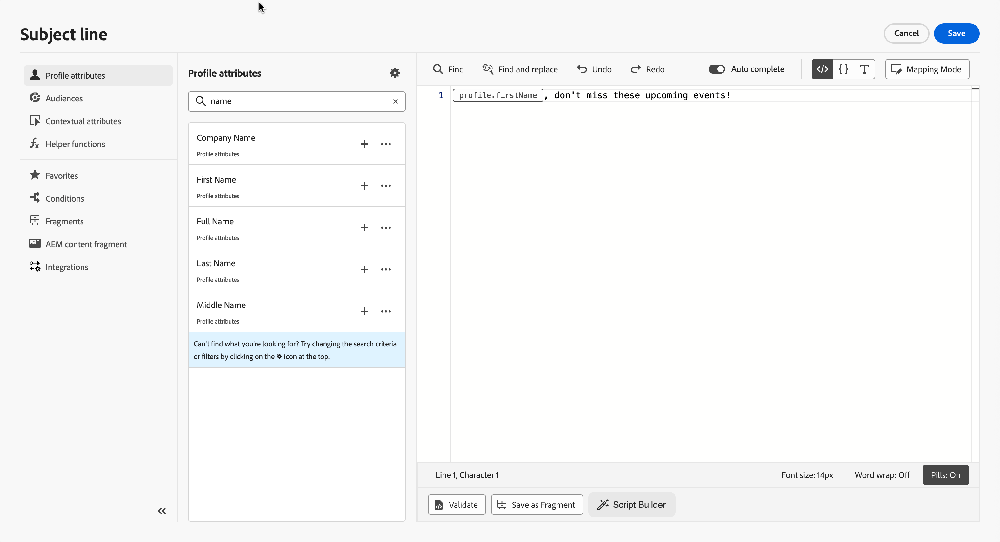

# Personalization編輯器

>[!CONTEXTUALHELP]
>id="ajo-b2b-prime_personalization_editor"
>title="關於個人化編輯器"
>abstract="個人化編輯器可讓您選取、排列、自訂和驗證設定檔屬性，以建立個人化內容。"

個人化編輯器是[!DNL Journey Optimizer B2B Prime]中個人化的核心。 無論您身在何處，在電子郵件、WhatsApp訊息、登入頁面及URL欄位中，都有需要動態內容的使用時機。

在個人化編輯器介面中，您可以選取、排列、自訂及驗證設定檔屬性，以建立個人化內容。

{width="700" zoomable="yes"}

>[!NOTE]
>
>在此Beta版本中，個人化編輯器中只能使用設定檔屬性。 無法使用帳戶層級的個人化和自訂物件資料。 請參閱[目前的限制](../marketing/email-channel.md#limitations)。

您可以使用&#x200B;_個人化_ （  ）圖示，在任何欄位中新增個人化。 展開下列章節以取得詳細資訊。

+++電子郵件和WhatsApp訊息

在[電子郵件](./email-authoring.md#personalize-content)和[WhatsApp訊息](./whatsapp-authoring.md#personalize-message-content)中，可以在不同的位置新增個人化，例如電子郵件中的&#x200B;**[!UICONTROL 主旨列]**&#x200B;欄位，或核准的WhatsApp範本中的動態引數。

您也可以將其新增至內容的其他區段，包括電子郵件內文、前置字元和按鈕URL。

+++

+++內容設計空間

編輯視覺內容時，您可以使用內容相關工具列中的圖示，在大部分的文字元素中新增個人化內容。

<!--  -->

+++

+++URL

[!DNL Journey Optimizer B2B Prime]也可讓您個人化訊息中的&#x200B;**URL**。 個人化 URL 會根據輪廓屬性，將收件者帶往網站特定頁面或個人化微網站。

<!-- {width="50%"} -->

>[!NOTE]
>
>URL個人化可用於這些型別的連結： **外部連結**、**取消訂閱連結**&#x200B;和&#x200B;**選擇退出**。

+++

+++電子郵件設定

建立[電子郵件通道設定](../admin/email-channel-configuration.md)時，您可以定義子網域、標題和URL追蹤引數的個人化值。

+++

## 新增個人化 {#add}

>[!CONTEXTUALHELP]
>id="ajo-b2b-prime_perso_editor_autocomplete"
>title="自動完成"
>abstract="啟用此選項後，可允許系統在您輸入時自動建議並完成程式碼。 此功能僅適用於HTML和文字格式，並支援設定檔屬性。 如果透過切換進行停用，編輯器將提供原生 HTML 程式碼自動完成。"

中央工作區是您建置個人化語法的位置。 若要使用屬性來個人化您的訊息，請在左側導覽窗格中找出該屬性，然後按一下`+`按鈕，將該屬性加入運算式中。

<!--  -->

`+`圖示旁的省略符號功能表可讓您取得每個屬性的詳細資訊，並將您最常用的屬性新增至我的最愛。 可透過導覽窗格中的&#x200B;**[!UICONTROL 我的最愛]**&#x200B;功能表存取新增至我的最愛的屬性。

>[!NOTE]
>
>依預設，屬性窗格只會顯示填入的屬性。 若要顯示所有屬性，請選取屬性窗格中的&#x200B;**[!UICONTROL 設定]**&#x200B;按鈕，並關閉&#x200B;**[!UICONTROL 僅顯示填入的屬性]**&#x200B;選項。

此外，您可以定義預設後援文字，當字串型別的設定檔屬性為空白時將會顯示。 若要這麼做，請按一下屬性旁的省略符號按鈕，然後選取&#x200B;**[!UICONTROL 插入後援文字]**。 如果設定檔的屬性值是空的，則寫入預設應顯示的文字，然後按一下&#x200B;**[!UICONTROL 新增]**。

<!--  -->

例如，您可以使用具有遞補的`{{profile.firstName}}`以名字迎接每個收件者，當值遺失時： `{{profile.firstName | default: "there"}}`。

## 運算式編輯選項 {#options}

中央工作區提供各種工具，協助您撰寫個人化運算式。

<!--  -->

可選擇下列選項：

1. **[!UICONTROL 尋找]** / **[!UICONTROL 尋找並取代]**：搜尋您的運算式並自動取代部分程式碼。
1. **[!UICONTROL 還原]** / **[!UICONTROL 重做]**：還原/重做上一個操作。
1. **[!UICONTROL 自動完成]**：在您輸入時自動建議並完成程式碼。 此功能僅適用於HTML和文字格式，並支援設定檔屬性。 如果透過切換進行停用，編輯器將提供原生 HTML 程式碼自動完成。

   <!-- {width="70%" align="center" zoomable="yes"} -->

1. **[!UICONTROL HTML]** / **[!UICONTROL JSON]** / **[!UICONTROL 文字]**：識別您的程式碼格式。 這可讓系統根據選取的語言調整驗證及自動完成功能。
1. **[!UICONTROL 驗證]**：檢查運算式的語法。
1. **[!UICONTROL 字型大小]**：調整編輯器內內容的字型大小，以提高可讀性。
1. **[!UICONTROL 自動換行]**：啟用或停用自動換行，允許長運算式顯示在單行或包含在編輯器中。 選項包括:
   * **關閉** （預設） — 無自動換行。 長線超出編輯器檢視範圍，需要水準捲動。
   * **On** — 以編輯器的寬度換行。
   * **自動換行** — 當行達到80個字元時換行。
   * **已繫結** — 以編輯器寬度或80個字元（以較小者為準）來換行。
1. **[!UICONTROL Picks]**：將屬性顯示為精簡的「Picks」，藉由隱藏長屬性路徑來改善可讀性。 按一下屬性以顯示其完整路徑。

   >[!NOTE]
   >
   >此選項僅適用於設定檔屬性。

在導覽窗格中，有其他功能可協助您建置個人化運算式。

<!--  -->

* **[!UICONTROL 輔助函式]** — 輔助函式可讓您對資料執行操作，例如計算、資料格式或轉換、條件，並在個人化的內容中操作它們。

* **[!UICONTROL 我的最愛]** — 您新增至我的最愛屬性會顯示在此清單中。 這可讓您快速存取最常使用的專案。 若要新增屬性至您的最愛，請按一下省略符號選單，然後選擇&#x200B;**[!UICONTROL 新增至我的最愛]**。

AI Assistant可以從純語言說明產生Handlebars運算式、說明現有運算式，並識別潛在問題。

當您的個人化運算式準備就緒時，請按一下&#x200B;**[!UICONTROL 確認]**&#x200B;或&#x200B;**[!UICONTROL 插入]**，將其新增至您的內容。

## 驗證機制 {#validation-mechanisms}

當您按一下&#x200B;**[!UICONTROL 確認]**&#x200B;或&#x200B;**[!UICONTROL 插入]**&#x200B;以關閉編輯器時，運算式的驗證會自動執行。 您也可以按一下「驗證&#x200B;**[!UICONTROL 」]**，在關閉前檢查您的個人化語法。

如需封鎖歷程啟用的內容警示，請參閱[驗證電子郵件內容](./email-authoring.md#validation)。

展開下列區段來檢視驗證個人化時可能會發生的常見錯誤。

+++常見錯誤

* **找不到「XYZ」路徑**

當您參照結構描述中未定義的欄位時，會發生此錯誤。

在此情況下，**firstName1**&#x200B;未定義為設定檔結構描述中的屬性：

```handlebars
{{profile.firstName1}}
```

* **變數&quot;XYZ&quot;的型別不相符。 必須是陣列。 找到字串。**

當您嘗試對字串而非陣列進行反複運算時，會發生此錯誤。

在此案例中，**jobTitle**&#x200B;是字串，而非陣列：

```handlebars
{{#each profile.jobTitle as |item|}}
  {{item}}
{{/each}}
```

* **無效的Handlebars語法。 找到`'[XYZ}}'`**

使用無效的Handlebars語法時，會發生此錯誤。

```handlebars
{{[profile.firstName}}
```

+++
