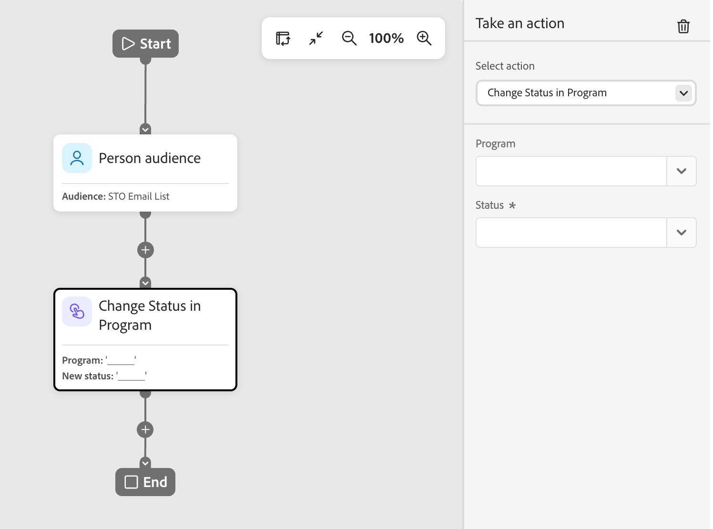
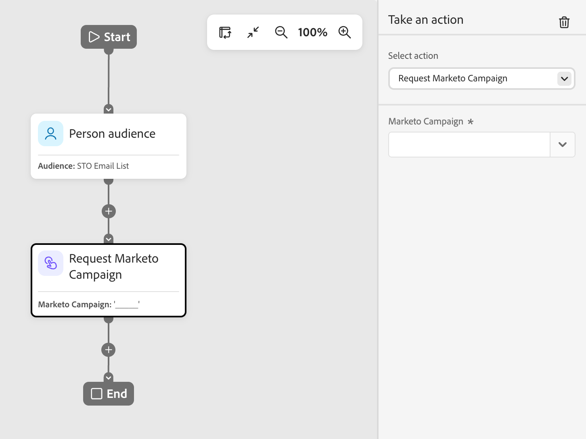
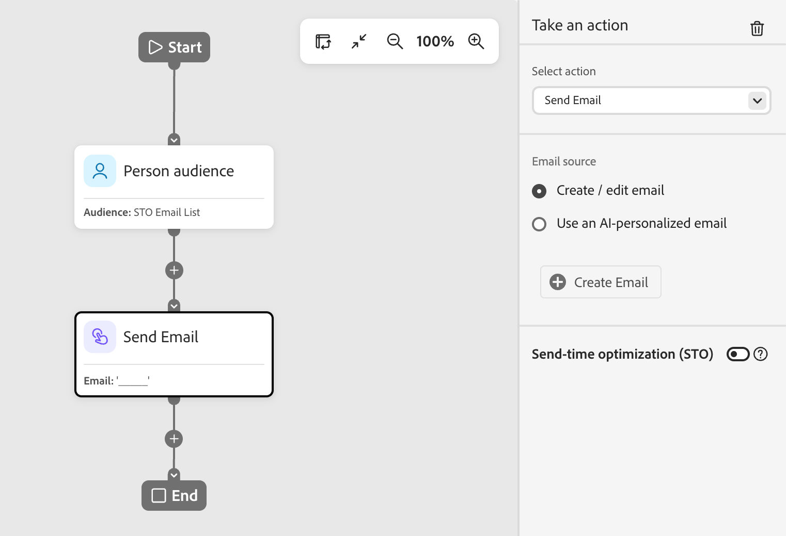

# 執行動作節點

在人員歷程中，當您想要將變更套用至節點路徑上的所有人員時，可對人員使用動作。

## 動作和限制 {#actions}

| 動作 | 限制 |
| ------ | ----------- |
| **[!UICONTROL 啟用到目的地]** | <li>選取或建立靜態清單 <li>如果清單沒有啟用的目的地，請啟用清單 |
| **[!UICONTROL 新增人員至歷程]** | <li>選取已排程或即時歷程 <li>未套用目標歷程的對象條件 |
| **[!UICONTROL 新增至清單]** | <li>建立新的靜態清單或選取現有的清單 |
| **[!UICONTROL 新增至Marketo清單]** | <li>在Marketo Engage中選取靜態清單 |
| **[!UICONTROL 變更資料值]** | <li>選取人員屬性 <li>設定新值 |
| **[!UICONTROL 變更方案資料]** | <li>選取方案屬性 <li>設定新值 |
| **[!UICONTROL 變更方案狀態]** | <li>選取計畫<li>選取新狀態 |
| **[!UICONTROL 從清單移除]** | <li>選取靜態清單 <li>若目前不是成員，則略過人員 |
| **[!UICONTROL 從Marketo清單移除]** | <li>在Marketo Engage中選取靜態清單 <li>若目前不是成員，則略過人員 |
| **[!UICONTROL 從歷程移除人員]** | <li>選取即時歷程 <li>如果目前不是目標歷程的成員，則略過人員 |
| **[!UICONTROL 要求Marketo行銷活動]** | <li>選取Marketo Engage行銷活動 |
| **[!UICONTROL 傳送電子郵件]** | <li>建立、編輯或使用AI個人化電子郵件 <li>傳送時間最佳化（選擇性） |
| **[!UICONTROL 傳送WhatsApp]** | <li>選取WhatsApp訊息 |

## 新增動作節點 {#add-an-action-node}

1. 導覽至歷程畫布。

1. 按一下路徑上的加號( **+** )圖示，然後選擇&#x200B;**[!UICONTROL 執行動作]**。

   {width="200"}

1. 在右側的節點屬性中，從清單中選取動作，並設定該動作的任何值。

+++針對目的地啟用

使用此動作直接從您的歷程啟用人員到Experience Platform目的地。 選取目的地並輸入對象名稱，以識別目的地中已啟用的對象。

{width="450"}

+++

+++[!UICONTROL 新增人員至歷程]

使用此動作將人員新增到其他排程或即時歷程。 透過此動作新增的人員會立即新增至目標歷程的對象中；不會套用歷程的對象條件。

{width="450"}

+++

+++[!UICONTROL 新增至清單]

使用此動作將人員新增至Journey Optimizer B2B Prime中的靜態清單。

{width="450"}

選擇下列其中一個選項：

* **[!UICONTROL 建立]** — 建立新的靜態清單資產並新增人員。 清單可立即供Journey Optimizer B2B Prime中的其他資產使用。
* **[!UICONTROL 選取]** — 選取您想要新增到達節點之人員的現有靜態清單資產。

+++

+++[!UICONTROL 新增至Marketo清單]

使用此動作將人員新增至Marketo Engage中的靜態清單。

{width="450"}

+++

+++[!UICONTROL 變更資料值]

使用此動作來更新人員記錄的屬性值。 選取屬性並設定新值。

>[!TIP]
>
>若要清除屬性的值，請將值設定為`NULL`。

{width="450"}

+++

+++[!UICONTROL 變更方案資料]

使用此動作來更新程式屬性的值。 選取程式屬性並設定新值。

{width="450"}

+++

+++[!UICONTROL 變更方案狀態]

使用此動作來變更Marketo Engage程式中人員的狀態。 選取方案，然後選取新狀態。

{width="450"}

+++

+++[!UICONTROL 從清單移除]

使用此動作從Journey Optimizer B2B Prime的靜態清單中移除人員。 如果人員目前不是清單成員，則會略過該人員的動作。

{width="450"}

+++

+++[!UICONTROL 從Marketo清單移除]

使用此動作從Marketo Engage的靜態清單中移除人員。 如果人員目前不是清單成員，則會略過該人員的動作。

{width="450"}

+++

+++[!UICONTROL 從歷程移除人員]

使用此動作將人員從其他即時人員歷程中移除。 人員會立即從目標歷程中移除，且不會對其採取進一步的動作。 如果人員目前不是目標歷程的成員，則會略過該人員的動作。

{width="450"}

+++

+++[!UICONTROL 要求Marketo行銷活動]

使用此動作，在連線的Marketo Engage執行個體中將人員新增至請求行銷活動。 選取要請求的Marketo Engage行銷活動。

{width="450"}

+++

+++[!UICONTROL 傳送電子郵件]

使用此動作傳送電子郵件給選擇加入的人員。 取消訂閱、封鎖列出、電子郵件已暫停或行銷已暫停的使用者會略過此動作。

{width="450"}

您可以建立電子郵件、編輯現有電子郵件，或使用AI個人化電子郵件。 如需有關建立和編輯電子郵件的資訊，請參閱[電子郵件編寫](../content/email-authoring.md)。

您可以使用[傳送時間最佳化](../marketing/email-send-time-optimization.md)，透過預測每個設定檔最有可能參與的時間來個人化電子郵件傳遞時間。

+++

+++[!UICONTROL 傳送WhatsApp]

使用此動作傳送WhatsApp訊息。 您可以在視覺化設計空間建立、個人化和預覽WhatsApp訊息（請參閱[WhatsApp製作](../content/whatsapp-authoring.md)）。

{width="450"}

+++
