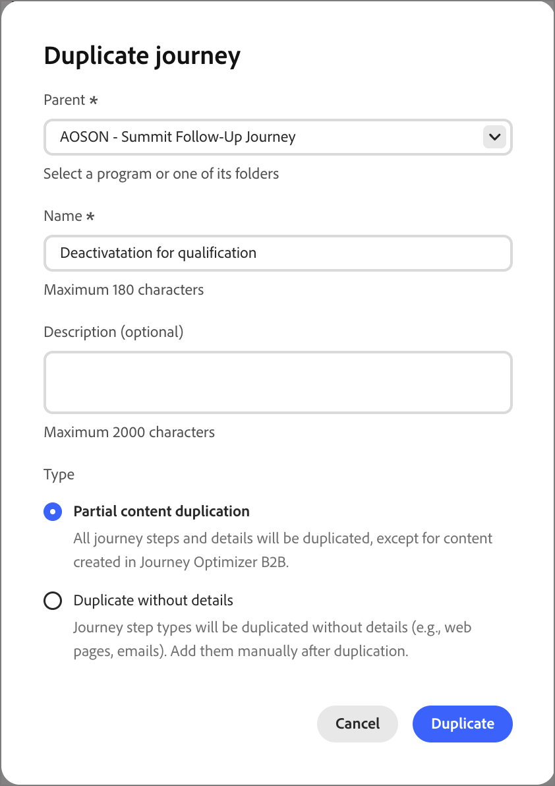

# 人員歷程

在[!DNL Adobe Journey Optimizer B2B Edition Prime]中，個人歷程是自動化的、以潛在客戶為基礎的多步驟行銷計畫，可跨管道協調個人化體驗。 這些歷程會使用Marketo Engage資料來執行這些行銷計畫，以回應參與、業務事件或排程的行銷活動。

>[!NOTE]
>
>每個歷程都位於定義的[方案](./programs.md)內。 在建立歷程之前，您必須至少有一個方案要作為父級使用。

建立新的人員歷程&#x200B;:_(_T)

1. 建立人員歷程。
1. 新增節點並在歷程畫布中定義歷程流程。
1. [發佈此歷程](#publish-a-journey)。

## 存取和瀏覽個人歷程 {#access-and-browse-person-journeys}

1. 在左側導覽列中，展開&#x200B;**[!UICONTROL 行銷管理]**。

1. 在&#x200B;**[!UICONTROL 行銷]**&#x200B;資源清單的右側，選取&#x200B;**[!UICONTROL 個人歷程]**。

   _個人歷程_&#x200B;清單會在主要工作區中顯示為索引標籤頁面。

   您可以在清單頂端的&#x200B;_搜尋_&#x200B;工具中輸入文字，依名稱篩選顯示的清單。

   {width="800" zoomable="yes"}

1. 使用清單工具來自訂顯示的清單：

   * 按一下&#x200B;_篩選器_ （  ）圖示，依狀態篩選清單。
   * 按一下&#x200B;_自訂表格_ （）圖示以控制顯示的欄。
   * 按一下&#x200B;_重設欄_ （ ）圖示以重設欄寬。

### 歷程清單欄 {#journey-list-columns}

歷程清單頁面包含下列欄：

* [!UICONTROL 名稱] （按一下名稱以開啟歷程畫布進行編輯）
* [!UICONTROL 狀態]
* [!UICONTROL 建立日期]
* [!UICONTROL 建立者]
* [!UICONTROL 上次更新]
* [!UICONTROL 上次更新者]
* [!UICONTROL 發佈日期]
* [!UICONTROL 發佈者]
* [!UICONTROL 開始日期]
* [!UICONTROL 結束日期]

您可以按一下欄標題，依&#x200B;_[!UICONTROL 狀態]_、_[!UICONTROL 建立日期]_&#x200B;或&#x200B;_[!UICONTROL 上次更新]_&#x200B;來排序清單。 您可以抓取並拖曳標題框線，以變更顯示的欄寬。 在&#x200B;_自訂表格_&#x200B;對話方塊中，選取或清除核取方塊，然後按一下&#x200B;**[!UICONTROL 套用]**。

### 歷程狀態 {#journey-status}

根據您套用的動作，歷程狀態可能會變更。 根據歷程的狀態，某些動作可從標題右側使用。

| 狀態 | 說明 | 可用的動作 |
| ------ | ----------- | ----------------- |
| _**草稿**_ | 未發佈且可以編輯的歷程。 | [發佈](#publish-a-journey)，[重複](#duplicate-a-journey)，[刪除](#delete-a-journey) |
| _**已上線**_ | 當您發佈歷程時，歷程狀態從&#x200B;_草稿_&#x200B;變更為&#x200B;_即時_。 在此狀態下，您將無法編輯歷程。 | [重複](#duplicate-a-journey)，[關閉新專案](#close-to-new-entries)，[中止](#abort-a-journey) |
| _**對新進客戶關閉**_ | 當您在歷程標題中按一下&#x200B;**[!UICONTROL 關閉新專案]**&#x200B;時，歷程狀態會從&#x200B;_即時_&#x200B;變更為&#x200B;_已關閉新專案_。 | [重複](#duplicate-a-journey)，[中止](#abort-a-journey) |
| _**已中止**_ | 中止歷程時，原本的「_已上線_」或「_對新進客戶關閉_」歷程狀態將會發生變更。 中止的歷程無法重新啟動。 | [重複](#duplicate-a-journey)，[刪除](#delete-a-journey) |
| _**已完成**_ | 當歷程中的所有個人對象成員完成歷程時，狀態會從&#x200B;_即時_&#x200B;或&#x200B;_已關閉新專案_&#x200B;變更為&#x200B;_已完成_。 | [重複](#duplicate-a-journey)，[刪除](#delete-a-journey) |

## 建立個人歷程 {#create-a-person-journey}

1. 按一下歷程清單右上角的&#x200B;**[!UICONTROL 建立歷程]**。

1. 在對話方塊中，選取人員歷程的&#x200B;**[!UICONTROL 家長]**&#x200B;方案。

1. 輸入唯一的&#x200B;**[!UICONTROL Name]** （必要）和&#x200B;**[!UICONTROL Description]** （選用）。

   {width="400"}

1. 按一下&#x200B;**[!UICONTROL 建立]**。

   歷程畫布隨即開啟，並顯示起始「人員」受眾節點。

   新人員歷程的{width="600" zoomable="yes"}

### 歷程標題 {#journey-header}

每個歷程畫布的標題包含歷程名稱、狀態和排程。

{width="600" zoomable="yes"}

* 按一下「_編輯_」圖示（「）以變更歷程名稱或說明資訊。
* 按一下&#x200B;**[!UICONTROL 歷程設定]**&#x200B;以變更歷程開始和週期。
* 按一下&#x200B;**[!UICONTROL ...超過]**&#x200B;套用歷程動作，或啟用/停用流量控制和重新進入。
* 如果所有錯誤都已解決且您想要啟動歷程，請按一下&#x200B;**[!UICONTROL 發佈]**。

### 歷程設計 {#journey-design}

_歷程畫布_&#x200B;是歷程工作區的中央區域。 您可以在此處新增及設定歷程節點。 按一下節點，在版面右側的面板中開啟其屬性，並根據您的設計進行設定。 個人歷程一律以[_[!UICONTROL 個人對象&#x200B;]_節點](./person-audience-node.md)開始，您可以在其中定義歷程的輸入。

建立人員歷程並定義人員對象後，請使用節點建置歷程。 歷程畫布提供視覺化設計空間，您可在其中使用下列節點型別建置您的多步驟B2B行銷使用案例，以建構歷程：

* [採取動作](./action-nodes.md)
* [監聽事件](./listen-for-event-nodes.md)
* [等待](./wait-nodes.md)
* [分割路徑](./split-merge-paths-nodes.md)
* [下一個最佳路徑](./next-best-path.md)
* [合併路徑](./split-merge-paths-nodes.md)

## 歷程管理 {#journey-management}

開啟歷程清單以檢閱歷程狀態、進行變更並採取行動。

### 歷程動作 {#journey-actions}

歷程清單頁面包含Journey Optimizer B2B Prime執行個體中的所有個人歷程。 您可以從清單頁面套用許多動作至歷程。

#### 發佈歷程 {#publish}

如果沒有封鎖程式錯誤，您可以發佈歷程。 發佈後，歷程狀態會變更為「_已上線_」。 如果歷程發生錯誤，**[!UICONTROL 發佈]**&#x200B;按鈕會變暗並顯示訊息`Resolve errors before publishing`。

1. 從&#x200B;_[!UICONTROL 個人歷程]_&#x200B;清單開啟草稿歷程。

1. 在歷程畫布的右上方，按一下&#x200B;**[!UICONTROL 發佈]**。

1. 在&#x200B;_[!UICONTROL 檢閱歷程設定]_&#x200B;對話方塊中，設定歷程開始選項。

   如果您已在&#x200B;**[!UICONTROL 歷程設定]**&#x200B;中定義排程，請檢閱設定。

   如果您需要設定歷程啟用，請選擇排程型別：

   * 若要在發佈時啟動歷程，請選擇&#x200B;**[!UICONTROL 立即]**。
   * 若要在未來日期啟動歷程，請選擇&#x200B;**[!UICONTROL 在特定日期]**&#x200B;並按一下&#x200B;_行事曆_&#x200B;圖示以選取日期。

1. 如有需要，請指定歷程的&#x200B;**[!UICONTROL 結束日期]**。

   {width="400" zoomable="no"}

   從開始日期算起，最多可以為三年。 需要此欄位才能發佈。

1. 按一下&#x200B;**[!UICONTROL 下一步]**。

1. 在確認對話方塊中，按一下&#x200B;**[!UICONTROL 發佈]**。

#### 中止歷程 {#abort-a-journey}

如果您中止（停止）排程在日後開始日期的即時歷程或歷程，歷程中的人們會立即停止前進，而且可能不會發生進一步的歷程入口。 中止的歷程無法重新啟動。

1. 從&#x200B;_[!UICONTROL 個人歷程]_&#x200B;清單開啟歷程。

1. 按一下&#x200B;**[!UICONTROL ...在右上角顯示更多]**，然後選擇&#x200B;**[!UICONTROL 中止]**。

   {width="600" zoomable="yes"}

1. 在確認對話框中，按一下「**[!UICONTROL 中止]**」。

#### 對新進客戶關閉 {#close-to-new-entries}

如果您關閉新進入專案的即時歷程，目前歷程中的人們會繼續其在歷程中的路徑，且不可能發生進一步的歷程進入。 已關閉的歷程無法重新啟動。 您可以重複已關閉的歷程。

1. 從&#x200B;_[!UICONTROL 個人歷程]_&#x200B;清單開啟歷程。

1. 按一下&#x200B;**[!UICONTROL ...在右上角顯示更多]**，並選擇&#x200B;**[!UICONTROL 關閉新專案]**。

1. 在確認對話框中，按一下「**[!UICONTROL 對新進客戶關閉]**」。

#### 複製歷程 {#duplicate-a-journey}

重複動作類似於原地複製功能，但重複的歷程不會包括任何已建立的歷程內容資產。 您可以複製歷程的詳細資訊，或只是流程及路徑結構的簡單骨架。

1. 在&#x200B;_[!UICONTROL 個人歷程]_&#x200B;清單中，按一下歷程名稱旁的&#x200B;_更多_&#x200B;圖示( **...** )，然後選擇&#x200B;**[!UICONTROL 複製]**。

   {width="400"}

   根據歷程的狀態，您還可以從歷程詳細資訊或歷程畫布存取重複動作：

   * 如需草稿歷程，請按一下&#x200B;**[!UICONTROL ...在右上角顯示更多]**，並選擇&#x200B;**[!UICONTROL 複製]**。
   * 對於所有其他歷程狀態，請按一下右上角的「**[!UICONTROL 重複]**」。

1. 在對話方塊中，選取重複歷程的&#x200B;**[!UICONTROL Parent]**&#x200B;程式。

1. 輸入唯一的&#x200B;**[!UICONTROL Name]** （必要）和&#x200B;**[!UICONTROL Description]** （選用）。

   依照預設，對話方塊會使用附加了`_copy`的原始歷程的名稱。 視需要為歷程輸入不同的唯一名稱。

   {width="370"}

1. 選擇重複的「**[!UICONTROL 類型]**」：

   * **[!UICONTROL 部分內容重複]** - 使用此類型複製歷程中所有內容，但不包括任何已建立的電子郵件或 SMS 訊息。 參照 Marketo Engage 電子郵件或 SMS 訊息的節點完好無損。

   * **[!UICONTROL 複製但不含詳細資料]** — 使用此型別僅複製節點結構和路徑。 所有節點設定和路徑條件均未定義 (預設)，以便您可以根據不同的客群、動作和路徑分段設定來重複使用基本流程。 所有「等待」節點都會使用預設的5天。

1. 按一下「**[!UICONTROL 重複]**」。

   重複的歷程會在歷程畫布中開啟，您可以在其中設定詳細資訊，並視需要建立歷程內容。

#### 刪除歷程 {#delete-a-journey}

使用刪除動作永久刪除歷程。 您無法刪除即時歷程或排程在未來開始日期的歷程。

>[!WARNING]
>
>刪除歷程是永久性的，且無法復原。

1. 在&#x200B;_[!UICONTROL 個人歷程]_&#x200B;清單中，按一下歷程名稱旁的&#x200B;_更多_&#x200B;圖示( **...** )，然後選擇&#x200B;**[!UICONTROL 刪除]**。

   根據歷程的狀態，您也可以從歷程標題存取刪除動作：

   * 如需草稿歷程，請按一下&#x200B;**[!UICONTROL ...在右上角顯示更多]**，然後選擇&#x200B;**[!UICONTROL 刪除]**。
   * 對於其他歷程狀態，例如「_已完成_」或者「_已中止_」，按一下右上角的「**[!UICONTROL 刪除]**」。

1. 在確認對話框中，按一下「**[!UICONTROL 刪除]**」。
