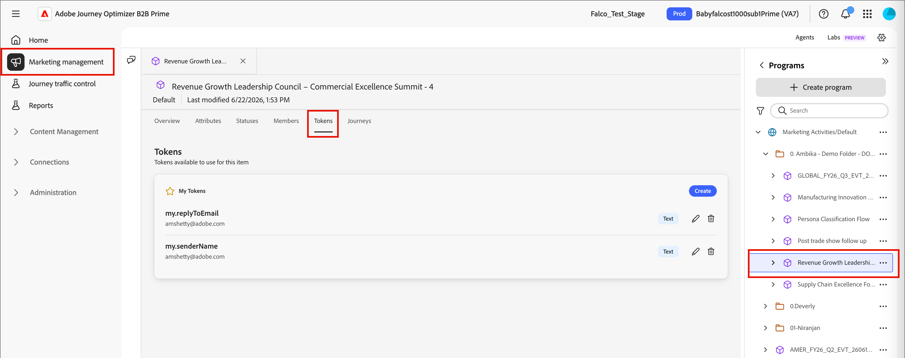

# 適用於個人化的自訂權杖

內容個人化使用代號做為產生內容成品時填入的預留位置或變數。 標準個人化權杖適用於電子郵件、登陸頁面、片段和範本。 您也可以使用程式或資料夾專用的值來定義一組自訂權杖。 這組自訂權杖稱為&#x200B;_我的權杖_，這些自訂權杖中的任何一個都用於個人化。

當您新增自訂權杖至電子郵件時，會顯示為`{{my.TokenName}}`。 例如，您可能會建立`{{my.EventDate}}`或`{{my.WebinarSpeaker}}`個Token，以管理與即將舉辦的網路研討會相關的電子郵件內容。

除了專屬於程式或資料夾的&#x200B;_My Token_&#x200B;之外，您也可以使用任何標準（內建）Token來進行個人化。

>[!NOTE]
>
>_我的Token_&#x200B;目前未在此Beta版本的Personalization編輯器中啟用。

## 存取權杖

1. 在左側導覽列中，展開&#x200B;**[!UICONTROL 行銷管理]**。

1. 在&#x200B;**[!UICONTROL 行銷]**&#x200B;資源清單的右側，選取&#x200B;**[!UICONTROL 方案]**。

1. 在樹狀結構中，選取程式或資料夾以在中心工作區中開啟詳細資訊。

1. 按一下「**[!UICONTROL 代號]**」標籤。

   所選程式中的{width="800" zoomable="yes"}

   此索引標籤會顯示資料夾或程式中定義的所有自訂權杖，以及為父資料夾或程式定義的任何權杖。

### 權杖型別 {#my-tokens}

_我的Token_&#x200B;是您為程式或資料夾建立或修改的自訂變數。 此自訂權杖集支援下列權杖型別：

| 代號類型 | 說明 |
| ---------- | ----------- |
| 文字 | 此型別包含標準文字字串。 文字權杖的大小限製為524,288個字元(UTF-8)或2 MB。 |
| 日期 | 此型別儲存日期值。 日期會顯示為月 — 日 — 年（例如，09-23-2026）。 |
| 日期與時間 | 此型別包含日期和時間值。 |
| 數字 | 此型別會儲存標準整數值。 |
| 電子郵件 | 此型別包含有效的電子郵件地址。 |
| 分數 | 使用此權杖變更歷程動作節點的分數。 |
| 布林值 | 此型別會保留標準布林值（true或false）。 |
| RTF 文字 | 此型別會保留格式化的文字。 |

### 權杖巢狀

當您在程式或資料夾中建立Token時，它可供其他子物件參考。

* 本機Token — 該Token定義在相同程式或資料夾中。
* 繼承的Token — 該Token定義於父程式或資料夾中，比目前程式或資料夾高一或多個層級。
* 覆寫的Token — 該Token是在父程式或資料夾中定義的，但在目前程式或資料夾中定義了不同的值。 Token狀態變更為&#x200B;_已覆寫_，且任何子資料夾、方案和行銷成品都會繼承新值。

{width="600" zoomable="yes"}

### 建立Token

1. 在&#x200B;_[!UICONTROL 代號]_&#x200B;索引標籤中，按一下&#x200B;**[!UICONTROL 建立]**。

1. 在對話方塊中，輸入權杖的&#x200B;**[!UICONTROL 名稱]**。

   {width="400"}

   Token名稱中不能使用空格或特殊字元。 您可以使用&#x200B;_駝峰式大小寫_ （例如`EventType`）來使用容易辨識的多字名稱。

1. 選擇權杖的&#x200B;**[!UICONTROL 型別]**。

1. 設定權杖的&#x200B;**[!UICONTROL 值]**。

1. 按一下&#x200B;**[!UICONTROL 建立]**。

### 編輯權杖

您可以編輯任何已定義「我的Token」的值。 執行此動作以覆寫繼承Token的值。

<!-- (How does this affect live person journeys? ) -->

1. 在&#x200B;_[!UICONTROL 權杖]_&#x200B;上，按一下權杖名稱旁的&#x200B;_編輯_&#x200B;圖示。

1. 在欄位中，視需要變更值。

   {width="400"}

1. 按一下&#x200B;_儲存_&#x200B;圖示。

### 刪除權杖

如果自訂權杖目前未用於歷程電子郵件內容，您可以從清單中刪除該權杖。

1. 在&#x200B;_[!UICONTROL 權杖]_&#x200B;上，按一下權杖名稱旁的&#x200B;_刪除_&#x200B;圖示。

1. 在確認對話框中，按一下「**[!UICONTROL 刪除]**」。

<!--

## Use custom tokens in your content

When you are authoring email content for your programs, you can use any of the tokens from the _My Tokens_ list when you use the personalization tools in the visual design space.

1. Select the text component and click the _Add personalization_ (  ) icon in the toolbar.

   {width="600"}

   This action opens the _Edit Personalization_ dialog. The dialog includes a _[!UICONTROL My tokens]_ folder in the _[!UICONTROL Personalization Tokens]_ library if there are custom tokens defined for the account journey.

1. To add one of your custom tokens to the blank space, expand the **[!UICONTROL My tokens]** folder, then click **+** or **...**.

   You can add any additional static text as needed.

   {width="700" zoomable="yes"}

1. Click **[!UICONTROL Save]**.

-->

