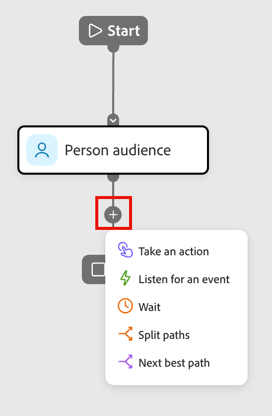

# 分割和合併路徑節點

在個人歷程中使用分割和合併路徑節點，根據您定義的條件將人們分割為不同的路徑，然後將這些路徑復原，以便歷程可以繼續。 分割路徑可讓您為特定對象區段量身打造動作和事件，而合併路徑可在下游的共同點重新整合這些區段。

## 分割路徑節點

使用分割節點，根據您定義的條件來劃分人員。 根據條件建立對象清單的路徑，使用區段的動作和事件節點定義每個路徑，然後組合路徑並繼續歷程。

「分割路徑」節點會根據人員篩選器定義一或多個分段路徑。

<!-- A split based on a people filter is automatically closed with a merge paths node so that all people can move forward to the next step. Split by people paths can include only people actions. These paths cannot be split again and automatically join back. _not currently true_ -->

_&#x200B;**依人員節點分割路徑的運作方式**&#x200B;_

* 每個路徑的評估方式都是從上到下。 如果人員符合第一個和第二個路徑，則他們只會沿著第一個路徑前進。
* 此節點支援&#x200B;_其他人_&#x200B;路徑的定義，您可以在此為不符合其中一個已定義區段/路徑的人員新增動作或事件。

### 相符的篩選器

對於您為節點定義的每個路徑，請使用下列篩選器型別，根據一或多個條件來比對人員：

* 活動歷史記錄 — 您可以根據與以下專案相關的人員活動來定義路徑：

   * 電子郵件訊息
   * 資料值變更

* 個人屬性 — 根據個人的屬性定義條件，例如國家、職稱或清單會籍。

### 新增分割路徑節點

1. 導覽至歷程畫布。

1. 按一下路徑上的加號( **+** )圖示，然後選擇&#x200B;**[!UICONTROL 分割路徑]**。

   {width="200"}

1. 若要定義適用於&#x200B;_[!UICONTROL 路徑1]_&#x200B;的條件，請按一下&#x200B;**[!UICONTROL 套用條件]**。

1. 在條件編輯器中，新增一或多個篩選器以定義分割路徑。

   * 從左側導覽拖放任何人員篩選器，並完成相符定義。

   * 在上方套用&#x200B;**[!UICONTROL 篩選邏輯]**，微調條件。 您可以選擇符合所有條件或任一條件。

     <!-- {width="700" zoomable="yes"} -->

   * 按一下「**[!UICONTROL 完成]**」。

1. 若要新增更多路徑，請按一下[新增路徑] **&#x200B;**，並重複上述步驟以新增適用於路徑的條件。

   您也可以根據這些條件來標示每個路徑，或使用預設標籤。

1. 如有需要，請根據您想要分割的優先順序來重新排序路徑。

   路徑篩選是以由上到下的順序評估。 每個人都會沿著第一個符合的路徑前進。

   按一下每個路徑卡片右上角的向上和向下箭頭，將其在路徑清單中向上或向下移動。

   <!-- {width="500" zoomable="yes"} -->

1. 啟用&#x200B;**[!UICONTROL 其他人]**&#x200B;選項，為不符合所定義路徑的人新增預設路徑。

   未啟用此選項時，不符合已定義區段/路徑的訪客會經過分割，繼續歷程的下一個步驟。

為每個路徑定義條件後，您可以新增要套用至路徑上人員的動作或事件節點。

## 合併路徑節點

1. 導覽至歷程畫布，並找出具有兩個或多個路徑的分割路徑節點。

   每個路徑都應該有動作和事件的組合。

1. 按一下任一路徑結尾的加號( **+** )圖示，然後從顯示的選項中選擇&#x200B;**[!UICONTROL 合併路徑]**。

1. 在右側的節點屬性中，選取您要合併的路徑。

   <!-- {width="600" zoomable="yes"} -->

   此時，路徑會合併，以便來自所選路徑的人合併成單一路徑，繼續完成歷程。

1. 如有需要，您可以導覽回合併路徑節點屬性，並清除您要移除之任何路徑的核取方塊，以取消合併路徑。