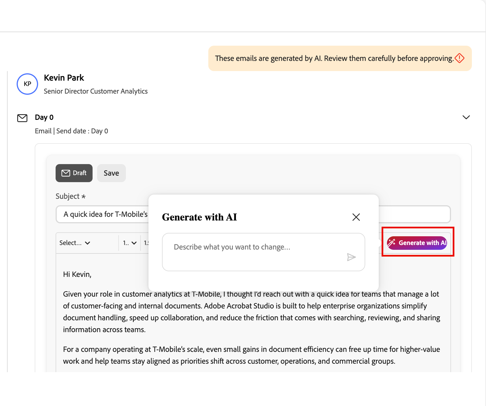

# 銷售限定詞

Sales Qualifier是AI驅動的應用程式，您可以搭配[!DNL Adobe Journey Optimizer B2B Prime]使用。 它會實作Account Qualification Agent，並旨在簡化業務開發代表(BDR)的工作流程。 Sales Qualifier可跨管道自動執行潛在客戶資格、外聯和買家參與工作流程。 它減少了手動BDR負載，並加快了企業B2B公司的管道速度。

BDR可以使用瀏覽器和電子郵件外掛程式，直接在CRM或Outlook中存取商業智慧。 下列影片提供Sales Qualifier和Account Qualification Agent的簡短示範。

>[!VIDEO](https://video.tv.adobe.com/v/3476572?captions=chi_hant)

## 應用程式首頁 {#application-home}

銷售限定詞包含在[!DNL Journey Optimizer B2B Prime]中，但它是Adobe Experience Platform中的個別應用程式。

{width="800" zoomable="yes"}

### Account Qualification 代理 {#account-qualification-agent}

Account Qualification Agent (AQA)是Sales Qualifier的核心。 AQA會使用AI來讀取您的帳戶，並判斷哪些帳戶已準備好進行下一步。 當您的組織已連線CRM （唯讀）時，它可協助研究、電子郵件草擬和CRM資訊內容。

<!--
## Edit the left navigation bar

At the bottom left of the application, click the _Edit_ (  ) icon to control which elements are visible in the left navigation. You can also drag and drop them to reorder as you want.
-->

### 基本代理程式使用情況 {#basic-agent-usage}

Adobe AI代理程式使用&#x200B;_自然語言查詢_，這表示他們在文字提示中使用與您交談人員時相同的語言。 您越詳細，結果就越好。

使用自然語言時，您可以要求代理程式：

* `Tell me the latest financial results of Bodea`
* `Tell me more about hiring at TechNova`
* `Tell me about the new AI features in Bodea LumaSecure4`

精簡您的提示，以取得您需要的結果，藉此重複您的傳出工作流程。 例如：

* _從盈利電話或報告等內容草擬後續電子郵件繪圖。_ 最多120個字。 主旨列：吸引人，包含關鍵主題。 介紹：使用上下文來源中的直接引號進行連結。 內文：與痛點和價值主張連結。 CTA：建議撥打短線電話以進一步探索。_

* _此電子郵件的目標是開始交談並建立可信度。_ 草擬一份語氣不超過120字的電子郵件，並具備諮詢性和同理心。 避免過於熟悉或銷售方法，請勿使用「希望您健康」、「登記使用」或「請」等詞語。_

### 產品存取和使用者群組 {#product-access-and-user-groups}

銷售限定詞功能的存取權是透過Adobe Admin Console中的使用者群組來管理。 產品管理員必須先設定適當的使用者群組，使用者才能存取應用程式。

#### 產品管理員

需要存取[整合](#integrations)功能的產品管理員必須是`Sales Qualifier Admins`使用者群組的成員。

1. 在Adobe Admin Console中建立名為`Sales Qualifier Admins`的使用者群組。
1. 新增需要設定CRM連線和知識庫設定的使用者。

#### 標準BDR使用者

標準BDR使用者必須是`Sales Qualifier users`使用者群組的成員，才能存取Sales Qualifier。

1. 在Adobe Admin Console中建立名為`Sales Qualifier users`的使用者群組。
1. 將&#x200B;**預設的生產所有存取權** AEP設定檔指派給群組。
1. 新增使用者至群組。

>[!NOTE]
>
>使用者群組名稱必須完全符合上述步驟。

## 潛在客戶 {#prospects}

在左側導覽中選取&#x200B;**[!UICONTROL 潛在客戶]**，以檢視您可以存取的所有潛在客戶清單。 它提供資訊的快速檢閱，例如潛在客戶狀態和上次活動。

{width="800" zoomable="yes"}

按一下&#x200B;_篩選器_ 圖示，依潛在客戶狀態篩選顯示的清單。

## 傳出工作流程 {#outbound-workflows}

>[!NOTE]
>
>產品管理員建立的傳出工作流程會與您組織中的所有使用者共用。

_輸出工作流程_&#x200B;是Sales Qualifier用來執行目標驅動電子郵件順序的結構。 您定義外聯目標和目標定位標準，AI會建議多點接觸步調，並為每個潛在客戶撰寫個人化電子郵件內容。 在註冊啟動序列之前，您可以檢閱並核准每封電子郵件，這樣訊息只會在您設定的視窗中傳送。

傳出工作流程會連線四個元素：

* **目標** — 您想要從宣傳中獲得的結果（例如，預約探索電話或駕駛事件註冊）。
* **目標定位篩選器** — 判斷哪些潛在客戶符合資格的條件。
* **接觸點的步調** — 步驟的有序順序，每個步驟都在排程的日期。 接觸點可以是&#x200B;**電子郵件**、**電話**&#x200B;或&#x200B;**LinkedIn InMails**。
* **個人化電子郵件內容** — 對於每個電子郵件接觸點，AI會使用潛在客戶設定檔、帳戶內容、參與歷程記錄和最近新聞來草擬內容。

目標會驅動下游的所有內容： AI會使用它來建議目標定位篩選器、設計步調、草稿接觸點提示，並為每個產生的電子郵件打造個人化形狀。

{width="800" zoomable="yes"}

### 重要概念 {#key-concepts}

| 概念 | 說明 |
| --- | --- |
| **工作流程** | 由目標、目標定位篩選器、步調和設定定義的可重複使用傳出活動。 |
| **目標** | 外聯的成效。 |
| **接觸點** | 序列中的一個步驟（電子郵件、電話或LinkedIn InMail），已排定為相對於註冊。 |
| **接觸點提示** | 產生潛在客戶的電子郵件內文和主旨（語氣、長度、焦點和call to action）時，AI會遵循的指示。 |
| **步調** | 接觸點的完整序列：數量、順序以及日期。 |
| **目標定位篩選器** | 將工作流程限制在潛在客戶子集合的條件。 |
| **草稿** | 已產生並準備好檢閱但尚未核准的電子郵件。 |
| **推理** | AI對其如何撰寫指定電子郵件（其使用哪些訊號和資料來源）的解釋。 |
| **註冊** | 核准潛在客戶的草稿，這會啟用步調，並在工作流程傳送視窗期間將電子郵件排入佇列。 |

以下章節說明完整的生命週期：在精靈中建立工作流程、檢閱產生的電子郵件、核准潛在客戶及管理一段時間內的工作流程。

### 建立傳出工作流程 {#outbound-workflow}

工作流程建立是五個步驟的精靈： **目標**、**鎖定目標**、**產生接觸點**、**設定**&#x200B;以及&#x200B;**新增潛在客戶**。 每個步驟都建立在最後一步之上；您的初始目標會塑造每個後續的決定。

1. 在左側導覽中，選取&#x200B;**[!UICONTROL 輸出工作流程]**。

1. 在&#x200B;**[!UICONTROL 瀏覽]**&#x200B;標籤上，按一下右上角的&#x200B;**[!UICONTROL +建立工作流程]**。

#### 步驟1：定義您的目標

目標是最重要的輸入：它會告訴AI成功的外觀，並錨定目標定位、步調和電子郵件產生。

1. 選擇&#x200B;**[!UICONTROL 從頭開始]**&#x200B;以撰寫您自己的目標，或選擇&#x200B;**[!UICONTROL 從範本開始]**&#x200B;以使用已儲存的範本。

   {width="700" zoomable="yes"}

1. 選擇其中一個&#x200B;**[!UICONTROL 建議目標]**&#x200B;作為起點，或輸入您自己的目標。

1. 按一下&#x200B;**[!UICONTROL 下一步：鎖定目標]**。

目標在陳述&#x200B;**具體結果**&#x200B;時運作最好，而不僅僅是主題。 例如，`Book a 15-minute discovery call with marketing leaders evaluating campaign automation`可讓AI使用`Promote campaign automation`以上的專案。

#### 步驟2：設定目標定位篩選器

目標定位篩選器會定義哪些潛在客戶符合資格。 當您稍後新增潛在客戶時，只有符合這些篩選條件的潛在客戶才會出現在選取清單中。

1. 按一下向下箭頭以顯示&#x200B;**[!UICONTROL 新增篩選器]**&#x200B;清單並選取要套用的篩選器。

   {width="700" zoomable="yes"}

1. 設定篩選的值。

1. 如果您需要縮小對象範圍，請新增更多篩選器。

   {width="600" zoomable="yes"}

1. 按一下&#x200B;**[!UICONTROL 下一步：產生接觸點]**。

#### 步驟3：產生並檢閱接觸點

設定目標後，AI會建置&#x200B;**_步調_**：它會分析您的目標和目標、定義接觸點順序，並為每個步驟寫入&#x200B;**_接觸點提示_**。 您會在特定日期看到每個接觸點的多步驟步調。 節奏可以混合電子郵件、電話和LinkedIn InMail步驟。

{width="700" zoomable="yes"}

展開電子郵件接觸點以讀取其提示。 此指示會在撰寫每個潛在客戶的電子郵件時指導AI，包括語調、長度、焦點和&#x200B;_call to action_。

**重新產生步調**

如果步調不是您想要的，請按一下[重新產生] **&#x200B;**&#x200B;並輸入精簡指令。 例如：

* `Make it 3 touchpoints across 2 weeks`
* `Lead with an executive briefing offer in the first email`
* `Add a nurture touch focused on a relevant case study`

AI會根據您的指示重寫完整的步調。

若要調整單一電子郵件接觸點而不重新產生整個步調，請直接在其文字區域中編輯提示文字。

當步調和提示看起來正確時，按一下&#x200B;**[!UICONTROL 下一步：設定]**。

在潛在客戶產生重要之前修訂接觸點提示：這些提示是AI稍後用於每個潛在客戶的核心指示。 此處逗留時間可在所有產生的電子郵件中調整。

#### 步驟4：設定工作流程設定

**設定**&#x200B;步驟控制工作流程的執行方式。

{width="700" zoomable="yes"}

1. 檢閱&#x200B;**[!UICONTROL 工作流程名稱]**，如果您想要更清楚的標籤，請變更它。
1. 在&#x200B;**[!UICONTROL 每個工作流程的最大潛在客戶數]**&#x200B;中，確認工作流程可同時管理多少個潛在客戶的上限。
1. 設定&#x200B;**[!UICONTROL 傳送視窗]**&#x200B;為允許傳送傳出電子郵件的時數。
1. 確認&#x200B;**[!UICONTROL 包含選擇退出連結]**，讓每封電子郵件都可以包含選擇退出連結。
1. 確認&#x200B;**[!UICONTROL 時區]**&#x200B;符合您的對象。
1. 按一下&#x200B;**[!UICONTROL 儲存並新增潛在客戶]**。

#### 步驟5：新增潛在客戶並開始產生電子郵件

儲存會開啟潛在客戶選取檢視，該檢視已依您的步驟2目標定位篩選。

{width="700" zoomable="yes"}

1. 檢閱清單。

   列通常包含潛在客戶名稱、帳戶、電子郵件、職稱、參與狀態和潛在客戶狀態。

1. 如果您需要展開或縮小清單，請在此調整篩選器。
1. 使用核取方塊選取潛在客戶。
1. 按一下&#x200B;**[!UICONTROL 下一步：檢閱接觸點]**&#x200B;以開始&#x200B;**每個潛在客戶**&#x200B;電子郵件產生。

AI會為每一個選取的潛在客戶產生個人化電子郵件，順序為&#x200B;**每個電子郵件接觸點**。 電話和LinkedIn InMail接觸點會依排程步驟保留在順序中。 產生可在背景執行 — 如果您要在完成時繼續其他工作，請使用&#x200B;**[!UICONTROL 準備就緒時通知]**。

AI會針對每個潛在客戶，將每個接觸點提示與潛在客戶特定資料（人員、帳戶、參與歷史記錄、最近新聞）結合，以產生主旨行與內文。

### 檢閱和調整產生的電子郵件 {#review-refine-emails}

產生完成後，工作流程詳細資料檢視會顯示橫幅以檢閱草稿。 需要檢閱，且在您核准前不會傳送任何內容。

{width="700" zoomable="yes"}

1. 在工作流程詳細資料檢視中，按一下橫幅中的&#x200B;**[!UICONTROL 檢閱草稿]**。
1. **[!UICONTROL 檢閱接觸點]**&#x200B;步驟有兩個標籤：
   * **[!UICONTROL 準備好檢閱]** — 已完成產生的電子郵件。
   * **[!UICONTROL 正在產生]** — 仍在寫入電子郵件。
1. 在左側的潛在客戶清單中，按一下名稱以在右側載入該潛在客戶的接觸點。
1. 在接觸點上使用>形箭號(**>**)以展開並讀取完整的主旨列和內文。

#### 閱讀AI推理

針對每個產生的電子郵件，**[!UICONTROL 推理]**&#x200B;說明AI如何製作該訊息，包括塑造內容和call to action的訊號、屬性和來源。 在您核准之前，請先檢閱此資訊並驗證個人化。

{width="600" zoomable="yes"}

#### 直接編輯電子郵件

若是細微的編輯（文字、色調、單句話）：

1. 在展開的接觸點上，按一下&#x200B;_編輯_&#x200B;圖示以開啟編輯器。
1. 編輯主旨列或內文。
1. 按一下&#x200B;**[!UICONTROL 儲存]**。

#### 使用AI調整電子郵件

若要進行較大的變更（重新建構、轉換強調或重新設定訊息框架），請使用&#x200B;**[!UICONTROL 使用AI產生]**。 AI代理程式會重寫電子郵件，同時保留個人化內容。

1. 在電子郵件編輯器中，按一下&#x200B;**[!UICONTROL 使用AI產生]**。

   {width="600" zoomable="yes"}

1. 輸入明確的指示，例如：
   * `Make it shorter and more direct. Keep it under 100 words.`
   * `Focus more on the prospect's role and how the solution helps them specifically.`
   * `Change the call-to-action to suggest a 15-minute introductory call instead.`
1. 檢閱修訂版本並視需要手動調整。
1. 按一下&#x200B;**[!UICONTROL 儲存]**。

>[!TIP]
>
>直接編輯套裝的文字和語調。 _[!UICONTROL 使用AI產生]_&#x200B;會比較好，否則您最好從頭開始重寫電子郵件。

### 核准並註冊潛在客戶 {#approve-enroll-prospects}

核准會啟用潛在客戶的步調。 在潛在客戶核准並註冊之前，系統不會向他們傳送電子郵件。

1. 在左側潛在客戶清單中，選取您已檢閱並準備傳送其電子郵件的潛在客戶。
1. 按一下&#x200B;**[!UICONTROL 核准並註冊潛在客戶]** （右下方）。

{width="700" zoomable="yes"}

核准的電子郵件會在工作流程&#x200B;**傳送視窗** （在設定的&#x200B;**時區**）中，在每個接觸點相對於註冊的排程日傳送。 在您採取行動之前，您未核准的潛在客戶仍會留在&#x200B;**[!UICONTROL 準備檢閱]**&#x200B;中。 核准後，工作流程將根據您定義的步調執行。

### 管理現有的工作流程 {#manage-existing-workflows}

在&#x200B;_[!UICONTROL 輸出工作流程]_&#x200B;頁面上，**[!UICONTROL 瀏覽]**&#x200B;索引標籤會列出每個工作流程。 每張卡片都會顯示目標、設定的接觸點和效能量度。 使用此檢視來監視作用中的工作流程、返回仍需要稽核的草稿，或開啟工作流程以新增更多潛在客戶。

### 傳出工作流程最佳實務 {#outbound-workflow-best-practices}

* **投資於目標。** 下游目標定位、步調和電子郵件都會追溯至目標。 特定的、以結果為導向的目標會比模糊的目標更勝一籌。
* **在產生每個潛在客戶之前完成接觸點提示。** 大量產生之後，通常會一次對一個潛在客戶進行變更。
* **使用推理作為品質檢查。** 如果強調錯誤的訊號（或明顯遺漏訊號），請編輯電子郵件或重新造訪接觸點提示並重新產生步調。
* **將編輯工具與變更相符。** 直接編輯文字和語調；**[!UICONTROL 使用AI產生]**&#x200B;以重新建構或重新建框。
* **僅核准您已檢閱的專案。** 在註冊之前，先展開接觸點、閱讀內容並調整所需位置。

## 電子郵件寄件匣 {#email-outbox}

「電子郵件」寄件匣可讓您檢視已傳送/產生的寄出電子郵件、開啟預覽，以及檢查回覆（可用時）。

<!--
## Meeting bookings

This panel displays all meetings set up through automation.

## Chat inbox

This panel displays all your chat threads.


You can interact with clients, and see summaries for the contact and the thread so that you can quickly know where you are in the thread.

-->

## 工作 {#tasks}

銷售限定詞中的&#x200B;_任務_&#x200B;區域為業務開發代表(BDR)提供專屬的空間，以管理和處理其對外工作流程動作。 傳出工作流程引擎會自動產生任務，這些任務代表BDR針對每個潛在客戶需要採取的特定動作，例如電話通話、LinkedIn InMails和電子郵件稽核。

工作管理體驗是設計為&#x200B;**處理佇列**，而不只是待辦事項清單。 您可以開啟工作、執行動作、標籤完成，以及移至下一個工作，這一切都不需要離開頁面。

在左側導覽列中選取&#x200B;**[!UICONTROL 工作]**&#x200B;以開啟完整工作頁面。 此頁面是逐一處理任務的主要工作區。

{width="800" zoomable="yes"}

<!--
**Homepage feed** - The homepage displays a running feed of your most urgent tasks, with overdue items at the top followed by today's tasks. Each item in the feed has an "Open" button that takes you directly to that task in the Tasks page with the detail panel already loaded.
-->

### 任務型別 {#task-types}

所有任務都與傳出工作流程步驟相關聯。 有三種型別：

**電話呼叫** — 在工作流程式列到達電話呼叫步驟時建立。 「工作」面板會顯示代理程式產生的推播點以及擷取電話備註的內嵌備註欄位。

**LinkedIn InMail** — 序列到達LinkedIn InMail步驟時建立。 任務面板會顯示建議的InMail內容，您可以複製這些內容並傳送至產品外部。

**電子郵件檢閱** — 在系統完成為已註冊工作流程的潛在客戶產生個人化電子郵件時建立。 您會在該潛在客戶開始出站之前檢閱及核准電子郵件。 每個潛在客戶都會取得個別的「電子郵件複查」任務；如果您在工作流程中註冊10個潛在客戶，則當產生完成時，您最多會看到10個「電子郵件複查」任務。

### 任務管理 {#task-management}

「工作」頁面分為兩個面板：

* **左 — 工作清單：**&#x200B;您的工作佇列，已根據您選取的檢視和排序設定排序和篩選。
* **右 — 任務工作面板：**&#x200B;所選任務的詳細資訊，包括潛在客戶資訊、工作流程內容、任務特定內容（要點、建議的復本、電子郵件草稿）以及動作控制項。

在左側面板中選取任何工作都會將其詳細資料載入右側面板，無需導覽離開頁面。

#### 佇列控制項

工作面板包含&#x200B;**Next**&#x200B;和&#x200B;**Previous**&#x200B;控制項，可依序移動工作佇列。 佇列會遵循您套用至清單的任何排序和篩選設定。 因此，如果您正在處理依到期日排序的逾期電話工作，_下一個_&#x200B;和&#x200B;_上一個_&#x200B;將完全按照該組進行移動。

當您將任務標示為完成時，面板會自動前進到佇列中的下一個任務。

#### 附註

對於「電話通話」和LinkedIn Mail工作，工作面板中有內嵌附註欄位。 當您按一下離開時，附註會自動儲存，這樣當您在標示目前工作完成之前導覽至其他工作時，便不會遺失附註。

#### 任務動作

使用下列動作管理您的工作：

* **[!UICONTROL 標籤完成]** — 主要動作。 在您執行工作後使用此動作 — 發出呼叫、傳送InMail或檢閱並核准電子郵件。 完成時，工作會記錄為&#x200B;**已完成**，而佇列會自動前進。

* **[!UICONTROL 略過接觸點]** — 可從工作面板的溢位功能表取得。 當您無法完成此步驟，但潛在客戶仍然是工作流程中的有效目標時，請使用此選項。
   * 潛在客戶會前進到序列中的下一個步驟。 未來的工作仍會依排程產生。
   * 選取原因： *錯誤的連絡資訊*、*錯誤的時間*、*不相關的內容*&#x200B;或&#x200B;*其他* （使用自由文字欄位）。
   * 工作狀態已設定為&#x200B;**已略過**，且已記錄原因和時間戳記。
   * 如果這是工作流程中的最後一個步驟，則潛在客戶的工作流程執行結束。 任務仍記錄為「已略過（未移除）」。

* **[!UICONTROL 從工作流程移除]** — 可從工作面板的溢位功能表取得。 當潛在客戶不再屬於此工作流程時，請使用此選項。

  從工作流程移除潛在客戶時：
   * 此工作流程中該潛在客戶的所有擱置和未來任務都會被取消。
   * 潛在客戶的註冊狀態變更為&#x200B;**已由BDR**&#x200B;移除。
   * 選取原因： *離開公司*、*重複*、*大小錯誤*、*已轉換*&#x200B;或&#x200B;*其他* （含文字欄位）。
   * 出現確認對話方塊： *&quot;此動作將取消[工作流程名稱]中[潛在客戶]的所有剩餘接觸點。 繼續？&quot;*
   * 工作狀態已設定為&#x200B;**已移除**。 所有已取消的同層級工作也標籤為&#x200B;**已移除**。

>[!NOTE]
>
>略過和移除原因資料會通知Analytics，包括各頻道的略過率、各工作流程的移除率及主要原因。 這有助於改善工作流程品質，並隨時間通知效能分析。

### 任務狀態 {#task-status}

每項工作都會經歷下列狀態：

| 狀態 | 說明 |
|---|---|
| **擱置中** | 已建立，但前一個工作流程步驟尚未完成。 在您的工作清單中不可見。 |
| **即將推出** | 前述步驟已完成，但到期日期為未來日期。 可見且可操作 — 如果時機正確，您可以提前完成。 |
| **開啟** | 今天到期。 可見且可操作。 |
| **過期** | 逾期日期，尚未完成。 可見、可操作、且具備視覺化標幟。 |
| **已完成** | 您已執行並標籤工作完成。 |
| **已略過** | 您已略過此接觸點。 潛在客戶在工作流程中前進。 |
| **已移除** | 您已從工作流程中移除潛在客戶。 已取消所有同層級工作。 |
| **已取消** | 由於工作流程變更或潛在客戶移除，系統已取消。 |

### 清單檢視 {#list-views}

使用工作清單頂端的標籤在檢視之間切換：

* **今天** *（預設）* — 今天到期的任務尚未完成。

* **逾期** — 到期日已過，且仍未完成的工作。 先處理這些工作。

* **近期** — 具有未來到期日的任務，其中已完成先前的工作流程步驟。 這些任務會提早顯示，因此您可以提前計畫，或在時機合適時儘早採取行動（例如，如果您已經在與潛在客戶通話）。 會顯示排程的到期日，讓您知道預定時間。

* **已完成** — 您已完成、略過或移除的工作記錄。 對檢閱和稽核非常有用。

### 篩選和搜尋 {#filtering-and-search}

有多種方式可篩選工作清單：

* 使用多選清單依工作型別篩選。 選取多個型別會顯示符合所選型別之&#x200B;*任何*&#x200B;的工作（例如，通話&#x200B;**或**&#x200B;電子郵件檢閱）。

* 依工作狀態篩選。 選取多個狀態會顯示符合任何選定狀態的任務。

* 使用&#x200B;**AND**&#x200B;邏輯跨群組篩選。 例如，`Type = Phone Call and Status = Overdue`只顯示逾期通話工作。

使用搜尋列，依潛在客戶名稱、公司名稱或參與名稱來尋找任務。 搜尋會與任何作用中的篩選器一併套用。 僅限文字比對 — 完全符合部分內容，沒有模糊搜尋。

### 排序 {#sorting}

使用&#x200B;**排序依據**&#x200B;控制項來選擇工作清單的排序方式。 排序也會決定「下一個」和「上一個」在佇列中的移動順序。

| 排序選項 | 行為 |
|---|---|
| **到期日期（遞增）** *（預設）* | 最舊到期日期在前。 超期任務會出現在今天的任務之前。 |
| **到期日期（降序）** | 最晚到期日期在前。 |
| **建立日期（最新）** | 最近建立的任務在前。 |
| **建立日期（最舊）** | 最先建立的任務最舊。 |
| **任務型別** | 依序依型別分組：電話通話→LinkedIn InMail→電子郵件檢閱。 在每個群組內，依到期日遞增排序。 |

### 超期任務 {#overdue-tasks}

如果任務尚未完成，則會在到期日後的第二天過期。 超期任務：

* 出現在&#x200B;**過期**&#x200B;檢視中，並位於首頁摘要的頂端。
* 在任務清單中有視覺化的「過期」徽章標籤。
* 保持完全可操作 — 您可以完成、略過或移除它們。

### 近期任務 {#upcoming-tasks}

即使下一個步驟到期日仍在未來，仍會在潛在客戶完成工作流程步驟時建立近期任務。 此可見度可讓您搶先體驗insight並進入管道，以便提前規劃或在機會出現時搶先行動。

近期任務會顯示其排程的到期日，因此您一律知道應何時解決這些任務。 完全支援提早完成即將到來的任務 — 工作流程引擎會記錄實際完成日期並正常推進潛在客戶。

### 任務完成 {#task-completion}

任務完成不限於「任務」頁面。

**參與潛在客戶檢視：**&#x200B;參與潛在客戶頁面上的接觸點預覽包含&#x200B;_標籤完成_&#x200B;動作，以及內容預覽和選擇性備註欄位。 在此處完成任務會立即更新其在「任務」頁面中的狀態。 此檢視不會觸發自動前進行為 — 它是一個檢視並操作表面，而不是一個佇列處理表面。

**Salesforce （CRM外掛程式）：** Salesforce中的Sales Qualifier外掛程式會在傳出工作流程卡中顯示任務狀態（即將推出、擱置中、已完成、逾期、已略過）。 在目前的版本中，CRM卡是&#x200B;**唯讀** — 您可以看到工作狀態，但必須完成銷售限定詞中的工作。

### 空白狀態 {#empty-states}

* **今天沒有工作：**&#x200B;您看到一則&#x200B;_您已全部完成_&#x200B;訊息。 如果存在近期任務，提示會顯示為&#x200B;_您有[N]個近期任務 — 檢視近期任務_。
* **逾期工作出現：**&#x200B;提示會鼓勵您先處理逾期工作。

## 整合 {#integrations}

透過整合，銷售限定詞可以使用您的CRM，讓Account Qualification Agent (AQA)和對外工作流程在Salesforce或Microsoft Dynamics 365中共用一致潛在客戶、帳戶、聯絡人、活動和擁有者的檢視。 CRM整合使用&#x200B;**唯讀**&#x200B;存取權進行連線，因此AQA可以擷取CRM銷售資料和活動（例如電子郵件、電話、工作和約會），以豐富深入分析。 CRM資料可用於分析應用程式中的見解和營運效率。 它不會用於透過此連線修改您的CRM記錄。

>[!IMPORTANT]
>
>存取銷售限定詞中的整合需要`Sales Qualifier Admins`使用者群組成員資格。

### CRM存取範圍 {#crm-access-scope}

CRM連線是&#x200B;**_唯讀_**。 使用的一般實體包括使用者、聯絡人、擁有者對應、銷售機會、客戶、商機和活動。 您的CRM管理員已在Salesforce或Dynamics中準備API存取。 然後您連線Sales Qualifier並對應應用程式中的傳入欄位。

### 在您的CRM中準備認證 {#prepare-credentials-in-your-crm}

在連線Sales Qualifier之前，請與您的CRM管理員合作。 以下摘要說明通常在每個系統中建立的內容。

#### Microsoft Dynamics 365 (Dataverse / Power Platform)

1. 在Azure Active Directory中註冊應用程式（**[!UICONTROL 應用程式註冊]**）。

   記下&#x200B;**使用者端識別碼**&#x200B;和&#x200B;**租使用者識別碼**，並建立&#x200B;**使用者端密碼**。

1. 在&#x200B;**[!UICONTROL Power Platform系統管理中心]**&#x200B;中，開啟您的環境，並移至&#x200B;**[!UICONTROL 設定]** > **[!UICONTROL 使用者+許可權]** > **[!UICONTROL 應用程式使用者]**。

1. 建立連結至該Azure AD應用程式的應用程式使用者。

1. 指定授予&#x200B;**讀取**&#x200B;存取權給實體「銷售限定詞」需求（例如銷售機會、聯絡人、帳戶、商機及活動）的安全性角色。

   應用程式需要具備讀取存取許可權的安全性角色才能讀取資料。

連線Dynamics時要提供的&#x200B;**資訊：**

* 用戶端 ID
* 使用者端密碼
* 租用戶 ID
* Dynamics執行個體URL （組織URL）

#### Salesforce

在Salesforce中，[建立已啟用OAuth且允許API存取身分和資料的外部使用者端應用程式](https://help.salesforce.com/s/articleView?id=xcloud.create_a_local_external_client_app.htm&type=5) （或&#x200B;_連線應用程式_），此範圍需遵循您組織的安全性標準。 整合的使用者（例如使用使用者端認證樣式設定時）必須擁有物件的讀取存取權，例如銷售機會、帳戶、連絡人、工作、事件、商機以及相關的商機物件。 管理工作通常需要具有&#x200B;**[!UICONTROL 管理連線應用程式]** （及其他許可權）的使用者在建立後檢視消費者金鑰和密碼。

>[!PREREQUISITES]
>
>若要建立外部使用者端應用程式，產品管理員應驗證您已啟用（從設定檔或許可權集）下列專案：
>
>* 自訂應用程式
>* 檢視設定
>* 修改所有資料
>* 管理連線應用程式（重要）
>
>   如果未啟用&#x200B;_管理連線應用程式_，則建立外部使用者端應用程式後，可能無法檢視使用者端識別碼和使用者端密碼。

建立外部使用者端應用程式時，請啟用OAuth並授與許可權。 同時啟用下列使用者端認證：

* 存取身分URL服務（識別碼、設定檔、電子郵件、地址、電話）
* 透過API (API)管理使用者資料
* 存取不重複使用者識別碼(openid)

建立應用程式後，請再次啟用使用者端憑證流程，並使用連絡人電子郵件作為使用者名稱。  啟用使用者端認證時，請將使用者設定為&#x200B;_執行身分_。

請確定已設定的使用者擁有下列物件的讀取存取權：

* 銷售機會
* 帳戶
* 聯絡人
* 工作
* 事件
* 機會
* Opportuncontactroles
* 機會明細專案

在銷售限定詞中連線Salesforce時要提供的&#x200B;**資訊：**

* 用戶端 ID (使用者金鑰)
* 使用者端密碼（使用者密碼）
* 回呼URL （如連線應用程式上的設定）
* Salesforce執行個體URL

>[!IMPORTANT]
>
>請勿透過電子郵件傳送使用者端密碼。 使用您組織核准的安全管道，與在「銷售限定詞」中輸入認證的人共用認證。

### 連線至您的CRM {#connect-to-your-crm}

1. 登入Sales Qualifier並確認已選取正確的沙箱或環境。

1. 在左側導覽列中，展開&#x200B;**[!UICONTROL 管理]**&#x200B;並選取&#x200B;**[!UICONTROL 整合]**。

   頁面會顯示Salesforce和Microsoft Dynamics的卡片。

   {width="800" zoomable="yes"}

1. 針對您使用的CRM，按一下&#x200B;**[!UICONTROL 連線]**。

1. 從您的CRM管理員輸入使用者端識別碼、密碼、租使用者或回呼值，以及&#x200B;**執行個體URL**。

1. 成功連線後，卡片會顯示&#x200B;**[!UICONTROL 已連線]**。

### 執行個體URL准則 {#instance-url-guidelines}

**執行個體URL**&#x200B;必須是您CRM用於API和整合設定的環境基底URL，而不是僅限UI的主機名稱。

**Salesforce**

1. 從瀏覽器位址列（`{{mydomain}}`值）登入並記下您的組織&#x200B;_我的網域_&#x200B;子網域。

1. 對於銷售限定詞，請使用標準格式： `https://{{mydomain}}.my.salesforce.com` 。

   請&#x200B;**不**&#x200B;使用`lightning.force.com` URL作為執行個體URL。

**Microsoft Dynamics 365**

1. 在瀏覽器中開啟CRM，並從網址列複製基底URL。

   其格式通常是`https://{{org}}.crm.dynamics.com`。

### 對應CRM欄位（傳入對應） {#map-crm-fields-inbound-mapping}

CRM連線之後，在整合上開啟&#x200B;**[!UICONTROL 管理]**&#x200B;以使用&#x200B;**[!UICONTROL CRM輸入對應]**。

1. 按一下&#x200B;**[!UICONTROL 新增區段]**，然後輸入名稱、選擇性說明和實體型別（例如潛在客戶）。

1. 選取要匯入、預覽和儲存的CRM欄位。

   區段會顯示在入站對應標籤下方。

1. 對應的潛在客戶欄位會顯示在潛在客戶的&#x200B;**[!UICONTROL 人員]**&#x200B;標籤上：
   * 帳戶檢視上的帳戶欄位。
   * 客戶體驗中機會領域的機會相關欄位。

### 參考資料：範例API引數 {#reference-sample-api-parameters}

您的CRM團隊可以使用這些範例，確認會傳回預期的潛在客戶欄位的讀取存取權。

**動態（OData樣式摘要）**

```text
$select=fullname,_ownerid_value,leadid,emailaddress1,jobtitle,statuscode,createdon,modifiedon,statecode
$filter=_ownerid_value eq '<crmUserId>' [AND additional filters]
$expand=Lead_ActivityPointers(...),parentaccountid(...)
$orderby=modifiedon desc
```

**Salesforce （SOQL摘要）**

```sql
SELECT Id, Salutation, FirstName, LastName, Name, Title, Company, Email,
  LeadSource, Status, OwnerId, LastModifiedDate, LastActivityDate, CreatedDate,
  (SELECT Id, Subject, ActivityDate, Status FROM Tasks ORDER BY ActivityDate DESC LIMIT 1),
  (SELECT Id, Subject, ActivityDateTime FROM Events ORDER BY ActivityDateTime DESC LIMIT 1)
FROM Lead
WHERE OwnerId = '<crmUserId>' AND IsDeleted = false
ORDER BY LastModifiedDate DESC
```

### 知識中心 {#knowledge-center}

_[!UICONTROL 知識中心]_&#x200B;可讓AQA存取客戶檔案和連結的知識，讓銷售限定詞可以使用您自己的資料產生更好的研究和資格見解。 上傳您要用於產生電子郵件的內容和資訊資源。

{width="700" zoomable="yes"}

## 輪廓設定 {#profile-settings}

設定檔設定會指定有關自己的資訊，包括個人詳細資料、電子郵件和行事曆設定，以及聊天可用性。

### 電子郵件設定 {#email-settings}

在&#x200B;**[!UICONTROL 電子郵件設定]**&#x200B;索引標籤中，設定您的電子郵件連線。


* **[!UICONTROL 電子郵件連線]** — 按一下&#x200B;**[!UICONTROL 連線]**&#x200B;並遵循Microsoft登入程式。

* **[!UICONTROL 電子郵件簽章]** — 設定用於自動產生電子郵件中的電子郵件簽章。

### 行事曆設定 {#calendar-configuration}

在&#x200B;**[!UICONTROL 行事曆組態]**&#x200B;索引標籤上，設定您的時區與可用性。

<!-- 

-->

* **[!UICONTROL 行事曆連線]** — 按一下&#x200B;**[!UICONTROL 連線]**，然後依照Microsoft登入程式來整合您的行事曆。

* **[!UICONTROL 會議確認電子郵件]** — 當使用者端確認與您進行會議時，他們會收到確認電子郵件作為回覆。 使用這些設定來定義電子郵件主旨與內文。

* **[!UICONTROL 偏好設定]** — 設定您的預設會議長度和連續會議之間的時間。

如果您中斷行事曆的連線：

* 有效停用作用中的預訂連結。
* 預訂頁面會顯示易記、暫時無法使用的狀態。
* 重新連線會保留設定。

### 日曆可用性 {#calendar-availability}

您在「銷售限定元」中的行事曆可用性是以兩個輸入為基準：

* 您連線的工作行事曆（Outlook或Gmail）
* 您在&#x200B;_行事曆設定_&#x200B;中設定的可用性+時段規則。

「銷售限定元」會從連線行事曆讀取空閒/忙碌狀態（而非完整事件內容），並搭配設定的規則來決定潛在客戶可以檢視哪些預約位置。

您可以設定：

* 按星期幾的工作時數
* 每天有多個區塊（範例： 9:00-12:00和1:00-5:00）
* 您的時區
* 會議持續時間
* 在會議之前/之後緩衝
* 最低通知
* 預訂視窗

<!-- 
### Chat settings

In the **[!UICONTROL Chat settings]** tab, set your Timezone Live chat availability.


## Representative management

The _[!UICONTROL Representative management]_ panel displays the defined representatives and their calendar status.

## Meeting performance

This panel presents analytics around your completed meetings.
-->

<!--
 SHPHR-24341 remove section
## Set up the Chrome plugin

The AI Assistant Chrome plugin is available on the [Google Store](https://chromewebstore.google.com/detail/ai-assistant/hancbabllcmckehonngbdkhilocpdfji?authuser=0&hl=en).

When the plugin is installed in Chrome, the Adobe logo appears on the middle right when you are on an integrated site:

* Adobe web applications
* Salesforce
* Outlook
* Microsoft Dynamics and web applications
* Google applications 
-->

