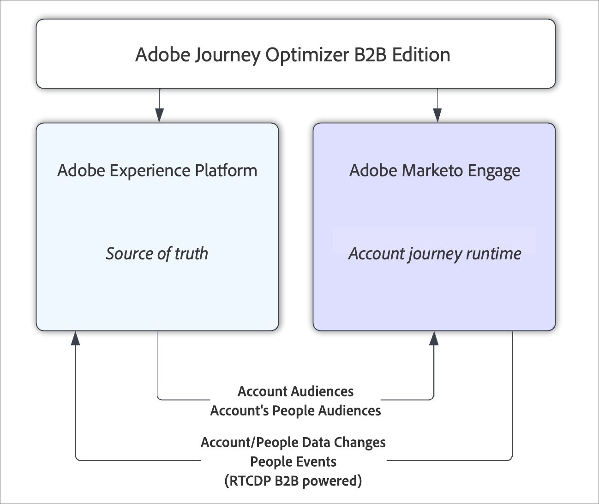

# Adobe Journey Optimizer B2B Edition 概觀

您可以使用 Adobe Journey Optimizer B2B Edition 內建的生成式 AI 和領先業界的自動化功能，協調帳戶和購買群組歷程，以便利用符合行銷資格的購買群組，將特定產品的需求最大化。

## 使用購買群組的帳戶歷程

以 Adobe Journey Optimizer B2B Edition 對比 Marketo Engage 以及 Adobe Journey Optimizer 標準版時，關鍵區別在於帳戶歷程推動帳戶完成整個歷程，而並非由人員推動。與某個帳戶關聯的人員，其歷程通常不會線性發展，而是取決於該帳戶在整個歷程中的進度，而非人員的個別動作。例如，當帳戶處於購買歷程的早期階段時，所傳送的資訊可能與一般解決方案功能或特色有關。在購買過程的後續進展中，所傳送的內容可能會更加針對特定的優惠，或是以成功銷售為目標的其他項目。購買解決方案後，所傳送的資訊可能會再次變更，改為提供操作指南、最佳實務或即將舉辦的活動相關資訊，或是有關其他向上銷售的內容。即使某人並未與早期階段的內容互動，您仍會希望根據其帳戶或購買群組內其他人員的行動 (而非他們自身的行動)，將其推進至目前階段。

## 高階架構

Adobe Journey Optimizer B2B Edition 會使用來自 Adobe Experience Platform 的&#x200B;_帳戶客群_&#x200B;和&#x200B;_人員客群_，推動在 Marketo Engage 內部執行的帳戶歷程。Experience Platform 始終是此資料的真實來源，但帳戶歷程的所有執行和處理均發生在 Marketo Engage B2B 行銷基礎結構內部。此協調流程透過現有的 Marketo Engage - Adobe Real-Time CDP B2B Edition 來源連接器，將資料近乎即時地帶回 Experience Platform，將資料變更從 Marketo Engage 串流傳送至 Experience Platform。

{width="500" zoomable="yes"}

>[!NOTE]
>
>有關效能護欄和靜態限制，請參閱您的授權權益以及對應的[產品說明](https://helpx.adobe.com/tw/legal/product-descriptions/adobe-journey-optimizer-b2b.html){target="_blank"}。

### 訂閱模型

Journey Optimizer B2B Edition 訂閱由一對 Experience Platform (AEP) 沙箱與 Marketo Engage _Munchkin_ 訂閱所定義。單一 Marketo Engage 訂閱不能與多個 AEP 沙箱進行配對。如果您未選擇將現有的 Marketo Engage 訂閱與 Journey Optimizer B2B Edition 進行配對，您將獲得一個全新、空白的 Marketo Engage 訂閱，以便與 Journey Optimizer B2B Edition 搭配使用。

在此設定中，Experience Platform 的用途是讓使用者統一檢視來自 Marketo Engage 執行個體 (以及任何附加的 CRM 系統) 的資料，然後可以使用帳戶歷程對統一資料採取動作。

### 帳戶歷程作業

帳戶歷程是在 Journey Optimizer B2B Edition 中編寫，並儲存在與訂閱相關的 Marketo Engage 執行個體中。雖然帳戶歷程儲存在 Marketo Engage 資料儲存區中，但不會顯示在 Marketo Engage 使用者介面中，而且僅可在 Journey Optimizer B2B Edition 中使用。

帳戶歷程開始時，一律會先選取一個帳戶細分做為歷程的帳戶客群。若要選取客群，請使用標準的 Experience Platform 客群選擇器元件。然後，行銷人員可以根據其條件 (包括帳戶條件、人員條件或購買群組條件)，透過分割歷程路徑來實作帳戶歷程。您可以在每個分支上採取行動來實施歷程，例如傳送電子郵件或等待事件發生。

建立帳戶歷程後，必須進行發佈。在發佈時，此帳戶歷程經驗證並轉換為一系列實施歷程體驗的 Marketo Engage 行銷活動。聯絡資料整合服務來開始資料流，進而開始帳戶歷程作業。第一步是為帳戶人員建立細分。

### 資料流

Journey Optimizer B2B Edition 使用 Real-Time CDP 帳戶細分來定義和執行帳戶細分，以及歷程所需的相關帳戶人員細分。當已發佈的歷程開始執行，有關人員和帳戶的資料可能會變更，並且會收集與歷程互動的人員資料。Journey Optimizer B2B Edition 依賴 Real-Time CDP B2B Edition 的 Marketo Engage 來源連接器，將資料變更傳回至 Experience Platform 沙箱，即真實來源。這些資料以近乎即時的方式傳送至 AEP。

只有 Marketo Engage 來源連接器支援的現有資料類型 (帳戶、人員和機會) 才會傳回至 Real-Time CDP。這表示購買群組資料不會傳回 AEP，而是儲存在 Journey Optimizer B2B Edition 訂閱使用的 Marketo Engage 執行個體中。
