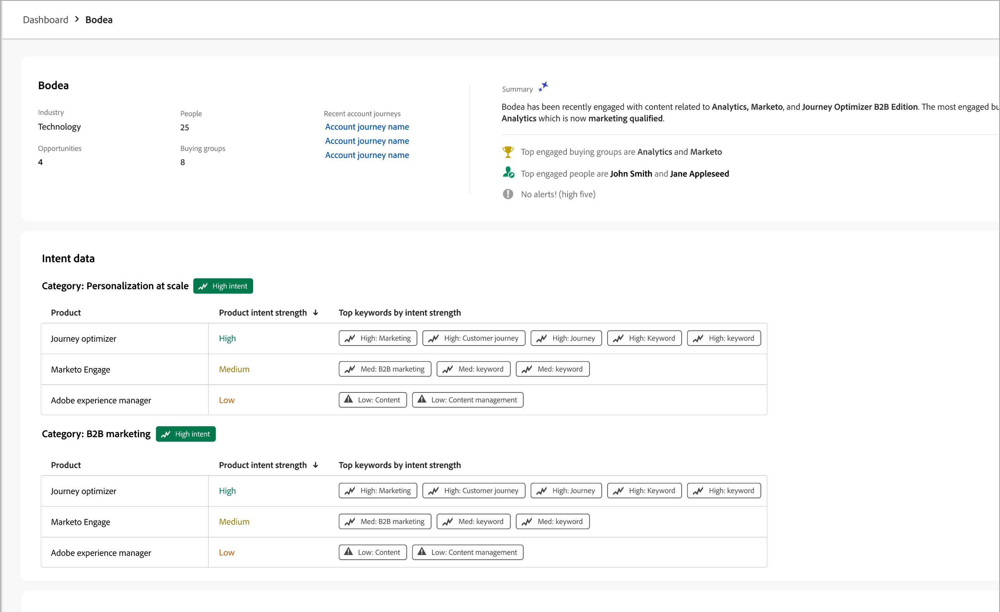
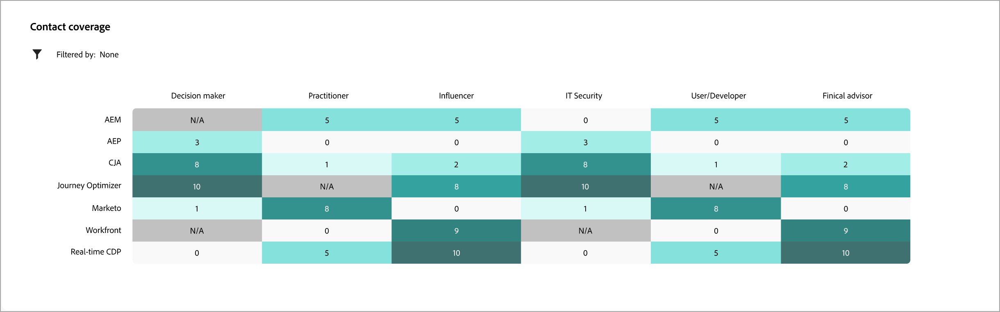
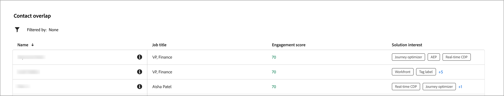
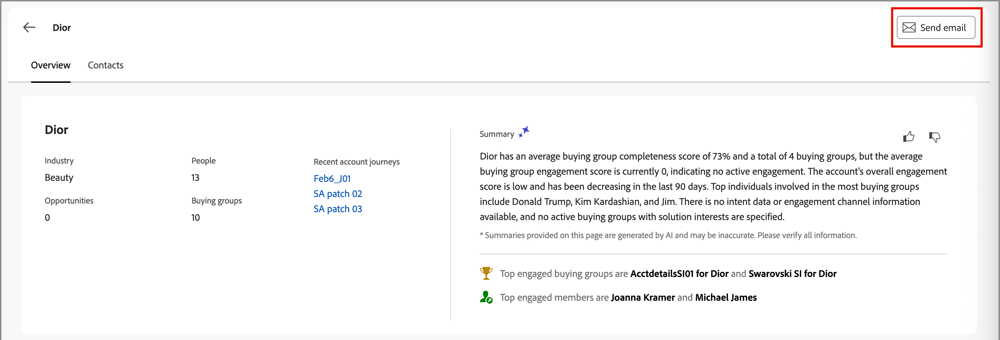
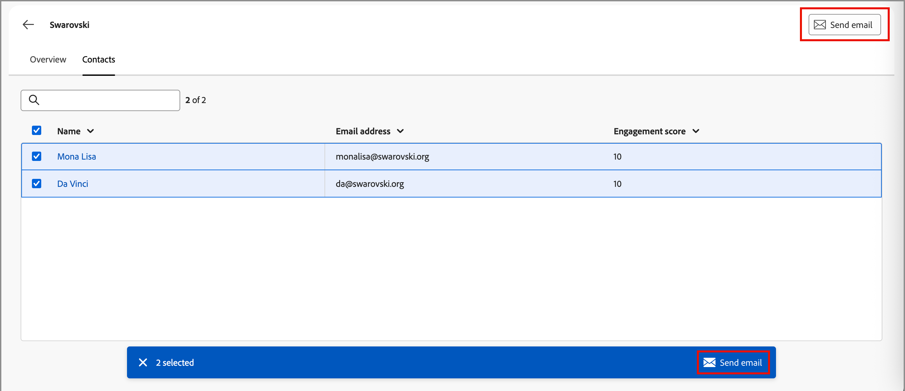

# 帳戶詳細資訊

當您在Journey Optimizer B2B edition的任何位置按一下帳戶名稱時，都會顯示&#x200B;_帳戶詳細資料_&#x200B;頁面。 此頁面提供帳戶的實用資訊，包括產生式AI摘要。 您也可以針對與帳戶關聯的連絡人執行[動作](#account-actions)。

{width="700" zoomable="yes"}

使用&#x200B;**[!UICONTROL 總覽]**&#x200B;標籤來檢閱帳戶的相關資訊，並使用&#x200B;**[!UICONTROL 連絡人]**&#x200B;標籤來存取帳戶連絡人清單。

## [!UICONTROL 概觀]索引標籤

帳戶詳細資訊頁面包含三個主要區段：

### 帳戶總覽

{zoomable="yes"}

帳戶概觀區段包含下列帳戶資訊：

* 帳戶名稱
* 帳戶中的人數
* 行業
* 開啟機會
* 帳戶目前使用中的最近三個帳戶歷程（按一下歷程名稱以開啟[歷程總覽](../journeys/journey-overview.md)）
* 帳戶的產生AI摘要，包括最常參與購買群組的相關資訊。

### 意圖資料

在Journey Optimizer B2B edition中，意圖偵測模型會根據帳戶聯絡活動，以足夠高的信賴度預測感興趣的解決方案/產品。 帳戶聯絡人的意圖可解譯為對產品感興趣的可能性。

{{intent-data-note}}

{width="700" zoomable="yes"}

* 意圖層級
* 意圖訊號型別 — 關鍵字、產品和解決方案

### 聯絡人涵蓋範圍

{width="800" zoomable="yes"}

_[!UICONTROL 連絡人涵蓋範圍]_&#x200B;區段會顯示帳戶中具有與解決方案相關的特定角色的連絡人數目。 角色和解決方案興趣的指派是以購買群組角色範本為基礎。 按一下儲存格以顯示下列詳細資訊：

* 描述，格式如下： _x個人擁有z方案興趣的y角色_
* 欄
* 名稱
* 帳戶
* 職稱
* 購買群組
* 個人參與分數
* 上次活動
* 詳細資料

按一下左上方的&#x200B;_篩選器_ （ ）圖示，使用下列任一屬性來篩選資料顯示：

* 解決方案興趣
* 時段

### 聯絡人重疊

{width="800" zoomable="yes"}

_[!UICONTROL 連絡人重疊]_&#x200B;區段顯示來自帳戶的連絡人，這些連絡人屬於多個購買群組，因為與數個解決方案興趣有關聯。 此資訊採用表格形式，包含下列資料欄：

* 名稱
* 職稱
* 帳戶
* 解決方案興趣

按一下連絡人名稱旁的&#x200B;_資訊_ （）以顯示包含下列詳細資訊的表格：

* 購買群組（按一下名稱以開啟[購買群組詳細資料](../buying-groups/buying-group-details.md)）
* 角色
* 解決方案興趣
* 產品目的（若[已設定](../admin/intent-data.md)）
* 產品

按一下左上方的&#x200B;_篩選器_ （ ）圖示，使用下列任一屬性來篩選資料顯示：

* 解決方案興趣
* 角色

## [!UICONTROL 連絡人]標籤

選取「**[!UICONTROL 連絡人]**」標籤以檢視與帳戶相關聯的所有人員清單，此帳戶會同步至Experience Platform。 列出的每個連絡人都包含姓名、電子郵件地址和參與分數。

![帳戶詳細資料 — [連絡人]索引標籤](./assets/account-details-contacts-tab.png){width="700" zoomable="yes"}

## 傳送電子郵件

您可以將行銷人員核准的電子郵件傳送給一或多個選取的連絡人（一次最多50個），或傳送給帳戶的所有連絡人。 可用電子郵件清單僅限於來自已連線Marketo Engage執行個體的已核准電子郵件。

>[!BEGINTABS]

>[!TAB 所有帳戶連絡人]

1. 從&#x200B;_[!UICONTROL 概述]_&#x200B;索引標籤，按一下右上方的&#x200B;**[!UICONTROL 傳送電子郵件]**。

   {width="700" zoomable="yes"}

1. 在&#x200B;_[!UICONTROL 傳送電子郵件]_&#x200B;對話方塊中，選取Marketo Engage工作區，然後選取您要傳送之電子郵件的核取方塊。

   {width="700" zoomable="yes"}的電子郵件

1. 按一下&#x200B;**[!UICONTROL 傳送]**。

>[!TAB 選取的連絡人]

1. 從&#x200B;_[!UICONTROL 連絡人]_&#x200B;索引標籤中，選取您要接收電子郵件的連絡人核取方塊。

1. 按一下右上角或底部選取列中的&#x200B;**[!UICONTROL 傳送電子郵件]**。

   {width="700" zoomable="yes"}

1. 在&#x200B;_[!UICONTROL 傳送電子郵件]_&#x200B;對話方塊中，選取Marketo Engage工作區，然後選取您要傳送之電子郵件的核取方塊。

   {width="700" zoomable="yes"}的電子郵件

1. 按一下&#x200B;**[!UICONTROL 傳送]**。

>[!ENDTABS]
