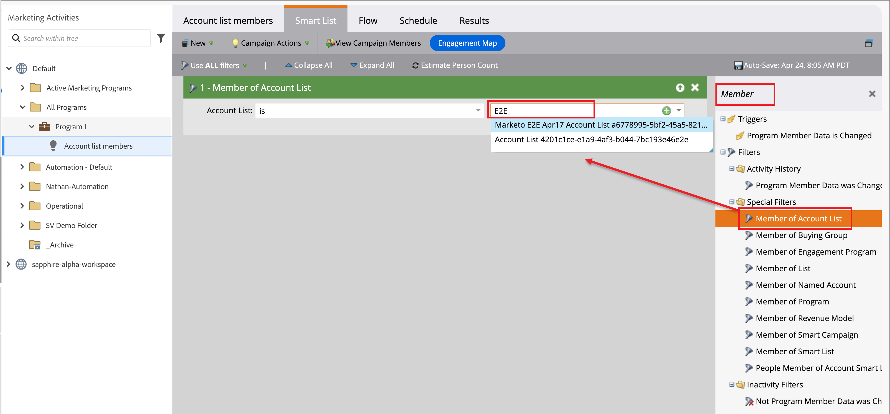
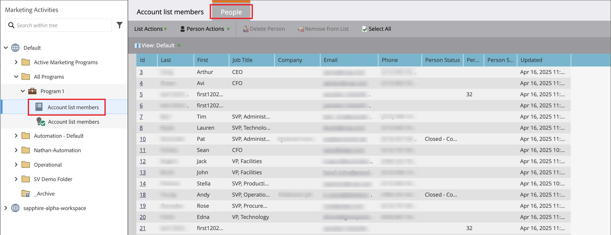

# 在歷程與程式中使用帳戶清單

您有多種方式可以將即時（已發佈）帳戶清單合併到帳戶歷程中。

## 帳戶對象節點

所有帳戶歷程都以&#x200B;[_帳戶對象_&#x200B;節點](../journeys/account-audience-nodes.md)開始。 當您設定此節點使用帳戶清單時，成員帳戶會在歷程上線（發佈）時移動歷程。

1. 選取起始&#x200B;**[!UICONTROL 帳戶對象]**&#x200B;節點的&#x200B;_帳戶清單_&#x200B;選項。

   {width="500"}

1. 按一下&#x200B;**[!UICONTROL 新增帳戶清單]**。

1. 選取帳戶清單的核取方塊，然後按一下[儲存]。****

   {width="600" zoomable="yes"}

## 採取動作節點 — 新增至帳戶

**_僅限靜態帳戶清單_**

在帳戶歷程中，使用[a _執行動作_&#x200B;節點](../journeys/action-nodes.md)將帳戶新增至靜態帳戶清單。

例如，您可能有傳送電子郵件的歷程路徑，且某些帳戶會將各種動作視為回應動作。 您將此活動視為歷程中的資格點。 透過資格，您想要將它們新增至帳戶清單，該清單用於作為另一個歷程的對象，該歷程具有合格帳戶的不同流程。

>[!NOTE]
>
>如果節點執行時帳戶已在清單中，則會忽略動作。

1. 選取&#x200B;__&#x200B;帳戶&#x200B;**[!UICONTROL 上的]**&#x200B;動作選項。

1. 若為帳戶&#x200B;_[!UICONTROL 上的]_&#x200B;動作，請選擇&#x200B;**[!UICONTROL 新增至帳戶清單]**。

   ![選取[新增至帳戶清單]](../journeys/assets/node-action-account-add-to-account-list.png){width="500"}

1. 若為&#x200B;**[!UICONTROL 選取即時靜態帳戶清單]**，請選擇您要新增帳戶的帳戶清單。

   ![選取[新增至帳戶清單]](../journeys/assets/node-action-account-add-to-account-list-select.png){width="500"}

## 採取動作節點 — 從帳戶移除

**_僅限靜態帳戶清單_**

在帳戶歷程中，使用[a _執行動作_&#x200B;節點](../journeys/action-nodes.md)從靜態帳戶清單移除帳戶。

例如，您可能有傳送電子郵件的歷程路徑，且某些帳戶會將各種動作視為回應動作。 您將此活動視為歷程中的資格點。 透過此資格，您會想要從用來作為其他傳送額外電子郵件之歷程對象的帳戶清單中移除這些對象，這樣您就不會重複您的資格通訊。

>[!NOTE]
>
>如果帳戶不在排定移除的清單中，則會忽略動作。

1. 選取&#x200B;__&#x200B;帳戶&#x200B;**[!UICONTROL 上的]**&#x200B;動作選項。

1. 若為帳戶&#x200B;_[!UICONTROL 上的]_&#x200B;動作，請選擇&#x200B;**[!UICONTROL 從帳戶清單移除]**。

   ![選取[新增至帳戶清單]](../journeys/assets/node-action-account-remove-from-account-list.png){width="500"}

1. 若為&#x200B;**[!UICONTROL 選取即時靜態帳戶清單]**，請選擇您要移除帳戶的帳戶清單。

   ![選取[新增至帳戶清單]](../journeys/assets/node-action-account-remove-from-account-list-select.png){width="500"}

## Marketo Engage方案 — 帳戶清單成員

行銷人員可能會想要在Marketo Engage中隱藏Journey Optimizer B2B edition中帳戶清單組成人員的計畫。

在連線至Journey Optimizer B2B edition的Marketo Engage執行個體中，您可以在智慧清單中使用&#x200B;_[!UICONTROL 帳戶清單成員]_&#x200B;篩選器，根據您的行銷活動策略來識別這些銷售機會。 如需智慧列示的詳細資訊，請參閱[Marketo Engage檔案](https://experienceleague.adobe.com/en/docs/marketo/using/product-docs/core-marketo-concepts/smart-lists-and-static-lists/understanding-smart-lists){target="_blank"}。

### 將篩選器新增至智慧清單

1. 在Marketo Engage中，選取行銷活動並按一下&#x200B;**[!UICONTROL 智慧清單]**&#x200B;索引標籤。

1. 在右側顯示的篩選器清單中，輸入`Member`並找到&#x200B;**[!UICONTROL 帳戶清單成員]**&#x200B;篩選器。

1. 將濾鏡拖曳至「智慧列示」畫布。

1. 在智慧列示畫布上，設定帳戶&#x200B;**[!UICONTROL 清單值的]**&#x200B;成員。

   按一下向下箭頭以顯示所有帳戶清單，或輸入部分帳戶清單名稱以協助找出您需要的帳戶清單。

   {width="800" zoomable="yes"}

1. 在行銷活動流程中，新增&#x200B;**[!UICONTROL 新增至清單]**&#x200B;步驟，並從Journey Optimizer B2B edition帳戶清單中選擇要填入人員的清單。

   請參閱Marketo Engage檔案中的&#x200B;_[將流程步驟新增至智慧行銷活動](https://experienceleague.adobe.com/en/docs/marketo/using/product-docs/core-marketo-concepts/smart-campaigns/flow-actions/add-a-flow-step-to-a-smart-campaign){target="_blank"}_，以取得有關將步驟新增至流程的詳細資訊。

### 檢閱成員

流程執行後，您可以檢視清單中填入的人員清單。 開啟清單並選取「人員」標籤。

從帳戶清單填入{width="800" zoomable="yes"}
