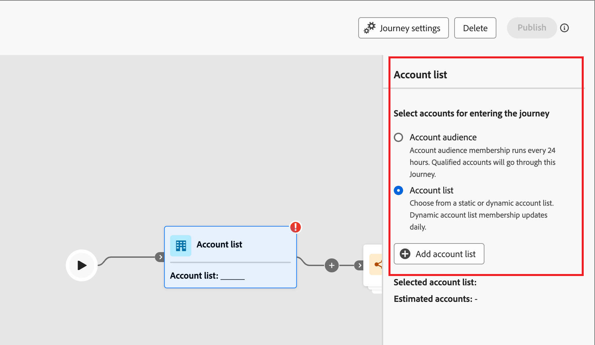

# 在歷程中使用帳戶清單

您有多種方式可以將即時（已發佈）帳戶清單合併到帳戶歷程中。

## 帳戶對象節點

所有帳戶歷程都以&#x200B;[_帳戶對象_&#x200B;節點](../journeys/account-audience-nodes.md)開始。 當您設定此節點使用帳戶清單時，成員帳戶會在歷程上線（發佈）時移動歷程。

1. 選取起始&#x200B;_帳戶對象_&#x200B;節點的&#x200B;**[!UICONTROL 帳戶清單]**&#x200B;選項。

   {width="500"}

1. 按一下&#x200B;**[!UICONTROL 新增帳戶清單]**。

1. 選取帳戶清單的核取方塊，然後按一下[儲存]。**&#x200B;**

   {width="600" zoomable="yes"}

## 採取動作節點 — 新增至帳戶

**_僅限靜態帳戶清單_**

在帳戶歷程中，使用[a _執行動作_&#x200B;節點](../journeys/action-nodes.md)將帳戶新增至靜態帳戶清單。

例如，您有一個傳送電子郵件的歷程路徑，而某些帳戶會採取各種動作作為回應。 您將此活動視為歷程中的資格點。 透過資格，您想要將它們新增到帳戶清單，該清單用作另一個歷程的對象，該歷程具有適用於合格帳戶的不同流程。

>[!NOTE]
>
>如果節點執行時帳戶已在清單中，則會忽略動作。

1. 選取&#x200B;_&#x200B;**[!UICONTROL 帳戶]**&#x200B;上的_&#x200B;動作選項。

1. 若為帳戶&#x200B;_上的_&#x200B;動作，請選擇&#x200B;**[!UICONTROL 新增至帳戶清單]**。

   ![選取[新增至帳戶清單]](../journeys/assets/node-action-account-add-to-account-list.png){width="500"}

1. 若為&#x200B;**[!UICONTROL 選取即時靜態帳戶清單]**，請選擇您要新增帳戶的帳戶清單。

   ![選取[新增至帳戶清單]](../journeys/assets/node-action-account-add-to-account-list-select.png){width="500"}

## 採取動作節點 — 從帳戶移除

**_僅限靜態帳戶清單_**

在帳戶歷程中，使用[a _執行動作_&#x200B;節點](../journeys/action-nodes.md)從靜態帳戶清單移除帳戶。

例如，您有一個傳送電子郵件的歷程路徑，而某些帳戶會採取各種動作作為回應。 您將此活動視為歷程中的資格點。 有了此資格，您就會想要從帳戶清單中移除他們。 此清單會作為另一個歷程的對象，該歷程會傳送其他電子郵件，讓您不會複製資格通訊。

>[!NOTE]
>
>如果帳戶不在排定移除的清單中，則會忽略動作。

1. 選取&#x200B;_&#x200B;**[!UICONTROL 帳戶]**&#x200B;上的_&#x200B;動作選項。

1. 若為帳戶&#x200B;_上的_&#x200B;動作，請選擇&#x200B;**[!UICONTROL 從帳戶清單移除]**。

   ![選取[從帳戶清單移除]](../journeys/assets/node-action-account-remove-from-account-list.png){width="500"}

1. 若為&#x200B;**[!UICONTROL 選取即時靜態帳戶清單]**，請選擇您要移除帳戶的帳戶清單。

   ![選取[從帳戶清單移除]](../journeys/assets/node-action-account-remove-from-account-list-select.png){width="500"}
