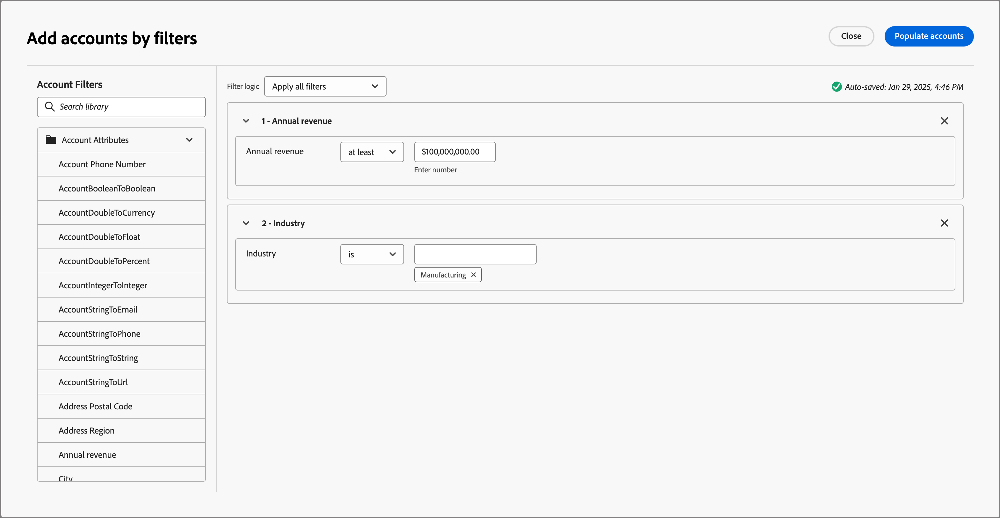

# 帳戶清單

在Journey Optimizer B2B edition中，帳戶清單是行銷人員可用於目標歷程協調的具名帳戶集合。 帳戶清單可依據您定義的條件（例如產業、地點或公司規模）來鎖定已命名的帳戶。 帳戶清單有兩種型別：

* **靜態** — 使用靜態帳戶清單時，清單只有在您新增帳戶時才會變更。 您可以套用篩選器集來根據目前的帳戶資料填入清單，以手動新增帳戶，或是透過帳戶歷程新增和移除帳戶。
* **動態** — 使用動態帳戶清單，您可以定義自動組織清單的篩選器集。 系統會使用此篩選器集，根據帳戶資訊中的變更來新增和移除帳戶。 此清單管理類似於Real-time Customer Data Platform[中的](https://experienceleague.adobe.com/zh-hant/docs/experience-platform/rtcdp/segmentation/b2b){target="_blank"}對象細分。

當帳戶清單處於&#x200B;_即時_ （已發佈）狀態時，它可用於[帳戶歷程和Marketo Engage程式](./account-lists-journeys.md)。

{width="30"}[觀看概觀影片](#overview-video)

>[!NOTE]
>
>帳戶清單會利用Marketo Engage中的帳戶資料來建立帳戶區段和清單。 這表示，如果Adobe Experience Platform的科目節段未主動同步至Marketo Engage，Journey Optimizer B2B edition科目清單中可能無法使用該Experience Platform節段中的科目。 接著，Experience Platform區段中，未同步至Marketo Engage之帳戶的任何人員，都不會納入人員會籍計數或觸發事件中。

## 存取和瀏覽帳戶清單

在左側導覽列中，展開&#x200B;**[!UICONTROL 帳戶]**&#x200B;並按一下&#x200B;**[!UICONTROL 帳戶清單]**。

{width="800" zoomable="yes"}

顯示的&#x200B;_[!UICONTROL 帳戶清單]_&#x200B;頁面包含下列資料行：

* [!UICONTROL 名稱] （按一下帳戶清單名稱以檢視詳細資料）
* [!UICONTROL 狀態]
* [!UICONTROL 類型]
* [!UICONTROL 上次更新時間：]
* [!UICONTROL 上次更新者]
* [!UICONTROL 建立日期]
* [!UICONTROL 建立者]

此表格包含依名稱搜尋的功能。 排序功能目前無法使用。

您可以按一下右上角的&#x200B;_欄設定_ （  ）圖示，並選取或清除核取方塊來自訂顯示的表格。

{width="300"}

若要檢視帳戶清單的說明，請按一下名稱旁的&#x200B;_資訊_ （  ）圖示。

## 建立帳戶清單

建立帳戶清單時，您可以定義一組篩選條件來產生清單。 例如，您可以使用它產生一份帳戶清單，其中產業為Healthcare且收入超過1億美元。

1. 在&#x200B;_[!UICONTROL 帳戶清單]_&#x200B;頁面中，按一下頁面右上角的&#x200B;**[!UICONTROL 建立帳戶清單]**。

   ![按一下[建立帳戶清單]](./assets/account-lists-create.png){width="700" zoomable="yes"}

1. 在&#x200B;_[!UICONTROL 建立帳戶清單]_&#x200B;對話方塊中，輸入唯一的&#x200B;**[!UICONTROL 名稱]** （必要）和&#x200B;**[!UICONTROL 描述]** （選用）。

1. 選擇帳戶清單的&#x200B;_[!UICONTROL 型別]_、**[!UICONTROL 靜態]**&#x200B;或&#x200B;**[!UICONTROL 動態]**。

   ![為帳戶清單選擇[靜態]或[動態]](./assets/account-list-create-dialog.png){width="380"}

1. 按一下&#x200B;**[!UICONTROL 建立]**。

   隨即開啟新的靜態帳戶清單，其中含有空白的帳戶清單。 開啟新的動態帳戶清單，其中顯示頁面中的&#x200B;_[!UICONTROL 依篩選器新增帳戶]_&#x200B;面板。

## 將帳戶新增至帳戶清單

對於靜態清單，您可以繼續發佈空白帳戶清單，並透過帳戶歷程新增帳戶。 您也可以在發佈之前套用篩選器集，以手動新增帳戶。

對於動態帳戶清單，您必須先新增要用來自動管理清單的篩選器集，然後才能發佈。

>[!BEGINTABS]

>[!TAB 靜態帳戶清單]

建立靜態帳戶清單後，您可以套用篩選器集來填入清單。 您也可以套用篩選器集，在靜態帳戶清單發佈後新增帳戶（_即時_）。

>[!NOTE]
>
>如果您希望帳戶清單一開始是空的，請勿選取任何篩選器，而只需發佈帳戶清單即可。 當您計畫透過帳戶歷程動作新增成員時，最好從空白清單開始（請參閱[採取動作節點 — 新增至帳戶](#take-an-action-node---add-to-account)）。

1. 按一下&#x200B;**[!UICONTROL 新增帳戶]**。

   {width="700" zoomable="yes"}

   您可以在空白清單頁面或右上角存取此函式。

1. 在&#x200B;_[!UICONTROL 依篩選器新增帳戶]_&#x200B;對話方塊中，使用&#x200B;**[!UICONTROL 帳戶篩選器]**&#x200B;功能表新增要用來建構篩選器集的屬性和活動：

   這些篩選器會巢狀內嵌至類別資料夾中。 您可以展開每個資料夾，並捲動瀏覽可用篩選器的清單。 或者，使用頂端的&#x200B;_搜尋_&#x200B;工具來尋找您需要的篩選器。

   * 從左側選單將篩選器拖放至篩選器定義空間。
   * 完成比對評估定義。
   * 對要包含的每個篩選器重複這些動作。

     {width="700" zoomable="yes"}

   * 您可以在頂端套用&#x200B;**[!UICONTROL 篩選邏輯]**，以微調條件。 您可以選擇符合所有屬性條件或任何條件。

     {width="450"}

1. 篩選器集和邏輯完成時，按一下&#x200B;**[!UICONTROL 填入帳戶]**。

   根據要評估和填入的帳戶數量（資料庫的大小和您選取的篩選條件），填入程式可能需要一些時間。 將帳戶填入您的清單最多可能需要兩個小時的時間。

您可以繼續發佈清單，使其可用於帳戶歷程中的新增和移除動作。

>[!TAB 動態帳戶清單]

建立動態帳戶清單之後，您定義用來管理清單的篩選器集（新增/移除帳戶），當清單為&#x200B;_即時_ （已發佈）。 您無法透過帳戶歷程新增/移除帳戶，但已發佈的動態帳戶清單可用於起始帳戶對象節點。

1. 按一下&#x200B;**[!UICONTROL 選取篩選器]**。

   {width="700" zoomable="yes"}

1. 在&#x200B;_[!UICONTROL 依篩選器新增帳戶]_&#x200B;對話方塊中，使用&#x200B;**[!UICONTROL 帳戶篩選器]**&#x200B;功能表新增要用來建構篩選器集的屬性和特殊篩選器：

   這些篩選器會巢狀內嵌至類別資料夾中。 您可以展開每個資料夾，並捲動瀏覽可用篩選器的清單。 或者，使用頂端的&#x200B;_搜尋_&#x200B;工具來尋找您需要的篩選器。

   * 從左側選單將篩選器拖放至篩選器定義空間。
   * 完成比對評估定義。
   * 對要包含的每個篩選器重複這些動作。

     {width="700" zoomable="yes"}

   * 您可以在頂端套用&#x200B;**[!UICONTROL 篩選邏輯]**，以微調條件。 您可以選擇符合所有屬性條件或任何條件。

     {width="450"}

1. 篩選器集和邏輯完成時，按一下&#x200B;**[!UICONTROL 完成]**。

   如果您滿意篩選器集，可以繼續進行[發佈清單](#publish-an-account-list)，使其可用於帳戶歷程中的起始[帳戶對象節點](#account-audience-node)。

   >[!NOTE]
   >
   >在發佈動態帳戶清單後，您無法更新該清單的篩選器。

   根據要評估和填入的帳戶數量（資料庫的大小和您選取的篩選條件），填入程式可能需要一些時間。 將帳戶填入您的清單最多可能需要兩個小時的時間。

>[!ENDTABS]

## 發佈帳戶清單

篩選器集完成後，您就可以繼續發佈帳戶清單。

>[!BEGINTABS]

>[!TAB 靜態帳戶清單]

1. 按一下右上方的&#x200B;**[!UICONTROL 發佈]**。

   ![按一下右上角的[發佈]](./assets/account-lists-static-publish.png){width="700" zoomable="yes"}

1. 在&#x200B;_[!UICONTROL 發佈靜態帳戶清單]_&#x200B;對話方塊中，按一下&#x200B;**[!UICONTROL 發佈]**&#x200B;以進行確認。

   {width="400"}

靜態帳戶清單的狀態變更為&#x200B;_[!UICONTROL 即時]_，且可用於[帳戶歷程](#account-list-usage-in-account-journeys)中使用。

>[!TAB 動態帳戶清單]

篩選器集完成後，您就可以繼續發佈動態帳戶清單。 帳戶清單處於即時狀態後，就可在帳戶對象歷程節點中選取。

1. 按一下右上方的&#x200B;**[!UICONTROL 發佈]**。

   ![按一下右上角的[發佈]](./assets/account-lists-dynamic-publish.png){width="700" zoomable="yes"}

1. 在&#x200B;_[!UICONTROL 發佈動態帳戶清單]_&#x200B;對話方塊中，按一下&#x200B;**[!UICONTROL 發佈]**&#x200B;以進行確認。

   {width="400"}

動態帳戶清單的狀態變更為&#x200B;_[!UICONTROL 即時]_，且可用於[帳戶歷程](#account-list-usage-in-account-journeys)中使用。

>[!ENDTABS]

## 概觀影片

>[!VIDEO](https://video.tv.adobe.com/v/3448636/?learn=on)
