# 從 CRM 內存取詳細資料頁面

Adobe Journey Optimizer B2B edition可讓銷售與帳戶團隊成員直接從其客戶關係管理(CRM)工具(例如Salesforce或Microsoft Dynamics)存取帳戶與購買群組資訊的詳細頁面。 透過這項整合，銷售代表可快速存取即時帳戶並購買群組深入分析，例如參與記錄、意圖訊號和AI產生的推薦。 這項能力讓銷售團隊能夠更快地進行外聯、更明智地安排優先順序，並且更好地與行銷保持一致。

若要讓銷售和帳戶團隊成員能夠從CRM檢視Journey Optimizer B2B edition中的[帳戶詳細資料](account-details.md)和[個人詳細資料](person-details.md)頁面，Salesforce或Dynamics管理員可以從帳戶、連絡人或潛在客戶檢視新增連結。

當銷售團隊成員使用來自CRM執行個體的連結時，沙箱應該是&#x200B;_Prod_，並且IMS組織會根據以下順序邏輯來決定：

1. 使用者最近存取的組織
1. 清單中第一個具有字母排序
1. 在其偏好設定中選取的組織

## Salesforce連結

具有&#x200B;_自訂應用程式_&#x200B;許可權的Salesforce管理員可以在帳戶、連絡人或潛在客戶配置中設定連結。 設定的連結可讓銷售使用者存取Adobe Journey Optimizer B2B edition中對應的帳戶詳細資料或人員詳細資料頁面。

在Salesforce中，新增自訂連結作為按鈕、超連結或連結圖示，並根據您團隊的偏好設定自訂。

在Salesforce中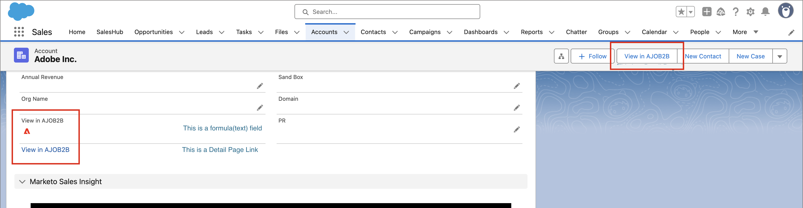{width="800" zoomable="yes"}

如需有關在Salesforce中新增自訂連結的詳細資訊，請參閱Salesforce檔案中的[定義自訂按鈕和連結](https://help.salesforce.com/s/articleView?id=platform.defining_custom_links.htm&type=5)。

當您定義連結的目標URL時，可以使用帳戶、聯絡人或銷售機會版面配置，並將其連結至Journey Optimizer B2B edition中對應的詳細資訊頁面：

* **帳戶** - `https://experience.adobe.com/#/journey-optimizer-b2b/accounts/crm/account/[18-character ID of account]`

* **連絡人** - `https://experience.adobe.com/#/journey-optimizer-b2b/accounts/crm/contact/[18-character ID of contact]`

* **銷售機會** - `https://experience.adobe.com/#/journey-optimizer-b2b/accounts/crm/lead/[18-character ID of lead]`

使用`Account`物件擷取帳戶的18個字元識別碼，例如`CASESAFEID(Account.Id)`或`CASESAFEID(Id)`。

**_範例:_**

+++欄位連結

1. 在Salesforce中，移至&#x200B;**[!UICONTROL 設定]** > **[!UICONTROL 物件管理員]** > **[!UICONTROL 帳戶]**/**[!UICONTROL 連絡人]**/**[!UICONTROL 銷售機會]** > **[!UICONTROL 欄位和關係]**。
1. 按一下&#x200B;**[!UICONTROL 新增]**&#x200B;以建立公式（文字）欄位，並將其新增至&#x200B;_帳戶_、_連絡人_&#x200B;或&#x200B;_銷售機會_&#x200B;配置。

   對於公式，請使用下列範例作為指引。

   **_文字超連結:_**

   * 帳戶 — `HYPERLINK("https://experience.adobe.com/#/journey-optimizer-b2b/accounts/crm/account/" & CASESAFEID(Id), "View in AJO B2B")`
   * 連絡人 — `HYPERLINK("https://experience.adobe.com/#/journey-optimizer-b2b/accounts/crm/contact/" & CASESAFEID(Id), "View in AJO B2B")`
   * 潛在客戶 — `HYPERLINK("https://experience.adobe.com/#/journey-optimizer-b2b/accounts/crm/lead/" & CASESAFEID(Id), "View in AJO B2B")`

   **_圖示超連結:_**

   * 帳戶 — `HYPERLINK("https://experience.adobe.com/#/journey-optimizer-b2b/accounts/crm/account/" & CASESAFEID(Id), IMAGE("https://cdn.experience.adobe.net/assets/HeroIcons.6620f5dc.svg#AdobeExperienceSubCloud", "View in AJO B2B", 24, 24))`
   * 連絡人 — `HYPERLINK("https://experience.adobe.com/#/journey-optimizer-b2b/accounts/crm/contact/" & CASESAFEID(Id), IMAGE("https://cdn.experience.adobe.net/assets/HeroIcons.6620f5dc.svg#AdobeExperienceSubCloud", "View in AJO B2B", 24, 24))`
   * 連絡人 — `HYPERLINK("https://experience.adobe.com/#/journey-optimizer-b2b/accounts/crm/lead/" & CASESAFEID(Id), IMAGE("https://cdn.experience.adobe.net/assets/HeroIcons.6620f5dc.svg#AdobeExperienceSubCloud", "View in AJO B2B", 24, 24))`

   Salesforce中的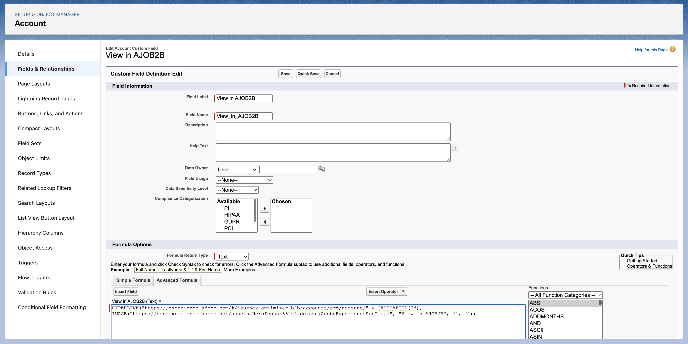{width="800" zoomable="yes"}

1. 重新整理頁面以顯示版面變更。 移至&#x200B;**[!UICONTROL 設定檔]**，並在&#x200B;**[!UICONTROL 顯示密度]**&#x200B;下選取其他選項。

   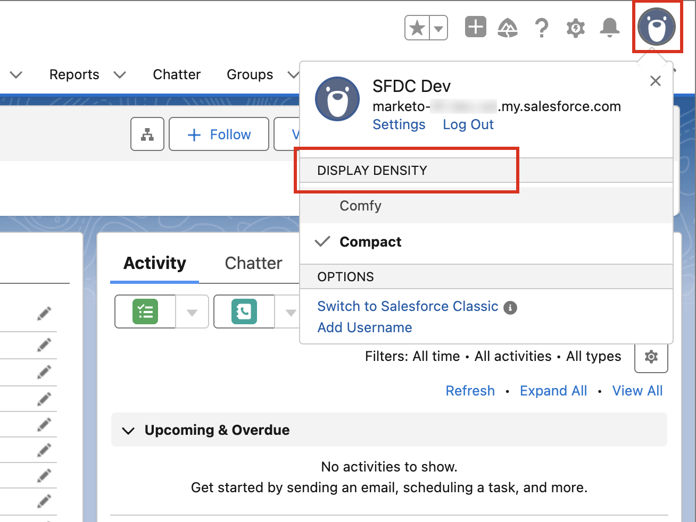{width="450" zoomable="yes"}

+++

+++詳細資訊頁面連結

1. 在Salesforce中，移至&#x200B;**[!UICONTROL 設定]** > **[!UICONTROL 物件管理員]** > **[!UICONTROL 帳戶]**/**[!UICONTROL 連絡人]**/**[!UICONTROL 銷售機會]** > **[!UICONTROL 按鈕、連結和動作]**。
1. 按一下右上角的「**[!UICONTROL 新增」按鈕或「連結]**」，建立詳細頁面連結。

   對於公式，請使用下列範例作為指引。

   * 帳戶 — `{!URLFOR("https://experience.adobe.com/#/journey-optimizer-b2b/accounts/crm/account/" & CASESAFEID(Account.Id), null)}`
   * 連絡人 — `{!URLFOR("https://experience.adobe.com/#/journey-optimizer-b2b/accounts/crm/contact/" & CASESAFEID(Contact.Id), null)}`
   * 潛在客戶 — `{!URLFOR("https://experience.adobe.com/#/journey-optimizer-b2b/accounts/crm/lead/" & CASESAFEID(Lead.Id), null)}`

   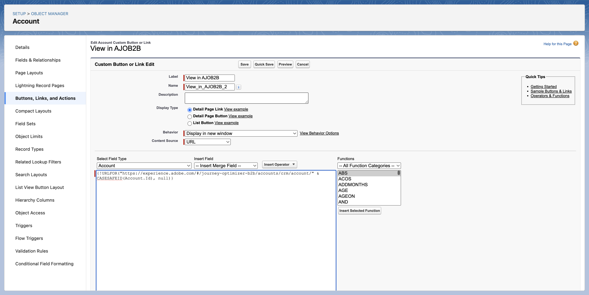{width="800" zoomable="yes"}

1. 前往左側導覽中的&#x200B;**[!UICONTROL 頁面配置]**。

1. 從&#x200B;**[!UICONTROL 自訂連結]**&#x200B;拖曳連結，並將它拖放到版面配置中的&#x200B;_自訂連結_&#x200B;區段。

+++

+++詳細資料頁面按鈕

1. 在Salesforce中，移至&#x200B;**[!UICONTROL 設定]** > **[!UICONTROL 物件管理員]** > **[!UICONTROL 帳戶]**/**[!UICONTROL 連絡人]**/**[!UICONTROL 銷售機會]** > **[!UICONTROL 按鈕、連結和動作]**。
1. 按一下右上角的「**[!UICONTROL 新增」按鈕或「連結]**」，然後建立詳細頁面按鈕。

   對於&#x200B;**[!UICONTROL 顯示型別]**，請選擇&#x200B;**[!UICONTROL 詳細頁面連結]**。

   對於公式，請使用下列範例作為指引。

   * 帳戶 — `{!URLFOR("https://experience.adobe.com/#/journey-optimizer-b2b/accounts/crm/account/" & CASESAFEID(Account.Id), null)}`
   * 連絡人 — `{!URLFOR("https://experience.adobe.com/#/journey-optimizer-b2b/accounts/crm/contact/" & CASESAFEID(Contact.Id), null)}`
   * 潛在客戶 — `{!URLFOR("https://experience.adobe.com/#/journey-optimizer-b2b/accounts/crm/lead/" & CASESAFEID(Lead.Id), null)}`

   Salesforce中的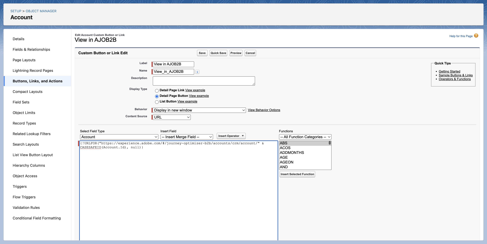{width="800" zoomable="yes"}

1. 前往左側導覽中的&#x200B;**[!UICONTROL 頁面配置]**。

1. 從&#x200B;**[!UICONTROL 行動與閃電動作]**&#x200B;拖曳按鈕，並將其拖放至版面中的&#x200B;**[!UICONTROL Salesforce行動與閃電體驗動作]**&#x200B;區段。

   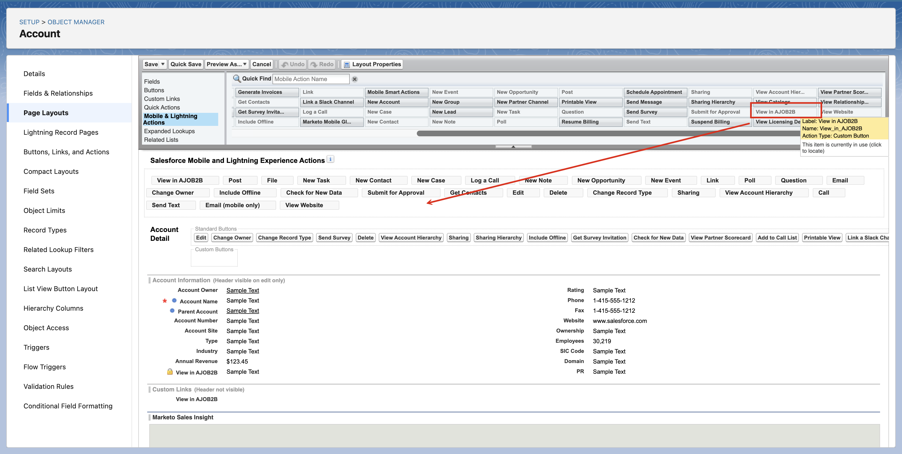{width="800" zoomable="yes"}

+++

## Microsoft Dynamics連結

Dynamics開發人員可以擴充「帳戶」、「連絡人」或「銷售機會」實體，以新增連結欄位。 設定的連結可讓銷售使用者存取Adobe Journey Optimizer B2B edition中對應的帳戶詳細資料或人員詳細資料頁面。

將自訂連結新增為按鈕、超連結或連結圖示連結，並根據您團隊的偏好設定加以自訂。

Dynamics中的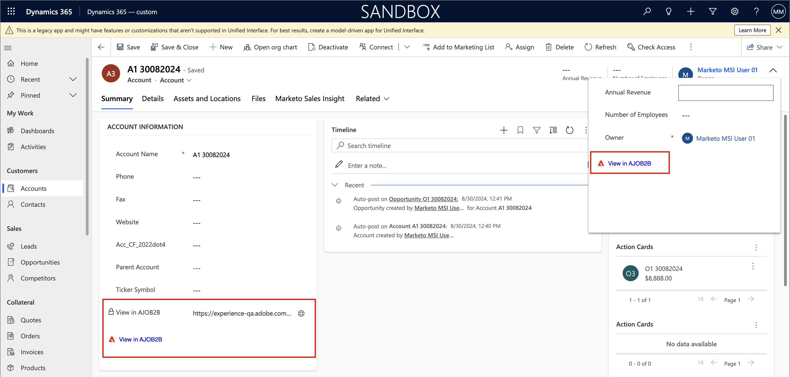{width="800" zoomable="yes"}

使用Power Apps來自訂Microsoft模型驅動的應用程式，例如Dynamics元件。 如需使用Power Apps在Dynamics中新增自訂連結的詳細資訊，請參閱[PowerApps檔案](https://learn.microsoft.com/en-us/power-apps/maker/model-driven-apps/create-edit-web-resources)。

當您定義連結的目標URL時，可以使用帳戶、聯絡人或潛在客戶檢視，並將其連結至Journey Optimizer B2B edition中對應的詳細資訊頁面：

* **帳戶** - `https://experience.adobe.com/#/journey-optimizer-b2b/accounts/crm/account/[Account ID]`

* **連絡人** - `https://experience.adobe.com/#/journey-optimizer-b2b/accounts/crm/contact/[Contact ID]`

* **銷售機會** - `https://experience.adobe.com/#/journey-optimizer-b2b/accounts/crm/lead/[Lead ID]`

**_範例:_**

+++url欄位

依照此工作順序將自訂連結新增為URL欄位：

**1 — 設定方案欄位**

1. 移至&#x200B;**[!UICONTROL 進階設定]** > **[!UICONTROL 自訂系統]**&#x200B;並選取&#x200B;**[!UICONTROL 解決方案]**&#x200B;標籤。
1. 選取&#x200B;**[!UICONTROL 實體]** > **[!UICONTROL 帳戶]**/**[!UICONTROL 連絡人]**/**[!UICONTROL 潛在客戶]** > **[!UICONTROL 欄位]**。
1. 按一下&#x200B;**[!UICONTROL 新增]**&#x200B;並設定新欄位。

   連絡人實體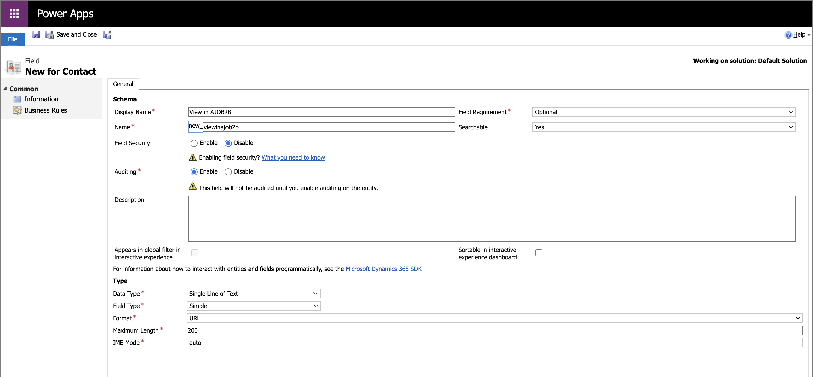{width="800" zoomable="yes"}新欄位

1. 儲存欄位設定。
1. 從&#x200B;_[!UICONTROL 解決方案]_&#x200B;索引標籤，選取&#x200B;**[!UICONTROL 網頁資源]**。
1. 按一下「**[!UICONTROL 新增]**」並設定下列Script (JScript) Web資源：

   ```js
   function setViewInAjoB2b(executionContext) {
    var url = "https://experience.adobe.com/#/journey-optimizer-b2b/accounts/crm";
   
    var formContext = executionContext.getFormContext();
   
    // Get the entity ID (GUID)
    var id = formContext.data.entity.getId();
   
    // Get the entity type (account, lead, contact)
    var type = formContext.data.entity.getEntityName().toLowerCase();
   
    if (id && type) {
        // Remove curly braces
        id = id.replace(/[{}]/g, "").toLowerCase();
   
        // Set the value in the custom field (Ensure this field exists on the form)
        formContext.getAttribute("new_viewinajob2b").setValue(url + "/" + type + "/" + id);
       }
   }
   ```

   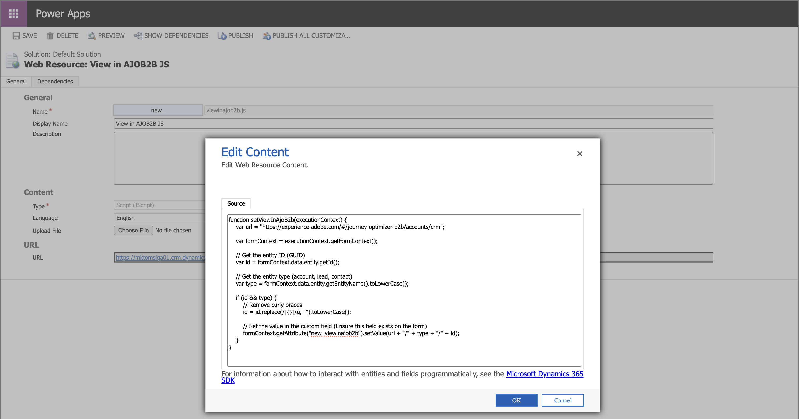{width="800" zoomable="yes"}

1. 在頁面頂端，按一下&#x200B;**[!UICONTROL 儲存]**，然後按&#x200B;**[!UICONTROL 發佈]**。

**2 — 設定表單**

1. 在&#x200B;_解決方案_&#x200B;索引標籤上，選取&#x200B;**[!UICONTROL 實體]** > **[!UICONTROL 帳戶]**/**[!UICONTROL 連絡人]**/**[!UICONTROL 銷售機會]** > **[!UICONTROL Forms]** > **[!UICONTROL 帳戶]**/**[!UICONTROL 連絡人]**/**[!UICONTROL 銷售機會]**。
1. 將您在第一個工作中建立的新欄位從&#x200B;**[!UICONTROL 欄位總管]**&#x200B;拖曳到&#x200B;**[!UICONTROL 摘要]**&#x200B;區段。

   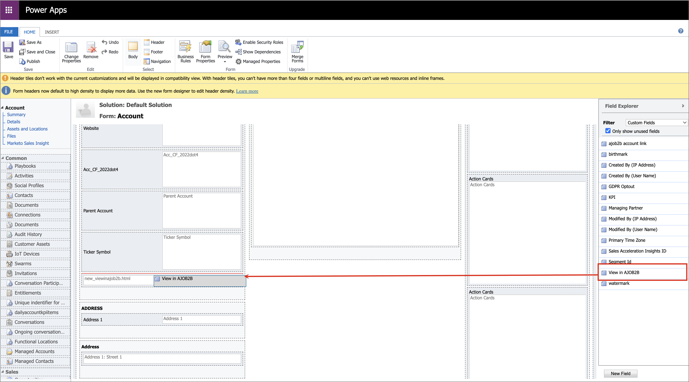{width="800" zoomable="yes"}

1. 連按兩下&#x200B;_摘要_&#x200B;區段中的欄位並設定其屬性。

   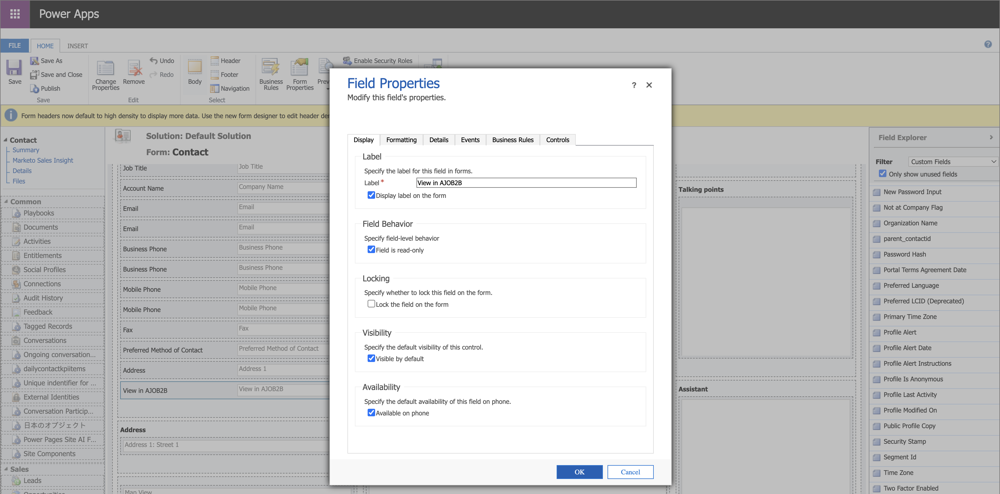{width="800" zoomable="yes"}

   當屬性組態完成時，按一下&#x200B;**[!UICONTROL 確定]**。

1. 在頁面頂端的功能區中，按一下&#x200B;**[!UICONTROL 儲存]**，然後按&#x200B;**[!UICONTROL 發佈]**。

**3 — 將JS Web資源新增至表單庫**

1. 在上方的&#x200B;_[!UICONTROL 首頁]_&#x200B;索引標籤上，按一下&#x200B;**[!UICONTROL 表單屬性]**。
1. 按一下&#x200B;**[!UICONTROL 新增]**。

   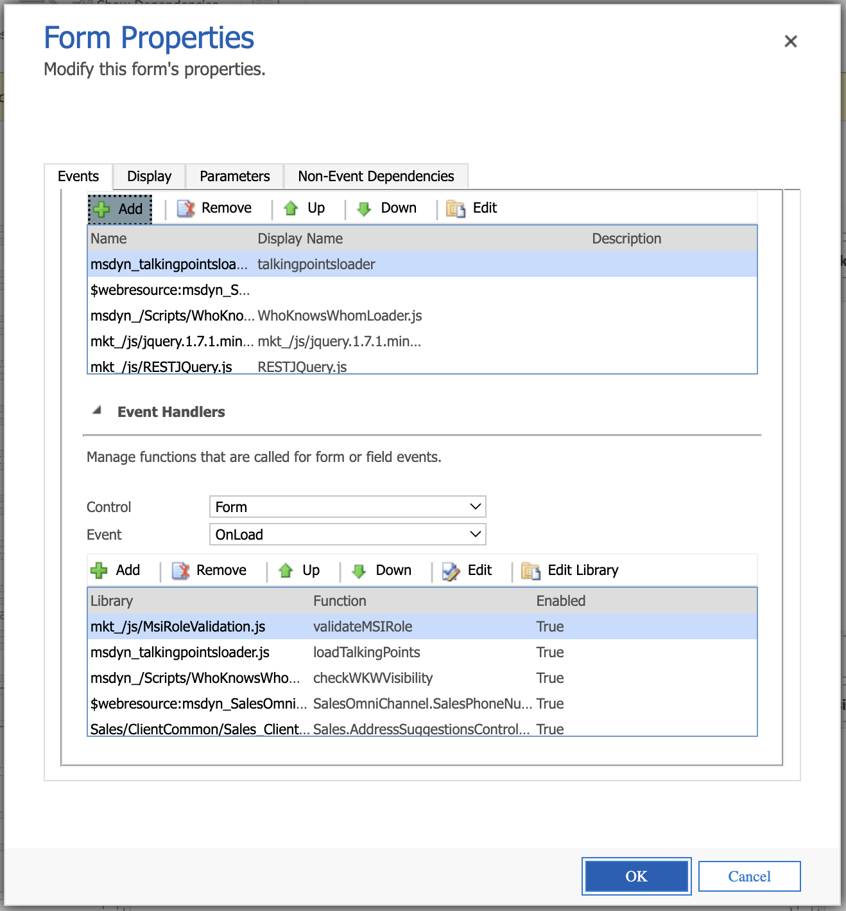{width="500" zoomable="yes"}

1. 找到資源，選取該資源，然後按一下[新增]。****

   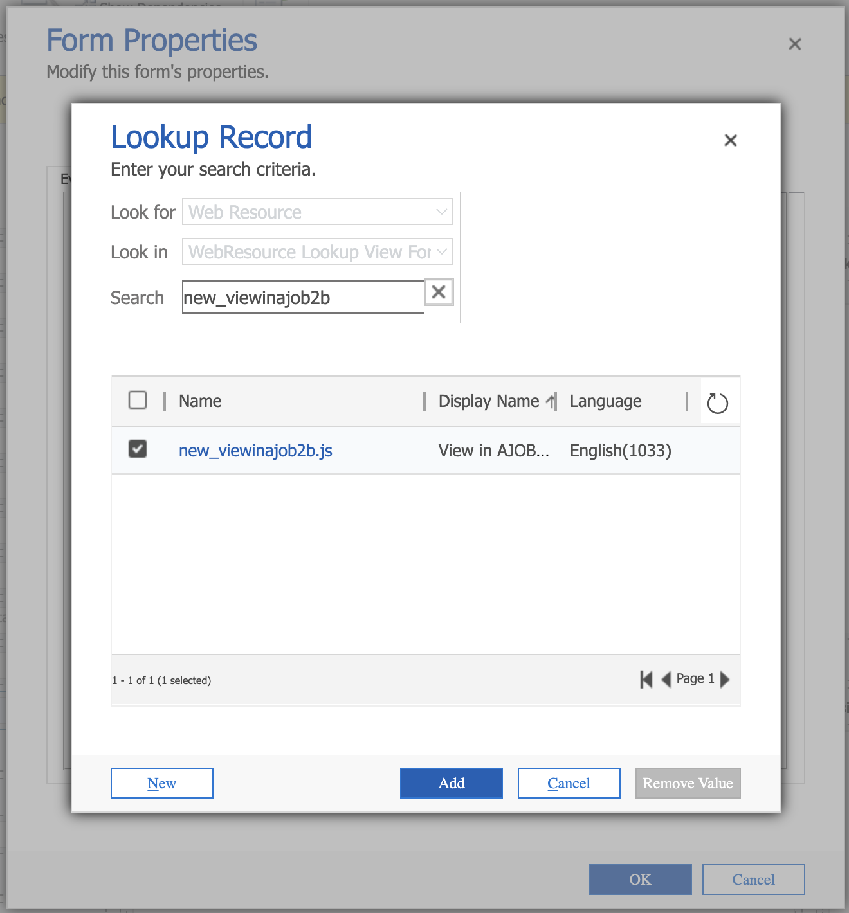{width="500" zoomable="yes"}

1. 選取新增的資源後，按一下&#x200B;**[!UICONTROL 事件處理常式]**&#x200B;下的&#x200B;_[!UICONTROL 新增]_。
1. 將`setViewInAjoB2b`函式新增至&#x200B;**[!UICONTROL 事件處理常式]**。
1. 在&#x200B;_[!UICONTROL 事件處理常式]_&#x200B;清單中選取函式後，將&#x200B;**[!UICONTROL Control]**&#x200B;設定為`Form`並將&#x200B;**[!UICONTROL Event]**&#x200B;設定為`OnLoad`。

   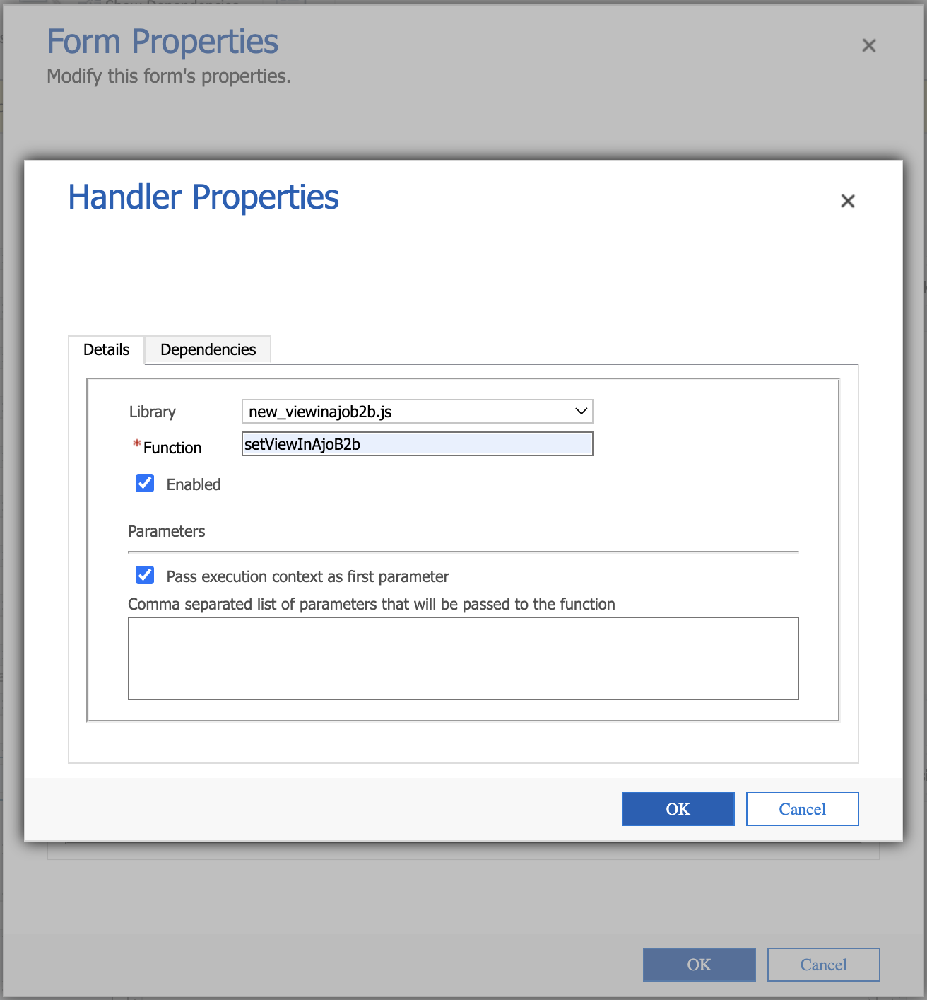{width="500" zoomable="yes"}

1. 按一下&#x200B;**[!UICONTROL 「確定」]**。

1. 在上方的&#x200B;_[!UICONTROL 首頁]_&#x200B;索引標籤上，按一下&#x200B;**[!UICONTROL 儲存]**，然後按一下&#x200B;**[!UICONTROL 發佈]**。

**4 — 驗證連結**

若要驗證連結，請檢查Dynamics中的「帳戶」、「連絡人」或「銷售機會」檢視。

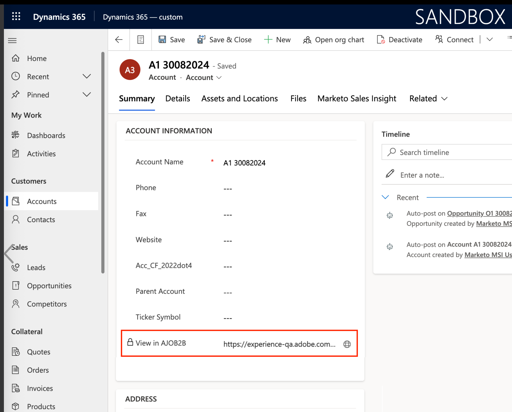{width="500" zoomable="yes"}

如果未顯示連結，請嘗試移至Dynamics首頁上&#x200B;**[!UICONTROL 客戶]**&#x200B;底下的[帳戶]、[連絡人]或[潛在客戶]。 然後返回特定帳戶、聯絡人或潛在客戶檢視。 您也可以嘗試登出並重新登入。

+++

+++HTML網站資源

依照下列工作順序，將自訂連結新增為HTML網頁資源：

>[!NOTE]
>
>此範例取決於Dynamics如何使用網頁網頁資源。

**1 — 設定方案網頁資源**

1. 移至&#x200B;**[!UICONTROL 進階設定]** > **[!UICONTROL 自訂系統]**&#x200B;並選取&#x200B;**[!UICONTROL 解決方案]**&#x200B;標籤。

1. 在&#x200B;_[!UICONTROL 解決方案]_&#x200B;索引標籤上，選取&#x200B;**[!UICONTROL 網頁資源]**。

1. 按一下&#x200B;**[!UICONTROL 新增]**，並使用下列函式設定下列Script (JScript)網頁資源：

   ```js
   function getFormContext(executionContext) {
       window.top["formContext"] = executionContext.getFormContext();
   }
   ```

   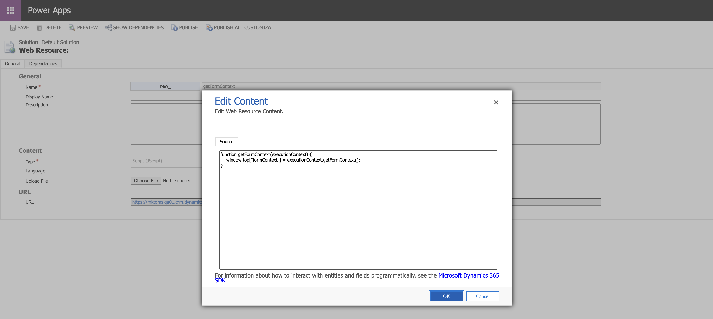{width="800" zoomable="yes"}

1. 按一下&#x200B;**[!UICONTROL 新增]**&#x200B;以建立其他網頁資源，並使用下列HTML設定網頁(HTML)網頁資源：

   ```html
   <html>
   <head>
       <script>
       function onLoad(){
           // Adobe URL
           var url = "https://experience.adobe.com/#/journey-optimizer-b2b/accounts/crm";
   
           // Get the entity ID (GUID)
           var id = window.top.formContext.data.entity.getId();
   
           // Get the entity type (account, lead, contact)
           var type = window.top.formContext.data.entity.getEntityName().toLowerCase();
   
           if (id && type) {
               // Remove curly braces
               id = id.replace(/[{}]/g, "").toLowerCase();
               var url = url + "/" + type + "/" + id;
   
               // Find the hyperlink and set the href value
               var link = document.getElementById("link");
               link.href = url;
           }
       }
       </script>
   </head>
   <body onload="onLoad()" style="margin-left: 0;">
       <a id="link" style="text-decoration: none; font-family: sans-serif; font-size: 13px;" target="_blank">
           
           <span style="vertical-align: middle;">View in AJOB2B</span>
       </a>
   </body>
   </html>
   ```

1. 在頁面頂端，按一下&#x200B;**[!UICONTROL 儲存]**，然後按&#x200B;**[!UICONTROL 發佈]**。

**2 — 將JS網頁資源新增至表單庫**

1. 在&#x200B;_解決方案_&#x200B;索引標籤上，選取&#x200B;**[!UICONTROL 實體]** > **[!UICONTROL 帳戶]**/**[!UICONTROL 連絡人]**/**[!UICONTROL 銷售機會]** > **[!UICONTROL Forms]** > **[!UICONTROL 帳戶]**/**[!UICONTROL 連絡人]**/**[!UICONTROL 銷售機會]**。

1. 在上方的&#x200B;_首頁_&#x200B;索引標籤上，按一下&#x200B;**[!UICONTROL 表單屬性]**。

1. 按一下&#x200B;**[!UICONTROL 新增]**。

1. 找到您建立的JScript Web資源(`new_getFormContext`)，選取它，然後按一下[新增]。****

   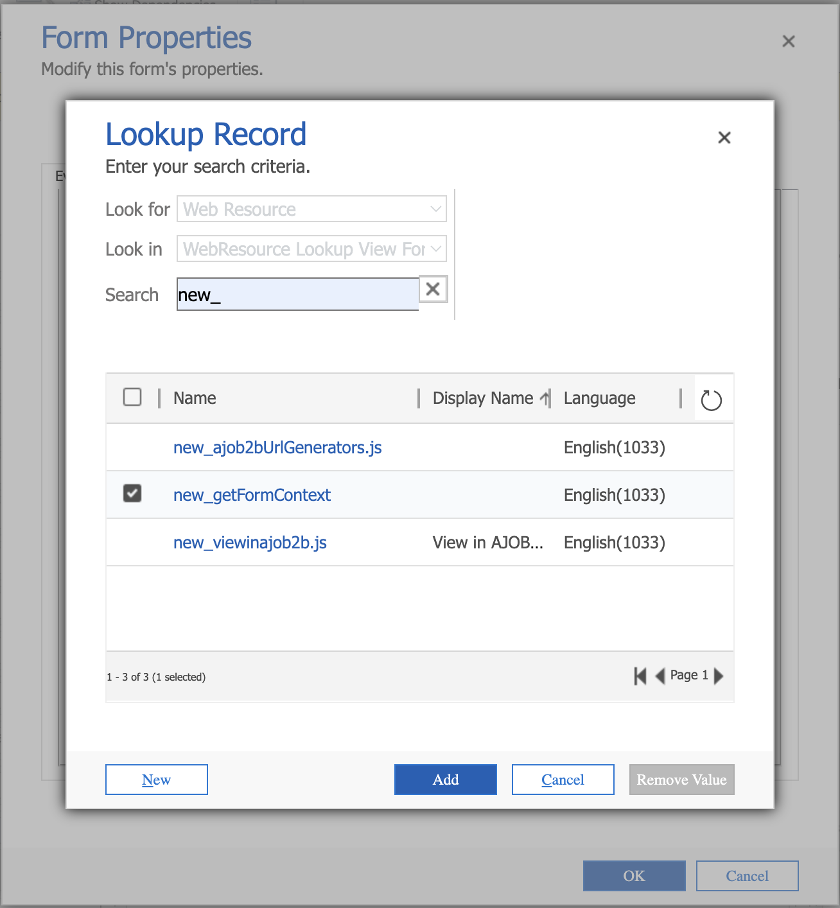{width="500" zoomable="yes"}

1. 選取新增的資源後，按一下&#x200B;**[!UICONTROL 事件處理常式]**&#x200B;下的&#x200B;_[!UICONTROL 新增]_。
1. 將`getFormContext`函式新增至&#x200B;**[!UICONTROL 事件處理常式]**。
1. 在&#x200B;_[!UICONTROL 事件處理常式]_&#x200B;清單中選取函式後，將&#x200B;**[!UICONTROL Control]**&#x200B;設定為`Form`並將&#x200B;**[!UICONTROL Event]**&#x200B;設定為`OnLoad`。

   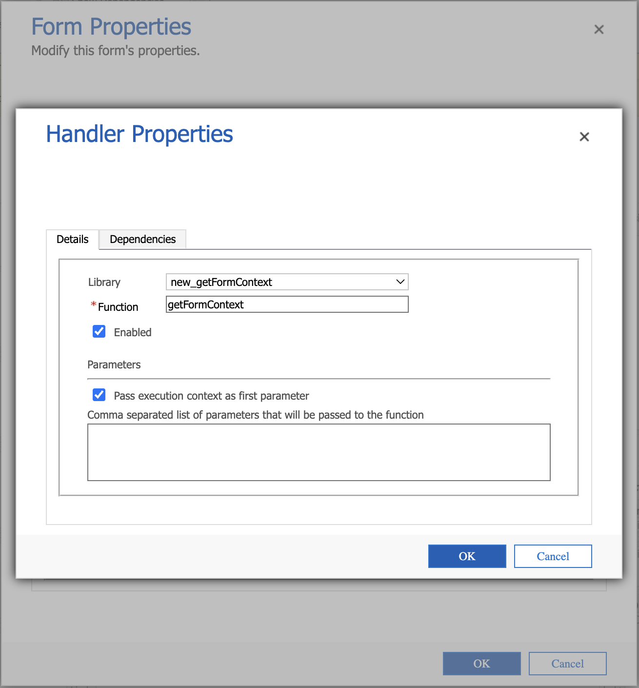{width="500" zoomable="yes"}

1. 按一下&#x200B;**[!UICONTROL 「確定」]**。

1. 在上方的&#x200B;_[!UICONTROL 首頁]_&#x200B;索引標籤上，按一下&#x200B;**[!UICONTROL 儲存]**，然後按一下&#x200B;**[!UICONTROL 發佈]**。

**3 — 設定表單**

1. 在帳戶、連絡人或潛在客戶表單的&#x200B;**[!UICONTROL 首頁]**&#x200B;索引標籤上，選取&#x200B;**[!UICONTROL 內文]** （在&#x200B;_摘要_&#x200B;區段中建立連結的資源）或&#x200B;**[!UICONTROL 標題]** （在標題功能表中建立）。

   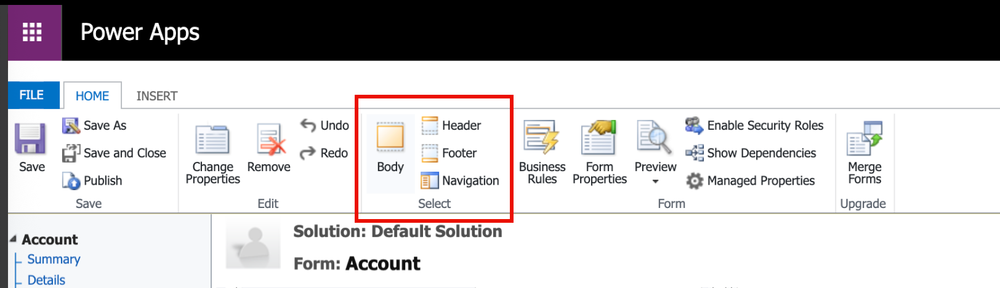{width="500" zoomable="yes"}

1. 選取頂端的&#x200B;**[!UICONTROL 插入]**&#x200B;索引標籤，然後按一下&#x200B;**[!UICONTROL 網頁資源]**。

1. 插入您建立的Web資源並設定屬性。

   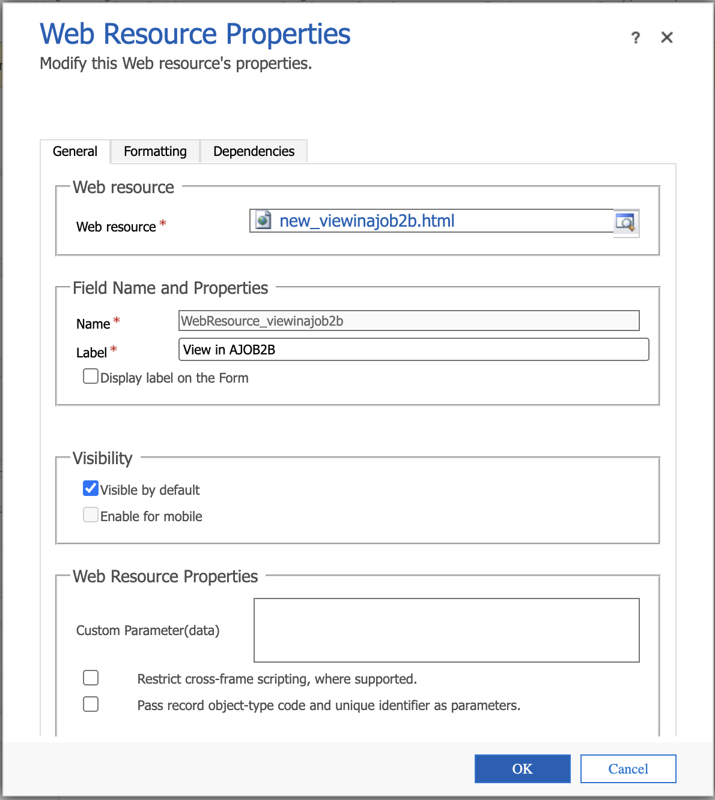{width="500" zoomable="yes"}

   如需有關Web資源屬性和格式的詳細資訊，請參閱[Power Apps檔案](https://learn.microsoft.com/en-us/power-apps/maker/model-driven-apps/web-resource-properties-legacy)。

1. 按一下&#x200B;**[!UICONTROL 「確定」]**。

   如果您為Web資源選擇「內文/摘要」位置，則會顯示在表單版面配置中。

   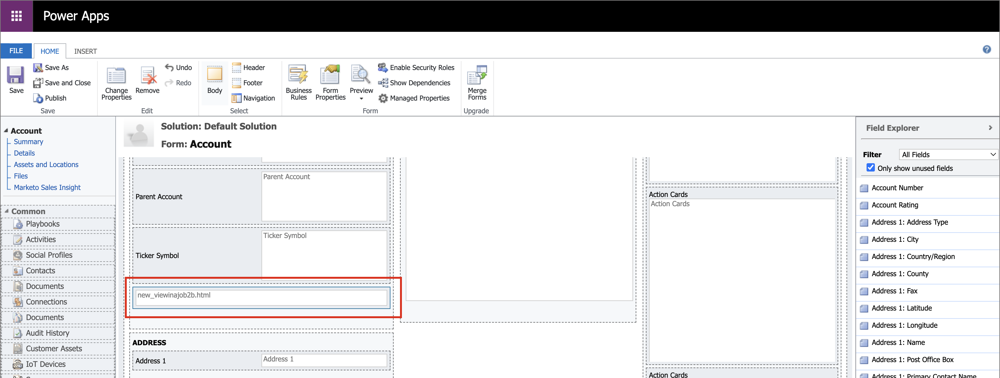{width="800" zoomable="yes"}的摘要區段

1. 在上方的&#x200B;_[!UICONTROL 首頁]_&#x200B;索引標籤上，按一下&#x200B;**[!UICONTROL 儲存]**，然後按一下&#x200B;**[!UICONTROL 發佈]**。

**4 — 驗證連結**

若要驗證連結，請檢查Dynamics中的「帳戶」、「連絡人」或「銷售機會」檢視。

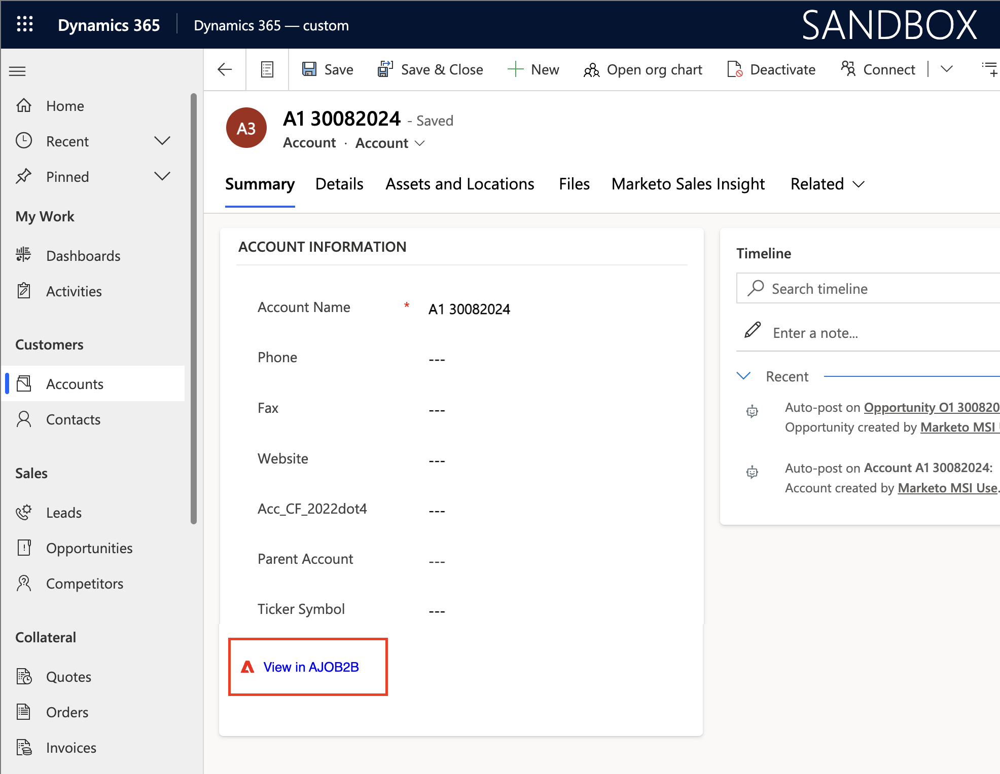{width="500" zoomable="yes"}

如果未顯示連結，請嘗試移至Dynamics首頁上&#x200B;**[!UICONTROL 客戶]**&#x200B;底下的[帳戶]、[連絡人]或[潛在客戶]。 然後返回特定帳戶、聯絡人或潛在客戶檢視。 您也可以嘗試登出並重新登入。

+++
