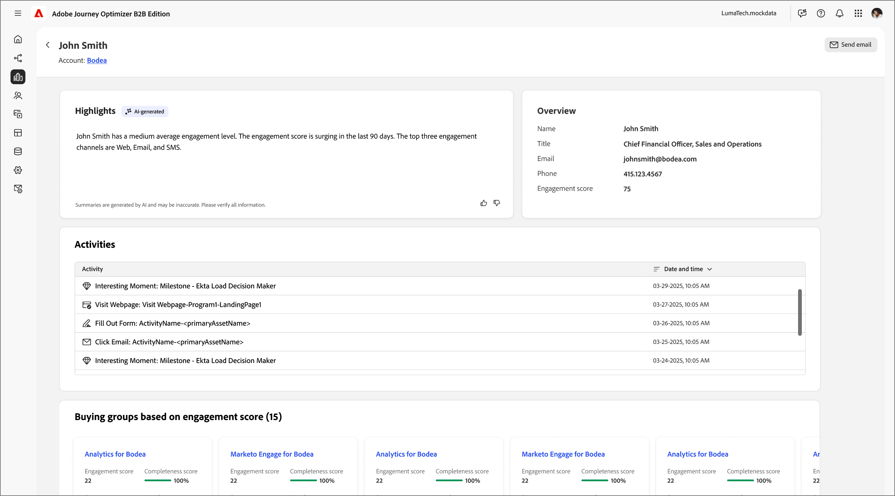
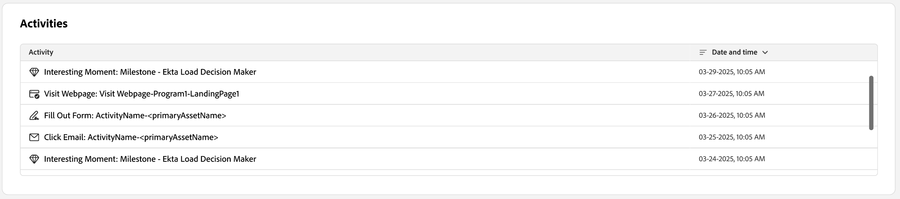
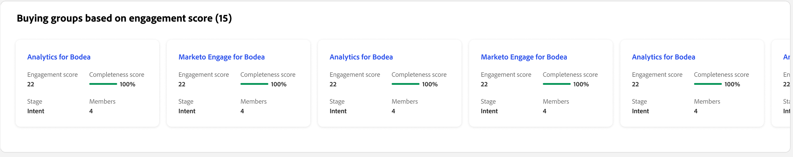

# 個人詳細資料

當您在Journey Optimizer B2B edition中的任何地方按一下人員名稱時，都會顯示人員詳細資訊頁面。 此頁面包含與帳戶或購買群組相關之個人的實用資訊，包括醒目提示和意圖資料的產生AI摘要（如果已設定）。<!-- There are also [actions](#person-actions) that you can execute for the person. -->

{width="800" zoomable="yes"}

您可以按一下[智慧型儀表板](../dashboards/intelligent-dashboard.md)、[購買群組詳細資料頁面](../buying-groups/buying-group-details.md)或[帳戶詳細資料頁面](./account-details.md)中顯示的名稱來存取此頁面。

「人員詳細資料」頁面包含下列四個區段：

## 個人總覽

{zoomable="yes"}

頁面頂端的人員總覽區段包含下列資訊：

* 名稱
* 標題
* 電子郵件
* 電話號碼
* 參與分數
* 摘要

## 活動

本節提供與此人相關的最新電子郵件、網頁、表單填寫和興趣時刻（最多20個）的清單。 專案會以活動型別的形式列出，並附上日期和時間。

{width="700" zoomable="yes"}

## 根據參與分數購買群組

本節包括購買群組（此人為會員），且會根據參與分數排序。 每張卡片都包含下列購買群組資訊：

* 名稱 — 按一下名稱以開啟[購買群組詳細資料](../buying-groups/buying-group-details.md)。
* 參與分數
* 完整性分數
* 階段
* 成員

{width="700" zoomable="yes"}

## 意圖資料

在Journey Optimizer B2B edition中，意圖偵測模型會根據使用者的活動，以足夠高的信賴度預測感興趣的解決方案/產品。 它也會運用其他帳戶共同成員的活動，以及標籤的內容。 個人的意圖可解譯為對產品感興趣的可能性。

{{intent-data-note}}

{width="700" zoomable="yes"}

* 意圖層級
* 意圖訊號型別 — 關鍵字、產品和解決方案

<!-- ## Person actions -->
