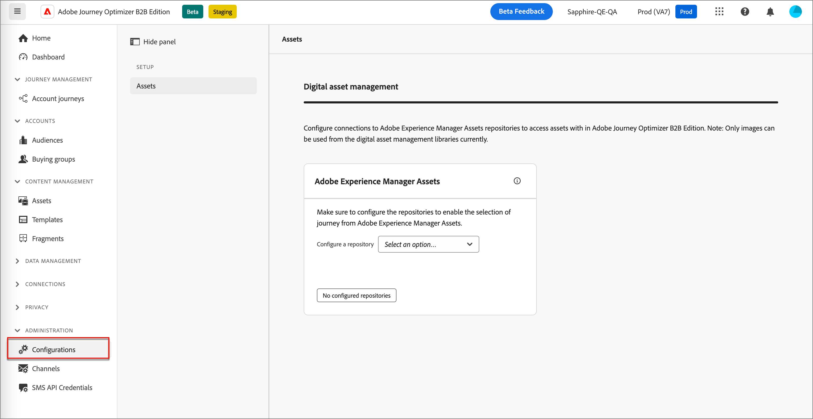
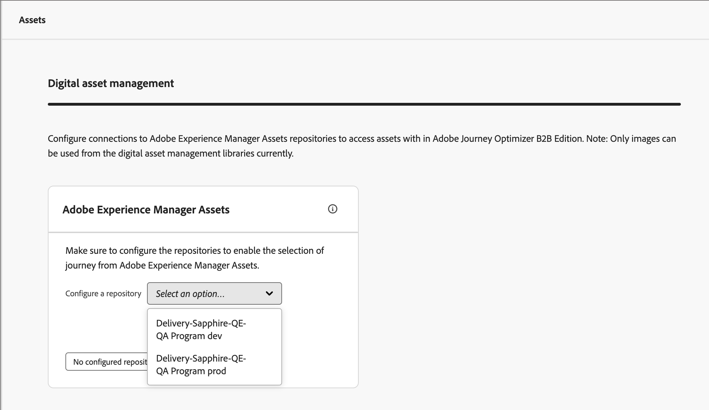
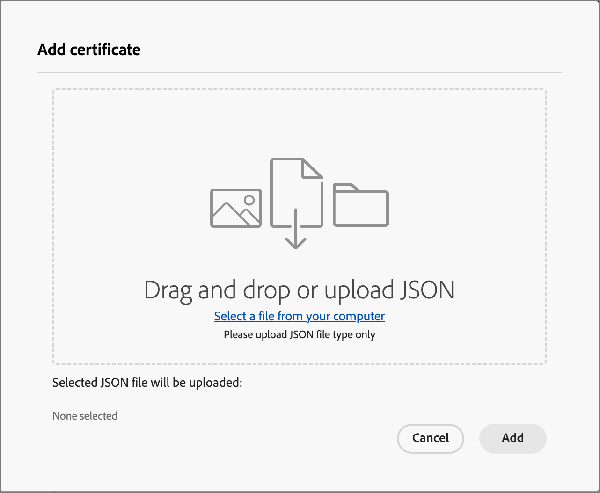
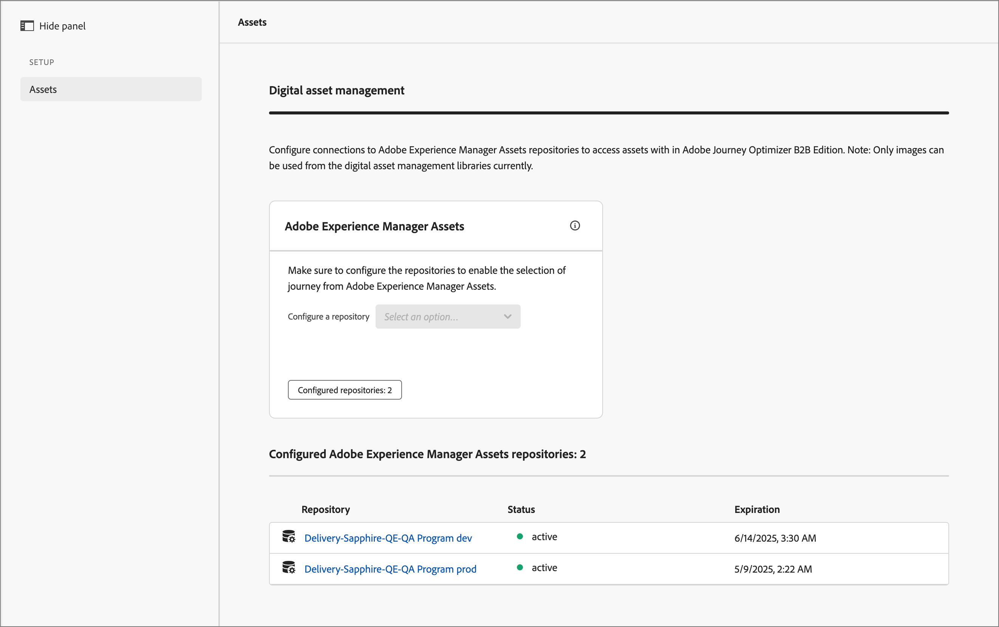
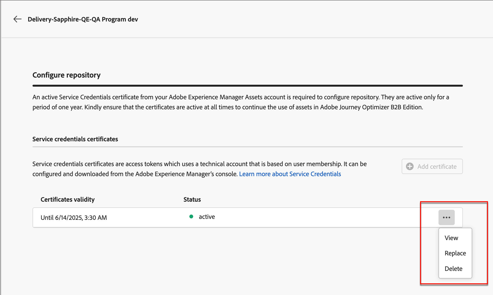
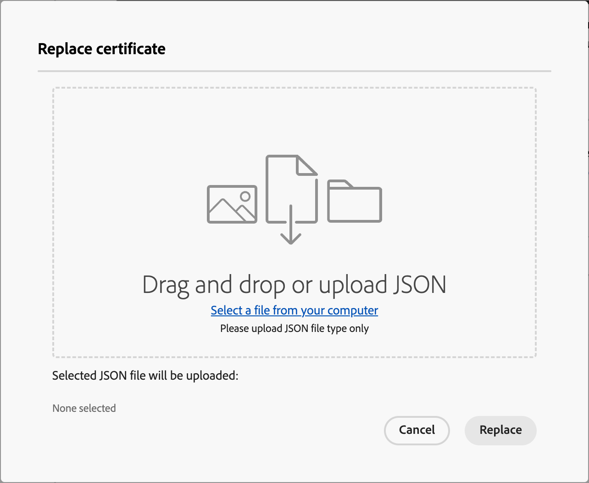
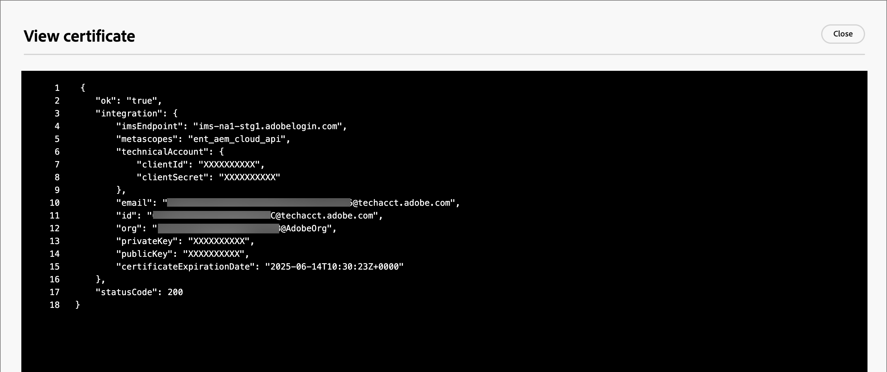

# 設定Experience Manager資產存放庫

Adobe Journey Optimizer B2B edition與Adobe Experience Manager Assetsas a Cloud Service整合，不僅允許在帳戶歷程中使用電子郵件等資產。 它透過與Experience Manager Assets交換資訊來確保透明度。 設定與AdobeExperience Assets的連線以啟用此功能。

Adobe Experience Manager Cloud Manager已組織成多個方案，每個方案都有多個環境和存放庫（[瞭解更多](https://experienceleague.adobe.com/en/docs/experience-manager-cloud-service/content/implementing/using-cloud-manager/programs/program-types)）。 在Adobe Journey Optimizer B2B edition中設定Adobe Experience Manager Assets時，您需設定與每個要用於存取數位資產的存放庫的連線。

{{aem-assets-licensing-note}}

## 先決條件

* 在AEM Headless Developer Console上針對所需的環境產生服務認證（[深入瞭解](https://experienceleague.adobe.com/en/docs/experience-manager-learn/getting-started-with-aem-headless/authentication/service-credentials#generate-service-credentials)）。
* 取得連線所需的憑證。 最佳做法是確保憑證在到期前至少還有六個月。 憑證每365天過期一次。
* Adobe Journey Optimizer B2B edition支援一次存取一個數位資產管理來源。 切換之前，請確定Adobe Experience Manager中提供了所需的資產。

>[!IMPORTANT]
>
>服務認證是真實的且包含私密金鑰。 這些憑證必須根據貴組織的IT和安全性原則進行儲存、管理和存取。

## 新增存放庫連線

1. 在左側導覽中，選擇&#x200B;**[!UICONTROL 管理]** > **[!UICONTROL 組態]**。

1. 按一下中間面板上的&#x200B;**[!UICONTROL Assets]**。

   {width="700" zoomable="yes"}

<!--   The default digital asset management option is configured as `Adobe Marketo Engage`.
-->
從這裡，您可以逐一設定與每個AEM環境存放庫的連線。

1. 在&#x200B;_[!UICONTROL Adobe Experience Manager Assets]_&#x200B;方塊中，按一下&#x200B;**[!UICONTROL 設定存放庫]**&#x200B;旁的箭頭，然後選擇存放庫。

   {width="500"}

1. 按一下&#x200B;**[!UICONTROL 新增憑證]**，並使用對話方塊工具上傳檔案。

   您可以上傳.json檔案，方法是將其拖曳至對話方塊或按一下連結，以尋找並從系統中選取檔案（請確定檔案是有效的JSON型別）。

   {width="500"}

   上傳後，憑證會顯示在底部。

   >[!NOTE]
   >
   >如果使用無效的檔案，對話方塊會在底部顯示錯誤。

   按一下&#x200B;**[!UICONTROL [新增]**]以完成憑證。

1. 按一下「上一步(←)」箭頭，返回主設定頁面。

   已設定的存放庫會顯示在選取範圍面板下方的表格中。 您可以重複步驟3-4來新增另一個存放庫。

   {width="600" zoomable="yes"}

當您完成存放庫設定時，專案團隊成員可以在編寫內容時選取Adobe Experience Manager Assets。

>[!NOTE]
>
>Adobe Journey Optimizer B2B edition支援在製作內容時一次存取一個數位資產管理來源。 

## 取代憑證

憑證從建立日期起每365天過期。 在到期之前將其取代，以確保您的團隊可以繼續存取資產。

>[!NOTE]
>
>Adobe Journey Optimizer B2B edition會與Experience Manager資產通訊，以取得使用資訊。 連線必須保持作用中狀態，才能可靠同步使用資料並避免資料差異。 管理員使用者會透過應用程式內通知收到有關憑證過期的通知。 他們也可以在「管理」區域的「Assets數位資產管理」子區段上記錄到期日。

1. 在數位資產管理頁面上，找出已設定的存放庫清單。

1. 按一下所需的存放庫以取代憑證。

1. 按一下憑證檔案的省略符號(**...**)圖示，以顯示其動作選項。

   {width="600" zoomable="yes"}

1. 選擇&#x200B;**[!UICONTROL 取代]**&#x200B;以開啟檔案上傳對話方塊。

1. 將檔案拖曳至對話方塊或使用連結即可上傳檔案。 確認檔案為json型別。

   {width="500"}

1. 按一下&#x200B;**[!UICONTROL 取代]**&#x200B;以確認上傳。

## 檢視憑證

您可以檢視與存放庫連線相關聯的憑證JSON檔案。

1. 在數位資產管理頁面上，找出已設定的存放庫清單。

1. 按一下已連線的存放庫。

1. 按一下憑證檔案的省略符號(**...**)圖示，以顯示其動作選項。

1. 選擇&#x200B;**[!UICONTROL 檢視]**。

   {width="600"}

1. 按一下&#x200B;**[!UICONTROL 關閉]**&#x200B;以返回「設定存放庫」頁面。

## 刪除存放庫連線

刪除存放庫會移除使用者對Journey Optimizer B2B edition中Experience Manager Assets環境的存取權。

1. 在&#x200B;_[!UICONTROL 數位資產管理]_&#x200B;頁面上，找出已設定的資產存放庫清單。

1. 按一下所需的存放庫名稱以編輯連線。

1. 按一下憑證檔案的省略符號(**...**)圖示，以顯示其動作選項。

1. 選擇&#x200B;**[!UICONTROL 刪除]**。

1. 在確認對話方塊中，按一下&#x200B;**[!UICONTROL 刪除]**。
<!--

## Switch back to Adobe Marketo Engage Assets

Select Adobe Marketo Engage digital asset management in the Assets section.

After the confirmation, the Adobe Marketo Engage assets library is available for users.
-->
