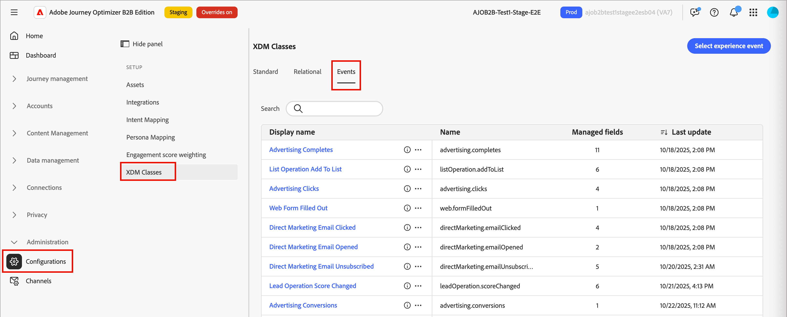
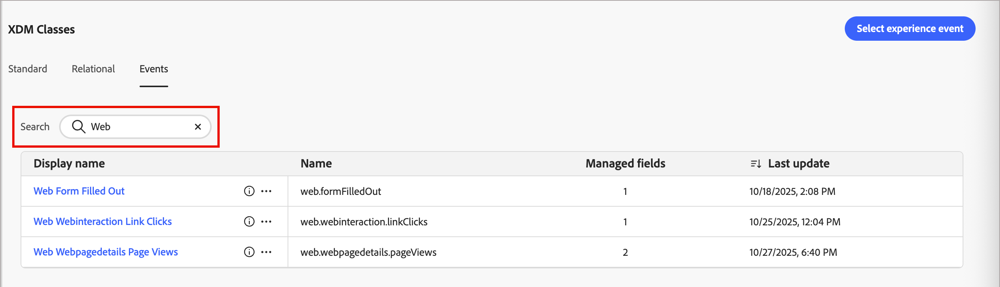
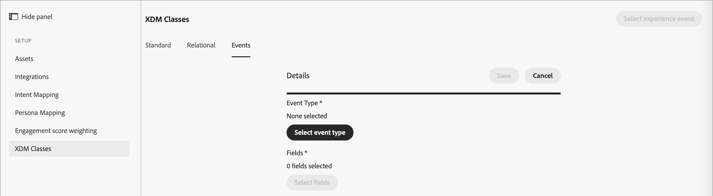
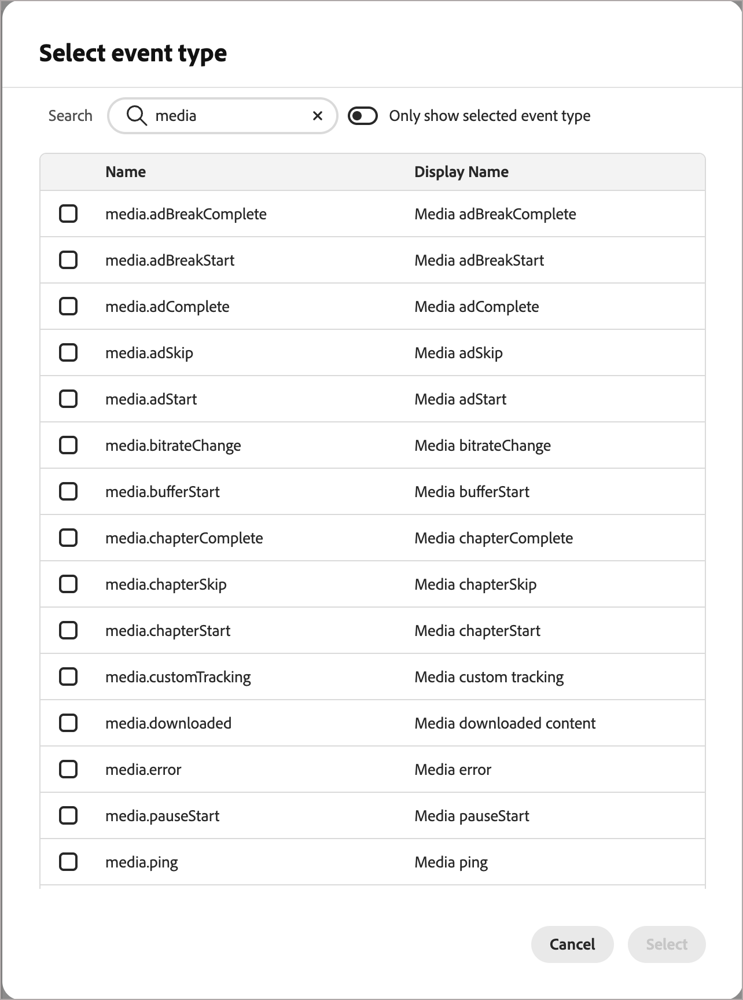
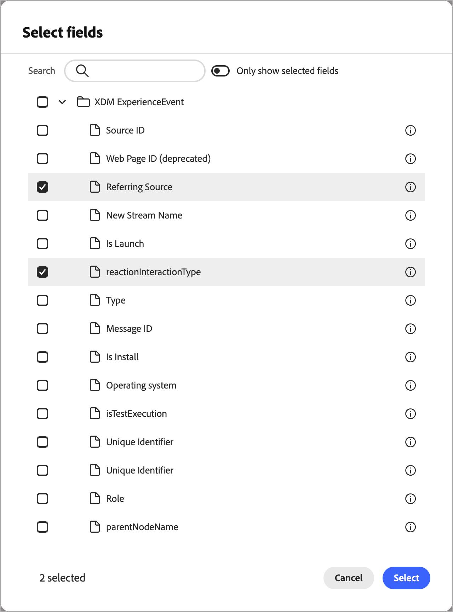

# 選取體驗事件和欄位

管理員可以在體驗事件聯合結構描述中選取特定的[AEP Experience Event](https://experienceleague.adobe.com/zh-hant/docs/experience-platform/xdm/classes/experienceevent){target="_blank"}及其相關欄位。 選取後，使用者可以設定決策規則來監聽這些Experience事件，以根據近乎即時的事件資料啟用動態且鎖定的行銷活動動作。

<!-- {width="30"} [Watch the video overview](#overview-video) -->
在歷程中使用AEP體驗事件有兩個步驟：

1. 管理員[在AEP B2B edition設定中新增Journey Optimizer體驗事件和欄位](#add-an-event)。

2. 在歷程中，行銷人員新增&#x200B;_接聽事件_&#x200B;節點，並[選取體驗事件](../journeys/listen-for-event-nodes.md#listen-for-an-experience-event)。

   * 選取要在節點中使用的事件。
   * 選取要做為限制的欄位。

>[!BEGINSHADEBOX]

## 指引和限制

當您選取符合組織目標的事件時，請記住下列事項：

* 您最多可以選取50個事件，每個事件最多可選取100個欄位。

* 歷程可以聆聽使用Experience Platform串流功能(例如Web SDK或HTTP API)擷取的體驗事件。

* 您可以在歷程中使用體驗事件進行決策，但不會保留這些事件。 因此，您無法在Journey Optimizer B2B edition中運用體驗事件的歷史記錄。

* 當您使用體驗事件並發佈歷程時，可以新增更多欄位，但無法移除先前選取的欄位。

* 您可以在多個歷程中參考體驗事件，或在相同歷程中多次使用體驗事件。

>[!ENDSHADEBOX]

## 管理體驗事件

1. 在左側導覽列中，選擇&#x200B;**[!UICONTROL 管理]** > **[!UICONTROL 組態]**。

1. 按一下中繼面板上的&#x200B;**[!UICONTROL XDM類別]**，然後按一下&#x200B;**[!UICONTROL 事件]**&#x200B;索引標籤以顯示可用事件的清單。

   {width="800" zoomable="yes"}

   表格是依&#x200B;_[!UICONTROL 上次更新]_&#x200B;欄排序，最近更新的事件預設會排在頂端。

   從此頁面，您可以[選取](#add-an-event)和[編輯](#edit-an-event)事件，以用於歷程。

   若要存取所選事件的詳細資訊，請按一下事件名稱。

### 篩選事件清單

在&#x200B;_[!UICONTROL 搜尋]_&#x200B;欄位中輸入文字，以篩選顯示的事件以符合事件名稱。

{width="600" zoomable="yes"}

### 新增事件

若要讓體驗事件可供歷程中的&#x200B;_接聽事件_&#x200B;節點使用，請選取事件和支援的欄位。

>[!NOTE]
>
>在測試版中，您無法從清單中移除事件。 請確定您新增的每個事件都是貴組織打算使用的事件。

1. 按一下右上角的&#x200B;**[!UICONTROL 選取體驗事件]**。

   此時會顯示事件詳細資訊頁面。 您可以在此頁面選擇事件型別和欄位。

   新事件的{width="700" zoomable="yes"}

1. 選擇事件型別。

   * 按一下&#x200B;**[!UICONTROL 選取事件型別]**。

   * 在對話方塊中，選擇事件型別。

     使用&#x200B;_[!UICONTROL 搜尋]_&#x200B;欄位，依名稱篩選顯示的清單。 使用&#x200B;**[!UICONTROL 僅顯示選取的欄位]**&#x200B;滑桿來檢閱目前的選取專案。

     {width="450" zoomable="yes"}

   * 按一下&#x200B;**[!UICONTROL 選取]**。

1. 為事件型別選擇一或多個欄位。

   * 按一下&#x200B;**[!UICONTROL 選取欄位]**。

   * 在對話方塊中，選取要用來作為相符事件限制條件的欄位。

     使用&#x200B;_[!UICONTROL 搜尋]_&#x200B;欄位，依名稱篩選顯示的清單。 使用&#x200B;**[!UICONTROL 僅顯示選取的欄位]**&#x200B;滑桿來檢閱目前的選取專案。

     {width="450" zoomable="yes"}

   * 按一下&#x200B;**[!UICONTROL 選取]**。

1. 在事件詳細資訊頁面中，按一下&#x200B;**[!UICONTROL 儲存]**。

已儲存的事件會顯示在&#x200B;_[!UICONTROL 事件]_&#x200B;索引標籤的清單中。

### 編輯事件

編輯事件詳細資料以變更欄位。

1. 按一下事件名稱，或按一下&#x200B;_更多功能表_ ( **...** )圖示並選擇&#x200B;**[!UICONTROL 編輯]**。

   ![按一下[更多]功能表圖示](./assets/configurations-xdm-classes-events-more-menu.png){width="500" zoomable="yes"}

1. 按一下「**[!UICONTROL 編輯欄位]**」，在「_[!UICONTROL 選取欄位]_」對話方塊中新增更多欄位或移除現有的選取專案。

1. 按一下&#x200B;**[!UICONTROL 選取]**&#x200B;以儲存您的選擇。

### 移除事件

>[!NOTE]
>
>對於此功能的Beta版本，您無法從選取的事件清單中移除事件。 已計畫於GA發行版本中移除事件。

## 事件和欄位

針對[!DNL Journey Optimizer B2B Edition]，某些人員層級活動會擷取為[!DNL Experience Platform]個體驗事件。 這些事件儲存在使用XDM體驗事件結構描述並包含歷程特定欄位群組的系統資料集中。 您可以在[!UICONTROL Journey Optimizer B2B edition]中使用這些事件，就像任何其他體驗事件一樣。

每個事件會顯示定義的一組欄位，可用於歷程&#x200B;_接聽事件_&#x200B;節點（根據事件進行決策）。 檢閱可用的事件型別及其欄位，以決定要在這些歷程節點中使用的事件和欄位：

### 電子郵件已傳送

此事件會追蹤何時將行銷電子郵件傳送給個人。

事件型別： `directMarketing.emailSent`

+++欄位

| 顯示名稱 | 路徑 |
| ------------ | ---- |
| 識別碼 | `_id` |
| 事件類型 | `eventType` |
| 時間戳記 | `timestamp` |
| 人員 ID | `personID` |
| 個人來源識別碼 | `personKey.sourceID` |
| 個人來源型別 | `personKey.sourceType` |
| 個人來源例項ID | `personKey.sourceInstanceID` |
| 個人來源金鑰 | `personKey.sourceKey` |
| 電子郵件來源ID | `directMarketing.emailSent.mailingKey.sourceID` |
| 電子郵件來源型別 | `directMarketing.emailSent.mailingKey.sourceType` |
| 電子郵件來源執行個體ID | `directMarketing.emailSent.mailingKey.sourceInstanceID ` |
| 電子郵件來源金鑰 | `directMailing.emailSent.mailingKey.sourceKey` |
| 郵寄名稱 | `directMarketing.emailSent.mailingName` |
| 歷程ID | `_experience.journeyOrchestration.stepEvents.journeyID` |
| 節點ID | `_experience.journeyOrchestration.stepEvents.nodeID` |

+++

### 電子郵件已傳遞

此事件會追蹤電子郵件何時成功傳遞至個人的電子郵件服務。

事件型別： `directMarketing.emailDelivered `

+++欄位

| 顯示名稱 | 路徑 |
| ------------ | ---- |
| 識別碼 | `_id` |
| 事件類型 | `eventType` |
| 時間戳記 | `timestamp` |
| 人員 ID | `personID` |
| 個人來源識別碼 | `personKey.sourceID` |
| 個人來源型別 | `personKey.sourceType` |
| 個人來源例項ID | `personKey.sourceInstanceID` |
| 個人來源金鑰 | `personKey.sourceKey` |
| 郵寄來源ID | `directMarketing.mailingKey.sourceID` |
| 郵寄來源型別 | `directMarketing.mailingKey.sourceType` |
| 郵寄來源執行個體ID | `directMarketing.mailingKey.sourceInstanceID` |
| 郵寄來源金鑰 | `directMarketing.mailingKey.sourceKey` |
| 郵寄名稱 | `directMarketing.mailingName` |
| 歷程ID | `_experience.journeyOrchestration.stepEvents.journeyID` |
| 節點ID | `_experience.journeyOrchestration.stepEvents.nodeID` |

+++

### 電子郵件已開啟

此事件會追蹤使用者何時開啟行銷電子郵件。

事件型別： `directMarketing.emailOpened`

+++欄位

| 顯示名稱 | 路徑 |
| ------------ | ---- |
| 識別碼 | `_id` |
| 事件類型 | `eventType` |
| 時間戳記 | `timestamp` |
| 人員 ID | `personID` |
| 個人來源識別碼 | `personKey.sourceID` |
| 個人來源型別 | `personKey.sourceType` |
| 個人來源例項ID | `personKey.sourceInstanceID` |
| 個人來源金鑰 | `personKey.sourceKey` |
| 郵寄來源ID | `directMarketing.mailingKey.sourceID` |
| 郵寄來源型別 | `directMarketing.mailingKey.sourceType` |
| 郵寄來源執行個體ID | `directMarketing.mailingKey.sourceInstanceID` |
| 郵寄來源金鑰 | `directMarketing.mailingKey.sourceKey` |
| 郵寄名稱 | `directMarketing.mailingName` |
| 是行動裝置 | `device.isMobileDevice` |
| 裝置型號 | `device.model` |
| 使用者代理 | `environment.browserDetails.userAgent` |
| 作業系統 | `environment.operatingSystem` |
| 歷程ID | `_experience.journeyOrchestration.stepEvents.journeyID` |
| 節點ID | `_experience.journeyOrchestration.stepEvents.nodeID` |

+++

### 電子郵件已點按

此事件會追蹤使用者何時點按行銷電子郵件中的連結。

事件型別： `directMarketing.emailClicked`

+++欄位

| 顯示名稱 | 路徑 |
| ------------ | ---- |
| 識別碼 | `_id` |
| 事件類型 | `eventType` |
| 時間戳記 | `timestamp` |
| 人員 ID | `personID` |
| 個人來源識別碼 | `personKey.sourceID` |
| 個人來源型別 | `personKey.sourceType` |
| 個人來源例項ID | `personKey.sourceInstanceID` |
| 個人來源金鑰 | `personKey.sourceKey` |
| 郵寄來源ID | `directMarketing.mailingKey.sourceID` |
| 郵寄來源型別 | `directMarketing.mailingKey.sourceType` |
| 郵寄來源執行個體ID | `directMarketing.mailingKey.sourceInstanceID` |
| 郵寄來源金鑰 | `directMarketing.mailingKey.sourceKey` |
| 郵寄名稱 | `directMarketing.mailingName` |
| 連結Url | `directMarketing.linkURL` |
| 是行動裝置 | `device.isMobileDevice` |
| 模型 | `device.model` |
| 使用者代理 | `environment.browserDetails.userAgent` |
| 作業系統 | `environment.operatingSystem` |
| 歷程ID | `_experience.journeyOrchestration.stepEvents.journeyID` |
| 節點ID | `_experience.journeyOrchestration.stepEvents.nodeID` |

+++

### 電子郵件已退回

此事件會追蹤傳送給個人的電子郵件何時退回。

事件型別： `directMarketing.emailBounced`

+++欄位

| 顯示名稱 | 路徑 |
| ------------ | ---- |
| 識別碼 | `_id` |
| 事件類型 | `eventType` |
| 時間戳記 | `timestamp` |
| 人員 ID | `personID` |
| 個人來源識別碼 | `personKey.sourceID` |
| 個人來源型別 | `personKey.sourceType` |
| 個人來源例項ID | `personKey.sourceInstanceID` |
| 個人來源金鑰 | `personKey.sourceKey` |
| 郵寄來源ID | `directMarketing.mailingKey.sourceID` |
| 郵寄來源型別 | `directMarketing.mailingKey.sourceType` |
| 郵寄來源執行個體ID | `directMarketing.mailingKey.sourceInstanceID` |
| 郵寄來源金鑰 | `directMarketing.mailingKey.sourceKey` |
| 郵寄名稱 | `directMarketing.mailingName` |
| 電子郵件 | `directMarketing.email` |
| 電子郵件退回代碼 | `directMarketing.emailBouncedCode` |
| 電子郵件退回細節 | `directMarketing.emailBouncedDetails` |
| 歷程ID | `_experience.journeyOrchestration.stepEvents.journeyID` |
| 節點ID | `_experience.journeyOrchestration.stepEvents.nodeID` |

+++

### 電子郵件已軟退回

此事件會追蹤傳送給個人的電子郵件何時軟跳出。

事件型別： `directMarketing.emailBouncedSoft`

+++欄位

| 顯示名稱 | 路徑 |
| ------------ | ---- |
| 識別碼 | `_id` |
| 事件類型 | `eventType` |
| 時間戳記 | `timestamp` |
| 人員 ID | `personID` |
| 個人來源識別碼 | `personKey.sourceID` |
| 個人來源型別 | `personKey.sourceType` |
| 個人來源例項ID | `personKey.sourceInstanceID` |
| 個人來源金鑰 | `personKey.sourceKey` |
| 郵寄來源ID | `directMarketing.mailingKey.sourceID` |
| 郵寄來源型別 | `directMarketing.mailingKey.sourceType` |
| 郵寄來源執行個體ID | `directMarketing.mailingKey.sourceInstanceID` |
| 郵寄來源金鑰 | `directMarketing.mailingKey.sourceKey` |
| 郵寄名稱 | `directMarketing.mailingName` |
| 電子郵件 | `directMarketing.email` |
| 電子郵件退回代碼 | `directMarketing.emailBouncedCode` |
| 電子郵件退回細節 | `directMarketing.emailBouncedDetails` |
| 歷程ID | `_experience.journeyOrchestration.stepEvents.journeyID` |
| 節點ID | `_experience.journeyOrchestration.stepEvents.nodeID` |

+++

### 電子郵件已取消訂閱

此事件會追蹤個人何時取消訂閱行銷電子郵件。

事件型別： `directMarketing.emailUnsubscribed `

+++欄位

| 顯示名稱 | 路徑 |
| ------------ | ---- |
| 識別碼 | `_id` |
| 事件類型 | `eventType` |
| 時間戳記 | `timestamp` |
| 人員 ID | `personID` |
| 個人來源識別碼 | `personKey.sourceID` |
| 個人來源型別 | `personKey.sourceType` |
| 個人來源例項ID | `personKey.sourceInstanceID` |
| 個人來源金鑰 | `personKey.sourceKey` |
| 郵寄來源ID | `directMarketing.mailingKey.sourceID` |
| 郵寄來源型別 | `directMarketing.mailingKey.sourceType` |
| 郵寄來源執行個體ID | `directMarketing.mailingKey.sourceInstanceID` |
| 郵寄來源金鑰 | `directMarketing.mailingKey.sourceKey` |
| 郵寄名稱 | `directMarketing.mailingName` |
| 歷程ID | `_experience.journeyOrchestration.stepEvents.journeyID` |
| 節點ID | `_experience.journeyOrchestration.stepEvents.nodeID` |

+++

### 造訪網頁

此事件型別是將點選標示為頁面檢視的標準方法。

事件型別： `web.webpagedetails.pageViews`

+++欄位

| 顯示名稱 | 路徑 |
| ------------ | ---- |
| 識別碼 | `_id` |
| 事件類型 | `eventType` |
| 時間戳記 | `timestamp` |
| 人員 ID | `personID` |
| 個人來源識別碼 | `personKey.sourceID` |
| 個人來源型別 | `personKey.sourceType` |
| 個人來源例項ID | `personKey.sourceInstanceID` |
| 個人來源金鑰 | `personKey.sourceKey` |
| 網頁來源ID | `web.webPageDetails.webPageKey.sourceID` |
| 網頁來源型別 | `web.webPageDetails.webPageKey.sourceType` |
| 網頁來源例項ID | `web.webPageDetails.webPageKey.sourceInstanceID` |
| 網頁來源金鑰 | `web.webPageDetails.webPageKey.sourceKey` |
| 網頁名稱 | `web.webPageDetails.name` |
| 網頁URL | `web.webPageDetails.URL` |
| 網頁查詢引數 | `web.webPageDetails.queryParameters` |
| 網頁ID | `web.webPageDetails.webPageID` |
| 使用者代理 | `environment.browserDetails.userAgent` |
| 反向連結URL | `web.webReferrer.URL` |

+++

### 表單已填寫

此事件會追蹤某人何時在網頁上填寫表單。

事件型別： `web.formFilledOut`

+++欄位

| 顯示名稱 | 路徑 |
| ------------ | ---- |
| 識別碼 | `_id` |
| 事件類型 | `eventType` |
| 時間戳記 | `timestamp` |
| 人員 ID | `personID` |
| 個人來源識別碼 | `personKey.sourceID` |
| 個人來源型別 | `personKey.sourceType` |
| 個人來源例項ID | `personKey.sourceInstanceID` |
| 個人來源金鑰 | `personKey.sourceKey` |
| 網頁表單來源ID | `web.fillOutForm.webFormKey.sourceID` |
| 網頁表單來源型別 | `web.fillOutForm.webFormKey.sourceType` |
| 網頁表單來源執行個體ID | `web.fillOutForm.webFormKey.sourceInstanceID` |
| 網頁表單來源金鑰 | `web.fillOutForm.webFormKey.sourceKey` |
| 網頁表單ID | `web.fillOutForm.webFormID` |
| 網頁表單名稱 | `web.fillOutForm.webFormName` |
| 網頁查詢引數 | `web.webPageDetails.queryParameters` |
| 網頁ID | `web.webPageDetails.webPageID` |
| 使用者代理 | `environment.browserDetails.userAgent` |
| 反向連結URL | `web.webReferrer.URL` |

+++

### 網頁連結已點按

事件代表Web SDK已自動記錄連結點選。

事件型別： `web.webinteraction.linkClicks`

+++欄位

| 顯示名稱 | 路徑 |
| ------------ | ---- |
| 識別碼 | `_id` |
| 事件類型 | `eventType` |
| 時間戳記 | `timestamp` |
| 人員 ID | `personID` |
| 個人來源識別碼 | `personKey.sourceID` |
| 個人來源型別 | `personKey.sourceType` |
| 個人來源例項ID | `personKey.sourceInstanceID` |
| 個人來源金鑰 | `personKey.sourceKey` |
| 網路互動來源ID | `web.webInteraction.webInteractionKey.sourceID` |
| 網路互動來源型別 | `web.webInteraction.webInteractionKey.sourceType` |
| 網路互動來源執行個體ID | `web.webInteraction.webInteractionKey.sourceInstanceID` |
| 網路互動來源金鑰 | `web.webInteraction.webInteractionKey.sourceKey` |
| 網頁互動連結識別碼 | `web.webInteraction.linkID` |
| 網頁互動連結URL | `web.webInteraction.linkURL` |
| 網頁查詢引數 | `web.webPageDetails.queryParameters` |
| 網頁ID | `web.webPageDetails.webPageID` |
| 使用者代理 | `environment.browserDetails.userAgent` |
| 反向連結URL | `web.webReferrer.URL` |

+++

### 有趣的時刻

此事件會追蹤何時為個人錄製有趣的時刻。

事件型別： `leadOperation.interestingMoment `

+++欄位

| 顯示名稱 | 路徑 |
| ------------ | ---- |
| 識別碼 | `_id` |
| 事件類型 | `eventType` |
| 時間戳記 | `timestamp` |
| 人員 ID | `personID` |
| 個人來源識別碼 | `personKey.sourceID` |
| 個人來源型別 | `personKey.sourceType` |
| 個人來源例項ID | `personKey.sourceInstanceID` |
| 個人來源金鑰 | `personKey.sourceKey` |
| 時刻日期 | `leadOperation.interestingMoment.date` |
| 時刻說明 | `leadOperation.interestingMoment.description` |
| 時刻來源 | `leadOperation.interestingMoment.source` |
| 時刻型別 | `leadOperation.interestingMoment.type` |
| 歷程ID | `_experience.journeyOrchestration.stepEvents.journeyID` |
| 節點ID | `_experience.journeyOrchestration.stepEvents.nodeID` |

+++

<!-- ## Overview video

>[!VIDEO](https://video.tv.adobe.com/v/3448694/?captions=chi_hant&learn=on) -->