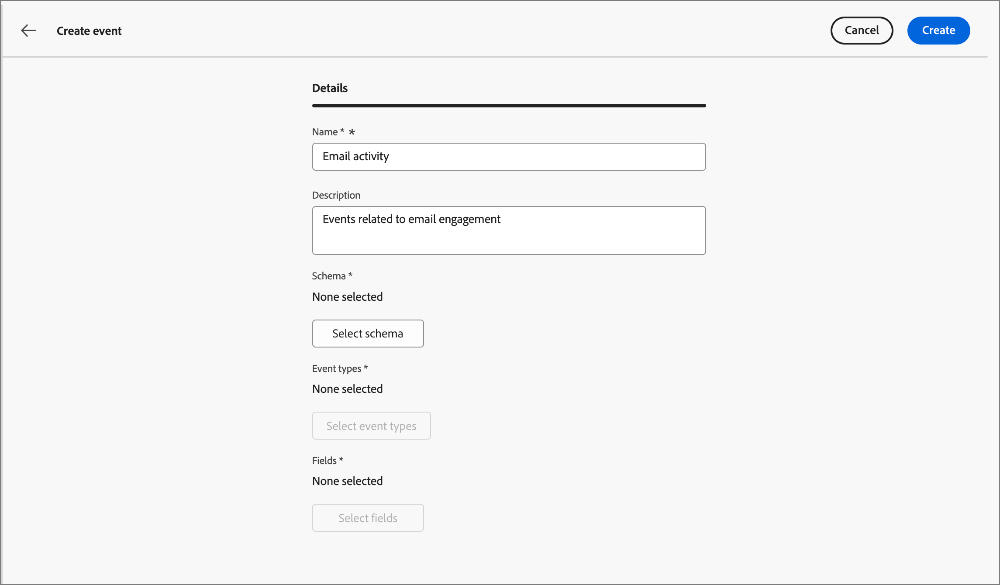

# 設定Experience Platform事件定義

管理員可以設定Adobe Experience Platform (AEP)型事件定義，讓行銷人員建立會對[AEP體驗事件](https://experienceleague.adobe.com/zh-hant/docs/experience-platform/xdm/classes/experienceevent){target="_blank"}做出反應的帳戶歷程。

{width="30"}[觀看概觀影片](#overview-video)

在帳戶歷程中使用AEP體驗事件有兩個步驟：

1. 建立並發佈AEP事件定義。

2. 在帳戶歷程中，新增&#x200B;_接聽事件_&#x200B;節點，並[選取AEP事件定義作為人員事件](../journeys/listen-for-event-nodes.md#listen-for-an-experience-event)。

每個事件定義都需要下列Experience Platform輸入：

* **_結構描述_** — 定義體驗事件資料結構的XDM結構描述。 它必須根據體驗事件且必須啟用設定檔。

  >[!NOTE]
  >
  >為確保已定義所需的結構描述，請與您的工程團隊協調。 [建立XDM結構描述](https://experienceleague.adobe.com/zh-hant/docs/experience-platform/xdm/schema/composition){target="_blank"}是資料工程師根據您整個組織的使用案例需求所執行的複雜程式。

* **_事件型別_** - XDM ExperienceEvent eventType （每個事件定義最多20個）。

* **_欄位_** — 存在於結構描述中的XDM欄位（每個事件定義最多20個）

* **_名稱_** — 事件定義的唯一名稱。

* **_描述_** — 事件定義的描述。

## 限制和護欄

當您建立和管理事件定義以符合您的組織目標時，請記住下列事項：

* Journey Optimizer B2B edition支援最多50個事件定義。

* 帳戶歷程可傾聽使用AEP串流功能(例如Web SDK或HTTP API)擷取的AEP Experience事件。

* 只有一個AEP事件定義可以使用合併的結構描述和事件型別集。 當您使用結構描述（例如`My Schema`）和事件型別（例如`Web Webpagedetails Page Views`）建立事件定義時，任何其他事件定義都不能使用`My Schema`和`Web Webpagedetails Page Views`的組合。

* 事件定義可用於多個帳戶歷程。

* AEP Experience事件可用於帳戶歷程中的決策目的，但不會保留。 因此，在AEP B2B edition中無法運用Journey Optimizer體驗事件的歷史記錄。

* 不支援&#x200B;_活動日期_&#x200B;和&#x200B;_最小次數_&#x200B;的限制。

* 發佈事件定義後，無法修改結構描述和名稱。 不過，您可以建立草稿版本並再次發佈，以新增事件型別和欄位。

* 無法刪除已發佈歷程中使用的事件定義。

## 存取及管理事件定義

1. 在左側導覽列中，選擇&#x200B;**[!UICONTROL 管理]** > **[!UICONTROL 組態]**。

1. 按一下中間面板上的&#x200B;**[!UICONTROL 事件]**&#x200B;以顯示事件定義清單。

   您可以從此頁面[建立](#create-an-event-definition)、[發佈](#publish-an-event-defintion)、[編輯](#edit-an-event-definition)和[刪除](#delete-an-event-definition)事件定義。

   {width="800" zoomable="yes"}

   資料表是依&#x200B;_[!UICONTROL 已修改]_&#x200B;資料行排序，最近更新的定義會位於最上方，作為預設值。<!-- Click the column title to change between ascending and descending.-->

1. 若要存取事件定義的詳細資訊，請按一下名稱。

### 事件定義狀態和生命週期

在&#x200B;_[!UICONTROL 事件定義]_&#x200B;清單中，**[!UICONTROL 狀態]**&#x200B;欄表示每個定義的目前狀態。 狀態會決定其是否可用於帳戶歷程，以及您可以對其進行的變更。

| 狀態 | 說明 |
| -------------------- | ----------- |
| 草稿 | 當您建立事件定義時，它會處於草稿狀態。 在您發佈以用於帳戶歷程之前，它會一直保持此狀態。 可用的動作：  <li>編輯所有詳細資料<li>發佈<li>刪除 |
| 發佈日期 | 當您發佈事件定義時，它便可用於帳戶歷程。 無法修改詳細資料。 可用的動作：  <li>可用於&#x200B;_接聽事件_&#x200B;歷程節點<li>建立草稿版本<li>刪除（若未使用） |
| 已發佈 (含草稿) | 當您從已發佈的事件定義建立草稿時，已發佈的版本仍可用於帳戶歷程，且可修改草稿版本。 如果您發佈草稿版本，草稿版本會取代目前發佈的版本，且事件定義會針對尚未執行的帳戶歷程而更新。 可用的動作：  <li>編輯所有詳細資料<li>發佈草稿版本<li>捨棄草稿版本<li>刪除（若未使用） |

{zoomable="yes"}

### 篩選事件定義清單

若要依名稱搜尋事件定義，請在搜尋列中輸入文字字串以尋找相符專案。

{width="700" zoomable="yes"}

## 建立事件定義

1. 在左側導覽中，選擇&#x200B;**[!UICONTROL 管理]** > **[!UICONTROL 組態]**。

1. 按一下中間面板上的&#x200B;**[!UICONTROL 事件]**&#x200B;以顯示事件定義清單。

1. 按一下右上角的&#x200B;**[!UICONTROL 建立事件]**。

1. 輸入&#x200B;**[!UICONTROL Name]** （必要）和&#x200B;**[!UICONTROL Description]** （選用）。

   {width="600" zoomable="yes"}

1. 設定&#x200B;**[!UICONTROL 結構描述]**&#x200B;以用於事件定義。

   您選取的結構描述會決定可新增至定義的欄位。 然後，您新增的欄位便可作為帳戶歷程中&#x200B;_接聽事件_&#x200B;節點的條件約束。

   * 按一下&#x200B;**[!UICONTROL 選取結構描述]**。
   * 在對話方塊中，從體驗事件型結構描述清單中選取結構描述。
   * 按一下&#x200B;**[!UICONTROL 選取]**。

   {width="600" zoomable="yes"}

1. 選取要用於事件定義的&#x200B;**[!UICONTROL 事件型別]**。

   您選取的[事件型別](https://experienceleague.adobe.com/zh-hant/docs/experience-platform/xdm/classes/experienceevent#eventType){target="_blank"}決定了在帳戶歷程中可作為&#x200B;_接聽事件_&#x200B;節點之條件約束的事件。

   * 按一下&#x200B;**[!UICONTROL 選取事件型別]**。
   * 在對話方塊中，從清單中選取一或多個事件型別（最多20個）。
   * 按一下&#x200B;**[!UICONTROL 選取]**。

   {width="600" zoomable="yes"}

1. 選取要用於事件定義的&#x200B;**[!UICONTROL 欄位]**。

   您選取的欄位決定當事件用於帳戶歷程中的&#x200B;_接聽事件_&#x200B;節點時可用的限制。

   >[!NOTE]
   >
   >`eventType`欄位為必要欄位，且已自動選取。

   * 按一下&#x200B;**[!UICONTROL 選取欄位]**。
   * 在對話方塊中，從清單中選取一或多個欄位（最多20個）。
   * 按一下&#x200B;**[!UICONTROL 選取]**。

   {width="600" zoomable="yes"}

1. 結構描述、事件型別和欄位完成時，按一下&#x200B;**[!UICONTROL 建立]**。

   建立後，會顯示清單頁面，而新事件位於清單頂端，並具有&#x200B;_草稿_&#x200B;狀態。

   {width="700" zoomable="yes"}上

## 發佈事件定義

當您滿意草稿事件定義是完整且正確符合您的需求時，您可以將其發佈。 然後，發佈的事件定義便可用於帳戶歷程。 在事件定義發佈後，如果您需要對其進行變更，可以建立草稿版本。 不過，您無法變更結構，而且只能新增事件型別和欄位（無法刪除它們）。

1. 在左側導覽中，選擇&#x200B;**[!UICONTROL 管理]** > **[!UICONTROL 組態]**。

1. 按一下中間面板上的&#x200B;**[!UICONTROL 事件]**&#x200B;以顯示事件定義清單。

1. 在&#x200B;_[!UICONTROL 事件定義]_&#x200B;清單中，按一下草稿事件定義的名稱以開啟詳細資訊頁面。

   {width="600" zoomable="yes"}

   如有需要，請先檢閱設定再發佈。 如果草稿[不符合您的要求，您可以](#edit-an-event-definition)編輯草稿。

1. 按一下右上方的&#x200B;**[!UICONTROL 發佈]**。

1. 在確認對話方塊中，按一下&#x200B;**[!UICONTROL 發佈]**。

   {width="300"}

   事件定義的狀態變更為&#x200B;_已發佈_，現在[可在帳戶歷程](../journeys/listen-for-event-nodes.md#listen-for-an-experience-event)中使用。

   {width="700" zoomable="yes"}上更新

## 編輯事件定義

1. 在左側導覽中，選擇&#x200B;**[!UICONTROL 管理]** > **[!UICONTROL 組態]**。

1. 按一下中間面板上的&#x200B;**[!UICONTROL 事件]**&#x200B;以顯示事件定義清單。

   對事件定義的編輯取決於其目前狀態：

   * 當事件定義處於&#x200B;_草稿_&#x200B;狀態時，您可以編輯其任何詳細資料。
   * 當事件定義處於&#x200B;_已發佈_&#x200B;狀態時，您無法對其進行編輯。 您可以建立可編輯的草稿版本，然後取代已發佈的版本。
   * 當事件定義處於&#x200B;_已發佈（含草稿）_&#x200B;狀態時，您可以變更草稿版本（編輯說明，以及新增事件型別和欄位）。

   {width="700" zoomable="yes"}上

1. 從&#x200B;_[!UICONTROL 事件定義]_&#x200B;清單頁面，按一下事件定義名稱以開啟。

根據狀態遵循步驟：

>[!BEGINTABS]

>[!TAB 草稿]

1. 視需要變更任何事件定義詳細資訊。

   {width="600" zoomable="yes"}

   請遵循用於[建立事件定義](#create-an-event-definition)的相同准則。

   變更會自動儲存在草稿中。

1. 當事件定義符合您的條件且您想要讓它可用於帳戶歷程時，請按一下&#x200B;**[!UICONTROL 發佈]**。

1. 在確認對話方塊中，按一下&#x200B;**[!UICONTROL 發佈]**。

   事件定義的狀態變更為&#x200B;_已發佈_，現在可用於帳戶歷程。

>[!TAB 已發佈]

1. 若要更新事件定義，請按一下右上角的&#x200B;**[!UICONTROL 建立草稿版本]**。

   {width="600" zoomable="yes"}

1. 在確認對話方塊中，按一下&#x200B;**[!UICONTROL 建立草稿]**&#x200B;以開啟草稿版本。

   {width="300"}

   此動作會建立草稿版本並傳回清單頁面，其中事件定義現在處於&#x200B;_已發佈（含草稿）_&#x200B;狀態。

1. 按一下事件定義名稱以開啟。

   對於&#x200B;_已發佈（含草稿）_&#x200B;事件定義，_[!UICONTROL 已發佈]_&#x200B;版本索引標籤會選取為預設值。

1. 選取&#x200B;**[!UICONTROL 草稿]**&#x200B;版本標籤。

   {width="600" zoomable="yes"}

1. 視需要變更任何可編輯的詳細資料（**[!UICONTROL 描述]**、**[!UICONTROL 事件型別]**&#x200B;和&#x200B;**[!UICONTROL 欄位]**）。

   請遵循用於[建立事件定義](#create-an-event-definition)的相同准則。

   變更會自動儲存在草稿中。

1. 當草稿事件定義符合您的條件，而您想要取代目前發佈的版本以用於帳戶歷程時，請按一下&#x200B;**[!UICONTROL 發佈草稿]**。

1. 在確認對話方塊中，按一下&#x200B;**[!UICONTROL 發佈]**。

   {width="300"}

   當您發佈草稿版本時，草稿版本會取代目前發佈的版本，而事件定義會針對使用中但尚未執行的帳戶歷程而更新。

>[!TAB 已發佈（含草稿）]

當您開啟&#x200B;_Published （含草稿）_&#x200B;事件定義時，_[!UICONTROL Published]_&#x200B;版本標籤會選取為預設值。

1. 選取&#x200B;**[!UICONTROL 草稿]**&#x200B;版本標籤。

   {width="600" zoomable="yes"}

1. 視需要變更任何可編輯的詳細資料（**[!UICONTROL 描述]**、**[!UICONTROL 事件型別]**&#x200B;和&#x200B;**[!UICONTROL 欄位]**）。

   遵循用於[建立事件定義](#create-an-event-definition)的相同准則。

   變更會自動儲存在草稿中。

1. 當草稿事件定義符合您的條件，而您想要取代目前發佈的版本以用於帳戶歷程時，請按一下&#x200B;**[!UICONTROL 發佈草稿]**。

1. 在確認對話方塊中，按一下&#x200B;**[!UICONTROL 發佈]**。

   {width="300"}

   當您發佈草稿版本時，草稿版本會取代目前發佈的版本，而事件定義會針對使用中但尚未執行的帳戶歷程而更新。

>[!ENDTABS]

## 刪除事件定義

如果已發佈的帳戶歷程未使用事件定義，您可以刪除該事件定義。

>[!CAUTION]
>
>請謹慎使用此動作。 事件定義的移除操作無法還原。

1. 在左側導覽中，選擇&#x200B;**[!UICONTROL 管理]** > **[!UICONTROL 組態]**。

1. 按一下中間面板上的&#x200B;**[!UICONTROL 事件]**&#x200B;以顯示事件定義清單。

1. 在清單中找到事件定義，然後按一下名稱右側的&#x200B;_刪除_ （  ）圖示。

1. 在確認對話框中，按一下「**[!UICONTROL 刪除]**」。

   {width="300"}

## 概觀影片

>[!VIDEO](https://video.tv.adobe.com/v/3448694/?learn=on&captions=chi_hant)