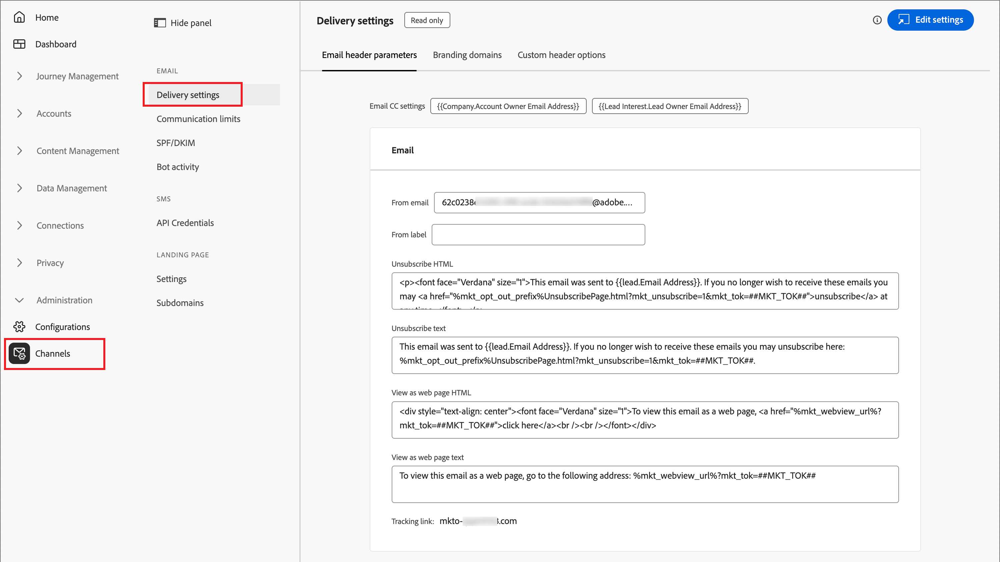
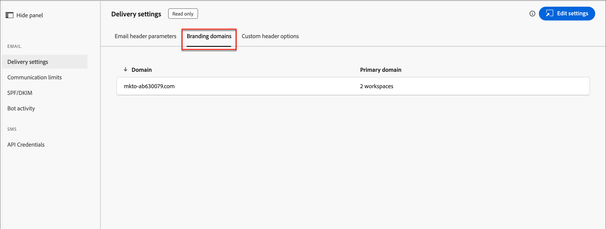
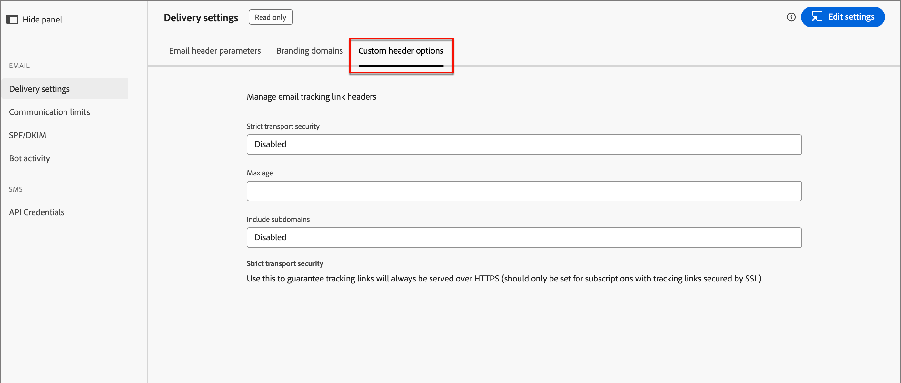
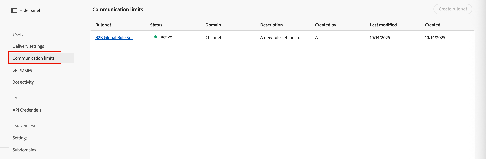
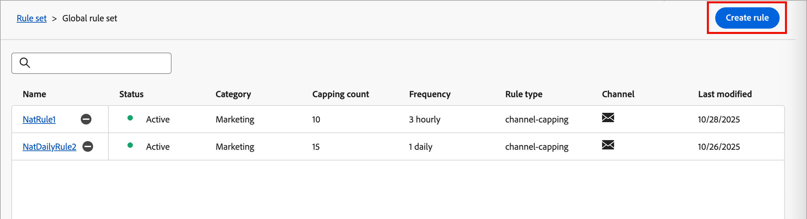
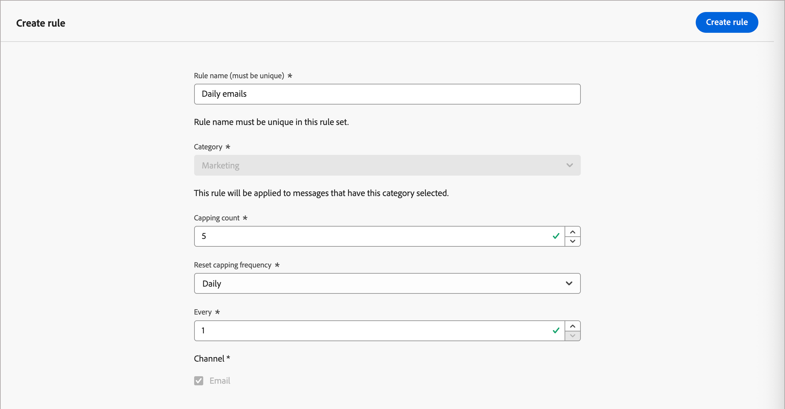
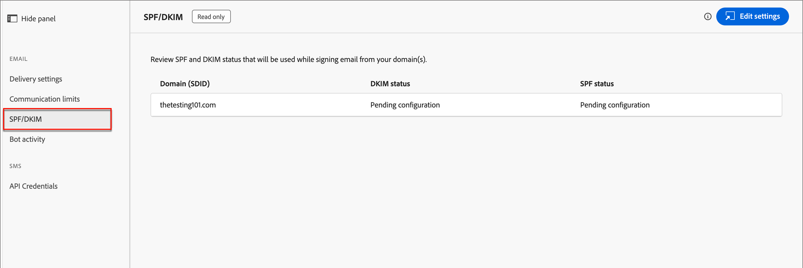
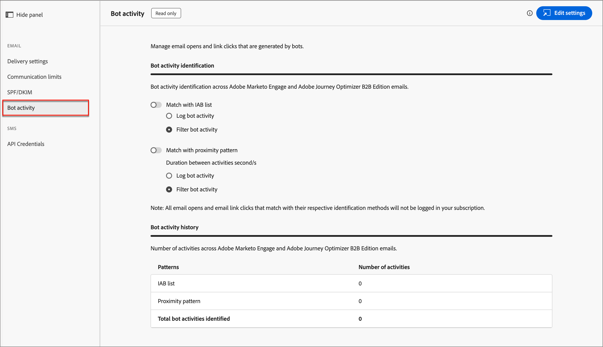

# 電子郵件通道設定

Adobe Journey Optimizer B2B edition可運用Marketo Engage中的管道功能和事件追蹤功能。 管理員應確保有傳送和追蹤設定，以啟用行銷人員的管道傳送。 如需有關透過Marketo Engage傳送電子郵件及追蹤所需通訊協定的資訊，請參閱[追蹤及電子郵件傳送通訊協定](../start/email-protocols.md)。

## 傳遞設定

當行銷人員在帳戶歷程中建立電子郵件時，會使用預設電子郵件設定。 若要檢閱電子郵件傳遞設定，請移至&#x200B;**[!UICONTROL 管理]** > **[!UICONTROL 管道]**。 在導覽面板中的&#x200B;_[!UICONTROL 電子郵件]_&#x200B;下，選取&#x200B;**[!UICONTROL 傳遞設定]**。

{width="800" zoomable="yes"}

這些設定在Journey Optimizer B2B edition中是唯讀的。 按一下右上角的「**[!UICONTROL 編輯設定]**」以存取已連線之Marketo Engage執行個體中的設定選項。

>[!NOTE]
>
>若要在Adobe Marketo Engage中存取及編輯這些設定，您必須擁有產品管理員許可權。

選取下列各標籤以檢閱目前設定。

### [!UICONTROL 電子郵件標頭引數] {#email-header}

電子郵件標頭引數會定義下列專案的預設值：

* **[!UICONTROL 寄件者電子郵件]** — 列在電子郵件標頭的&#x200B;_寄件者_&#x200B;欄位中的電子郵件地址。

* **[!UICONTROL 寄件者標籤]** — 電子郵件寄件者地址的顯示名稱。

* **[!UICONTROL 取消訂閱HTML]** — 顯示在非營運電子郵件中的HTML （適用於支援的電子郵件使用者端），向收件者說明取消訂閱動作。 此文字和連結會附加至底部。

* **[!UICONTROL 取消訂閱文字]** — 顯示在非營運電子郵件中的純文字，向收件者說明取消訂閱動作。 此文字和連結會附加至底部。

* **[!UICONTROL 以網頁方式檢視HTML]** — 用於&#x200B;_以網頁方式檢視_&#x200B;的HTML （適用於支援的電子郵件使用者端），它提供在瀏覽器中顯示電子郵件的連結。

* **[!UICONTROL 以網頁文字檢視]** — 純文字用於&#x200B;_以網頁檢視_，提供在瀏覽器中顯示電子郵件的連結。

### [!UICONTROL 品牌化網域] {#branding-domains}

若要檢閱品牌化網域，請按一下&#x200B;**[!UICONTROL 品牌化網域]**&#x200B;標籤。

{width="700" zoomable="yes"}

此設定會為連線的Marketo Engage執行個體中的一或多個工作區定義您的主要網域。 新電子郵件會使用此網域作為預設值，但行銷人員可以[根據每封電子郵件](../content/add-email.md#define-the-email-settings)覆寫它。 如需定義預設品牌定義域的詳細資訊，請參閱[Marketo Engage檔案](https://experienceleague.adobe.com/zh-hant/docs/marketo/using/product-docs/administration/email-setup/add-multiple-branding-domains/edit-your-default-branding-domain){target="_blank"}。

>[!NOTE]
>
>如果您正在行銷多個品牌，且希望每個品牌都有自己的品牌追蹤連結，您可以新增額外的品牌領域名稱。 如需新增多個品牌化網域的詳細資訊，請參閱[Marketo Engage檔案](https://experienceleague.adobe.com/zh-hant/docs/marketo/using/product-docs/administration/email-setup/add-multiple-branding-domains/add-an-additional-branding-domain){target="_blank"}。

### [!UICONTROL 自訂標頭選項] {#custom-header-options}

若要檢閱自訂標頭選項，請按一下&#x200B;**[!UICONTROL 自訂標頭選項]**&#x200B;標籤。

{width="700" zoomable="yes"}

啟用&#x200B;_[!UICONTROL 嚴格傳輸安全性]_&#x200B;時，可保證透過HTTPS提供追蹤連結（僅適用於具有SSL保護的追蹤連結的訂閱）。

## 通訊限制

通訊限制可控制連絡人從您的組織收到的電子郵件數量。 您設定的上限會在Journey Optimizer B2B edition和連線的Marketo Engage執行個體之間共用。 設定這些限制可確保某個潛在客戶在指定時間內不會收到超過最大數量的電子郵件。

>[!AVAILABILITY]
>
>通訊限制適用於在[簡化架構](../simplified-architecture.md)上布建的Journey Optimizer B2B edition環境。 請聯絡Adobe支援或開啟支援票證，以啟用Journey Optimizer B2B edition與一或多個Marketo Engage執行個體之間的通訊限制共用。

例如，已定義每天五封電子郵件的限制，系統會隱藏第六封電子郵件，以確保一位聯絡人不會在一天內收到第六封電子郵件。 藉由Journey Optimizer B2B edition和Marketo Engage之間的共用通訊限制，可在同一位置定義通訊限制規則。 無論來自Journey Optimizer B2B edition或Marketo Engage的傳送動作為何，都會隱藏第六封電子郵件。

所有Marketo Engage生產執行個體預設都有定義的通訊限制(如需詳細資訊，請參閱[Marketo Engage檔案](https://experienceleague.adobe.com/zh-hant/docs/marketo/using/product-docs/administration/email-setup/enable-communication-limits){target="_blank"})。 若要使用共用通訊限制，請在Journey Optimizer B2B edition中定義規則，並將這些限制的共用延伸至Marketo Munchkin程式碼。

>[!IMPORTANT]
>
>若要將通訊規則集擴充至Marketo Munchkin程式碼，請洽詢您的Adobe帳戶管理團隊。 此設定通常是上線流程的一部分。

若要檢閱或設定通訊限制規則，請移至&#x200B;**[!UICONTROL 管理]** > **[!UICONTROL 管道]**。 在導覽面板中的&#x200B;_[!UICONTROL 電子郵件]_&#x200B;下，選取&#x200B;**[!UICONTROL 通訊限制]**。

{width="700" zoomable="yes"}

依預設，有一個全域規則集，您可以在其中根據您的需求定義、啟用和停用多個規則。 按一下規則集名稱以顯示規則清單。

### 建立規則

1. 按一下右上角的&#x200B;**[!UICONTROL 建立規則]**。

   {width="600" zoomable="yes"}

1. 輸入&#x200B;**[!UICONTROL 規則名稱]**。

1. 設定&#x200B;**[!UICONTROL 上限金額]**。

   輸入值，或按一下右側的&#x200B;_向上_&#x200B;或&#x200B;_向下_&#x200B;箭頭以增加或減少值。

1. 根據您想要為限制定義時間週期的方式，選擇&#x200B;**[!UICONTROL 重設上限頻率]**&#x200B;值。

   您可以選擇每小時&#x200B;_[!UICONTROL 、]_&#x200B;每日&#x200B;_[!UICONTROL 、]_&#x200B;每週&#x200B;_[!UICONTROL 或]_&#x200B;每月&#x200B;_[!UICONTROL 。]_

   {width="600" zoomable="yes"}

1. 根據週期要包含多少頻率單位設定&#x200B;**[!UICONTROL Every]**&#x200B;值。

   例如，如果您使用&#x200B;_每日_&#x200B;作為頻率，並將此值設為`3`，則週期定義為三天。

1. 按一下右上角的&#x200B;**[!UICONTROL 建立規則]**。

新規則處於&#x200B;_草稿_&#x200B;狀態，除非您選擇啟用，否則不會套用至通訊限制。

### 管理規則

只要規則處於&#x200B;_草稿_&#x200B;狀態，您就可以編輯定義或刪除規則。 當您想要套用規則時，可以啟用它。 按一下清單中草稿規則名稱旁的&#x200B;_更多功能表_ (***...***)圖示，然後選擇&#x200B;**[!UICONTROL 啟動]**。

![按一下通訊限制規則草稿的[更多]功能表](./assets/config-email-communication-limits-draft-more-menu.png){width="400" zoomable="yes"}

然後，在確認對話方塊中按一下&#x200B;**[!UICONTROL 啟動]**。

無法編輯或刪除作用中的規則，只能將其停用。 針對您要從套用的通訊限制中移除的有效規則，請按一下有效規則名稱旁的&#x200B;_停用_ （  ）圖示。

![按一下使用中通訊限制規則的[停用]圖示](./assets/config-email-communication-limits-active-deactivate.png){width="400" zoomable="yes"}

然後，在確認對話方塊中按一下&#x200B;**[!UICONTROL 停用]**。

規則以&#x200B;_非使用中_&#x200B;狀態顯示。 它與草稿規則類似，您可以視需要編輯、刪除或啟動它。

## SPF/DKIM

將SPF (Sender Policy Framework)和DKIM (Domain Keys Identified Mail)整合至DNS設定，以提高您的電子郵件傳遞率。 這些技術可讓您的收件者確保您的電子郵件不是垃圾郵件。 為協助防止收件者的垃圾郵件篩選器拒絕電子郵件，請確保已針對您的網域設定SPF和DKIM。

若要檢閱目前的設定，請移至&#x200B;**[!UICONTROL 管理]** > **[!UICONTROL 管道]**。 在導覽面板的&#x200B;_[!UICONTROL 電子郵件]_&#x200B;下，選取&#x200B;**[!UICONTROL SPF/DKIM]**。

{width="700" zoomable="yes"}

這些設定在Journey Optimizer B2B edition中是唯讀的。 按一下右上角的「**[!UICONTROL 編輯設定]**」以存取已連線之Marketo Engage執行個體中的設定選項。

>[!NOTE]
>
>若要在Adobe Marketo Engage中存取及編輯這些設定，您必須擁有產品管理員許可權。

### SPF設定

網路管理員應將下列行加入您的DNS專案：

`[domain] IN TXT v=spf1 mx ip4:[corpIP] include:mktomail.com ~all`

在此專案中，將`[domain]`取代為您網站的主要網域（例如`company.com`），並將`[corpIP]`取代為您公司電子郵件伺服器的IP位址（例如`255.255.255.255`）。 如果您透過Marketo Engage從多個網域傳送電子郵件，請在單行上為每個網域新增此專案。

如果您的DNS專案中已有SPF記錄，請新增下列內容：

`include:mktomail.com`

### DKIM設定

DKIM是一種驗證通訊協定，電子郵件接收者使用它來驗證電子郵件訊息的寄件者。 這通常可以改善電子郵件傳送至收件匣的能力，因為接收者可以確信郵件並非偽造。

當您的DNS記錄中有公開金鑰，且在連線的Marketo Engage執行個體中啟用了傳送網域時，自訂DKIM簽署將用於外寄訊息。 自訂DKIM簽署包含加密的數位簽名，以及傳送的每封電子郵件。 然後，接收者就可以在您傳送網域的DNS中查詢&#x200B;_公開金鑰_，以解密數位簽章。 如果電子郵件中的金鑰與DNS記錄中的金鑰相對應，則接收郵件伺服器更有可能接受透過Marketo Engage傳送的電子郵件。

如需針對電子郵件傳遞設定自訂DKIM簽章的詳細資訊，請參閱[Marketo Engage檔案](https://experienceleague.adobe.com/zh-hant/docs/marketo/using/product-docs/email-marketing/deliverability/set-up-a-custom-dkim-signature){target="_blank"}。

## 機器人活動

電子郵件機器人活動可能會讓您的電子郵件開啟膨脹，並按一下資料。

Marketo Engage使用兩種方法來確認機器人活動：

* **與互動式Advertising Bureau (IAB)清單相符** — 與IAB UA/IP （使用者代理程式/IP位址）清單上的任何專案相符的活動會標示為機器人。

* **符合近似程度模式** — 當兩個或多個活動同時發生（在一秒內）時，會將它們識別為機器人。 此方法會考量下列屬性以進行比較：

   * 銷售機會ID （應相同）
   * 電子郵件資產（應相同）
   * 連結點選或電子郵件開啟
   * 時間差異（應小於1秒）

對於電子郵件連結點選和電子郵件開啟活動，新屬性會填入以下值：

* 識別為機器人的活動將&#x200B;_機器人活動_&#x200B;設為`True`，並將&#x200B;_機器人活動模式_&#x200B;設為識別的模式/方法。
* 識別為不是機器人的活動將&#x200B;_機器人活動_&#x200B;設為`False`，將&#x200B;_機器人活動模式_&#x200B;設為`N/A`。
* 在引入屬性之前發生的活動有&#x200B;_機器人活動_&#x200B;為空白(null)和&#x200B;_機器人活動模式_&#x200B;為空白(null)

若要檢閱目前的設定，請移至&#x200B;**[!UICONTROL 管理]** > **[!UICONTROL 管道]**。 在導覽面板的&#x200B;_[!UICONTROL 電子郵件]_&#x200B;下，選取&#x200B;**[!UICONTROL 機器人活動]**。

{width="700" zoomable="yes"}

這些設定在Journey Optimizer B2B edition中是唯讀的。 按一下右上角的「**[!UICONTROL 編輯設定]**」以存取已連線之Marketo Engage執行個體中的設定選項。

>[!NOTE]
>
>若要在Adobe Marketo Engage中存取及編輯這些設定，您必須擁有產品管理員許可權。

如需設定機器人活動選項的詳細資訊，請參閱[Marketo Engage檔案](https://experienceleague.adobe.com/zh-hant/docs/marketo/using/product-docs/administration/email-setup/filtering-email-bot-activity#select-filter-type){target="_blank"}。
