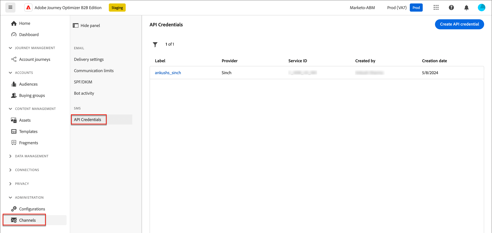
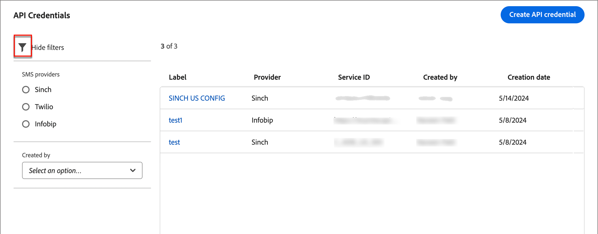
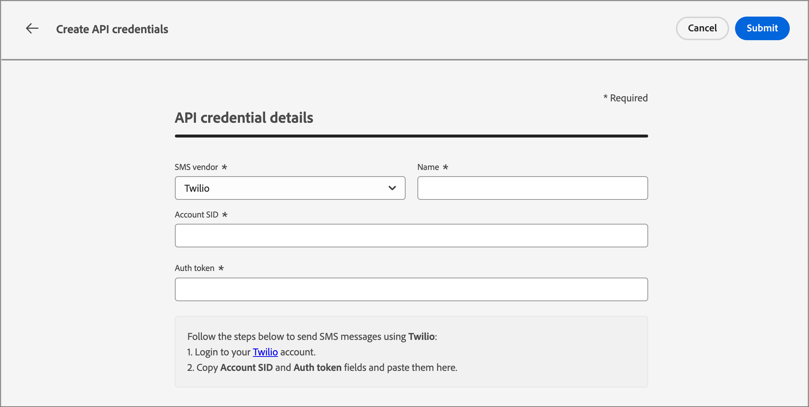
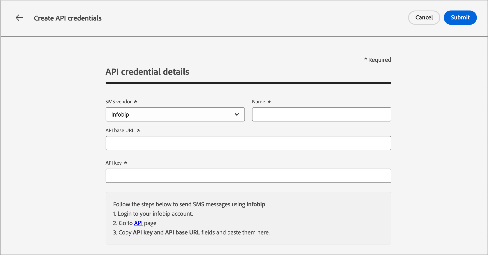

# 簡訊設定

Adobe Journey Optimizer B2B edition會透過SMS服務提供者（或SMS閘道提供者）傳送文字訊息。 建立SMS訊息之前，請先從&#x200B;_管理員_&#x200B;設定設定您的服務提供者。

## SMS閘道服務提供者

Adobe Journey Optimizer B2B edition目前與獨立提供簡訊服務的協力廠商提供者整合。 支援的簡訊提供者為Sinch、Twilio和Infobip。

在Adobe Journey Optimizer B2B edition中設定SMS通道前，您必須與其中一個提供者建立帳戶，以取得API權杖和服務ID。 設定Adobe Journey Optimizer B2B edition與適用提供者之間的連線時，需要這些憑證。

>[!IMPORTANT]
>
>您對簡訊服務的使用受限於適用提供者的其他條款與條件。 作為協力廠商解決方案，Adobe Journey Optimizer B2B edition使用者可透過整合使用Sinch、Twilio和Infobip。 Adobe無法控制，且對協力廠商產品不負任何責任。 若有任何與簡訊服務(SMS)相關的問題或尋求協助的請求，請聯絡您的提供者。

## 驗證現有的SMS API設定

>[!NOTE]
>
>上述設定僅供具有SMS管理員許可權的使用者存取。

1. 在左側導覽列中，展開&#x200B;**[!UICONTROL 管理員]**&#x200B;區段，然後按一下&#x200B;**[!UICONTROL 管道]**。

   {width="800" zoomable="yes"}

1. 在導覽面板中，選取&#x200B;**[!UICONTROL API認證]**。

   頁面列出執行個體可用的應用程式開發介面設定。

1. 如有需要，請按一下&#x200B;_篩選器_&#x200B;圖示（ ）並選取選項，以顯示SMS服務提供者或建立者設定的API認證清單。

   {width="600" zoomable="yes"}

## 建立SMS服務提供者的新API認證

>[!BEGINTABS]

>[!TAB Sinch]

若要使用Adobe Journey Optimizer B2B edition將Sinch設定為您的簡訊提供者(_T):_

1. 在左側導覽列中，展開&#x200B;**[!UICONTROL 管理員]**&#x200B;區段，然後按一下&#x200B;**[!UICONTROL 設定]**。

1. 按一下&#x200B;**[!UICONTROL API認證]**&#x200B;清單右上角的&#x200B;_[!UICONTROL 建立新API認證]_。

1. 設定您的SMS API認證：

   {width="500"}

   * **[!UICONTROL 簡訊供應商]** — 選擇`Sinch`做為簡訊提供者。

   * **[!UICONTROL 名稱]** — 輸入您API認證的名稱。

   * **[!UICONTROL 服務ID]**&#x200B;和&#x200B;**[!UICONTROL API Token]** — 從您的Sinch帳戶存取API頁面（您可以在SMS標籤下找到您的認證）。

   如需尋找您Sinch帳戶之相關資訊的詳細資訊，請參閱[Sinch開發人員檔案](https://developers.sinch.com/docs/sms/getting-started)

1. 當API認證的組態詳細資料完成時，按一下&#x200B;**[!UICONTROL 提交]**。

>[!TAB Twilio]

若要使用Adobe Journey Optimizer B2B edition將Twilio設定為您的簡訊提供者(_T):_

1. 在左側導覽列中，展開&#x200B;**[!UICONTROL 管理員]**&#x200B;區段，然後按一下&#x200B;**[!UICONTROL 設定]**。

1. 按一下&#x200B;**[!UICONTROL API認證]**&#x200B;清單右上角的&#x200B;_[!UICONTROL 建立新API認證]_。

1. 設定您的SMS API認證：

   {width="500"}

   * **[!UICONTROL 簡訊供應商]** — 選擇`Twilio`做為簡訊提供者。

   * **[!UICONTROL 名稱]** — 輸入API認證定義的名稱。

   * **[!UICONTROL 帳戶SID]**&#x200B;和&#x200B;**[!UICONTROL 驗證權杖]** — 存取您Twilio主控台儀表板頁面的&#x200B;_帳戶資訊_&#x200B;窗格，以尋找您的認證。

   如需尋找您Twilio帳戶之相關資訊，請參閱[Twilio說明中心](https://help.twilio.com/articles/14726256820123-What-is-a-Twilio-Account-SID-and-where-can-I-find-it-)。

1. 完成API認證的組態詳細資料時，請按一下頁面右上方的&#x200B;**[!UICONTROL 提交]**。

>[!TAB Infobip]

若要使用Adobe Journey Optimizer B2B edition將Infobip設定為簡訊提供者(_T):_

1. 在左側導覽列中，展開&#x200B;**[!UICONTROL 管理員]**&#x200B;區段，然後按一下&#x200B;**[!UICONTROL 設定]**。

1. 按一下&#x200B;**[!UICONTROL API認證]**&#x200B;清單右上角的&#x200B;_[!UICONTROL 建立新API認證]_。

1. 設定您的SMS API認證：

   {width="500"}

   * **[!UICONTROL 簡訊供應商]** — 選擇`Infobip`做為簡訊提供者。

   * **[!UICONTROL 名稱]** — 輸入API認證定義的名稱。

   * **[!UICONTROL API基底URL]**&#x200B;和&#x200B;**[!UICONTROL API金鑰]** — 存取您的網頁介面首頁或Infobip帳戶的API金鑰管理頁面，以尋找您的認證。

   如需有關為您的Infobip帳戶尋找此資訊的詳細資訊，請參閱[Infobip檔案](https://www.infobip.com/docs/api/_blank)。

1. 完成API認證的組態詳細資料時，請按一下頁面右上方的&#x200B;**[!UICONTROL 提交]**。

>[!ENDTABS]

按一下&#x200B;_[!UICONTROL 提交]_&#x200B;後，認證會立即驗證並儲存，將您重新導向至&#x200B;_[!UICONTROL API認證]_&#x200B;清單頁面。 如果提交的認證無效，系統會在清單頁面上顯示錯誤訊息。 在這種情況下，您可以選擇取消設定，或更新設定並重新提交。
