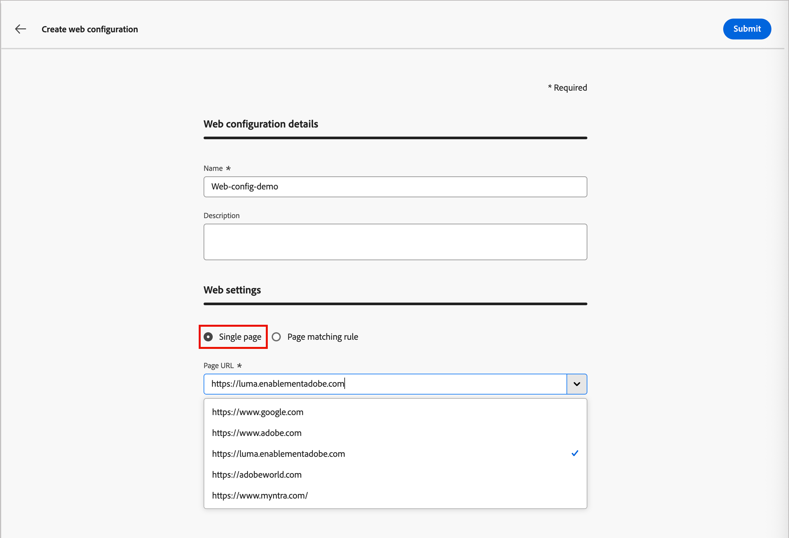
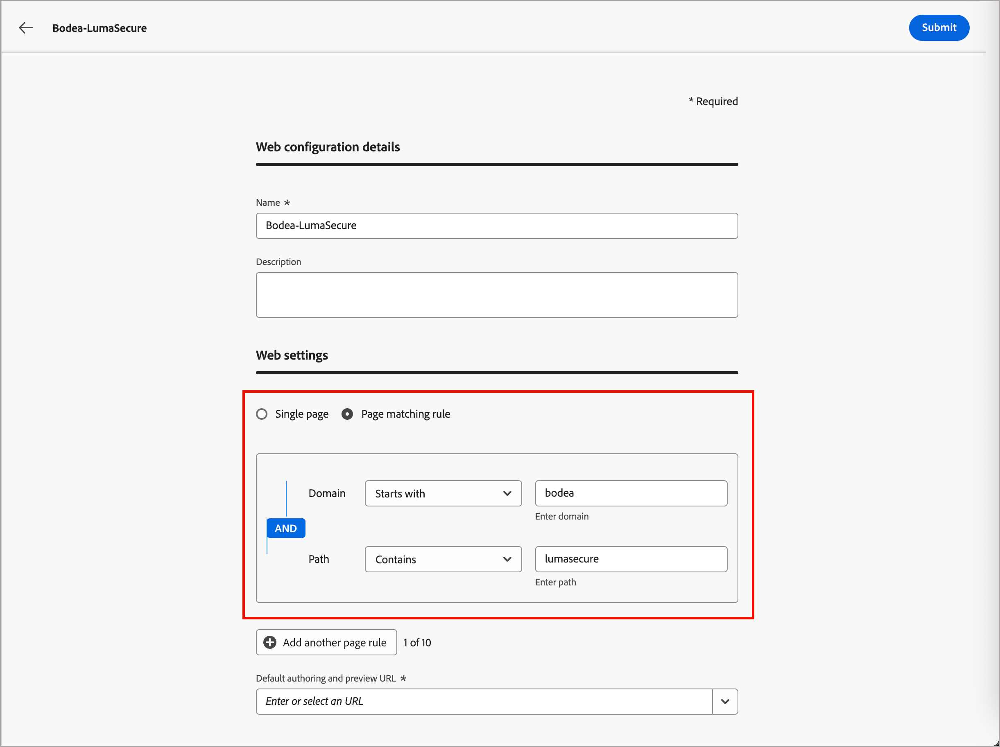
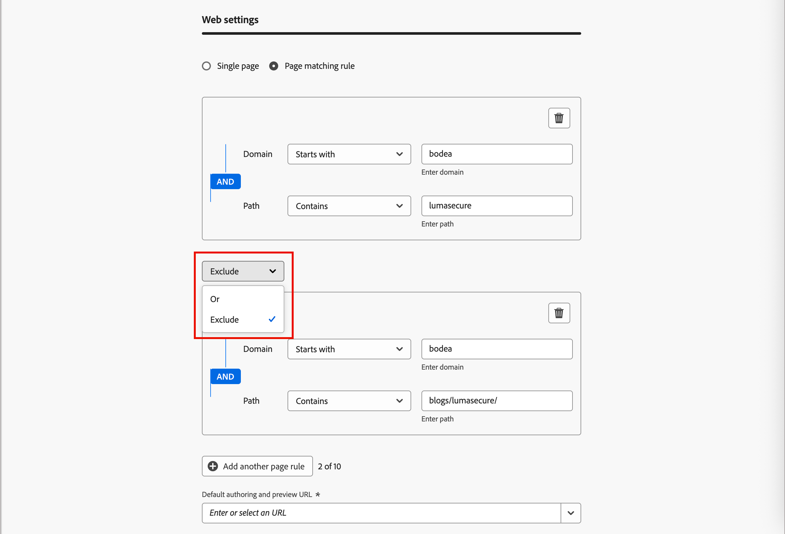

# Web頻道設定

Web設定是由傳送內容的URL識別的Web屬性。 它可以比對單一頁面URL或多個頁面，讓網頁體驗可以跨一或多個網頁進行修改。 行銷人員需要這些設定，才能[在歷程中新增Web個人化動作節點](../content/web-experiences.md#create-a-web-experience)，以及[為行銷活動設計體驗修改](../content/web-experience-design.md)。

>[!BEGINSHADEBOX]

**先決條件**

若要使用網路管道，您的網站必須實作[Adobe Experience Platform Web SDK](https://experienceleague.adobe.com/zh-hant/docs/experience-platform/collection/js/js-overview) (`alloy.js`)，以識別訪客並傳送內容。 請確定Adobe Experience Platform Web SDK的版本是2.16或更高版本。

Journey Optimizer B2B edition中的Web頻道設定需要下列[許可權](../admin/user-management.md#b2b-product-permissions)：

* _[!UICONTROL 頻道設定]_ > _[!UICONTROL 管理訊息預設集]_ — 建立、更新及刪除Web頻道設定所需。
* _[!UICONTROL 頻道設定]_ > _[!UICONTROL 檢視訊息預設集]_ — 檢視Web頻道設定所需。

>[!ENDSHADEBOX]

## 建立Web頻道設定

1. 在左側導覽列中，移至&#x200B;**[!UICONTROL 管理]** > **[!UICONTROL 管道]**。

1. 在導覽面板中的&#x200B;_[!UICONTROL Web]_&#x200B;下，選取&#x200B;**[!UICONTROL 頻道設定]**。

   {width="800" zoomable="yes"}

1. 按一下右上角的&#x200B;**[!UICONTROL 建立管道組態]**。

1. 輸入組態的&#x200B;**[!UICONTROL Name]** （必要）和&#x200B;**[!UICONTROL Description]** （選用）。

   >[!NOTE]
   >
   >名稱必須以字母(A-Z)開頭，並且只能包含英數字元。 您也可以使用底線`_`、點`.`和連字型大小`-`字元。

1. 在&#x200B;**[!UICONTROL 網頁設定]**&#x200B;區段中，選取下列其中一個選項：

   * **[!UICONTROL 單一頁面]** — 如果您只想將變更套用至單一頁面，請輸入或選取&#x200B;**[!UICONTROL 頁面URL]**。

     {width="600" zoomable="yes"}

   * **[!UICONTROL 頁面符合規則]** — 若要鎖定多個符合相同規則的URL，請建置符合規則[的](#build-a-pages-matching-rule)頁面，並輸入&#x200B;**[!UICONTROL 預設的撰寫與預覽URL]**。

1. 按一下&#x200B;**[!UICONTROL 提交]**&#x200B;以儲存變更。

儲存設定後，設定會處於&#x200B;_草稿_&#x200B;狀態，當行銷人員在歷程中使用網路管道時，即可使用該設定。 只要組態保持草稿狀態，您就可以繼續編輯組態。 您也可以按一下名稱旁的&#x200B;_更多_&#x200B;圖示(**...**)，然後選擇&#x200B;**[!UICONTROL 刪除]**，刪除草稿Web Channel設定。

在歷程中使用Web管道後，它就會移至&#x200B;_作用中_&#x200B;狀態。 在此狀態下，您可以編輯設定的名稱和描述。 您無法變更網頁設定或刪除設定。

## 頁面比對規則 {#pages-matching-rule}

建立Web組態時，您可以建置符合規則&#x200B;_[!UICONTROL 的]_&#x200B;頁面，以鎖定多個符合相同規則的URL。 這些規則可讓您將相同的內容變更套用至多個頁面。

例如，您可能會想要將變更套用至整個網站的主圖橫幅，或新增顯示在所有產品頁面上的最上層影像。

### 建立規則

1. 當您[建立Web Channel設定](#create-a-web-channel-configuration)時，請選擇&#x200B;**[!UICONTROL 頁面比對規則]**。

1. 使用每個區段中的不同運運算元來建立規則，以定義&#x200B;**[!UICONTROL 網域]**&#x200B;和&#x200B;**[!UICONTROL 頁面]**&#x200B;欄位的條件。

   +++網域運運算元

   根據您輸入的字串值，使用下列運運算元來比對網域：

   | 運算子 | 說明 | 範例 |
   | --- | --- | --- |
   | [!UICONTROL 等於] | 網域的完全相符專案。 | |
   | [!UICONTROL 開頭為] | 符合以輸入字串開頭的所有網域（包括子網域）。 | `Starts with: dev`符合所有以`dev`開頭的網域和子網域，例如`dev.example.com`、`dev.products.example.com`和`developer.example.com` |
   | [!UICONTROL 結尾為] | 比對以輸入字串結尾的所有網域（包括子網域）。 | `Ends with: example.com`符合所有以`example.com`結尾的網域和子網域，例如`stage.example.com`、`prod.example.com`和`myexample.com` |
   | [!UICONTROL 萬用字元符合] | 可讓您在字串中間定義萬用字元相符，例如`dev.*.example.com`。 當運運算元為&#x200B;_萬用字元符合_&#x200B;時，驗證規則要求值僅包含一個萬用字元（星號）。 | `Wildcard matching: dev.*.example.com`符合網域，例如`dev.products.example.com`、`dev.mytest.products.example.com`和`dev.blog.example.com` |
   | [!UICONTROL 任何] | 符合所有網域。 在跨網域測試特定路徑時，這個用法很有用。 | |

   +++

   +++路徑運運算元

   根據您輸入的字串值，使用下列運運算元來比對路徑：

   | 運算子 | 說明 | 範例 |
   | --- | --- | --- |
   | [!UICONTROL 等於] | 路徑的確切相符專案。 | |
   | [!UICONTROL 開頭為] | 符合以字串開頭的所有路徑（包括子路徑）。 | |
   | [!UICONTROL 結尾為] | 比對以字串結尾的所有路徑（包括子路徑）。 | |
   | [!UICONTROL 任何] | 符合所有路徑。 以一或多個網域下的所有路徑為目標時，此功能會很有用。 | |
   | [!UICONTROL 萬用字元符合] | 可讓您在路徑中定義內部萬用字元，例如`/products/*/detail`。 路徑元件中的萬用字元`*`會比對到第一個`/`字元之前的任一字元順序。  且`/*/`符合任何字元順序（包括子路徑）。 | `Wildcard matching: /products/*/detail`符合路徑，例如`example.com/products/yoga/detail`、`example.com/products/surf/detail`、`example.com/products/tennis/detail`和`example.com/products/yoga/pants/detail` |
   | [!UICONTROL 包含] | 值會轉譯為萬用字元（例如`*mystring*`），並比對包含字元順序的所有路徑。 | `Contains: product`符合包含字串`product`的所有路徑，例如`example.com/products`、`example.com/yoga/perfproduct`、`example.com/surf/productdescription`和`example.com/home/product/page` |

   +++

   例如，若要支援您&#x200B;_Bodea_&#x200B;網站的所有&#x200B;_LumaSecure_&#x200B;解決方案頁面上的內容變更，請選取&#x200B;**[!UICONTROL 網域]** > **[!UICONTROL 開頭為]** > `bodea`且&#x200B;**[!UICONTROL 頁面]** > **[!UICONTROL 包含]** > `lumasecure`。

   {width="600" zoomable="yes"}

1. 如果您的使用案例需要多個規則，請按一下&#x200B;**[!UICONTROL 新增其他頁面規則]**&#x200B;並重複上一步驟。

   * 您最多可以定義10個規則。

   * 在不同的規則之間使用&#x200B;**[!UICONTROL Or]**&#x200B;或&#x200B;**[!UICONTROL Exclude]**&#x200B;運運算元。

     _[!UICONTROL Or]_&#x200B;是定義多個規則的預設運運算元，可用來新增可比對的多個條件定義。

     _[!UICONTROL 排除]_&#x200B;在符合所定義規則的其中一個頁面不應鎖定為目標時非常有用。 例如，您可以鎖定包含`bodea.com`的所有`lumasecure`頁面，但不包括部落格頁面（例如`bodea.com/blogs/lumasecure/latest-release`）。

   {width="600" zoomable="yes"}

1. 輸入&#x200B;**[!UICONTROL 預設的撰寫與預覽URL]**。

   此步驟會確保規則產生或相符的頁面具有指定URL，可用於網頁體驗內容設計和預覽。

## 複製網路頻道

您可以複製現有的Web Channel設定並加以變更，以根據現有的Web Channel建立新的Web Channel。 無法修改儲存至程式庫的使用中Web Channel設定。

1. 按一下變體的&#x200B;_更多功能表_&#x200B;圖示(**...**)，然後選擇&#x200B;**[!UICONTROL 複製]**。

   ![按一下[更多nenu]圖示以複製現有的Web Channel設定](./assets/config-web-channels-more-menu.png){width="450"}

   此動作會建立重複的Web Channel，並在名稱后面附加`_Copy_nnn`。

1. 按一下複製的Web Channel名稱以編輯引數。

   * 變更名稱和說明，以符合規則中的用途或專案。
   * 如有需要，請變更單一頁面URL。
   * 如有需要，請根據您的需求變更頁面比對規則。

1. 組態完成時，按一下&#x200B;**[!UICONTROL 提交]**。
