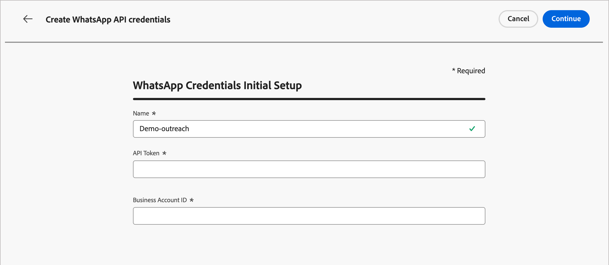

# WhatsApp頻道設定

Adobe Journey Optimizer B2B edition會透過Meta的Cloud API傳送WhatsApp訊息。 行銷人員必須為帳戶歷程建立WhatsApp訊息，產品管理員必須設定WhatsApp頻道。

適用於Journey Optimizer B2B edition的

## 先決條件

在設定WhatsApp頻道之前，請確定您符合下列條件：

* [Meta Business Manager帳戶](https://business.facebook.com/)
* [具有已驗證寄件者姓名與電話號碼的WhatsApp商業帳戶](https://developers.facebook.com/docs/whatsapp/overview/business-accounts/)
* [具有適當許可權的Meta使用者授權權杖](https://developers.facebook.com/blog/post/2022/12/05/auth-tokens/)
* [您的WhatsApp商業帳戶中的已核准訊息範本](https://developers.facebook.com/docs/whatsapp/message-templates/guidelines/)

>[!IMPORTANT]
>
>您使用WhatsApp訊息服務時，必須遵守Meta的條款與條件。 透過Journey Optimizer B2B edition存取WhatsApp傳訊，即表示您確認已檢閱並同意遵守[Meta WhatsApp商業政策](https://www.whatsapp.com/legal/business-policy/)。

## 限制 {#limitations}

下列限制適用於 WhatsApp 頻道：

* Adobe Journey Optimizer B2B edition **不符合HIPAA標準，而且不符合HIPAA標準**。 此外，Adobe的BAA不包含第三方廠商。 客戶需自行負責法規遵循及供應商驗證。

* 尚不支援自動化或預先定義的回應訊息。

* 自2025年4月起，Meta暫停傳送所有行銷範本訊息給擁有美國電話號碼（由+1撥號代碼和美國區碼組成的號碼）的WhatsApp使用者。 [進一步瞭解Meta檔案](https://developers.facebook.com/documentation/business-messaging/whatsapp/templates/marketing-templates/per-user-limits/)

* 原生整合功能不允許整合入第三方企業服務提供者 (BSP)。

## 完成頻道設定

在傳送WhatsApp訊息之前，您必須先設定Journey Optimizer B2B edition環境，並將其與您的WhatsApp帳戶連結。

完成下列作業：

1. [建立WhatsApp API認證](#create-whatsapp-api-credentials)
1. [新增WhatsApp Webhook](#configure-webhooks)
1. [建立WhatsApp通道設定](#create-channel-configuration)

### 建立WhatsApp API認證

>[!NOTE]
>
>上述設定僅供具有管理員許可權的使用者存取。

1. 在左側導覽列中，展開&#x200B;**[!UICONTROL 管理]**&#x200B;區段，然後按一下&#x200B;**[!UICONTROL 管道]**。

1. 在面板中，展開&#x200B;**[!UICONTROL WhatsApp設定]**&#x200B;並選取&#x200B;**[!UICONTROL API認證]**。

   {width="800" zoomable="yes"}

1. 按一下右上角的&#x200B;**[!UICONTROL 建立新的API認證]**。

1. 設定您的API認證，如下所述：

   * **[!UICONTROL 名稱]** — 輸入認證的唯一名稱
   * **[!UICONTROL API權杖]** — 輸入您的API權杖。 如需詳細資訊，請參閱[Meta檔案](https://developers.facebook.com/blog/post/2022/12/05/auth-tokens/)。
   * **[!UICONTROL 企業帳戶ID]** — 輸入與您的企業組合相關的唯一編號。 如需詳細資訊，請參閱[Meta檔案](https://www.facebook.com/business/help/1181250022022158?id=180505742745347)。

   {width="500" zoomable="yes"}

1. 按一下&#x200B;**[!UICONTROL 繼續]**。

1. 選擇您要連線至您的WhatsApp API認證的&#x200B;**[!UICONTROL WhatsApp商業帳戶]**。

   {width="500" zoomable="yes"}

1. 選取用於傳送WhatsApp訊息的&#x200B;**[!UICONTROL 寄件者名稱]**。

   電話號碼設定會自動填入：

   * **品質評等** — 反映客戶對過去24小時內傳送之訊息的回饋。
      * 綠色：高品質
      * 黃色：Medium品質
      * 紅色：低品質

     如需詳細資訊，請參閱Meta檔案中的&#x200B;[_品質評等_](https://www.facebook.com/business/help/766346674749731#)。

   * **輸送量** — 指出您的電話號碼可以傳送訊息的速率。

1. 完成API認證的設定時，請按一下&#x200B;**[!UICONTROL 提交]**。

按一下&#x200B;_[!UICONTROL 提交]_&#x200B;後，認證會立即驗證並儲存，將您重新導向至&#x200B;_[!UICONTROL API認證]_&#x200B;清單頁面。

如果提交的認證無效，系統會顯示HTTP 500錯誤訊息。 在這種情況下，您可以選擇取消設定或更新設定，然後重新提交。

+++HTTP 500錯誤疑難排解

如果您在設定WhatsApp API認證時遇到HTTP 500錯誤，請遵循下列疑難排解步驟：

1. 驗證您的Adobe權益 — 確認您的組織已布建&#x200B;_cjm_ whatsapp_權益。 若沒有此權益，便無法設定WhatsApp頻道。

1. 驗證企業帳戶欄位 — 確保所有必要欄位正確無誤：

   * API權杖 — 必須是具有適當許可權的有效[Meta存取權杖](https://developers.facebook.com/blog/post/2022/12/05/auth-tokens/)。
   * Business帳戶ID — 必須與您的[Meta Business帳戶ID](https://www.facebook.com/business/help/1181250022022158?id=180505742745347)完全相符。

1. 從外部測試認證 — 直接使用Meta API驗證您的認證，以確認問題與認證有關，或與Journey Optimizer B2B edition認證處理有關。

<!-- 1. Enable advanced logging - To identify internal server or authentication misconfigurations, enable advanced logs in your Journey Optimizer B2B Edition environment to provide detailed information about the API call failures. 
do we have advanced logs? How are they enabled?-->

1. 聯絡Adobe — 如果環境和權益經確認有效，但HTTP 500錯誤仍然存在，請聯絡您的Adobe代表。

+++

### 新增WhatsApp Webhook {#configure-webhooks}

>[!CONTEXTUALHELP]
>id="ajo_b2b_admin-whatsapp-webhook-inbound-keyword-category"
>title="傳入關鍵字類別"
>abstract="<b>選擇加入</b>：當使用者訂閱時，傳送您定義的自動回覆。  <b>選擇退出</b>：當使用者取消訂閱時，傳送您定義的自動回覆。  <b>說明</b>：當使用者要求說明或支援時，傳送您定義的自動回覆。  <b>預設</b>：當沒有相符的關鍵字時，會傳送您的遞補自動回應。"

>[!CONTEXTUALHELP]
>id="ajo_b2b_admin_whatsapp-webhook-inbound-keyword"
>title="輸入您的關鍵字"
>abstract="您可以定義關鍵字，根據使用者輸入的文字來觸發特定的自動回應。 關鍵字不區分大小寫（停止和STOP的處理方式相同）。"

>[!CONTEXTUALHELP]
>id="ajo_b2b_admin-whatsapp-webhook-webhook-url"
>title="回呼 URL"
>abstract="此物件的驗證請求和 Webhook 通知會傳送至指定的 URL。"

>[!CONTEXTUALHELP]
>id="ajo_b2b_admin-whatsapp-webhook-verify-token"
>title="驗證權杖"
>abstract="在驗證過程中，Meta 回傳以確認和驗證回呼 URL 的權杖。"

Webhook可讓Journey Optimizer B2B edition接收來自WhatsApp商業帳戶的傳入訊息、同意回應和傳送通知。 設定Webhook以確保適當的同意管理和訊息追蹤。

>[!NOTE]
>
>若沒有指定的選擇加入或選擇退出關鍵字，則不會啟用標準同意訊息。

成功建立WhatsApp API認證時，您可以設定Webhook。

1. 在導覽面板中，選取&#x200B;**[!UICONTROL WhatsApp Webhooks]**。

1. 按一下&#x200B;**[!UICONTROL 建立Webhook]**。

1. 輸入webhook組態的&#x200B;**[!UICONTROL 名稱]**。

1. 針對&#x200B;**[!UICONTROL 組態]**，選取要與webhook建立關聯的API認證（在前一個任務中建立）。

1. 針對&#x200B;**[!UICONTROL 傳入關鍵字類別]**，請選擇類別以定義關鍵字與回複訊息：

   * **[!UICONTROL 選擇加入]** — 使用者必須主動同意接收WhatsApp訊息，通常透過您網站或應用程式上的表單進行管理。
   * **[!UICONTROL 選擇退出]** — 設定您的Webhook聆聽`Stop`或`No Message`之類的片語，以自動將使用者標示為選擇退出。
   * **[!UICONTROL 說明]** — 允許自動系統偵測使用者傳送`HELP` （或類似的關鍵字，如`Unknown`）的時間，並自動回覆特定的資訊，例如服務指示。
   * **[!UICONTROL 預設]** — 處理不符合明確定義之關鍵字的傳入訊息。 它可當作遞補類別，以便在Adobe Experience Platform資料集中啟用追蹤事件（例如開啟和傳送報告）。

   當您選取關鍵字類別時，會填入預設關鍵字。

1. 針對&#x200B;**[!UICONTROL 輸入關鍵字]**，您可以輸入自訂關鍵字，然後按一下&#x200B;_新增_ ( **+** )。

   您可以為每個類別新增多個關鍵字。

   >[!NOTE]
   >
   >關鍵字不區分大小寫（`stop`和`STOP`被視為相同）。

1. 輸入&#x200B;**[!UICONTROL 回複訊息]**，當收到的訊息符合此類別的關鍵字時，自動傳送。

   {width="500" zoomable="yes"}

1. 針對您想要設定的其他關鍵字類別，按一下右上角的&#x200B;_新增_ (**+**)，並重複步驟5-7。

1. 按一下&#x200B;**[!UICONTROL 提交]**&#x200B;以儲存webhook設定。

### 複製權杖和URL

提交webhook後，您可以擷取權杖和URL值，然後在Meta中註冊它。

1. 在&#x200B;**[!UICONTROL WhatsApp Webhooks]**&#x200B;清單中，按一下您建立之webhook的編輯（  ）圖示。

1. 複製&#x200B;**[!UICONTROL 驗證Token]**&#x200B;和&#x200B;**[!UICONTROL Webhook URL]**&#x200B;值。

   {width="500" zoomable="yes"}

1. 在[開發人員專用Meta入口網站](https://developers.facebook.com/)中，瀏覽至您的WhatsApp應用程式設定，並使用您複製的值設定webhook。

### 建立管道設定 {#create-channel-configuration}

管道設定會定義從歷程動作節點傳送WhatsApp訊息時使用的傳送設定。

1. 在導覽面板的&#x200B;_[!UICONTROL 一般設定]_&#x200B;下，選取&#x200B;**[!UICONTROL 頻道設定]**。

   {width="600" zoomable="yes"}

1. 按一下右上角的&#x200B;**[!UICONTROL 建立管道組態]**。

1. 輸入組態的&#x200B;**[!UICONTROL 名稱]**&#x200B;和&#x200B;**[!UICONTROL 描述]** （選擇性）。

   >[!NOTE]
   >
   >名稱必須以字母(A-Z)開頭，並且只能包含英數字元、底線(`_`)、點(`.`)和連字型大小(`-`)。

1. 針對&#x200B;**[!UICONTROL 選取頻道]**，請選擇`WhatsApp`。

<!-- 1. For **[!UICONTROL Marketing action]**, select one or more marketing actions to associate consent policies with this configuration.

   Make sure to include all applicable marketing actions to ensure compliance with customer preferences.

   All consent policies associated with a selected marketing action are automatically leveraged in order to respect the preferences of your customers. For example, any WhatsApp message using that configuration in a journey is only sent to the profiles who have consented to receive WhatsApp messages from you. Profiles who have not consented to receive these communications are excluded. -->

1. 在&#x200B;_[!UICONTROL WhatsApp設定]_&#x200B;底下，選取您在前一個工作中建立的&#x200B;**[!UICONTROL WhatsApp設定]** （API認證）。

1. 輸入用於郵件傳遞的&#x200B;**[!UICONTROL 寄件者電話號碼]**。

   {width="500" zoomable="yes"}

1. （目前不適用於Journey Optimizer B2B edition）針對&#x200B;**[!UICONTROL WhatsApp執行欄位]**，選取當收件者有多個電話號碼可用時，要作為優先電話號碼使用的設定檔屬性。

1. 按一下&#x200B;**[!UICONTROL 提交]**&#x200B;以儲存，或按一下&#x200B;**[!UICONTROL 另存為草稿]**&#x200B;以完成並稍後提交組態。

在執行驗證檢查時，組態最初顯示為&#x200B;_處理_&#x200B;狀態。 當所有檢查都通過時，狀態會變更為&#x200B;**_作用中_**，而且當行銷人員在歷程動作中創作WhatsApp訊息時，即可選取設定。
