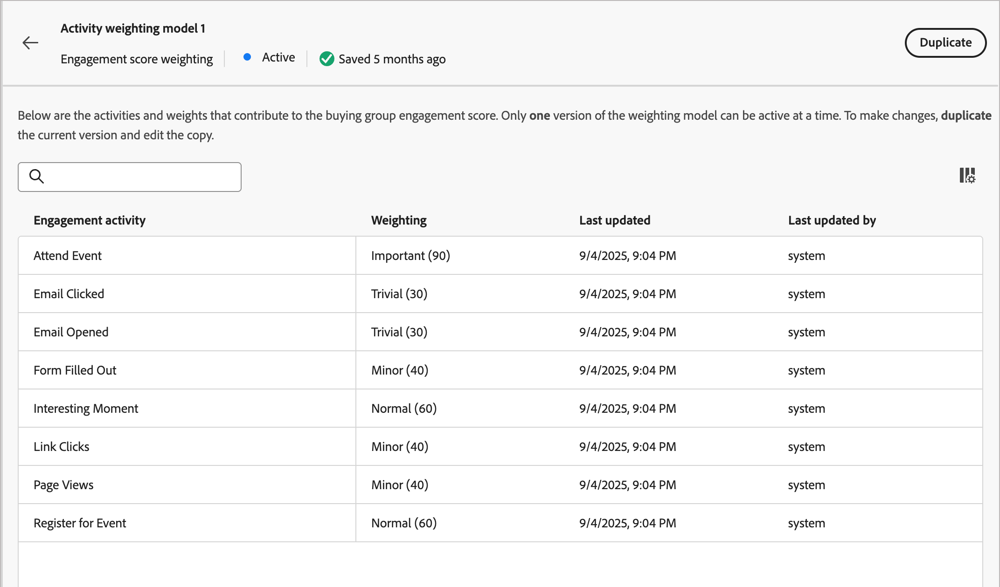

# 設定自訂參與分數加權

[購買群組參與分數](../buying-groups/engagement-scores.md)會藉由評估為購買群組成員所記錄的各種活動來反映參與程度。 透過自訂分數加權，行銷營運團隊可靈活定義自己的模型以加權活動。 自訂評分模型藉由優先處理在銷售程式中最準確地代表購買意圖的行為，而更準確地反映您的管道。

身為管理員，您可以為組織定義多個參與分數模型，但一次只能啟用一個模型。 您可以根據套用至每個參與評分活動的權重，定義評分模型。

>[!PREREQUISITES]
>
>若要定義及啟用參與分數加權模型，您必須擁有&#x200B;_[!UICONTROL 管理B2B管理組態]_ [產品許可權](./user-management.md#b2b-product-permissions)。

## 存取參與分數加權模型

開啟&#x200B;_[!UICONTROL 參與分數加權]_&#x200B;清單以檢視作用中、草稿和已封存的模型：

1. 在左側導覽列中，選擇&#x200B;**[!UICONTROL 管理]** > **[!UICONTROL 組態]**。

1. 在中間面板上按一下&#x200B;**[!UICONTROL 參與分數加權]**&#x200B;以顯示評分模型清單。

   從這個頁面，您可以[建立（複製）](#create-an-engagement-score-model)、[啟用](#activate-a-score-model)和[編輯](#change-the-engagement-weighting-settings)參與分數模型。

   {width="800" zoomable="yes"}

   清單會在頂端顯示最近更新的模型（依&#x200B;_[!UICONTROL 上次更新時間]_&#x200B;排序），並包含依&#x200B;_[!UICONTROL 名稱]_&#x200B;搜尋的功能。

   您可以按一下右上角的&#x200B;_欄設定_ （  ）圖示，並選取或清除欄核取方塊來自訂顯示的表格。

   {width="300"}

1. 若要存取參與分數模型的詳細資訊，請按一下名稱。

### 預設分數模型

系統會建立名為&#x200B;_活動加權模型1_&#x200B;的初始參與分數模型。 模型狀態和參與活動取決於[!DNL Journey Optimizer B2B Edition]環境的資料架構：

* **簡化架構** (Beta) — 如果您的環境使用[簡化架構](../simplified-architecture.md)，參與活動會以標準和自訂Experience Platform事件為基礎。 依預設，所有活動的權重為0。

  {width="600" zoomable="yes"}

* **標準架構** — 如果您的環境使用標準架構，則連線的[!DNL Marketo Engage]執行個體是參與活動資料的來源。 預設模型會一直處於活動狀態，直到您建立自訂版本並啟動它為止。

  {width="600" zoomable="yes"}

當您啟動自訂模型時，使用中的模型會變更為&#x200B;_已封存_&#x200B;狀態。 如果您決定恢復為預設參與分數模型，您可以複製原始預設模型，然後啟動它，或將其用作另一個自訂模型的起點。

### 刪除草稿模型

如果您決定不想在未來啟用草擬業務開發分數模型，可以將其刪除。 按一下清單中草稿分數模型名稱旁的&#x200B;_更多選單_ (***...***)圖示，然後選擇&#x200B;**[!UICONTROL 刪除]**。

{width="350"}

在確認對話框中，按一下「**[!UICONTROL 刪除]**」。

## 建立自訂參與計分模型

若要建立自訂參與分數模型，請複製預設模型或其他已建立的自訂模型。 您可以複製目前的&#x200B;_Active_&#x200B;模型、_草稿_&#x200B;模型或&#x200B;_已封存_&#x200B;模型。 然後，根據您的需求編輯重複模型。

1. 按一下模型名稱以開啟模型詳細資訊頁面，然後按一下右上方的&#x200B;**[!UICONTROL 複製]**。

   {width="600" zoomable="yes"}

   您也可以按一下清單中分數模型名稱旁的&#x200B;_更多選單_ (***...***)圖示，並選擇&#x200B;**[!UICONTROL 複製]**。

   ![使用[更多]功能表復製作用中的模型](./assets/configuration-engagement-scoring-model-more-duplicate.png){width="325"}

1. 在&#x200B;_複製_&#x200B;對話方塊中，輸入複製模型的唯一名稱，然後按一下&#x200B;**[!UICONTROL 複製]**。

   {width="500"}

   重複的模型會以&#x200B;_草稿_&#x200B;狀態顯示在清單中。 按一下名稱以開啟評分模型詳細資料並進行變更。

### 變更參與加權設定

權重設定會定義您可以指派給模型中每個活動的範圍。 您可以變更頻帶，以反映組織評估參與度的策略。 例如，如果您想要將較高的值指派給一般活動，您可以將&#x200B;_一般_&#x200B;加權範圍調整為65的值。 或者，您可以新增加權範圍，以擷取介於&#x200B;_一般_&#x200B;和&#x200B;_重要_&#x200B;之間的活動。 在此情況下，您可以新增頻帶，並將其標示為&#x200B;_重大_，並指派權重頻帶值為75。

1. 在分數模型詳細資訊頁面中，按一下頂端的&#x200B;**[!UICONTROL 參與權重設定]**。

   {width="600" zoomable="yes"}

1. 針對每個權重範圍，請根據您的需求調整名稱或值：

   * 變更&#x200B;_[!UICONTROL 加權頻帶]_&#x200B;欄位中的名稱。
   * 輸入新值。 您也可以按一下&#x200B;**&amp;amp；加號；**&#x200B;或&#x200B;**−**&#x200B;來增加或減少值。

   {width="500"}

1. 如有需要，請新增另一個加權範圍：

   按一下清單底部的&#x200B;**[!UICONTROL +新增加權頻帶]**。 此動作會在清單底部插入空白加權範圍。

   輸入名稱並設定頻帶的值。 請務必使用唯一的名稱和值。

1. 若要移除加權範圍，請按一下加權範圍列的&#x200B;_刪除_ （ ）圖示。

1. 完成變更後，按一下[儲存]。**&#x200B;**

### 變更活動加權

每個分數模型都包含支援的參與分數活動完整清單。

+++簡化架構的活動

簡化架構的預設模型包含Experience Platform追蹤的活動。 每個活動的權重為零(0) （未使用），直到您為其指定權重為止。 所有活動的每日頻率上限也為20，您無法加以變更。

<table style="table-layout: fixed; width: 100%; border: 0;">
<tbody>
<tr style="border: 0;">
<td>
<ul><li>Advertising點按次數 </li><li>Advertising完成 </li><li>Advertising轉換 </li><li>Advertising Federated </li><li>Advertising第一個四分位數 </li><li>Advertising曝光數 </li><li>Advertising中點 </li><li>Advertising開始 </li><li>Advertising第三個四分位數 </li><li>Advertising播放時間 </li><li>應用程式關閉 </li><li>應用程式啟動 </li><li>變更參與促銷活動步調 </li><li>Commerce Backoffice已核發的銷退折讓單 </li><li>Commerce Backoffice訂單已取消 </li><li>已下達Commerce Backoffice訂單 </li><li>Commerce Backoffice訂單已出貨專案 </li><li>Commerce Backoffice運送已完成 </li><li>Commerce結帳 </li><li>Commerce產品清單（購物車）新增專案 </li><li>Commerce產品清單（購物車）開啟 </li><li>Commerce產品清單（購物車）移除次數 </li><li>Commerce產品清單（購物車）重新開啟 </li><li>Commerce產品清單（購物車）檢視次數 </li><li>Commerce產品檢視次數 </li><li>Commerce購買次數 </li><li>Commerce儲存供日後使用 </li><li>決策主張解除 </li><li>決策主張顯示 </li><li>決策主張互動 </li></ul>
</td>
<td>
<ul><li>決策主張傳送 </li><li>決策主張觸發程式 </li><li>傳遞回饋 </li><li>直銷電子郵件已退回 </li><li>直銷電子郵件已軟退信 </li><li>直銷電子郵件已點按 </li><li>直銷電子郵件已傳遞 </li><li>直銷電子郵件已開啟 </li><li>直銷電子郵件已傳送 </li><li>已取消訂閱直銷電子郵件 </li><li>應用程式內訊息已解除 </li><li>已顯示應用程式內訊息 </li><li>與應用程式內訊息互動 </li><li>銷售機會作業新增至行銷活動 </li><li>潛在客戶操作呼叫Webhook </li><li>潛在客戶作業變更促銷活動資料流 </li><li>潛在客戶作業轉換潛在客戶 </li><li>潛在客戶操作有趣的時刻 </li><li>潛在客戶作業合併潛在客戶 </li><li>潛在客戶作業新潛在客戶 </li><li>潛在客戶作業收入階段已變更 </li><li>潛在客戶作業分數已變更 </li><li>促銷活動進度中的潛在客戶作業狀態已變更 </li></ul>
</td>
<td>
<ul><li>潛在客戶作業新增至清單 </li><li>潛在客戶作業從清單移除 </li><li>位置退出 </li><li>Media adBreakComplete </li><li>Media adBreakStart </li><li>媒體廣告完成 </li><li>Media adSkip </li><li>Media adStart </li><li>媒體位元速率變更 </li><li>媒體緩衝開始 </li><li>Media chapterComplete </li><li>Media chapterSkip </li><li>Media chapterStart </li><li>媒體自訂追蹤 </li><li>媒體下載內容 </li><li>媒體錯誤 </li><li>Media pauseStart </li><li>媒體Ping </li><li>媒體播放 </li><li>媒體工作階段完成 </li><li>媒體工作階段結束 </li><li>媒體工作階段開始 </li><li>媒體狀態更新 </li><li>訊息回饋 </li><li>訊息呈現資料 </li><li>訊息追蹤 </li><li>機會事件新增至機會 </li><li>機會事件機會已更新 </li><li>機會事件從機會移除 </li><li>推播追蹤應用程式已開啟 </li><li>推播追蹤自訂動作 </li><li>網路表單已填寫 </li><li>Web Webinteraction連結點選次數 </li><li>網頁詳細資訊頁面檢視次數</li></ul>
</td>
</tbody>
</table>

+++

+++標準架構的活動

標準架構的預設模型包含具有相關預設權重的[!DNL Marketo Engage]個追蹤活動。 複製此模型時，您可以視需要變更加權。 您無法變更最大每日頻率。

{{engagement-activities-me}}

+++

針對清單中的每個活動，設定您要指派給每個活動發生次數的值。 按一下&#x200B;**[!UICONTROL 加權]**&#x200B;欄位中的向下箭頭，然後選擇參與加權設定中所定義的加權頻帶。

{width="600" zoomable="yes"}

如果您不希望參與分數計算使用活動，請將加權設為零(0)值。

您的變更會自動儲存。

## 啟用分數模型

當您啟動草繪分數模型時，它會取代目前啟動的模型。 目前作用中的模型會自動封存。

1. 開啟草稿分數模型以檢視詳細資訊頁面。

1. 按一下&#x200B;**[!UICONTROL 啟動]**。

1. 在確認對話方塊中，按一下&#x200B;**[!UICONTROL 啟動]**。

   {width="400"}
