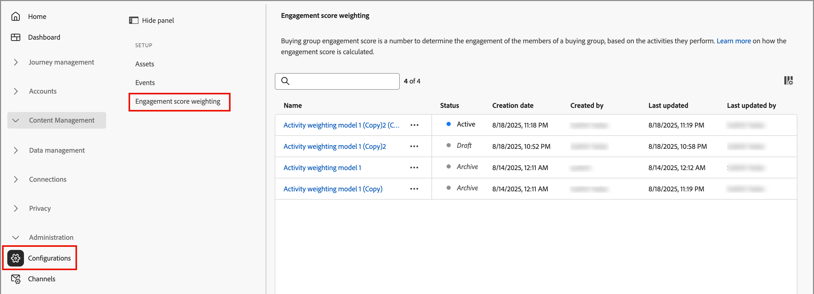
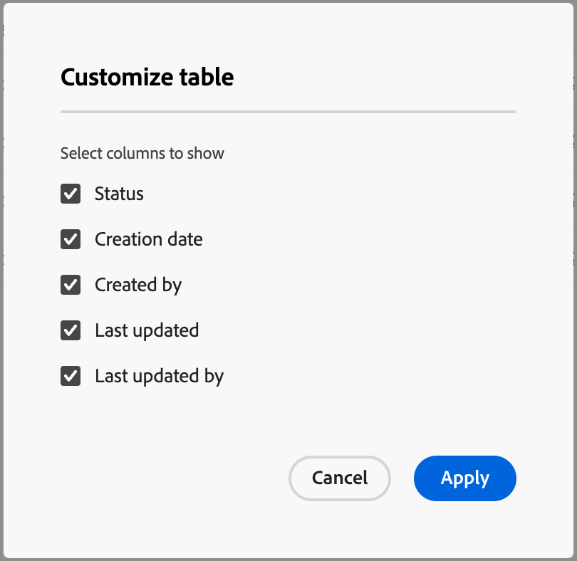
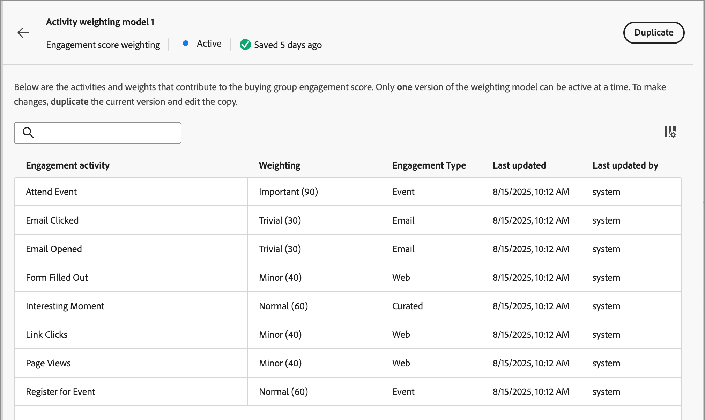
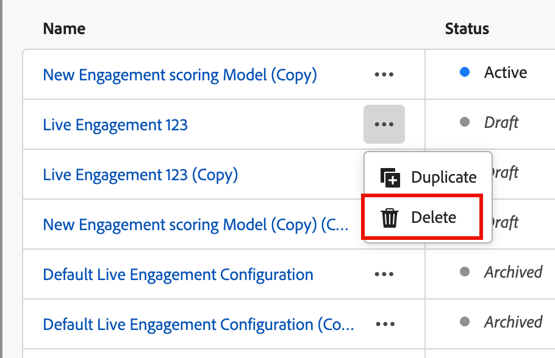
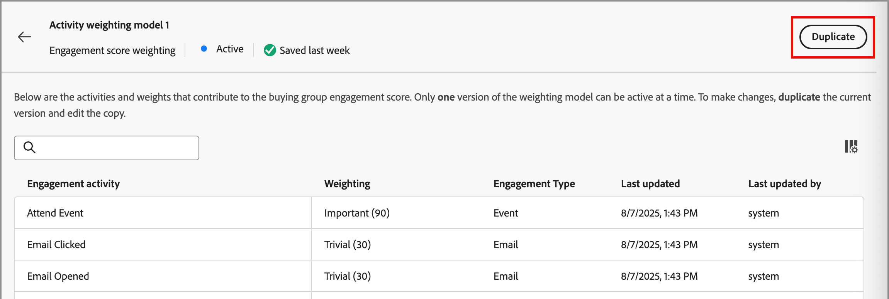
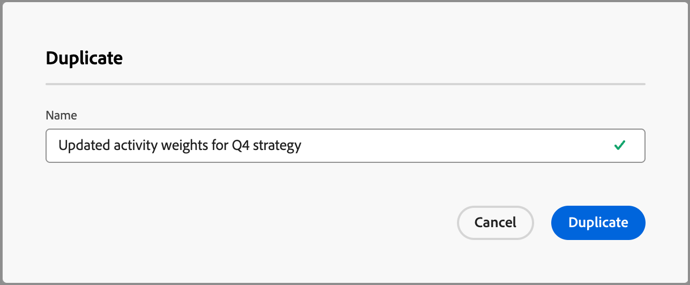
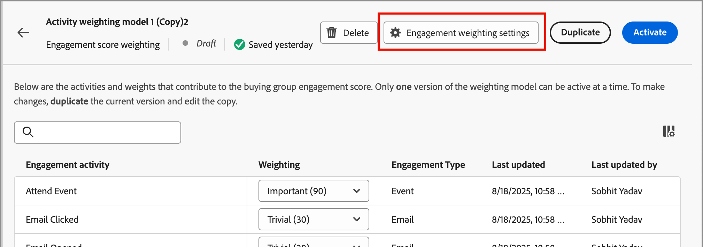
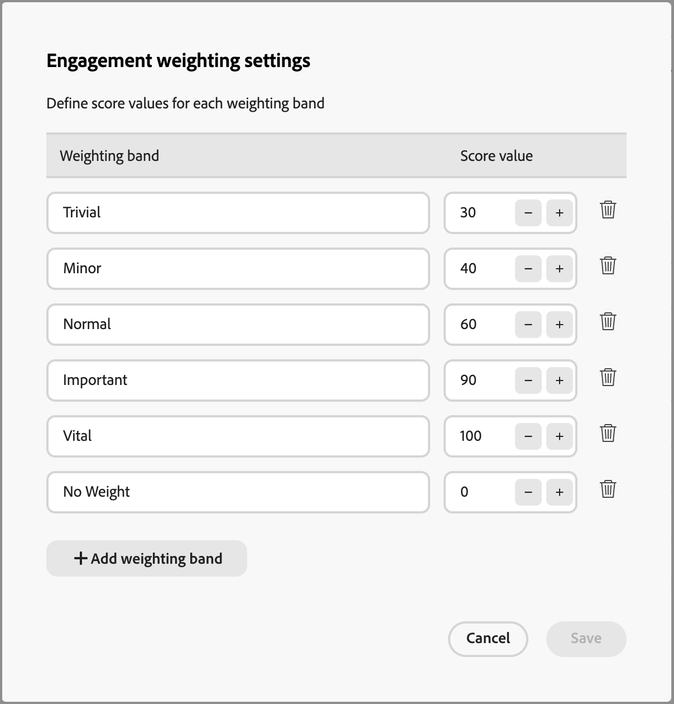
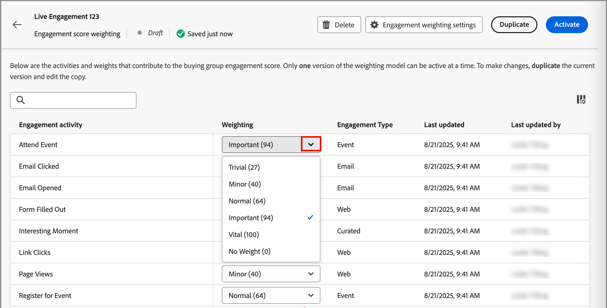
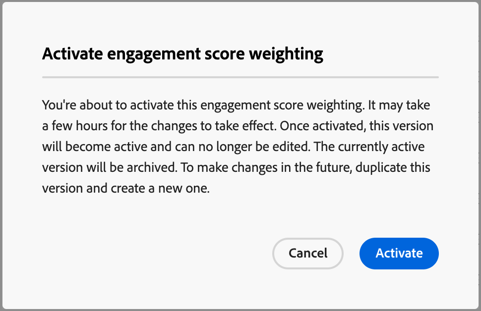

# 設定自訂參與分數加權

購買群組參與分數會透過評估為購買群組成員記錄的各種活動來反映參與程度。 透過自訂分數加權，行銷營運團隊可靈活定義自己的模型，用於加權對參與最有意義的活動。 自訂評分模型藉由優先處理在銷售程式中最準確地代表購買意圖的行為，而更準確地反映您的管道。

身為管理員，您可以為組織定義多個參與分數模型，但一次只能啟用一個模型。 您可以根據套用至每個參與評分活動的權重，定義評分模型。

## 存取參與分數加權模型

1. 在左側導覽列中，選擇&#x200B;**[!UICONTROL 管理]** > **[!UICONTROL 組態]**。

1. 在中間面板上按一下&#x200B;**[!UICONTROL 參與分數加權]**&#x200B;以顯示評分模型清單。

   從這個頁面，您可以[建立（複製）](#create-an-engagement-score-model)、[啟用](#activate-a-score-model)和[編輯](#change-the-engagement-weighting-settings)參與分數模型。

   {width="800" zoomable="yes"}

   此表格在頂端顯示最近更新的模型（依&#x200B;_[!UICONTROL 上次更新時間]_&#x200B;排序），並包含依&#x200B;_[!UICONTROL 名稱]_&#x200B;搜尋的功能。 您可以按一下右上角的&#x200B;_欄設定_ （  ）圖示，並選取或清除欄核取方塊來自訂顯示的表格。

{width="300"}

1. 若要存取參與分數模型的詳細資訊，請按一下名稱。

### 預設分數模型

系統會建立名為&#x200B;_活動加權模型1_&#x200B;的初始參與分數模型，在您建立自己的自訂模型並啟動它之前，此模型為作用中模型。 當您啟動自訂模型時，預設模型會變更為&#x200B;_已封存_&#x200B;狀態。 如果您決定恢復為預設參與分數模型，或將其用作另一個自訂模型的起點，則可以複製它。

{width="600" zoomable="yes"}

### 刪除草稿模型

如果您決定不想在未來啟用草擬業務開發分數模型，可以將其刪除。 按一下清單中草稿分數模型名稱旁的&#x200B;_更多選單_ (***...***)圖示，然後選擇&#x200B;**[!UICONTROL 刪除]**。

{width="350"}

在確認對話框中，按一下「**[!UICONTROL 刪除]**」。

## 建立自訂參與計分模型

若要建立自訂參與分數模型，請複製預設模型或其他已建立的自訂模型。 您可以複製目前的&#x200B;_Active_&#x200B;模型、_草稿_&#x200B;模型或&#x200B;_已封存_&#x200B;模型。 然後，根據您的需求編輯重複模型。

1. 按一下模型名稱以開啟模型詳細資訊頁面，然後按一下右上方的&#x200B;**[!UICONTROL 複製]**。

   {width="600" zoomable="yes"}

   您也可以按一下清單中分數模型名稱旁的&#x200B;_更多選單_ (***...***)圖示，並選擇&#x200B;**[!UICONTROL 複製]**。

   ![使用[更多]功能表復製作用中的模型](./assets/configuration-engagement-scoring-model-more-duplicate.png){width="325"}

1. 在&#x200B;_複製_&#x200B;對話方塊中，輸入複製模型的唯一名稱，然後按一下&#x200B;**[!UICONTROL 複製]**。

   {width="500"}

   重複的模型會以&#x200B;_草稿_&#x200B;狀態顯示在清單中。 按一下名稱以開啟評分模型詳細資料並進行變更。

### 變更參與加權設定

權重設定會定義您可以指派給模型中每個活動的範圍。 您可以變更頻帶，以反映組織評估參與度的策略。 例如，如果您想要將較高的值指派給一般活動，您可以將&#x200B;_一般_&#x200B;加權範圍調整為65的值。 或者，您可以新增加權範圍，以擷取介於&#x200B;_一般_&#x200B;和&#x200B;_重要_&#x200B;之間的活動。 在此情況下，您可以新增頻帶，並將其標示為&#x200B;_重大_，並指派權重頻帶值為75。

1. 在分數模型詳細資訊頁面中，按一下頂端的&#x200B;**[!UICONTROL 參與權重設定]**。

   {width="600" zoomable="yes"}

1. 針對每個權重範圍，請根據您的需求調整名稱或值：

   * 變更&#x200B;_[!UICONTROL 加權頻帶]_&#x200B;欄位中的名稱。
   * 輸入新值。 您也可以按一下&#x200B;**&amp;amp；加號；**&#x200B;或&#x200B;**−**&#x200B;來增加或減少值。

   {width="500"}

1. 如有需要，請新增另一個加權範圍：

   按一下清單底部的&#x200B;**[!UICONTROL +新增加權頻帶]**。 此動作會在清單底部插入空白加權範圍。

   輸入名稱並設定頻帶的值。 請務必使用唯一的名稱和值。

1. 如有需要，請移除加權範圍，然後按一下加權範圍列的&#x200B;_刪除_ （  ）圖示。

1. 完成變更後，按一下[儲存]。**&#x200B;**

### 變更活動加權

每個分數模型都包含支援的參與分數活動完整清單：

{{engagement-activities}}

針對清單中的每個活動，設定您要指派給每個活動發生次數的值。 按一下&#x200B;**[!UICONTROL 加權]**&#x200B;欄位中的向下箭頭，然後選擇參與加權設定中所定義的加權頻帶。

{width="500"}

如果您不希望參與分數計算使用活動，請將加權設為零(0)值。

您的變更會自動儲存。

## 啟用分數模型

當您啟動草繪分數模型時，它會取代目前啟動的模型。 目前作用中的模型會自動封存。

1. 開啟草稿分數模型以檢視詳細資訊頁面。

1. 按一下&#x200B;**[!UICONTROL 啟動]**。

1. 在確認對話方塊中，按一下&#x200B;**[!UICONTROL 啟動]**。

   {width="400"}
