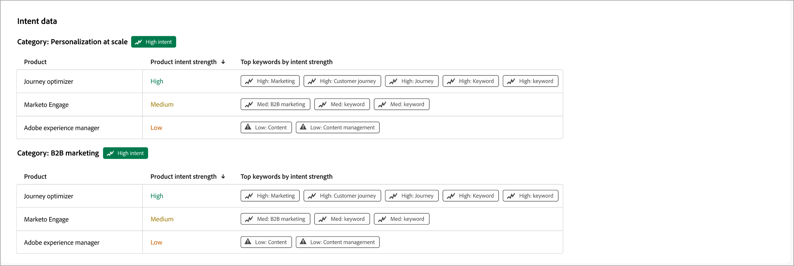
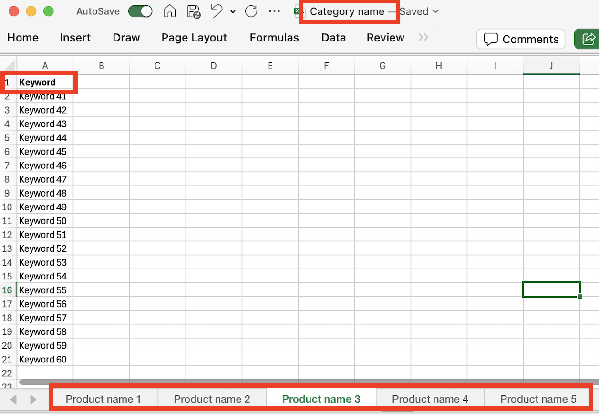

# 意圖資料

在Journey Optimizer B2B edition中，意圖偵測模型會根據潛在客戶活動，以足夠高的信賴度預測感興趣的解決方案/產品。 它也會運用其他帳戶共同成員的活動，以及標籤的內容。 個人的意圖可解譯為對產品感興趣的可能性。

* 意圖層級 — 可用於已知銷售機會、帳戶和購買群組層級。
* 意圖訊號型別 — 關鍵字、產品和解決方案

{width="700" zoomable="yes"}

若要啟用此功能，您可以在試算表中提交關鍵字清單給Adobe客戶經理。 這些關鍵字用於內容標籤。

關鍵字集（最多20個）可與產品相關聯。 一組產品（最多20個）可以與類別相關聯。 您最多可以有20個類別。 這個整個模型是透過簡單的試算表來達成，該試算表會被擷取。 試算表可以包含與產品名稱相關的單一標籤，也可以包含與關鍵字清單相關的一欄。

{width="500" zoomable="yes"}

您可以新增多個標籤，每個標籤都具有產品名稱，而整個試算表都可以與類別相互關聯。

{width="500" zoomable="yes"}
