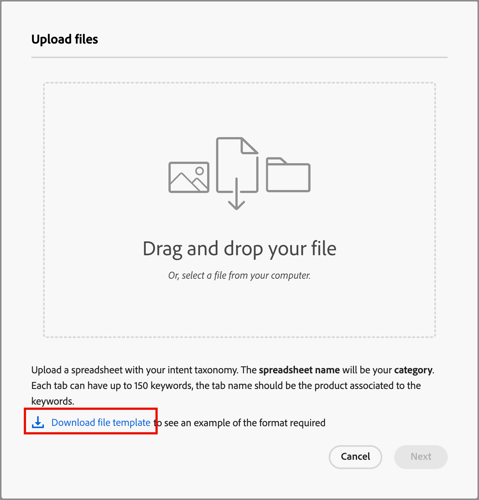
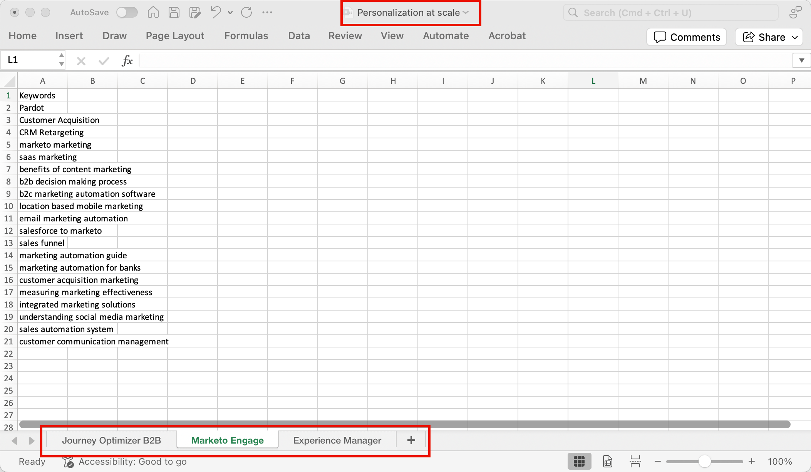
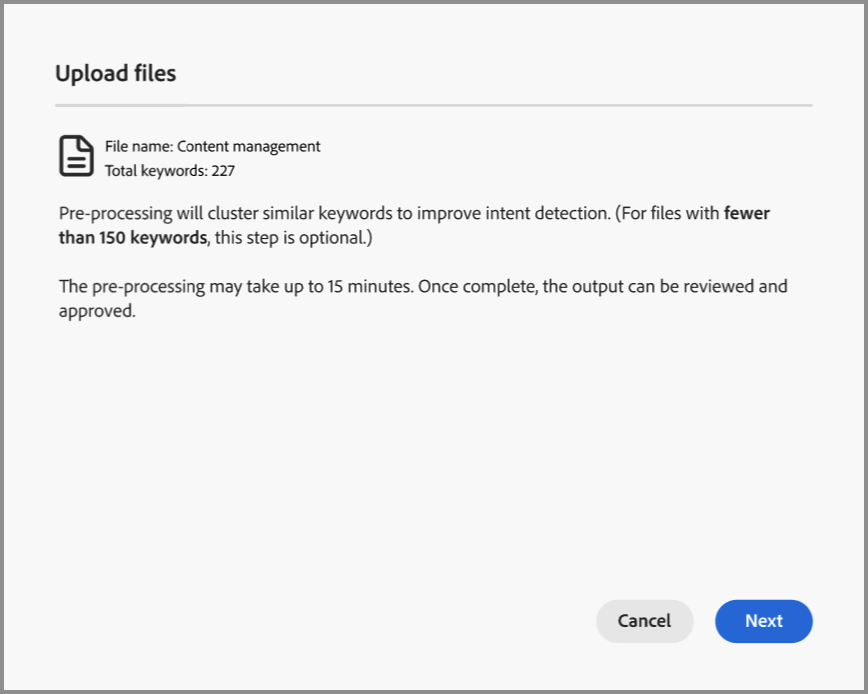
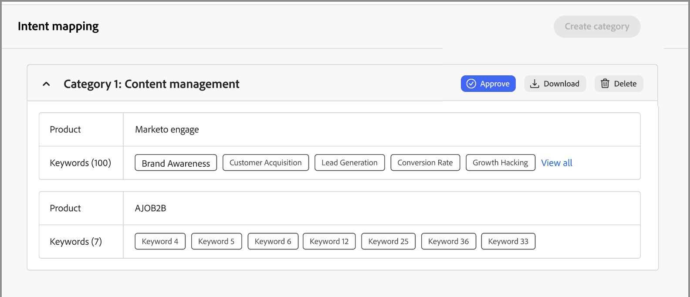
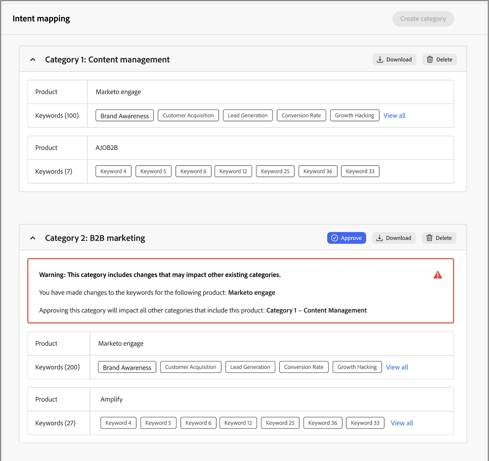

# 意圖資料

在Journey Optimizer B2B edition中，意圖偵測模型會根據潛在客戶活動，以足夠高的信賴度預測感興趣的解決方案/產品。 它也會運用其他帳戶共同成員的活動，以及標籤的內容。 個人的意圖可解譯為對產品感興趣的可能性。

* 意圖層級 — 可用於已知銷售機會、帳戶和購買群組層級。
* 意圖訊號型別 — 關鍵字、產品和解決方案

意圖資料用於&#x200B;[_智慧型儀表板_](../dashboards/intelligent-dashboard.md)、[_帳戶詳細資料_&#x200B;頁面](../accounts/account-details.md)、[_購買群組詳細資料_&#x200B;頁面](../buying-groups/buying-group-details.md)和&#x200B;[_個人詳細資料_&#x200B;頁面](../accounts/person-details.md)。

{width="700" zoomable="yes"}

## 準備您的意圖對應資料

若要啟動此功能，請使用標籤來定義意圖分類法，以建立試算表，例如Microsoft Excel檔案。 整個試算表會作為一個類別上傳，該類別可以有多個產品，每個產品可以有多個關鍵字。 針對您要定義的每個類別，針對意圖對應試算表使用下列定義：

* 試算表名稱= _類別名稱_
* 每個標籤=您的產品名稱
* 每個索引標籤包含一欄=產品關鍵字（最多150個）

您可以下載Excel檔案，作為準備對應資料的範本。 若要下載範本：

1. 在左側導覽中，選擇&#x200B;**[!UICONTROL 管理]** > **[!UICONTROL 組態]**。

1. 在中間面板中按一下&#x200B;**[!UICONTROL 意圖對應]**。

1. 按一下&#x200B;**[!UICONTROL 建立類別]**。

1. 在對話方塊中，按一下&#x200B;**[!UICONTROL 下載檔案範本]**&#x200B;連結。

   {width="500"}

1. 按一下&#x200B;**[!UICONTROL 取消]**。

   完成後，您可以返回上傳準備的檔案。

1. 使用範本來定義您的意圖對應資料：

   * 重新命名檔案以反映您的類別名稱，例如&#x200B;_縮放的Personalization_。
   * 根據您的產品名稱重新命名每個標籤，例如&#x200B;_Journey Optimizer B2B_、_Marketo Engage_&#x200B;和&#x200B;_Experience Manager_。
   * 為每個索引標籤新增產品關鍵字，例如&#x200B;_B2B行銷_、_品牌認可_&#x200B;和&#x200B;_潛在客戶參與度_。

   {width="600" zoomable="yes"}

## 上傳類別檔案

當您的試算表準備就緒時，請返回&#x200B;_[!UICONTROL 意圖對應]_&#x200B;設定頁面並上傳檔案。

1. 按一下&#x200B;**[!UICONTROL 建立類別]**。

1. 將檔案拖放到&#x200B;_[!UICONTROL 上傳檔案]_&#x200B;對話方塊中，或按一下&#x200B;**[!UICONTROL 選取檔案]**&#x200B;以尋找並選取您系統上的檔案。

1. 按一下&#x200B;**[!UICONTROL 下一步]**。

   預先處理執行以叢集類似的關鍵字，這會改善意圖偵測並避免關鍵字稀釋。 此前置處理一旦完成，就會顯示脈衝通知（視資料而定，最長15分鐘）。

   {width="500"}

   結果會顯示在&#x200B;_意圖對應_&#x200B;頁面中。

   {width="600" zoomable="yes"}

## 核准或拒絕類別

檢閱類別清單，然後按一下&#x200B;**[!UICONTROL 核准]**&#x200B;以啟用關鍵字，以用於智慧型儀表板、帳戶詳細資訊頁面、購買群組詳細資訊頁面和人員詳細資訊頁面。 按一下[檢視全部]&#x200B;**&#x200B;**&#x200B;以顯示每個產品的完整清單，或按一下[下載]&#x200B;**&#x200B;**&#x200B;以Excel檔案檢視完整清單。

如果您對清單不滿意，可以按一下&#x200B;**[!UICONTROL 刪除]**&#x200B;以移除類別。 接著，您可以調整試算表檔案，再開始上傳程式以定義該類別。

>[!IMPORTANT]
>
>您必須核准或拒絕（刪除）新類別，才能新增其他類別或編輯類別。

如果您新增另一個類別，而且其分類會影響現有類別，則會出現警告。 當您決定核准或拒絕類別時，請考慮此影響。 如果產品用於多個類別，則所有類別中的產品與關鍵字對應應該是相同的。

{width="600" zoomable="yes"}
