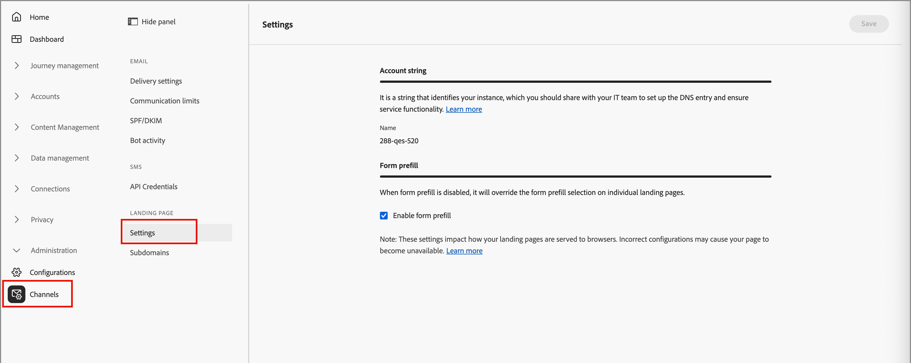
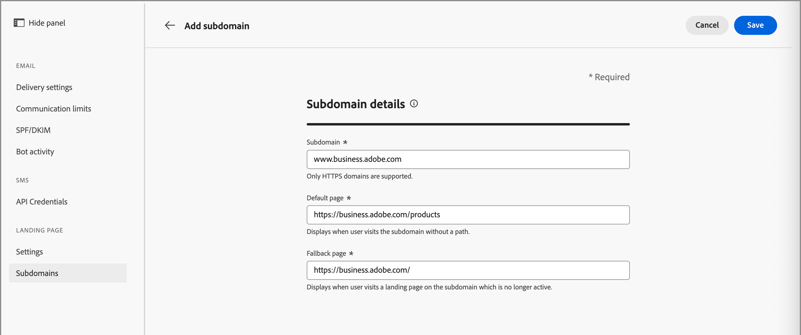

# 登陸頁面設定

管理員應確保為製作和發佈這些頁面的行銷人員設定登入頁面設定。

## 設定

若要檢閱登入頁面設定，請移至&#x200B;**[!UICONTROL 管理]** > **[!UICONTROL 管道]**。 在導覽面板的&#x200B;_[!UICONTROL 登陸頁面]_&#x200B;下，選取&#x200B;**[!UICONTROL 設定]**。

{width="800" zoomable="yes"}

### 帳戶字串 {#account-string}

>[!CONTEXTUALHELP]
>id="ajo-b2b_landing_pages_account_string"
>title="登陸頁面帳戶字串"
>abstract="帳戶字串會識別託管登陸頁面的 Adobe Journey Optimizer B2B Edition 執行個體。"

帳戶字串可識別託管登入頁面的Adobe Journey Optimizer B2B edition例項。 請確定您的系統團隊新增並設定DNS專案。

### 表單預填 {#form-prefill}

>[!CONTEXTUALHELP]
>id="ajo-b2b_landing_pages_form_prefill"
>title="登陸頁面表單預填設定"
>abstract="您可以啟用表單預填選項，以允許登陸頁面中的表單使用已知使用者的預填資訊。"

啟用&#x200B;**[!UICONTROL 表單預填]**&#x200B;選項，以允許登入頁面中的表單使用已知使用者的預填資訊。 停用此選項時，登入頁面作者無法包含預填的表單欄位。

### 資料流 {#datastream}

>[!CONTEXTUALHELP]
>id="ajo-b2b_landing_pages_datastream"
>title="資料流需求"
>abstract="需要Datastream才能從此網域上的登入頁面收集頁面事件。"

>[!CONTEXTUALHELP]
>id="ajo-b2b_landing_pages_missing_datastream"
>title="缺少資料串流ID"
>abstract="子網域缺少正確路由所需的資料串流ID。 在「設定」中進行設定以繼續"

設定&#x200B;**[!UICONTROL Datastream]**&#x200B;選項，設定登陸頁面事件集合的資料流。

## 子網域 {#add-subdomain}

>[!CONTEXTUALHELP]
>id="ajo-b2b_landing_pages_add_subdomain"
>title="新增登陸頁面子網域"
>abstract="您最多可以新增 50 個子網域。針對您想要在 Adobe Journey Optimizer B2B Edition 託管的每個唯一品牌 URL 設定新的子網域。"

>[!CONTEXTUALHELP]
>id="ajo-b2b_landing_pages_configure_subdomain"
>title="設定登陸頁面子網域"
>abstract="需要已設定的子網域才能發佈登陸頁面。您可以使用已委派給 Adobe 的子網域，或建立新的子網域。"

登陸頁面子網域應有助於識別內容型別、產品名稱或促銷活動，並強化頁面真實性。 設定子網域之前，請先定義一或多個CNAME以用於登入頁面。 例如：

* **產品**。[CompanyDomain].com
* **執行**。[CompanyDomain].com
* **註冊**。[CompanyDomain].com

在這些範例中，第一部分（粗體字）是`LandingPageCNAME`。

為您要託管於Adobe Journey Optimizer B2B edition上的每個唯一品牌URL新增子網域。 您最多可以新增50個子網域。

>[!IMPORTANT]
>
>不允許將無效的子網域委派給Adobe。 請務必輸入貴組織擁有的有效子網域，例如&#x200B;_marketing.yourcompany.com_。

若要檢閱您的子網域並新增子網域，請移至&#x200B;**[!UICONTROL 管理]** > **[!UICONTROL 管道]**。 在導覽面板的&#x200B;_[!UICONTROL 登陸頁面]_&#x200B;下，選取&#x200B;**[!UICONTROL 子網域]**。

{width="800" zoomable="yes"}

新增登陸頁面子網域&#x200B;:_(_T)

1. 按一下右上角的&#x200B;**[!UICONTROL 新增子網域]**。

1. 在&#x200B;_[!UICONTROL 子網域詳細資料]_&#x200B;中，輸入子網域資訊：

   * **[!UICONTROL 子網域]** — 要使用的子網域URL，例如`marketing.yourcompany.com`
   * **[!UICONTROL 預設頁面]** — 預設子網域頁面的URL，例如`marketing.yourcompany.com/products`
   * **[!UICONTROL 後援頁面]** — 如果子網域上的登陸頁面未啟用（例如`marketing.yourcompany.com/expired`），則使用後援頁面的URL

   {width="700" zoomable="yes"}

1. 按一下&#x200B;**[!UICONTROL 儲存]**。
