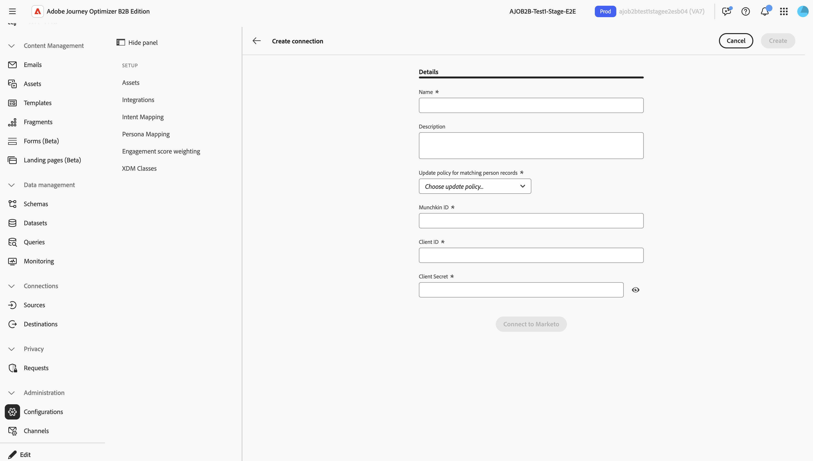
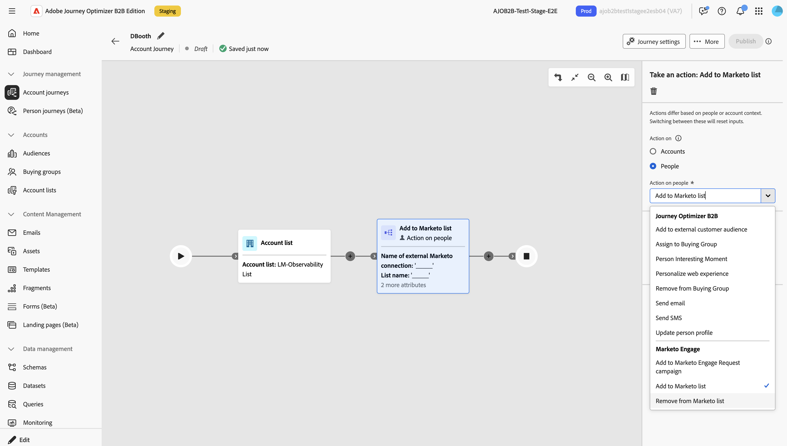

# 啟動Marketo Engage執行個體以支援動作

Marketo Engage動作是&#x200B;_以人物為基礎的_&#x200B;動作，可讓您在Journey Optimizer B2B edition與Marketo Engage中的&#x200B;_潛在客戶為基礎的_&#x200B;行銷工作之間，協調您的&#x200B;_以帳戶為基礎的_&#x200B;行銷協調。 使用這些動作來編排靜態清單成員資格，並將人員放入行銷活動。

若要使用Marketo Engage動作，管理員必須先在Marketo Engage中建立[自訂服務](https://experienceleague.adobe.com/en/docs/marketo-developer/marketo/rest/custom-services#)，此服務提供驗證所需的認證。
接著，Journey Optimizer B2B edition的產品管理員會輸入認證，以建立與Marketo Engage的連線。
接著Journey Optimizer B2B edition使用者可以參考連線，在<!-- Person and -->帳戶歷程中設定Marketo Engage動作，例如從Marketo Engage清單新增或移除人員，或將他們新增至請求行銷活動。

資產（例如清單和行銷活動）的Marketo Engage工作區可見度是由自訂服務中指派的角色許可權所管理。

同一個連線可在歷程中多次使用，不同的Marketo Engage連線可在單一歷程中並存。

當動作執行時，它會使用選擇原則來決定Marketo Engage中的哪些人員記錄，以選擇統一人員設定檔中是否存在多個識別碼。 選項包括選擇最舊、最新或所有相符的Marketo Engage記錄。 除了發生錯誤外，無論符合何項，人員都會繼續此歷程。

## 設定Marketo Engage連線

設定遠端Marketo Engage執行個體以搭配Marketo Engage歷程動作使用。

### 建立Marketo Engage自訂服務

1. 以管理員身分登入Marketo Engage並建立自訂服務。
1. 記錄下列值以用於連線：

   * Munchkin ID
   * 用戶端 ID
   * 使用者端密碼

### 新增整合

1. 在Journey Optimizer B2B edition中，導覽至&#x200B;**管理** > **設定**。
1. 選取&#x200B;**整合**&#x200B;標籤。
1. 按一下&#x200B;**[!UICONTROL 建立連線]**。
1. 輸入名稱（必要）和說明（選擇性）。
1. 選取符合人員記錄的&#x200B;**選取原則**。
1. 輸入您的Munchkin ID、使用者端ID和使用者端密碼。
1. 按一下&#x200B;**[!UICONTROL 連線至Marketo]**。
1. 按一下&#x200B;**[!UICONTROL 建立]**。

當行銷人員在歷程中使用Marketo Engage動作時，他們可以使用連線名稱設定節點。

完成整合後，便可從節點屬性中的&#x200B;**動作：**&#x200B;取得Marketo Engage動作。

