# 使用者管理

布建完成並繫結沙箱後，請完成下列步驟，為團隊和使用者提供Adobe Journey Optimizer B2B edition存取權。

1. [在Admin Console中建立Marketo Engage產品設定檔](#marketo-engage-profile) (僅限新的Marketo Engage執行個體)。
1. 在Admin Console中[建立使用者群組](#create-user-group)。
1. [編輯內建角色](#edit-roles)或[建立具有Journey Optimizer B2B edition許可權的自訂角色](#create-a-custom-role)。
1. [新增使用者](#add-users)或[群組](#add-user-groups-to-a-role)至角色。

作為管理員，您可以在Adobe Admin Console中完成這些工作，這是管理您的Adobe產品授權和使用者的中心位置。 在Admin Console中，您可以在單一位置而非在各種個別解決方案中建立和管理使用者。 請參閱[Admin Console概觀](https://helpx.adobe.com/tw/enterprise/using/admin-console.html)頁面，進一步瞭解其功能和特性。

## 存取Admin Console

在使用Admin Console管理團隊中的使用者之前，您需要確保您可以存取Admin Console並擁有適當的許可權。

1. 作為系統管理員，您應該會在上線流程中收到來自Adobe的多封電子郵件。

   尋找歡迎電子郵件，提供您被授予存取權的組織名稱相關資訊。

1. 按一下歡迎電子郵件中的&#x200B;**[!UICONTROL 開始使用]**&#x200B;連結，以瀏覽至Admin Console。

   如果找不到電子郵件，請直接在[https://adminconsole.adobe.com](https://adminconsole.adobe.com)開啟瀏覽器並存取Admin Console。

1. 使用您的Adobe ID登入。

   登入成功後，您會看到Adobe Admin Console的&#x200B;_概觀_&#x200B;頁面。

1. 如果您可以存取多個組織，請確保您已登入正確的組織。

   若要變更您的組織，請按一下右上角的組織名稱，然後選擇您需要存取的組織。

1. 從&#x200B;**[!UICONTROL 使用者]**&#x200B;卡中選擇&#x200B;_[!UICONTROL 管理員]_&#x200B;以驗證您是系統管理員。

   ![Admin Console概觀 — 按一下[管理員]](./assets/admin-console-overview-administrators.png){width="700" zoomable="yes"}

1. 透過輸入您的Adobe ID電子郵件、使用者名稱、名字或姓氏進行搜尋。

   * 如果您的存取權設定正確，搜尋會傳回您的記錄。

   * 如果&#x200B;**[!UICONTROL 管理員角色]**&#x200B;欄中的值顯示`System`，您就知道您（或顯示的使用者）是系統管理員。

## 建立Marketo Engage產品設定檔 {#marketo-engage-profile}

在授與使用者Adobe解決方案的存取權時，您不一定要授與他們完整的存取權。 產品設定檔使每個解決方案都可以擁有自己的一組使用者許可權。 使用Admin Console指派產品設定檔。

如需有關使用產品設定檔取得使用者許可權的詳細資訊，請參閱Admin Console檔案中的[管理企業使用者的產品設定檔](https://helpx.adobe.com/tw/enterprise/using/manage-product-profiles.html){target="_blank"}。

>[!BEGINSHADEBOX]

新增使用者至Marketo Engage產品設定檔時，他們隨後會新增至Marketo Engage訂閱預設工作區中的&#x200B;_標準使用者_&#x200B;角色。 此角色會授予他們該工作區中Marketo Engage的所有&#x200B;_標準使用者_&#x200B;許可權。 目前，所有Journey Optimizer B2B edition使用者都必須是Marketo Engage使用者。 Marketo Engage管理員可以更新&#x200B;_標準使用者_&#x200B;角色的許可權，或將使用者移至其他具有更嚴格許可權的Marketo Engage使用者角色，以限制存取權。

如需有關在Marketo Engage中管理這些許可權的詳細資訊，請參閱Marketo Engage檔案中的[管理使用者角色和許可權](https://experienceleague.adobe.com/en/docs/marketo/using/product-docs/administration/users-and-roles/managing-user-roles-and-permissions){target="_blank"}。

>[!ENDSHADEBOX]

{width="30"}系統管理員或Marketo Engage產品管理員可以執行下列步驟。

1. 登入[https://adminconsole.adobe.com](https://adminconsole.adobe.com)。

1. 選取「**[!UICONTROL 產品]**」標籤。

1. 開啟您想要新增設定檔的Marketo Engage執行個體，然後按一下&#x200B;**[!UICONTROL 新增設定檔]**。

   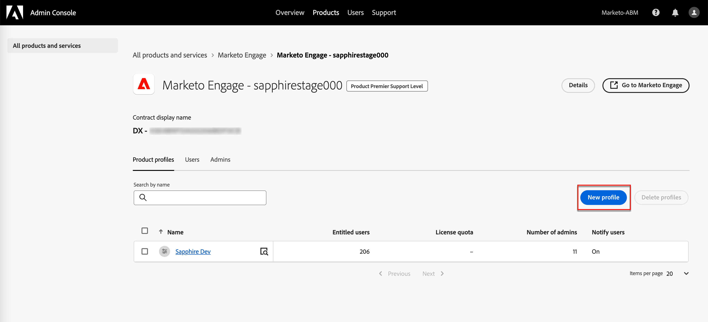{width="700" zoomable="yes"}

1. 輸入產品設定檔名稱，例如&#x200B;_標準使用者_。

1. 按一下[下一步]****，然後按一下[儲存]****。

## 建立使用者群組 {#create-user-group}

使用者群組是使用者被授予一組共用許可權的集合。 您可以在使用者群組中新增或移除使用者。 當群組內的使用者變更時，群組許可權會維持不變。

如需有關如何使用使用者群組來管理許可權的詳細資訊，請參閱Admin Console檔案中的[管理使用者群組](https://helpx.adobe.com/tw/enterprise/using/user-groups.html){target="_blank"}。

{width="30"}系統管理員可以執行下列步驟。

1. 登入[https://adminconsole.adobe.com](https://adminconsole.adobe.com)。

1. 選取&#x200B;**[!UICONTROL 使用者]**&#x200B;索引標籤。

1. 在左側導覽中選擇&#x200B;**[!UICONTROL 使用者群組]**。

1. 按一下右上角的&#x200B;**[!UICONTROL 新增使用者群組]**。

1. 輸入使用者群組的名稱，例如&#x200B;_標準使用者_，然後按一下&#x200B;**[!UICONTROL 儲存]**。

1. 按一下您剛建立的使用者群組。

1. 選取&#x200B;**[!UICONTROL 指派的產品設定檔]**&#x200B;索引標籤，然後按一下&#x200B;**[!UICONTROL 指派設定檔]**。

1. 按一下&#x200B;**+**&#x200B;並新增下列產品的每個執行個體：

   * [!UICONTROL Marketo Engage]
   * [!UICONTROL Adobe Experience Platform - AEP-Default-All-Users]
   * [!UICONTROL Adobe Experience Platform Data Collection — 預設資料收集所有存取權]
   * [!UICONTROL Adobe Experience Platform — 預設的生產所有存取權]

   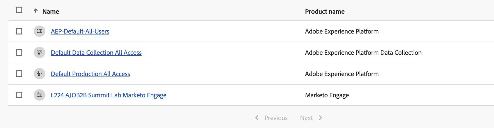{width="550" zoomable="yes"}

1. 按一下&#x200B;**[!UICONTROL 儲存]**。

## 新增使用者至群組

如需使用者管理的相關資訊，請參閱Admin Console檔案中的[Admin Console使用者](https://helpx.adobe.com/tw/enterprise/using/user-groups.html)。

{width="30"}系統管理員或產品管理員可以執行下列步驟。 產品管理員只能新增其組織中已存在的使用者。

1. 移至[https://adminconsole.adobe.com](https://adminconsole.adobe.com)。

1. 在&#x200B;_[!UICONTROL 快速連結]_&#x200B;下，按一下&#x200B;**[!UICONTROL 新增使用者]**。

1. 新增每個使用者：

   * 輸入使用者的電子郵件地址、名字和姓氏。

     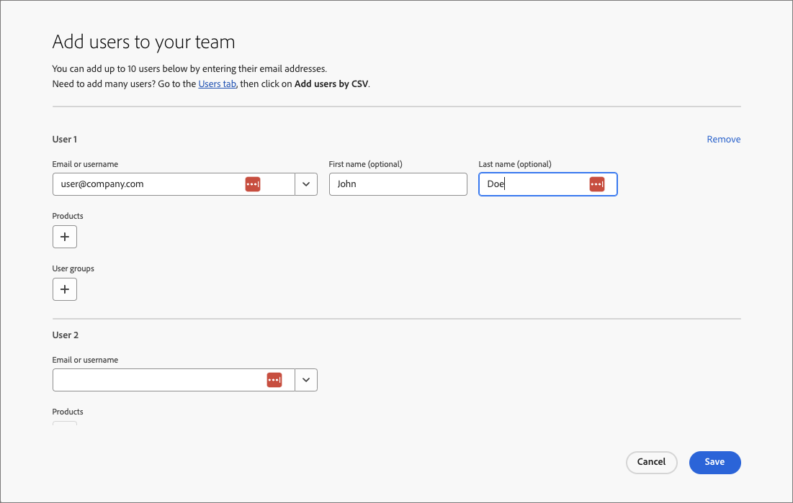{width="600" zoomable="yes"}

   * 若為&#x200B;**[!UICONTROL 使用者群組]**，請按一下&#x200B;**+**。

   * 選取您先前建立的使用者群組。

   * 按一下&#x200B;**[!UICONTROL 套用]**。

1. 按一下&#x200B;**[!UICONTROL 儲存]**。

## 編輯產品許可權的角色 {#edit-roles}

許可權是統一許可權，可讓您定義指派給產品設定檔的授權。 每個許可權都是透過功能收集而得，例如歷程或購買群組，這些功能代表Journey Optimizer B2B edition中的不同功能或物件。

Adobe Experience Platform的&#x200B;_許可權_&#x200B;區域是管理員可以定義使用者角色和存取原則，以管理產品應用程式內功能和物件的存取許可權。 在此應用程式中，您可以建立和管理角色，並為這些角色指派所需的資源許可權。 許可權也可讓您管理與特定角色相關聯的沙箱和使用者。

如需Experience Platform中角色許可權的詳細資訊，請參閱Experience Platform檔案中的[管理角色](https://experienceleague.adobe.com/en/docs/experience-platform/access-control/abac/permissions-ui/permissions){target="_blank"}。

### B2B產品許可權

下列許可權控管對Journey Optimizer B2B edition功能的存取：

| 類別 | 說明 | 權限 |
| -------- | ----------- | ---------- |
| B2B帳戶清單 | 設定、管理、檢視和發佈B2B帳戶清單的許可權。 這些許可權包括帳戶清單中的新增、移除、匯入和刪除帳戶等動作。 | <li>管理B2B帳戶清單 |
| B2B管理設定 | 設定、管理和檢視B2B管理設定的許可權。 這些許可權包括數位資產管理連線、資產存放庫和事件。 | <li>管理B2B管理設定 |
| B2B Assets | 設定、管理和檢視B2B資產的許可權。 這些許可權包括電子郵件、簡訊、登陸頁面、片段、範本和影像。 | <li>管理B2B Assets <li>管理B2B範本 <li>管理B2B片段 |
| B2B購買群組 | 設定、管理和檢視B2B購買群組的許可權。 這些許可權包括解決方案興趣、角色範本和購買群組狀態。 | <li>管理B2B購買群組 |
| B2B通道設定 | 設定、管理和檢視B2B通道設定的許可權。 這些許可權包括通訊限制、API憑證和安全性設定的設定。 | <li>管理B2B通道設定 |
| B2B儀表板 | 設定和檢視B2B儀表板的許可權。 這些許可權包括帳戶參與度、購買群組階段、飆升的帳戶和聯絡人涵蓋範圍。 | <li>管理B2B儀表板 |
| B2B歷程 | 設定B2B歷程的管理、檢視和發佈許可權。 這些許可權包括帳戶和人員動作、事件接聽程式以及分割路徑 | <li>管理B2B歷程 |

### B2B內建角色

當貴組織布建Journey Optimizer B2B edition產品時，Experience Platform會包含一組內建（預設）角色，您可將其用於管理對產品功能的存取：

| 角色 | 權限 |
| ---- | ----------- |
| B2B Journey Manager | <li>管理B2B歷程 <li>管理B2B購買群組 <li>管理B2B帳戶清單 <li>檢視B2B參與儀表板 <li>檢視B2B見解控制面板 |
| B2B頻道管理員 | <li>管理B2B Assets <li>管理B2B範本 <li>管理B2B片段 |
| B2B系統管理員 | <li>管理B2B通道設定 <li>管理B2B管理設定 |
| B2B銷售使用者 | <li>檢視B2B參與儀表板 <li>存取In-CRM Insights |

### 編輯角色許可權

對於內建或自訂角色，您可以隨時決定新增或刪除許可權。 如果您修改預設或自訂角色，則會影響指派給該角色的每個使用者。

在以下範例中，您想要為指派給B2B頻道管理員角色的使用者，新增與B2B歷程資源相關的許可權。 此變更可讓該角色的使用者同時管理帳戶歷程。

>[!NOTE]
>
>Admin Console系統管理員可以執行這些步驟。

若要變更角色&#x200B;:_的許可權(_T)

1. 移至[experience.adobe.com](https://experience.adobe.com/)。

1. 在&#x200B;_[!UICONTROL 快速存取]_&#x200B;面板中，選取&#x200B;**[!UICONTROL 許可權]**。

   >[!NOTE]
   >
   >如果您沒有看到&#x200B;_[!UICONTROL 許可權]_，您可能需要按一下「檢視全部&#x200B;**[!UICONTROL 」]**，然後從可用的應用程式中選取它。

   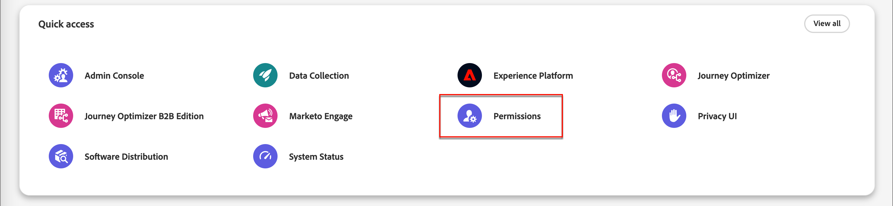{width="700" zoomable="yes"}

1. 在左側導覽中選取&#x200B;**[!UICONTROL 角色]**。

1. 按一下&#x200B;**_B2B頻道管理員_**&#x200B;角色名稱。

1. 在詳細資訊頁面中，按一下右上方的&#x200B;**[!UICONTROL 編輯]**。

   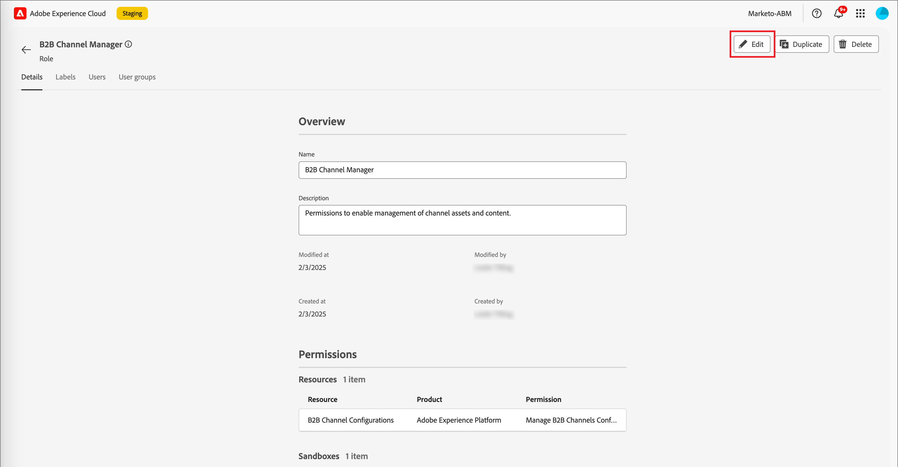{width="700" zoomable="yes"}

   在角色編輯器中，_[!UICONTROL 資源]_&#x200B;功能表會顯示套用至Experience Cloud - Platform支援的應用程式產品的資源清單。

   您可以在搜尋工具中輸入&#x200B;_B2B_，以篩選B2B產品許可權的清單。

1. 按一下B2B歷程資源的&#x200B;_新增_&#x200B;圖示(**+**)。

   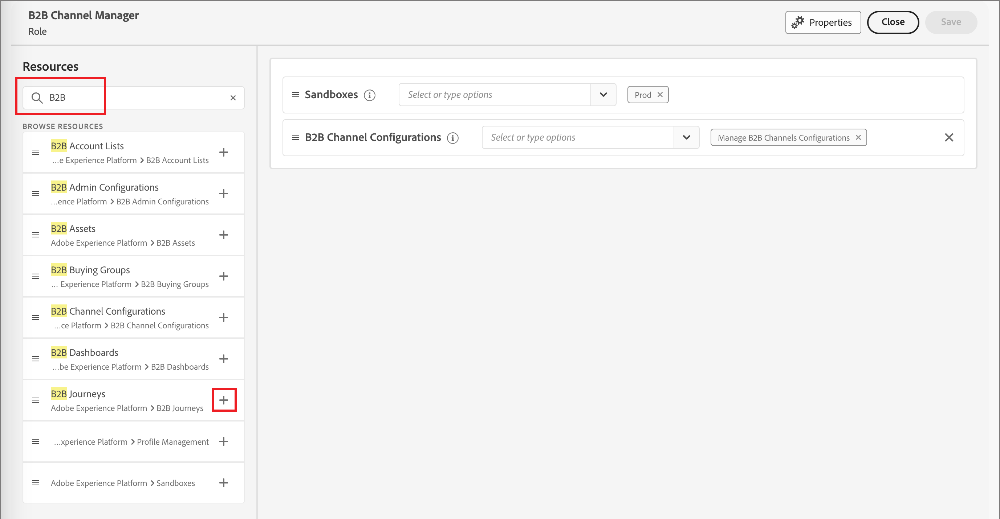{width="700" zoomable="yes"}

1. 在&#x200B;_[!UICONTROL B2B歷程]_&#x200B;許可權卡中，選取&#x200B;**[!UICONTROL 管理B2B帳戶歷程]**。

1. 按一下&#x200B;**[!UICONTROL 儲存]**。

   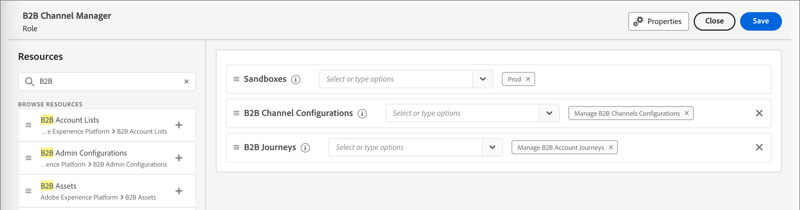{width="700" zoomable="yes"}

1. 按一下&#x200B;**[!UICONTROL 關閉]**&#x200B;以返回詳細資料頁面。

### 將使用者新增至角色

{width="30"}系統管理員或AEP產品管理員可以執行下列步驟。

1. 開啟角色詳細資料，並選取&#x200B;**[!UICONTROL 使用者]**&#x200B;索引標籤。

   此標籤會顯示指派給角色的所有使用者清單。

1. 按一下&#x200B;**[!UICONTROL 新增使用者]**。

   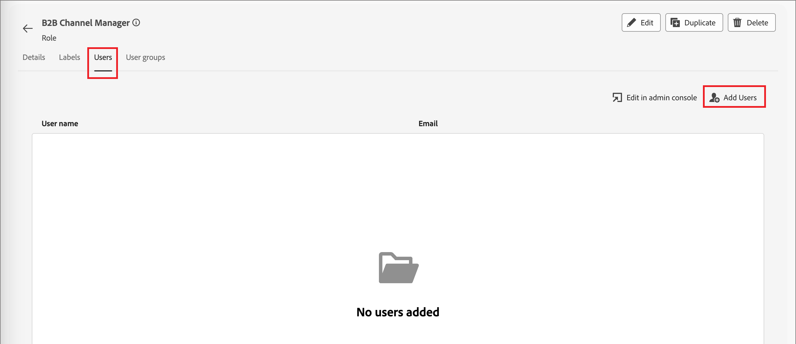{width="700" zoomable="yes"}

1. 在&#x200B;_[!UICONTROL 新增使用者]_&#x200B;對話方塊中，找出並選取您要新增至角色的使用者。

   * 您可以使用搜尋工具來篩選使用者清單。

   * 選取每個使用者的核取方塊。

   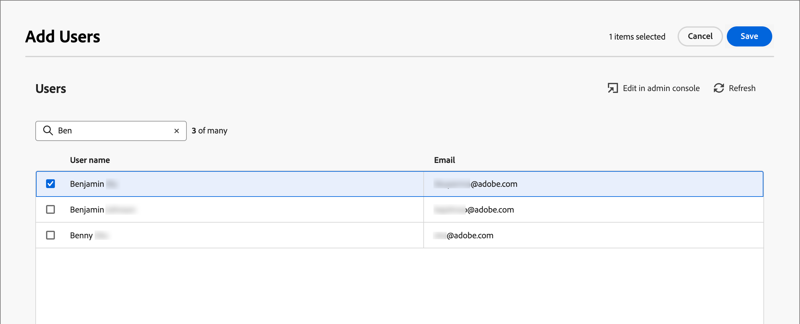{width="600" zoomable="yes"}

1. 當您選取要新增的所有使用者時，請按一下&#x200B;**[!UICONTROL 儲存]**。

### 將使用者群組新增至角色

如需使用者管理的相關資訊，請參閱Admin Console檔案中的[Admin Console使用者](https://helpx.adobe.com/tw/enterprise/using/user-groups.html)。

{width="30"}系統管理員或AEP產品管理員可以執行下列步驟。

1. 開啟角色詳細資料，並選取&#x200B;**[!UICONTROL 使用者群組]**&#x200B;索引標籤。

   此標籤會顯示指派給角色的所有使用者群組清單。

1. 按一下&#x200B;**[!UICONTROL 新增群組]**。

   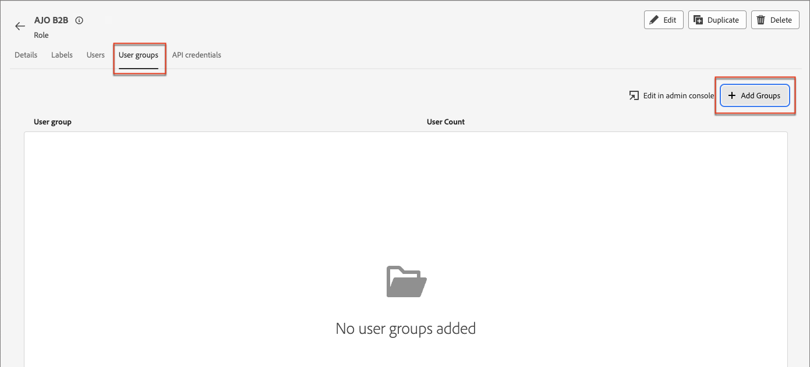{width="700" zoomable="yes"}

1. 在&#x200B;_[!UICONTROL 新增群組]_&#x200B;對話方塊中，找出並選取您要新增至角色的群組。

   * 您可以使用搜尋工具來篩選使用者群組清單。

   * 選取每個使用者群組的核取方塊。

   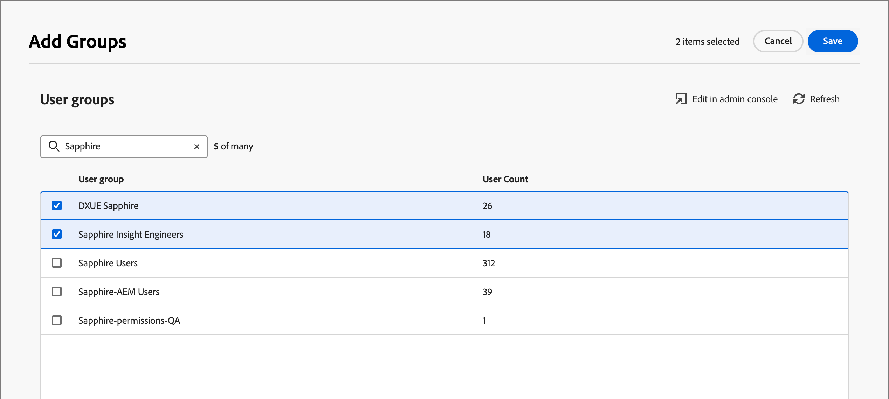{width="600" zoomable="yes"}

1. 當您選取要新增的所有使用者時，請按一下&#x200B;**[!UICONTROL 儲存]**。

## 建立自訂角色

{width="30"}系統管理員或AEP產品管理員可以執行下列步驟。

1. 在左側導覽中選取&#x200B;**[!UICONTROL 角色]**，然後選取&#x200B;**[!UICONTROL 建立角色]**。

1. 在&#x200B;_[!UICONTROL 建立新角色]_&#x200B;對話方塊中，輸入角色的名稱，例如&#x200B;_B2B行銷人員_，以及說明（選擇性）。

1. 按一下「**[!UICONTROL 確認]**」。

1. 選取您的沙箱。

   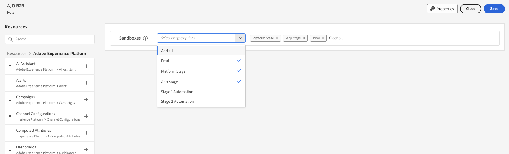{width="700" zoomable="yes"}

1. 新增設定檔許可權：

   * 在左側的&#x200B;_[!UICONTROL 資源]_&#x200B;清單中，找到&#x200B;**[!UICONTROL 設定檔管理]**&#x200B;專案，然後按一下&#x200B;_新增_ (**+**)圖示以新增屬性。

   * 針對屬性，新增下列許可權：
      * [!UICONTROL 檢視區段]
      * [!UICONTROL 管理區段]
      * [!UICONTROL 檢視設定檔]
      * [!UICONTROL 管理設定檔]
      * [!UICONTROL 檢視B2B設定檔]
      * [!UICONTROL 管理B2B設定檔]

   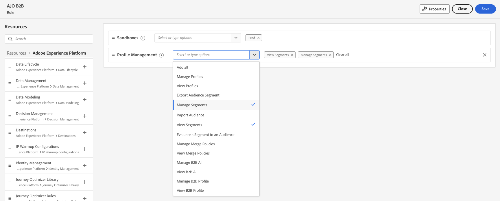{width="700" zoomable="yes"}

1. 新增B2B產品許可權：

   請參閱[B2B產品許可權](#b2b-product-permissions)清單，以決定您想要用於此角色的產品功能。

   在左側的&#x200B;_[!UICONTROL 資源]_&#x200B;清單中，找到&#x200B;**[!UICONTROL B2B]**&#x200B;專案，然後按一下&#x200B;_新增_ (**+**)圖示以新增您想要為角色啟用的每個屬性。

   您可以在搜尋工具中輸入&#x200B;_B2B_，以篩選B2B產品許可權的清單。

1. 按一下右上角的&#x200B;**[!UICONTROL 儲存]**。

1. 前往角色詳細資料，並選取&#x200B;**[!UICONTROL 使用者群組]**&#x200B;標籤。

1. 按一下&#x200B;**[!UICONTROL 新增群組]**。

   {width="700" zoomable="yes"}

1. 選取您先前在Admin Console中建立的使用者群組旁的核取方塊。

1. 按一下&#x200B;**[!UICONTROL 儲存]**。
