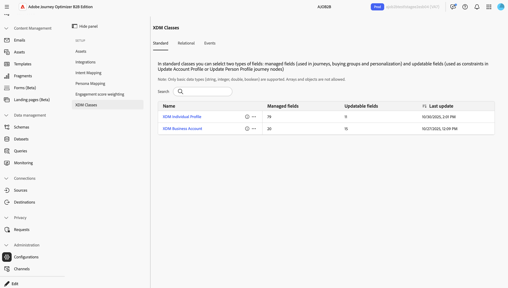
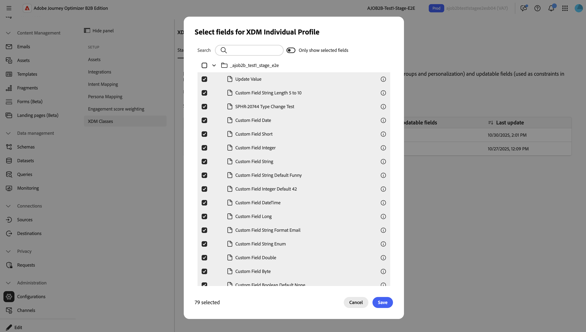
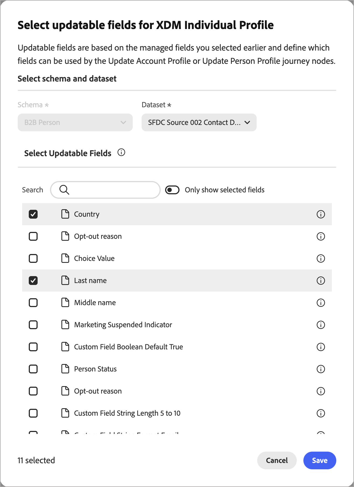
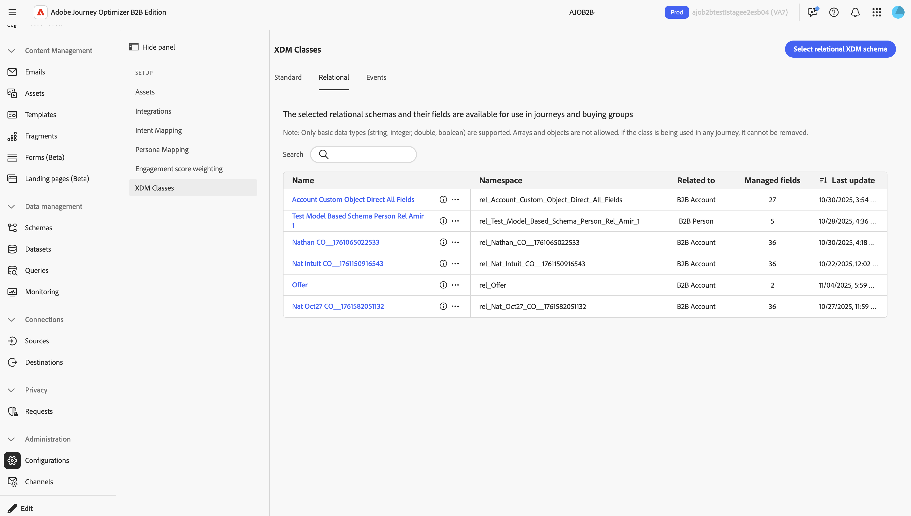
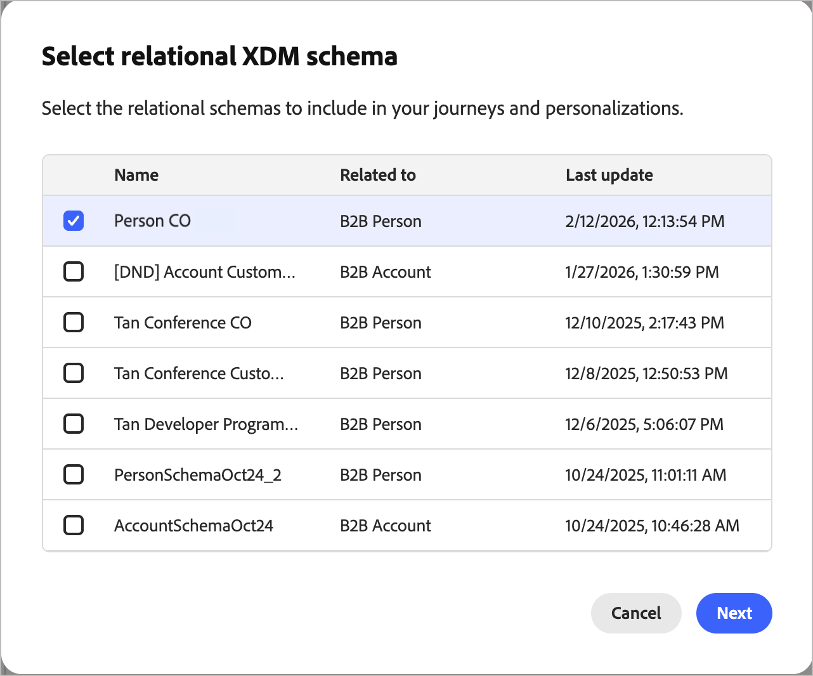
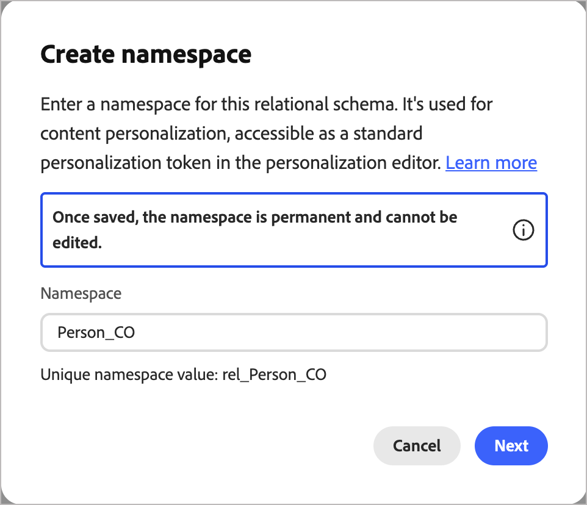
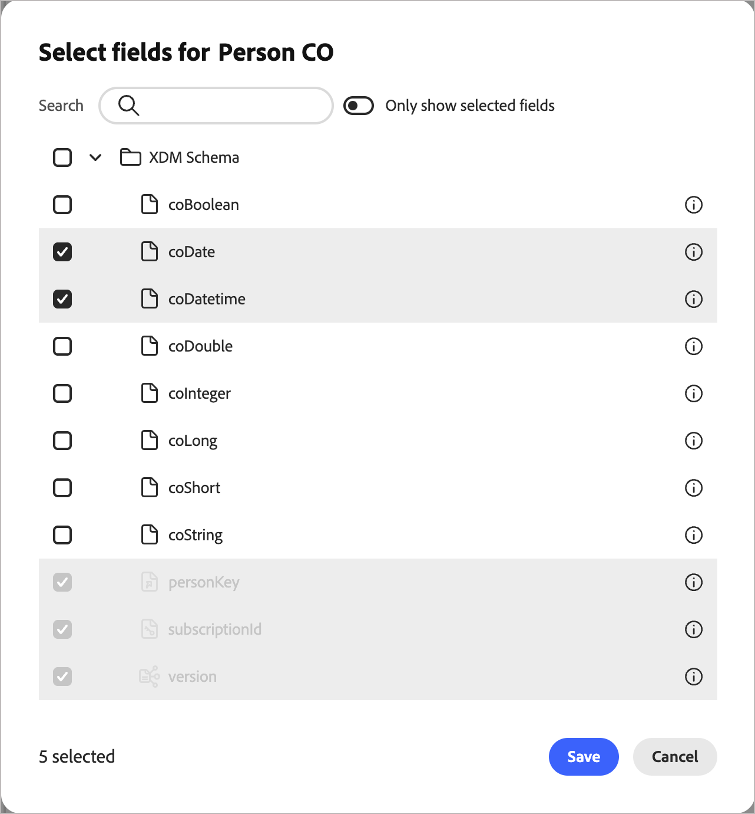

# xdm欄位管理

體驗資料模型(XDM)欄位是結構描述元素，可為[!DNL Journey Optimizer B2B Edition]應用程式提供資料。 在歷程、購買群組和功能（例如電子郵件個人化和條件式內容）中使用XDM欄位作為篩選器和限制。

結構描述根據標準XDM類別來定義欄位。 標準XDM類別包括個人設定檔、企業帳戶和體驗事件。 關聯式結構描述也會定義欄位，讓您以類似傳統關聯式資料庫的方式來模型化結構化資料。

Adobe Experience Platform (AEP)結構描述通常包含複雜階層中的許多欄位。 周遊XDM結構描述樹狀結構需要時間。 XDM欄位管理只顯示與每個歷程相關的欄位，藉此簡化欄位選擇。 管理員可控制哪些欄位要向歷程建立者顯示。 管理員也會將欄位設定為唯讀或可編輯。 這些動作可改善歷程設計期間的效率。

瞭解XDM並與資料工程師或B2B客戶資料平台(CDP)資料模型相關人員合作的管理員應使用本頁面上的程式。

>[!NOTE]
>[關聯式結構描述](https://experienceleague.adobe.com/en/docs/experience-platform/xdm/schema/relational#)可作為[!DNL Journey Optimizer B2B Edition]的有限發行版本使用。 Data Mirror和關聯式結構描述可供Journey Optimizer Orchestrated行銷活動授權持有人使用。 根據您的授權和功能啟用，關聯式結構描述也以限量版形式提供給Customer Journey Analytics使用者。 請聯絡您的Adobe代表以取得存取權。

## 存取XDM類別

1. 在左側導覽中，選擇&#x200B;**[!UICONTROL 管理]** > **[!UICONTROL 組態]**。

1. 在中間面板上按一下&#x200B;**[!UICONTROL XDM類別]**。

   * 使用&#x200B;**[!UICONTROL Standard]**&#x200B;和&#x200B;**[!UICONTROL Relational]**&#x200B;索引標籤來新增欄位，並在Journey Optimizer B2B edition中提供這些欄位。

   * 使用&#x200B;**事件**&#x200B;索引標籤來[選取特定AEP體驗事件及其相關欄位](./configure-aep-events.md)，以用於歷程事件節點。

## 欄位選擇

>[!IMPORTANT]
>
>您可以隨時更新您的欄位選擇，方法是選取新欄位或取消選取您不再需要的欄位。 使用此方案發佈歷程時，您會鎖定方案結構。 不支援刪除或重新命名結構、新增欄位或變更欄位型別，這可能會導致歷程失敗。

使用下列指南進行欄位選擇：

* 只有在歷程中主動使用結構描述後，您才能新增欄位。
* 刪除、重新命名或變更欄位型別可能會導致歷程功能問題。 操控結構時請小心。
* 請勿重新命名或刪除結構描述，或修改關聯式結構描述中的索引鍵。

### 標準類別

在&#x200B;_[!UICONTROL 標準]_&#x200B;索引標籤中，您可以編輯標準類別的&#x200B;_受管理的欄位_&#x200B;和&#x200B;_可更新的欄位_：

* 受管理的欄位會出現在歷程、購買群組和個人化功能中。
* 可更新的欄位可做為&#x200B;_更新帳戶設定檔_&#x200B;和&#x200B;_更新個人設定檔_&#x200B;歷程節點的限制。

{width="600" zoomable="yes"}

此清單包含兩個類別：

* **[!UICONTROL XDM 個別輪廓]**
* **[!UICONTROL XDM商業帳戶]**

顯示的類別資訊包括：

* 受管理的欄位數
* 可更新欄位數
* 上次更新時間

若要從標準XDM類別的聯合結構描述中選取欄位，請按一下類別名稱以開啟&#x200B;_受管理的欄位_&#x200B;選取對話方塊，或按一下&#x200B;_更多功能表_ (**...**)圖示以在&#x200B;_[!UICONTROL 受管理的欄位]_&#x200B;與&#x200B;_[!UICONTROL 可更新的欄位]_&#x200B;之間選取。

![按一下[更多]功能表圖示，在受管理的欄位與可更新的欄位之間選擇](./assets/xdm-classes-standard-more-menu.png){width="550" zoomable="yes"}

>[!NOTE]
>
>欄位必須先是&#x200B;_Managed_，才能是&#x200B;_可更新_。 您選取的&#x200B;_可更新欄位_&#x200B;必須存在於使用者提供的結構描述中。

#### 受管理的欄位

當您選擇&#x200B;**[!UICONTROL 受管理的欄位]**&#x200B;時，_選取欄位_&#x200B;對話方塊會列出所有可設定的欄位。

1. 為每個XDM類別選取最多100個欄位。

   使用&#x200B;_[!UICONTROL 搜尋]_&#x200B;欄位，依名稱篩選顯示的清單。 使用&#x200B;**[!UICONTROL 僅顯示選取的欄位]**&#x200B;滑桿來檢閱目前的選取專案。

   {width="450" zoomable="yes"}

1. 按一下&#x200B;**[!UICONTROL 儲存]**&#x200B;以確認您的選擇。

#### 可更新欄位

當您選擇&#x200B;**[!UICONTROL 可更新欄位]**&#x200B;時，_選取欄位_&#x200B;對話方塊可讓您從其他資料來源選擇欄位。

1. 針對&#x200B;**[!UICONTROL 資料集]**，請選取您要設定的資料來源。
1. 編輯所選資料集中的欄位。

   {width="450" zoomable="yes"}

1. 按一下[儲存]以套用您的變更。****

### 關聯式結構描述

關聯式結構描述可讓您建立自訂資料類別。 您可以存取多個資料集，建立依資料需求量身打造的類別。 在歷程決定和電子郵件個人化中，使用商業實體的關聯式結構描述，例如購買、授權和事件註冊。 您最多可以選取50個結構描述，以及每個結構描述最多100個欄位。

>[!NOTE]
>
>此功能目前支援與帳戶相關的自訂物件使用案例，並計畫在未來支援更多現成可用的物件使用案例。

您可以使用結構描述編輯器建立關聯式結構描述（前往左側導覽中的&#x200B;**[!UICONTROL 資料管理]** > **[!UICONTROL 結構描述]**）。

建立結構描述以搭配[!DNL Journey Optimizer B2B Edition]使用時，需要下列組態值：

* 行為：記錄
* 區段：已啟用
* 關係型別：多對一
* 參考結構描述：B2B帳戶
* 必填欄位：主索引鍵、外部索引鍵和版本描述項
* 關聯的資料集：已定義並對應到結構描述

若要選取要在[!DNL Journey Optimizer B2B Edition]中使用的關聯式結構描述欄位：

1. 選取&#x200B;**[!UICONTROL 關聯式]**&#x200B;標籤以檢視您的結構描述。

   結構描述編輯器中的{width="600" zoomable="yes"}

1. 按一下&#x200B;**[!UICONTROL 選取關聯式XDM結構描述]**。

   >[!NOTE]
   >
   >在這個測試版功能發行中，僅支援&#x200B;_帳戶多對一自訂物件_。

1. 選取關聯式結構描述，然後按一下&#x200B;**[!UICONTROL 下一步]**。

   >[!NOTE]
   >
   >在這個測試版功能發行中，選取結構描述後，您無法從清單中移除該結構描述。

   {width="500" zoomable="yes"}

1. 輸入名稱空間或使用預設名稱空間。 按一下&#x200B;**[!UICONTROL 下一步]**。

   您只能設定名稱空間一次，且無法還原此動作。

   {width="400" zoomable="yes"}

1. 檢閱關聯式結構描述欄位。

   按一下&#x200B;_資訊_ 圖示以檢視欄位中繼資料。

1. 選取要為歷程和個人化啟用的欄位。

   平台會自動選取下列必填欄位：

   * 外部索引鍵
   * 主索引鍵
   * 版本描述項

   使用&#x200B;_[!UICONTROL 搜尋]_&#x200B;欄位，依名稱篩選顯示的清單。 使用&#x200B;**[!UICONTROL 僅顯示選取的欄位]**&#x200B;滑桿來檢閱目前的選取專案。

   {width="500" zoomable="yes"}

1. 按一下&#x200B;**[!UICONTROL 儲存]**。
