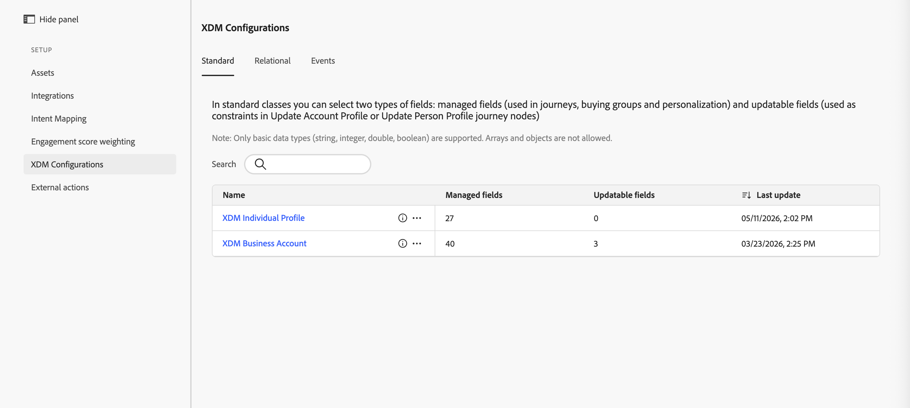
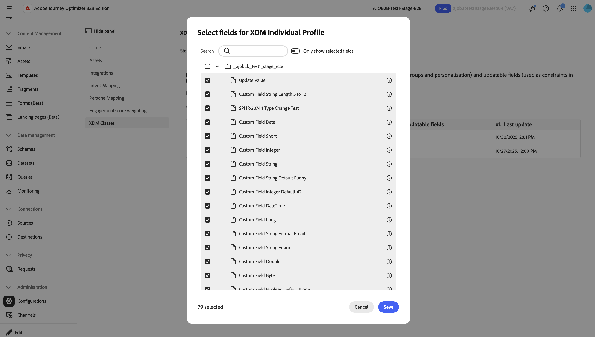
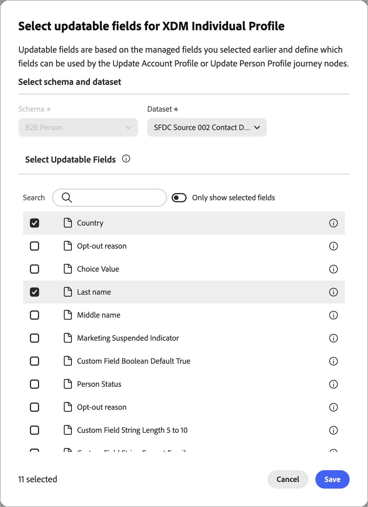

# xdm欄位管理

體驗資料模型(XDM)欄位是結構描述元素，可為[!DNL Journey Optimizer B2B Edition]應用程式提供資料。 將XDM欄位用作歷程節點、購買群組中的篩選器和限制，以及用於內容功能，例如電子郵件個人化和條件式內容。

結構描述會根據標準XDM設定檔來定義欄位。 標準XDM設定包含個別設定檔、企業帳戶和體驗事件。 關聯式結構描述也會定義欄位，讓您以類似傳統關聯式資料庫的方式來模型化結構化資料。

Adobe Experience Platform (AEP)結構描述通常包含複雜階層中的許多欄位。 周遊XDM結構描述樹狀結構需要時間。 XDM欄位管理只顯示與您的歷程、購買群組和個人化相關的欄位，藉此簡化欄位選擇。  管理員可啟用這些欄位以用於Journey Optimizer B2B edition，包括唯讀或可編輯的欄位。

瞭解XDM並與資料工程師或B2B客戶資料平台(CDP)資料模型利害關係人合作的管理員應使用以下步驟，為[!DNL Journey Optimizer B2B Edition]設定XDM欄位。

## 存取XDM設定

1. 在左側導覽中，選擇&#x200B;**[!UICONTROL 管理]** > **[!UICONTROL 組態]**。

1. 在中間面板上按一下&#x200B;**[!UICONTROL XDM組態]**。

   * 使用&#x200B;**[!UICONTROL Standard]**&#x200B;和&#x200B;**[!UICONTROL Relational]**&#x200B;索引標籤來新增欄位，並在Journey Optimizer B2B edition中提供這些欄位。

   * 使用&#x200B;**[!UICONTROL 事件]**&#x200B;索引標籤來[選取特定AEP體驗事件及其相關欄位](./configure-aep-events.md)，以用於歷程事件節點。

## 欄位選擇

>[!IMPORTANT]
>
>您可以隨時更新您的欄位選擇，方法是選取新欄位或取消選取您不再需要的欄位。 使用此方案發佈歷程時，您會鎖定方案結構。 不支援刪除或重新命名結構、新增欄位或變更欄位型別，這可能會導致歷程失敗。

使用下列指南進行欄位選擇：

* 只有在歷程中主動使用結構描述後，您才能新增欄位。
* 刪除、重新命名或變更欄位型別可能會導致歷程功能問題。 操控結構時請小心。
* 請勿重新命名或刪除結構描述，或修改關聯式結構描述中的索引鍵。

### 標準類別

在&#x200B;_[!UICONTROL 標準]_&#x200B;索引標籤中，您可以編輯標準類別的&#x200B;_受管理的欄位_&#x200B;和&#x200B;_可更新的欄位_：

* 受管理的欄位會出現在歷程、購買群組和個人化功能中。
* 可更新的欄位可做為&#x200B;_更新帳戶設定檔_&#x200B;和&#x200B;_更新個人設定檔_&#x200B;歷程節點的限制。

{width="600" zoomable="yes"}

此清單包含兩個類別：

* **[!UICONTROL XDM 個別輪廓]**
* **[!UICONTROL XDM商業帳戶]**

顯示的類別資訊包括：

* 受管理的欄位數
* 可更新欄位數
* 上次更新時間

若要從聯合結構描述中選取欄位，請按一下類別名稱以開啟「受管理的欄位選取」對話方塊。 或者，按一下&#x200B;_其他功能表_ (**...**) 圖示，並在「管理」和「可更新」欄位之間選擇。

![按一下[更多]功能表圖示，在受管理的欄位與可更新的欄位之間選擇](./assets/xdm-classes-standard-more-menu.png){width="550" zoomable="yes"}

>[!NOTE]
>
>欄位必須先是&#x200B;_Managed_，才能是&#x200B;_可更新_。 您選取的&#x200B;_可更新欄位_&#x200B;必須存在於使用者提供的結構描述中。 您的結構描述可能不包括必填欄位，系統定義的欄位除外。

#### 受管理的欄位

當您選擇&#x200B;**[!UICONTROL 受管理的欄位]**&#x200B;時，_選取欄位_&#x200B;對話方塊會列出所有可設定的欄位。

1. 為每個XDM結構描述選取最多100個欄位。

   使用&#x200B;_[!UICONTROL 搜尋]_&#x200B;欄位，依名稱篩選顯示的清單。 使用&#x200B;**[!UICONTROL 僅顯示選取的欄位]**&#x200B;滑桿來檢閱目前的選取專案。

   {width="450" zoomable="yes"}

1. 按一下&#x200B;**[!UICONTROL 儲存]**&#x200B;以確認您的選擇。

#### 可更新欄位

設定可更新欄位，以選擇可透過&#x200B;**[!UICONTROL 更新帳戶設定檔]**&#x200B;或&#x200B;**[!UICONTROL 更新人員設定檔]**&#x200B;歷程動作修改的欄位。

在設定可更新欄位之前，這些欄位必須位於自訂資料集中。 如需自訂資料集工作流程的逐步解說，請參閱[建立資料集並擷取資料](https://experienceleague.adobe.com/en/docs/journey-optimizer-learn/tutorials/data-management/create-datasets-and-ingest-data#){target="_blank"}，並使用&#x200B;**[!UICONTROL 從結構描述建立資料集]**&#x200B;選項。 此資料集可用來隔離可更新的欄位。 所有可更新欄位都必須在此資料集中。

>[!IMPORTANT]
>
>可更新欄位的護欄：
>
>* 結構描述 — 結構描述必須使用B2B人員主要身分(`b2b.personKey.sourceKey`)。 在XDM個別設定檔類別上，結構描述中的任何必要欄位都必須是系統定義的，例如`identityMap`或`personID`。
>* 資料集 — 請勿將已使用的資料集用於其他用途。 最佳實務是建立專屬的資料集，以專門儲存可更新欄位。 為每個XDM結構描述使用個別的資料集。

為個別設定檔建立資料集，並為企業帳戶建立另一個資料集。 在設定程式期間選取每個新資料集：

1. 針對&#x200B;**[!UICONTROL 資料集]**，選取您建立的新資料來源。

1. 從選取的資料集選擇欄位。

   {width="450" zoomable="yes"}

1. 按一下[儲存]以套用您的變更。**&#x200B;**

### 關聯式結構描述

關聯式結構描述可讓您建立自訂資料類別。 您可以存取多個資料集，建立依資料需求量身打造的類別。 在歷程決定和電子郵件個人化中，使用商業實體的關聯式結構描述，例如購買、授權和事件註冊。 您最多可以選取20個結構描述，以及每個結構描述最多50個欄位。

有多個功能可支援使用已設定的關聯式結構描述和欄位：

* [內容個人化](../content/personalization.md#custom-datasets)
* [歷程決策（分割路徑）](../journeys/split-merge-paths-nodes.md#custom-data-filtering)
* [購買群組角色](../buying-groups/buying-groups-role-templates.md#add-the-template-roles) （僅限B2B人員）

>[!AVAILABILITY]
>
>[關聯式結構描述](https://experienceleague.adobe.com/en/docs/experience-platform/xdm/schema/relational#)可作為[!DNL Journey Optimizer B2B Edition]的有限可用性版本使用。 [!DNL Journey Optimizer Orchestrated Campaigns]個授權持有人可使用Data Mirror和關聯式結構描述。 根據您的授權和功能啟用，[!DNL Customer Journey Analytics]個使用者也可限量使用關聯式結構描述。 請聯絡您的Adobe代表以取得存取權。

>[!NOTE]
>
>此功能目前支援帳戶相關和人員相關自訂物件使用案例，並計畫在未來支援更多現成可用的物件使用案例。

您可以使用結構描述編輯器建立關聯式結構描述（前往左側導覽中的&#x200B;**[!UICONTROL 資料管理]** > **[!UICONTROL 結構描述]**）。

>[!BEGINSHADEBOX]

**結構描述需求**

當[建立結構描述以搭配 [!DNL Journey Optimizer B2B Edition]](https://experienceleague.adobe.com/zh-hant/docs/platform-learn/tutorials/schemas/create-schemas-for-b2b-data)使用時，需要下列組態值：

* 行為：記錄
* 區段：已啟用
* 關係型別：多對一
* 參考結構描述：B2B帳戶或B2B人員
* 必填欄位：主索引鍵、外部索引鍵和版本描述項
* 關聯的資料集：已定義並對應到結構描述

>[!ENDSHADEBOX]

若要選取要在[!DNL Journey Optimizer B2B Edition]中使用的關聯式結構描述欄位：

1. 選取&#x200B;**[!UICONTROL 關聯式]**&#x200B;標籤以檢視您的結構描述。

   結構描述編輯器中的{width="600" zoomable="yes"}

1. 按一下&#x200B;**[!UICONTROL 選取關聯式XDM結構描述]**。

   >[!NOTE]
   >
   >在這個測試版功能發行中，僅支援&#x200B;_帳戶和人員多對一自訂物件_。

1. 選取關聯式結構描述，然後按一下&#x200B;**[!UICONTROL 下一步]**。

   {width="500" zoomable="yes"}

1. 輸入名稱空間或使用預設名稱空間。 按一下&#x200B;**[!UICONTROL 下一步]**。

   您只能設定名稱空間一次，且無法還原此動作。

   {width="400" zoomable="yes"}

1. 檢閱關聯式結構描述欄位。

   按一下&#x200B;_資訊_ 圖示以檢視欄位中繼資料。

1. 選取要為歷程和個人化啟用的欄位。

   平台會自動選取下列必填欄位：

   * 外部索引鍵
   * 主索引鍵
   * 版本描述項

   使用&#x200B;_[!UICONTROL 搜尋]_&#x200B;欄位，依名稱篩選顯示的清單。 使用&#x200B;**[!UICONTROL 僅顯示選取的欄位]**&#x200B;滑桿來檢閱目前的選取專案。

   {width="500" zoomable="yes"}

1. 按一下&#x200B;**[!UICONTROL 儲存]**。
