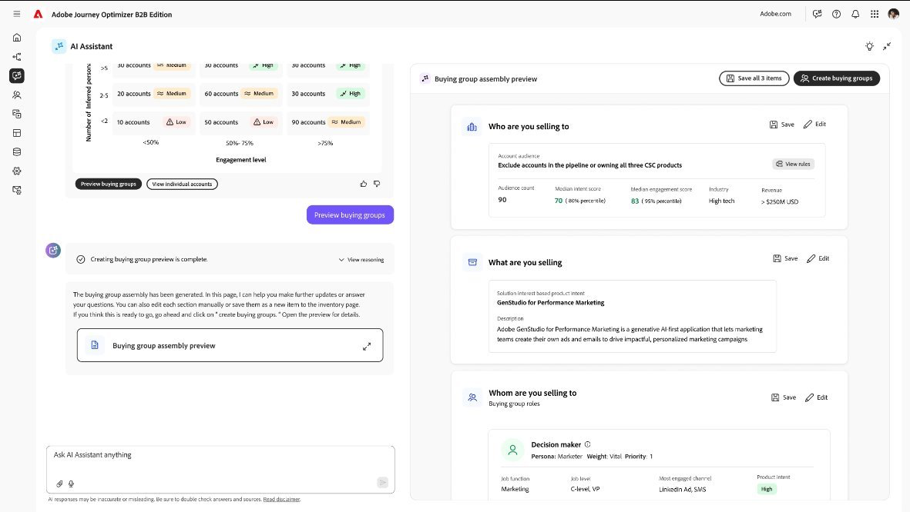

# 適用於B2B的Audience Agent

Audience Agent B2B由[Adobe Experience Platform Agent Orchestrator](https://experienceleague.adobe.com/zh-hant/docs/experience-cloud-ai/experience-cloud-ai/agents/agent-orchestrator)提供技術支援，可在Journey Optimizer B2B edition中使用。 使用此代理程式可提高探索和擴展受眾的效率和成效，加速建立購買群組和順暢的工作流程以進行歷程啟動：

* **_依意圖排列目標對象的優先順序_**：根據不同對象的產品意圖推斷角色，並簡化行銷活動規劃，減少對象驗證所花費的時間。

* **_利用AI偵測購買群組_**：使用AI、結構化、非結構化資料以及統一的第一方資料，以簡化購買群組探索與建立。

{width="700" zoomable="yes"}

>[!PREREQUISITES]
>
>若要針對B2B使用Audience Agent，必須有必要的資料定義和對應：  
>
>* [意圖資料分類法/對應](../admin/intent-data.md)
>* [XDM欄位分類法/對應](#xdm-data-prerequisites)

## 適用於B2B功能的Audience Agent

| 區域圖 | 作用 | 商業價值 |
| ---- | ------------ | -------------- |
| 意圖分析 | <li> 測量特定產品的帳戶意圖強度（例如低、中和高）。 <li>比較一段時間內的產品興趣趨勢（例如過去&#x200B;_n_&#x200B;天排名最前的產品）。 <li>識別主動顯示對特定產品感興趣的帳戶。 <li>結合帳戶活動與角色涵蓋範圍的表面參與模式。 | <li>協助團隊在適當的時間聚焦於適當的帳戶。 <li>透過使用真正的購買訊號來排定帳戶的優先順序，以改善管道品質。 <li>在競爭者採取行動之前啟用主動參與。 |
| 人物誌對應 | <li>依產品意向偵測並排名最前角色。 <li>識別購買一或多個產品所涉及的角色。 <li>將角色對應到功能角色（例如&#x200B;_Champion_、_決策者_&#x200B;和&#x200B;_影響者_），並提供理由。 <li>驗證為何將指定人員視為冠軍。 | <li>確保銷售團隊與真正的決策者和影響者互動。 <li>減少低影響力聯絡人的浪費工作。 <li>根據購買者的力量動態調整外展活動，提高成功率。 |
| 購買群組評估 | <li>評估購買群組的大小（例如，擁有超過&#x200B;_n_&#x200B;個成員的群組）。 <li>跨帳戶測量角色涵蓋範圍（例如，低於&#x200B;_x_%）。 <li>追蹤購買群組內的角色分配和涵蓋範圍差距。 <li>強調最近交易中有冠軍的客戶。 | <li>顯示可能阻礙交易的涵蓋範圍差距。 <li>確保完整的角色表示，強化多執行緒策略。 <li>透過群組層級的參與深入分析改善交易健康追蹤。 |

## 提示範例

這些提示範例示範您可以使用代理程式的一些方式：

* 顯示趨勢視窗：每個產品的最早和最新帳戶產品意向更新。
* 針對`<product>`，列出具有產品意向和評分的購買群組。
* 針對`<product>`，列出角色及其機會量度（獲勝率、會籍率、計數）。
* 對於`<industry>`中的帳戶，`<product>`的平均帳戶角色涵蓋範圍是多少？
* 哪些客戶對任何產品的意圖較低，但仍擁有開放機會（值得培育）？
* 哪些帳戶本週新增了`<account_name>`的新意圖訊號？

## 概念

| 概念 | 說明 |
| ------- | ----------- |
| 對象偵測 | 在幕後，代理程式會根據兩件事檢視第一方意圖訊號：使用者與您的品牌的參與程度，以及他們代表的角色型別。 分析會回顧過去18個月的活動，以偵測帳戶中每個人的產品意圖，尤其是在商機結束前的這段時間。 此分析可協助代理商強調最有可能影響交易的角色。  有時帳戶並非所有機會資料都是完美的形式，這很正常，而且代理程式仍然可以完全從參與模式偵測到產品目的。 |
| 人物誌 | 角色代表帳戶中互動的人員型別。 代理程式會檢視職稱、職能和資歷層級，然後將該資訊標準化，以便在不同帳戶間保持一致，藉此建立資訊。 如此一來，您就能快速瞭解自己是否觸及決策者、影響者或支援角色，而不至於迷失在亂七八糟的標題中。 角色可協助您瞭解哪些人感興趣，而不只是瞭解他們有多大興趣。   當代理程式將角色對應到購買群組角色時，它會根據工作職稱、職能、資歷以及您選擇新增的任何其他屬性，採用已識別角色的型別，並將其對應到他們在購買決定中最可能扮演的角色，例如&#x200B;_決策者_、_影響者_&#x200B;或&#x200B;_冠軍_。 這些角色與相關的特定產品相關，因此您可以檢視誰對該機會最重要。 此代理程式也會顯示每個角色的涵蓋範圍，協助您快速瞭解哪些角色的呈現情況良好，以及在哪些位置可能存在空白以填入您的參與策略。 |
| 對應購買群組角色 | 將角色對應至角色後，您就可以將角色集合至購買群組。 將其視為帳戶內最有可能影響或決定購買的完整團隊。 每個角色（例如&#x200B;_決策者_、_影響者_&#x200B;或&#x200B;_冠軍_）都會新增一張圖片，讓您能夠清楚瞭解推動交易的整個委員會。   將角色對應到購買群組角色時，您會根據職稱、職能、資歷以及您選擇新增的任何其他屬性，採用已識別角色的型別，並將其對應到他們在購買決定中最可能扮演的角色，例如&#x200B;_決策者_、_影響者_&#x200B;或&#x200B;_冠軍_。 這些角色與相關的特定產品相關，因此您可以檢視誰對該機會最重要。 代理程式會顯示每個角色的涵蓋範圍，協助您快速瞭解哪些角色的呈現情況良好，以及在哪些情況下可能存在空白以填入您的參與策略。 |
| 購買群組 | 購買群組可讓行銷人員管理購買委員會的真正複雜性，而不是孤立的潛在客戶或帳戶。 Adobe Journey Optimizer B2B edition提供的工具（AI導向的深入分析、角色型歷程和完整性追蹤）可為該流程帶來結構、個人化和分析上的清晰度，最終使行銷和銷售更密切地圍繞著收入結果調整。  建立購買群組，實際上就是將三個關鍵因素結合在一起：正確的對象、產品內容以及購買群組的角色。 以下是其運作方式的逐步預覽： <ol><li>**識別您的對象** <ul><li>首先，代理程式會找出與您的產品最相關的帳戶。 此探索包括已顯示興趣的帳戶和具有潛在興趣的帳戶。<li>在此帳戶中，可識別可能影響購買決策或參與購買決策的人員（您的關鍵角色）。<li>它會從要呈現的帳戶中進行選擇：帳戶清單或帳戶對象。</ul><li>**考慮產品內容**<ul><li>接下來，它會審視您專注的產品或解決方案，確保已識別的角色與您要銷售或促銷的內容實際相關。<li>它還有助於突顯涵蓋範圍中的任何差距（可能是產品缺少某些角色），讓您知道該聚焦於何處。</ul> <li>**將角色對應到購買群組角色** <ul><li>最後，代理程式會將這些角色對應至特定的購買群組角色，例如決策者、影響者和擁護者。<li>根據此對應，代理商可以為您建議購買群組構成，您可以檢閱、調整或確認該構成。</ul> </ol> 當這三個元件結合在一起時，就會建立您的購買群組，其中包含可立即使用的成員詳細資訊、角色和見解。 |
| 在歷程中購買群組 | 在歷程中，購買群組可用作協調的中央單位，可讓行銷人員設計符合群組動態的體驗，而不是單獨處理成員。 例如，您可以透過協調訊息定位整個群組，同時為決策者、影響者或一般使用者量身打造角色特定內容。 隨著意圖訊號和參與資料流入，歷程可以根據群組整備程度進行分支、在關鍵角色參與時針對銷售表面警報，或在缺少關鍵角色時自動觸發培養步驟。 此流程可確保每個接觸點（從電子郵件到帳戶型廣告，再到銷售推廣）共同合作，推動群組在購買流程中前進，加快共識並降低購買過程中的摩擦。 |
| Journey Optimizer B2B edition中的歷程 | 無論是否屬於購買群組，都可以建立歷程，但精確度及影響程度會大幅變更：<ul><li>**如果沒有購買群組**，歷程通常是以帳戶建立。 行銷人員仍可使用意圖、行為或產品興趣等訊號來觸發培養流程和外聯。 此方法適用於較簡單的動作，或適用於帳戶資料有限的情況。 然而，這有可能忽視影響交易的更廣泛利害關係人，可能會減慢轉換速度或造成參與度差距。<li>**購買群組**&#x200B;的歷程是圍繞購買決定中涉及的完整角色集所編排。 您可以將步驟與群組層級的里程碑保持一致（例如當委員會達到完整度分數或顯示集體參與時），同時為每個角色個人化接觸點。 此方法可讓您設計協調一致的多執行緒參與度：決策者可能會收到策略性ROI內容，而影響者則會收到產品深入探討，而銷售人員會在關鍵角色參與時收到警報。 透過對應個人和集體歷程，行銷人員和銷售人員可以加速建立共識，並更有效率地推動機會。 </ul> |
| 使用機會資料來偵測角色 | 為了讓您最準確地瞭解誰正在參與及其興趣所在，代理商會根據下列專案處理角色排名和產品意圖： <ul><li>最佳案例情境：若您能提供&#x200B;_機會階段_、_機會關閉日期_&#x200B;等資料，以及明確的&#x200B;_機會與產品對應_，代理程式就能自信地根據產品來排名角色。<li>此排名可讓您精確瞭解整個帳戶的參與度和興趣。 </ul>但代理程式知道資料並不一定完整，這沒有關係。 其中包含智慧型遞補功能，可讓一切順暢運作：<ul><li>代理程式會分析活動量，使用時間衰減為最近的活動提供更大的權重。<li>此加權可讓代理商區分及排名角色，即使沒有完整機會資料亦然。 </ul>將機會連結至產品時，代理程式會以下列方式處理：<ul><li>_理想_：您提供或協助代理程式建立對應表格。<li>_如果無法使用_：代理程式使用模糊比對來連線點。<li>_完全沒有連結_：代理程式會根據關閉日期之前的最近活動推斷產品意圖。</ul>這種分層方法可確保代理程式仍能提供有意義的深入分析，即使資料並非完美無缺。 |
| 機會分析 | 代理程式會檢視歷史機會資料，以瞭解哪些因素最能預測成功，並使用三個核心維度來執行此操作：<ol><li>成功率：顯示涉及特定角色時成功完成交易的頻率。 如果帳戶具有特定角色模式（例如技術評估師或VP層級決策者）傾向於更頻繁轉換，則模型會給予該模式較高的權重。 此資訊是總商機的百分比，例如已結束或成功的商機。<li>成員比率：測量角色型別在指定產品的各個商機中出現的頻率。 如果特定角色持續出現在成功的交易中，就表示他們在購買過程中扮演了重要的角色。<li>角色影響：量化指定角色對結果的貢獻度，不僅包括角色是否存在，還包括其參與度或活動層級與勝利的關聯度。</ol>這些訊號可搭配使用，有助於推斷哪些角色對購買結果的影響最大，即使商機資料不完整亦然。 長期下來，它可讓系統呈現最具影響力的角色和模式，這些角色和模式最能預測交易成功，然後會告知客戶意圖、角色對應和購買群組建議。 |
| 意圖 | 當某人瀏覽網頁或按一下與產品相關的電子郵件連結時，即表示他們感興趣，稱為&#x200B;_意圖_。  代理程式會從分類法開始，分類法基本上是客戶的產品清單以及描述這些產品的關鍵字。 此資訊可協助代理程式瞭解每個內容或互動的內容。  接著，代理程式會使用該分類法來標示訪客活動，例如其動作相關的關鍵字或產品。  接著，代理程式會檢視某個人參與的程度，例如造訪多少頁面或互動的頻率。 它會使用此資訊來計算特定關鍵字、產品或產品類別的個別意圖分數。 它將每個意圖分數儲存為&#x200B;_高_、_Medium_&#x200B;或&#x200B;_低_&#x200B;意圖以表示興趣強度。 (低意圖： `<=0.2`，Medium意圖： `0.2 < score <= 0.6`，高意圖： `0.6 < score <= 1`)  最後，代理程式會結合來自相同公司（帳戶）之所有人員的意圖分數，以檢視整體帳戶層級意圖，以顯示公司似乎最感興趣的產品或主題。 |
| 影響購買群組的角色 | 每個購買群組都是由對購買決定貢獻不同的角色所組成，例如&#x200B;_決策者_、_影響者_、_冠軍_&#x200B;和&#x200B;_一般使用者_。 每個角色都有不同程度的影響。  決策者擁有最大的影響力，通常可控制預算核准。 影響者圖形評估與建議。 Champions有助於建立內部共識，而使用者則需驗證產品的適用性。  藉由向您展示這些角色，代理商可協助您瞭解誰是購買決策的決定者、您的參與度最強的地方，以及涵蓋範圍差距可能存在的位置。 此資訊可讓您專注在此產品中最重要的角色。 |
| 角色或角色涵蓋範圍 | 對於任何特定產品，通常有一組已知會影響購買的關鍵角色和角色（_N_&#x200B;個角色）。  對於每一個帳戶，代理程式會透過檢查該帳戶中至少有一個人代表多少這&#x200B;_N_&#x200B;個角色來計算涵蓋範圍。  如果所有&#x200B;_N_&#x200B;角色都存在，則帳戶具有完整涵蓋範圍。 如果只顯示部分角色，則涵蓋範圍是部分的。  簡單來說，角色和角色涵蓋範圍會根據是否包含所有重要的決策者、影響者和擁護者，來衡量購買群組對產品的完成程度。 |

## XDM資料必要條件

Audience Agent針對顯示產品第一方意圖的帳戶提供深入分析，並根據定義的資料計算角色和角色。 請確認下列先決條件資料已設定為可使用Audience Agent功能：

### xdm欄位對應

<table>
  <tbody>
    <tr>
      <th>XDM欄位</th>
      <th>實體</th>
      <th>業務定義</th>
      <th>其他詳細資料</th>
    </tr>
    <tr>
      <td>
        

          b2b.accountKey.sourceKey
        

      </td>
      <td>
        

          輪廓
        

      </td>
      <td>帳戶識別碼，用於加入商機、事件和意圖資料</td>
      <td rowspan="2">機會分析 帳戶探索 
         
      </td>
    </tr>
    <tr>
      <td>
        

          b2b.personKey.sourceKey
        

      </td>
      <td>
        

          輪廓
        

      </td>
      <td>個人識別碼，用於涉及事件資料至設定檔資料的加入</td>
    </tr>
    <tr>
      <td>
        

          extendedWorkDetails.departments
        

      </td>
      <td>
        

            設定檔
        

      </td>
      <td>設定檔/個人的工作部門</td>
      <td rowspan="5">
        

           
        

        
角色對應

      </td>
    </tr>
    <tr class="">
      <td>
        

          extendedWorkDetails.jobTitle
        

      </td>
      <td>
        

            設定檔
        

      </td>
      <td>用於角色計算的設定檔/人員職稱</td>
    </tr>
    <tr>
      <td>
        

          person.name.firstName
        

      </td>
      <td>
        

          輪廓
        

      </td>
      <td>個人的名字，Audience Agent在滿足任何條件時用來在UI中顯示姓名</td>
    </tr>
    <tr class="">
      <td>
        

          person.name.fullName
        

      </td>
      <td>
        

          個設定檔
        

      </td>
      <td>個人的全名，Audience Agent在滿足任何條件時用來在UI中顯示名稱</td>
    </tr>
    <tr class="">
      <td>
        

          person.name.lastName
        

      </td>
      <td>
        

          個設定檔
        

      </td>
      <td>個人的姓氏，Audience Agent在滿足任何條件時用來在UI中顯示姓名</td>
    </tr>
    <tr>
      <td>
        

          accountKey.sourceKey
        

      </td>
      <td>
        

          帳戶
        

      </td>
      <td>帳戶識別碼，用於加入商機、事件和意圖資料</td>
      <td>機會分析 帳戶探索</td>
    </tr>
    <tr>
      <td>
        

          帳戶名稱
        

      </td>
      <td>
        

          帳戶
        

      </td>
      <td>當符合使用者查詢中提出的任何條件時，Audience Agent在UI中顯示的帳戶名稱</td>
      <td rowspan="4">
        

           
        

        

           
        

        

           
        

        
帳戶探索

      </td>
    </tr>
    <tr>
      <td>
        

          accountDescription
        

      </td>
      <td>
        

          帳戶
        

      </td>
      <td>Audience Agent用來根據使用者在UI中的查詢來套用帳戶篩選的帳戶/公司的說明 </td>
    </tr>
    <tr>
      <td>
        

          accountOrganization.industry
        

      </td>
      <td>
        

            帳戶
        

      </td>
      <td>Audience Agent根據使用者在UI中的查詢來套用帳戶篩選的帳戶/公司產業 </td>
    </tr>
    <tr>
      <td>
        

          accountBillingAddress.region
        

      </td>
      <td>
        

            帳戶
        

      </td>
      <td>Audience Agent用來根據使用者在使用者介面中的查詢來套用帳戶篩選的帳戶/公司帳單地址 </td>
    </tr>
    <tr>
      <td>
        

          accountKey.sourceKey
        

      </td>
      <td>
        

          商機
        

      </td>
      <td>帳戶識別碼，用於加入商機、事件和意圖資料</td>
      <td rowspan="2">
        
機會分析 帳戶探索

      </td>
    </tr>
    <tr>
      <td>
        

          opportunityKey.sourceKey
        

      </td>
      <td>
        

          商機
        

      </td>
      <td>機會識別碼，用於加入帳戶資料</td>
    </tr>
    <tr>
      <td>
        

          opportunityName
        

      </td>
      <td>
        

          個機會
        

      </td>
      <td>Audience Agent使用的機會名稱 </td>
      <td rowspan="5">
        

           
        

        

           
        

        

           
        

        

           
        

        

           
        

        
機會分析

      </td>
    </tr>
    <tr>
      <td>
        

          isWon
        

      </td>
      <td>
        

          商機
        

      </td>
      <td>是否贏得機會（二進位）</td>
    </tr>
    <tr>
      <td>
        

          opportunityDescription
        

      </td>
      <td>
        

          商機
        

      </td>
      <td>Audience Agent使用的機會說明 </td>
    </tr>
    <tr>
      <td>
        

          opportunityAmount
        

      </td>
      <td>
        

          商機
        

      </td>
      <td>機會中涉及的金額$</td>
    </tr>
    <tr class="">
      <td>
        

          opportunityType
        

      </td>
      <td>
        

          商機
        

      </td>
      <td>機會型別</td>
    </tr>
    <tr>
      <td>
        

          商機階段
        

      </td>
      <td>
        

          個機會
        

      </td>
      <td>機會階段（已結束的贏家或已結束的輸家，或任何中間階段） </td>
      <td rowspan="4">
        
機會分析 帳戶探索

      </td>
    </tr>
    <tr>
      <td>
        

          actualCloseDate
        

      </td>
      <td>
        

          商機
        

      </td>
      <td>機會的實際結束日期</td>
    </tr>
    <tr>
      <td>
        

          expectedCloseDate
        

      </td>
      <td>
        

          個機會
        

      </td>
      <td>商機的預期結束日期</td>
    </tr>
    <tr>
      <td>
        

          extSourceSystemAudit.createdDate
        

      </td>
      <td>
        

          商機
        

      </td>
      <td>建立此機會的日期</td>
    </tr>
  </tbody>
</table>

### 分類資料

Audience Agent會運用Journey Optimizer B2B edition中偵測到的第一方意圖：

1. 意圖計算需要來自客戶>分類的分類資料（客戶產品和對應的關鍵字）
1. 分類資料用於標示事件資料（資產標籤）。 此資料會根據訪客的事件資料>資產標籤，提供訪客感興趣的關鍵字和產品深入分析 
1. 標籤資產（事件資料）會與訪客行為（造訪的頁面數）結合，以在意向計算中判斷關鍵字、產品和產品類別層級的訪客意→
1. 訪客設定檔層級的意圖分數會在帳戶層級彙總，以判斷指定關鍵字、產品和產品類別>意圖帳戶彙總中的帳戶意圖

除了[設定意圖分類](../admin/intent-data.md)外，還需要下列欄位：

<table>
  <tbody>
    <tr>
      <th>XDM欄位</th>
      <th>實體</th>
      <th>業務定義</th>
    </tr>
    <tr>
      <th>
         
      </th>
      <th>
         
      </th>
      <td>個人設定檔</td>
    </tr>
    <tr>
      <td>
        

          _acp_system_metadata.primaryIdentity.namespace.code 
          
        

      </td>
      <td>
        

          設定檔
        

      </td>
      <td>協助識別人員（電子郵件或b2b_person）識別碼</td>
    </tr>
    <tr>
      <td>
        

          _acp_system_metadata.primaryIdentity.id
          
        

      </td>
      <td>
        

          設定檔
        

      </td>
      <td>namespace_id</td>
    </tr>
    <tr>
      <td>
        <ul>
          <li>keyword_id</li>
          <li>keyword_name</li>
          <li>product_id</li>
          <li>product_name</li>
          <li>product_category_id</li>
          <li>product_category_name</li>
        </ul>
      </td>
      <td>
        

           
        

      </td>
      <td>做為標籤資產（體驗事件，例如點選的電子郵件、造訪的網頁）的分類法</td>
    </tr>
    <tr>
      <td>
        

          時間戳記
        

      </td>
      <td>
        

          體驗活動
        

      </td>
      <td>用於取得回填和增量執行的時間</td>
    </tr>
    <tr>
      <td>
        

          eventType
        

      </td>
      <td>
        

          體驗活動
        

      </td>
      <td>取得事件型別，因為代理程式只會處理四個事件(directMarketing.emailClicked， directMarketing.emailOpen， directMarketing.emailUnsubscribed， web.webpagedetails.pageViews)
      </td>
    </tr>
    <tr>
      <td>
        

          directMarketing.mailingName
        

      </td>
      <td>
        

          體驗活動
        

      </td>
      <td>僅供參考/書籍保管；有關行銷活動名稱的資訊</td>
    </tr>
    <tr>
      <td>
        

          directMarketing.mailingKey.sourceID
        

      </td>
      <td>
        

          體驗活動
        

      </td>
      <td>僅供參考/書籍儲存；電子郵件目標來源ID的相關資訊</td>
    </tr>
    <tr>
      <td>
        

          directMarketing.mailingKey.sourceInstanceID 
          
        

      </td>
      <td>
        

          體驗活動
        

      </td>
      <td>僅供參考/書籍儲存；電子郵件目標來源執行個體的資訊</td>
    </tr>
    <tr>
      <td>
        

          directMarketing.mailingKey.sourceKey 
          
        

      </td>
      <td>
        

          體驗活動
        

      </td>
      <td>用於從Marketo Engage資料中心擷取電子郵件內容；包含(SourceID@SourceInsatceID.SourceType)</td>
    </tr>
    <tr>
      <td>
        

          directMarketing.mailingKey.sourceType 
          
        

      </td>
      <td>
        

          體驗活動
        

      </td>
      <td>僅供參考/書籍保管；來源型別或來源來源來源來源的資訊 </td>
    </tr>
    <tr>
      <td>
        

          web.webPageDetails 
          
        

      </td>
      <td>
        

          體驗活動
        

      </td>
      <td>電子郵件目標來源的相關資訊</td>
    </tr>
    <tr>
      <td>
        

          web.webPageDetails.name 
          
        

      </td>
      <td>
        

          體驗活動
        

      </td>
      <td>用來取得內容的實際URL</td>
    </tr>
    <tr>
      <td>
        

          web.webPageDetails.queryParameters
        

      </td>
      <td>
        

          體驗活動
        

      </td>
      <td>用於擷取目標內容的URL的其他查詢引數 </td>
    </tr>
    <tr>
      <td>
        

          web.webPageDetails.isPersonalizedURL
        

      </td>
      <td>
        

          體驗活動
        

      </td>
      <td>僅供參考/書籍保管</td>
    </tr>
    <tr>
      <td>
        

          web.webPageDetails.webPageKey.sourceID 
          
        

      </td>
      <td>
        

          體驗活動
        

      </td>
      <td>僅供參考/書籍儲存；電子郵件目標來源ID的相關資訊</td>
    </tr>
    <tr>
      <td>
        

          web.webPageDetails.webPageKey.sourceInstanceID 
          
        

      </td>
      <td>
        

          體驗活動
        

      </td>
      <td>僅供參考/書籍儲存；電子郵件目標來源執行個體的相關資訊</td>
    </tr>
    <tr class="">
      <td>
        

          web.webPageDetails.webPageKey.sourceKey 
          
        

      </td>
      <td>
        體驗活動
      </td>
      <td>僅供參考/儲存書籍之用；由(SourceID@SourceInsatceID.SourceType)組成</td>
    </tr>
    <tr>
      <td>
        

          web.webPageDetails.webPageKey.sourceType
        

      </td>
      <td>
        體驗活動
      </td>
      <td>僅供參考/書籍保管；來源型別或來源來源來源的資訊</td>
    </tr>
    <tr>
      <td>
        

          web.webPageDetails.webPageKey.URL
        

      </td>
      <td>
        體驗活動
      </td>
      <td>用於擷取web.webPageDetails.name沒有的實際url。</td>
    </tr>
  </tbody>
</table>
