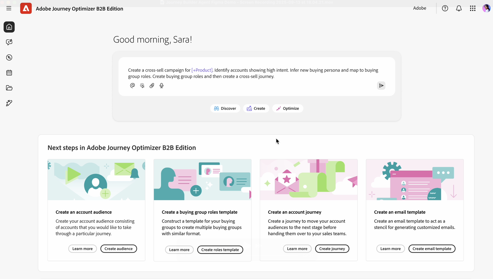
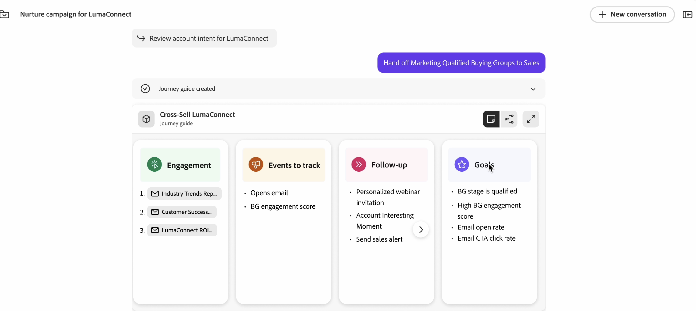

# B2B的Journey Build代理程式

Journey Builder Agent B2B是一種AI代理程式，可協助您透過自動化和資料導向建議進行歷程設計/建立、執行和最佳化。 適用於B2B的Journey Builder代理程式會自動執行建立新B2B歷程所需的時間，並縮短所需時間。

Journey Optimizer B2B edition中的Journey Agent解決B2B行銷人員目前面臨的三大挑戰：

* 處理日益複雜的客戶歷程（對象、內容和訊息及全通路的複雜性）
* 在預算緊縮的情況下提高效率
* 瞭解應如何建構最佳客戶歷程

Journey Builder代理程式B2B代理程式可用於產生和更新歷程：

* 建立 — 將行銷目標、產品、參與策略和KPI轉換為具有自動化和條件的個人化客戶歷程
* 建議 — 運用過去的行銷參與和其他歷史資料，將歷程建立最佳化
* 最佳化 — 根據預測或實際效能，分析、調整及最佳化作用中的歷程
* 管理 — 優先處理、管理和協調重疊的歷程和訊息傳送

## 基本用途

若要使用Journey Agent，請使用自然語言，在提示視窗中輸入您要建立的內容：

「建立B2B歷程，邀請決策者參加最有可能開啟新管道的參與帳戶路演。」

您可以提供的細節越多，回覆就越好。 如果您有描述事件或您的產品等的現有行銷資料，請將其貼到提示中，好讓Agent更能瞭解目標。

「擔任B2B歷程策略師，以建立多階段客戶帳戶歷程，在`Solution Name`的早期探索階段培養並吸引決策者及行銷人員參與。 目標是將匿名訪客轉換為已知連絡人、在`domain`.com上深化與相關內容的互動，並為`Product Name`銷售推廣主要合格的銷售機會。 使用電子郵件和付費媒體等管道，運用現有的受眾區段和內容。 建構4-6週期間跨意識、考量和評估階段的歷程，並為每個階段提供清晰的觸發器、操作和目標。 納入轉換率、參與分數和示範請求等KPI，並將輸出以結構化的歷程流程傳回。」

此詳細提示會提供：

* 清楚的意圖：您希望AI做什麼？ 明確關於任務或結果。
* 豐富內容：提供相關背景或限制。 儘可能加入範例或參照。
* 結構化格式：使用專案符號、編號步驟或範本。
* 角色指派：指定AI的角色 — 「擔任資料分析師……」

使用代理程式來迭代細分：開始簡單，然後根據結果調整提示。 回饋回圈可改善一段時間後的結果。

## 從文字檔或提示建立端對端B2B歷程（帳戶或個人歷程）。

Journey Agent可透過對話式體驗（而非傳統使用者介面），從自然語言文字提示和中繼資料產生端對端歷程流程（帳戶或個人歷程）。

端對端歷程提示範例：

* 建立跨管道歷程，培養過去30天未與我的內容互動的客戶。
* 建立歷程，藉由為最重要的購買群組角色提供個人化內容，將解決方案交叉銷售給意圖高且未開啟管道的客戶。
* 建立B2B歷程，邀請決策者在最有可能開啟新管道的參與帳戶中參加路演。
* 為意圖用於我的解決方案的空白帳戶建立歷程，著重於參與網站內容的人員。

## 多階段歷程

您可以充當B2B歷程設計人員，建立多階段客戶帳戶歷程，在探索階段的早期通知決策者和行銷人員。
目標是將匿名訪客轉化為已知聯絡人、深化與相關內容的互動，並努力取得銷售推廣的合格銷售機會。

* 使用管道（例如`Email`、`Paid media`、`Personalized web experiences`）來利用現有的受眾區段和內容。
* 在4-6週內跨`awareness`、`consideration`和`evaluation`階段建構歷程，並為每個階段設定明確的觸發器、動作和目標。
* 包含KPI （例如`conversion rates`、`engagement scores`和`demo requests`），並將輸出傳回為結構化的歷程流程。
