# 銷售限定詞

>[!NOTE]
>此功能目前處於「有限可用性」，並非所有使用者都可使用。
>

Sales Qualifier是Adobe Journey Optimizer B2B edition的AI驅動附加應用程式，其中包含Account Qualification Agent，旨在簡化業務開發代表(BDR)的工作流程。 Sales Qualifier可跨管道自動化潛在客戶資格、外聯及買方參與工作流程，減少手動BDR負載，並加快企業B2B公司的管道速度。
使用瀏覽器和電子郵件外掛程式，直接在CRM或Outlook中存取商業智慧。

銷售限定詞包含在AJO B2B中，但是AEP Experience Cloud中的獨立應用程式。

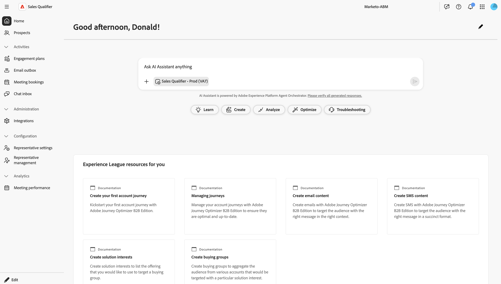

## Account Qualification 代理

Account Qualification Agent (AQA)是銷售限定詞的核心。 AQA會使用AI來讀取您的帳戶，並判斷哪些帳戶已準備好進行下一步。  它可協助研究、電子郵件草擬和CRM更新。

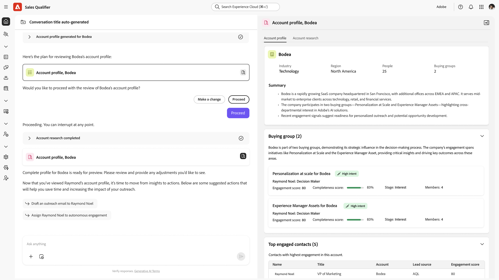

* **潛在客戶研究**

  使用自動擷取和顯示關鍵潛在客戶資訊（例如職稱、最近的參與、購買群組成員資格）來進行潛在客戶研究，以在幾秒鐘內提供完整的概況。

* **帳戶研究**

  使用自動擷取和顯示有關潛在客戶組織的詳細資訊來執行帳戶調查。 這些資訊包括公司重要資訊、最新消息、策略優先順序以及最常參與的成員。

* **草稿電子郵件**

  透過綜合潛在客戶與帳戶分析的研究來產生電子郵件草稿，以根據BDR的目標產生相關的個人化單一電子郵件內容。

* **參與計畫電子郵件**

  建立專案計畫電子郵件草稿，針對BDR定義的外聯步調的每個步驟進行個人化，確保整個順序都經過個人化

### 基本用途

Adobe AI代理程式使用&#x200B;_自然語言查詢_，這表示他們在文字提示中使用與您對個人說話相同的語言。 您越詳細，結果就越好。

使用自然語言時，您可以要求代理程式：

* 顯示我指派但尚未參與的銷售機會
* 顯示我所有不屬於任何自主參與的銷售機會
* 提供`<company>`的詳細摘要，包括他們的購買群組、最近的意圖訊號，以及我們過去的參與。

您可以立即瞭解哪些帳戶和潛在客戶最活躍，並顯示出最高的意圖，因此您可以將精力集中在最具影響力的地方。

精簡您的提示，以取得您需要的結果，藉此重複您的歷程。 例如：

* 從盈利電話或報告等內容草擬後續電子郵件繪圖。 最多120個字。 主旨列：吸引人，包含關鍵主題。 介紹：使用上下文來源中的直接引號進行連結。 內文：與痛點和價值主張連結。 CTA：建議撥打短線電話以進一步探索。

* 這封電子郵件的目標是開始交談並建立可信度。 草擬一份語氣不超過120字的電子郵件，並具備諮詢性和同理心。 請務必避免過於熟悉或銷售方式，請勿使用「希望您一切安好」、「登記使用」或「請」等詞語。

## 潛在客戶

此視窗會列出您有權存取的所有銷售機會。 這可快速檢查潛在客戶狀態和上次活動等。

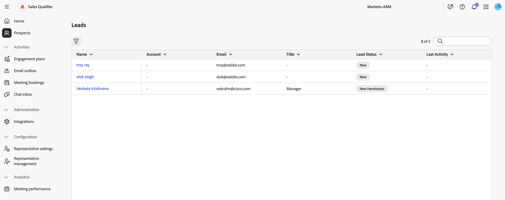

按一下「篩選」圖示以依潛在客戶狀態篩選。

## 參與計畫

此視窗會提供任何已定義「業務開發」計畫的詳細資訊。

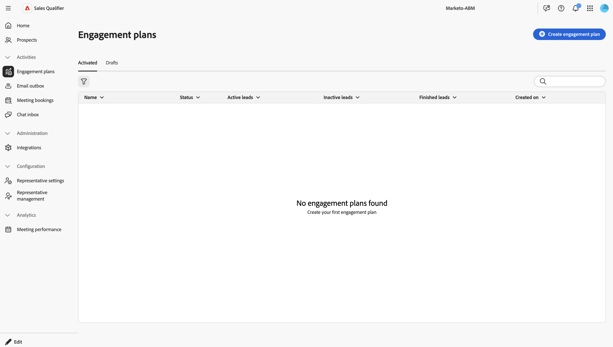

若要建立新的參與計畫，請按一下[建立參與計畫]。**&#x200B;**

1. 在「詳細資訊」階段中，提供名稱和選擇性說明。 按一下&#x200B;**[!UICONTROL 儲存並繼續]**。
1. 在「選取潛在客戶」階段中，選取應屬於此計畫的潛在客戶。
1. 在定義步調階段中，設定計畫的引數。
1. 在「預覽」階段中，確定一切都如預期般運作。

## 電子郵件寄件匣

「電子郵件」寄件匣面板會列出您已傳送的所有自動電子郵件。

## 會議預訂

此面板會顯示所有透過自動化設定的會議。

## 聊天收件匣

此面板會顯示您的所有聊天對話串。

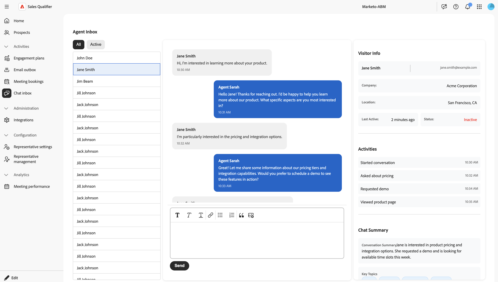

您不僅可以與使用者端互動，還可以檢視聯絡人的摘要和執行緒的摘要，以便快速瞭解您在執行緒中的位置。

## 整合

透過整合，銷售限定詞可運用CRM和其他資料來源來豐富客戶設定檔並挖掘銷售活動：

* 與您的電子郵件收件匣整合，以追蹤相關的傳入電子郵件並幫助產生回覆。
* 讀取和更新CRM資料，例如Salesforce或Microsoft®Dynamics、ZoomInfo或Buildwidth。

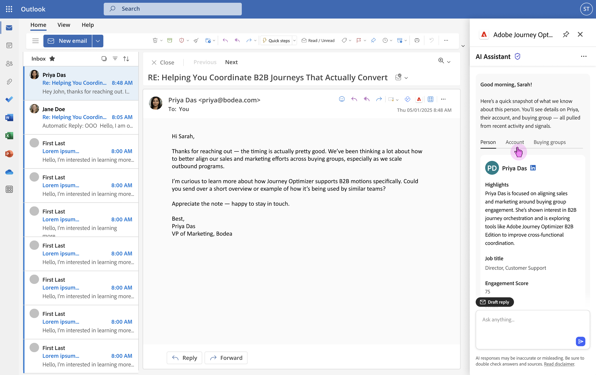

### 設定新整合

若要開始新的整合，請按一下右上方的&#x200B;**[!UICONTROL 建立整合]**。

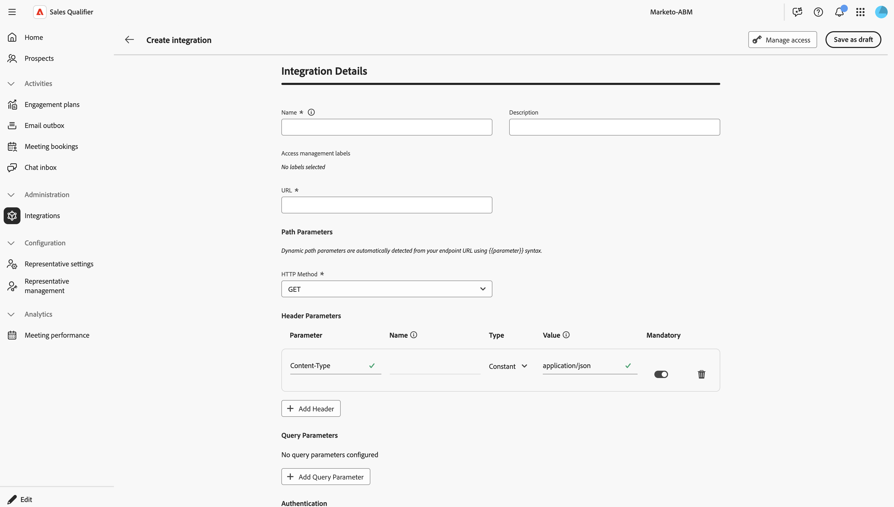

我們在此處定義整合的URL，並建立要傳送的裝載。

1. 提供整合的唯一名稱和說明（選用）。
1. 將URL欄位設定為整合網站的整合驗證端點。
1. 在路徑引數中，設定HTTP方法。
1. 在標頭引數中，設定需要傳送的任何HTTP標頭。 一般而言，所傳送且需要內容型別標頭的JSON物件。
1. 在查詢引數中，建立任何必要的引數。
1. 在「驗證」下，設定整合網站的登入資訊。

   * None
   * OAuth 2.0
   * API金鑰
   * 基本驗證

1. 在承載設定區段中設定節流和快取值。
1. 在「裝載設定」下，按一下鉛筆圖示。 在「貼上裝載」對話方塊中，貼上或輸入您的JSON裝載物件。
   * 請求裝載：包含要傳送整合網站之資料的JSON物件。
   * 回應裝載：您預期會傳回的資料結構。
1. 按一下[!UICONTROL 測試連線]以確保您的設定正確無誤。

當連線設定有效時，按一下&#x200B;**[!UICONTROL 另存為草稿]**。

當您回到主要整合表格時，請選取整合併按一下「**[!UICONTROL 啟用]**」讓整合上線，或&#x200B;**[!UICONTROL 儲存為草稿]**。

#### 管理存取權

您可以管理對使用者的存取權以及與不同使用者群組共用的資料型別。

按一下&#x200B;**[!UICONTROL 管理存取權]**&#x200B;以開啟[管理存取權]對話方塊。

此對話方塊會列出貴組織已建立的所有標籤。 選取您要套用至此整合的標籤。

如果您需要新標籤，請按一下&#x200B;**[!UICONTROL 建立標籤]**&#x200B;並填入：

* 名稱
* 易記名稱
* 說明

## 代表設定

您可以在此輸入自己的相關資訊：個人詳細資料、電子郵件和行事曆設定，以及聊天可用性。

### 詳細資料

您可以在「詳細資訊」標籤中輸入自己的相關資訊：

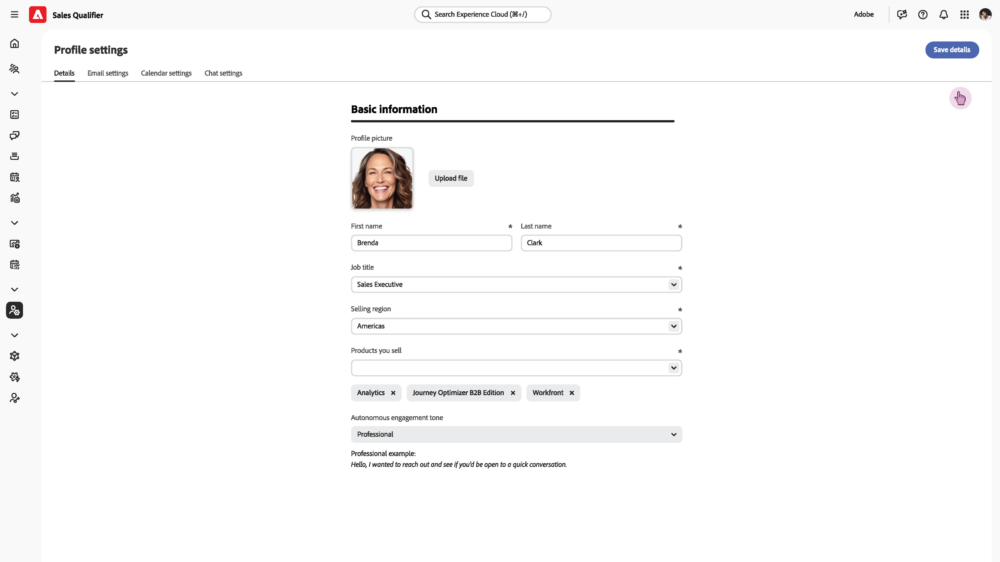

### 電子郵件設定

在電子郵件設定索引標籤中，設定您的電子郵件連線。

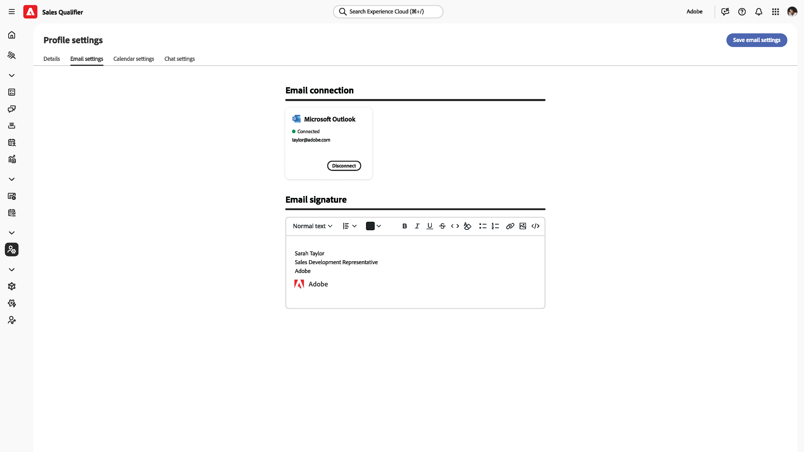

#### 電子郵件連線

按一下「**[!UICONTROL 連線]**」，然後依照Microsoft登入程式進行。

#### 電子郵件簽章

設定用於自動產生電子郵件的電子郵件簽名。

### 行事曆設定

在「行事曆設定」標籤中，設定您的時區與可用性。

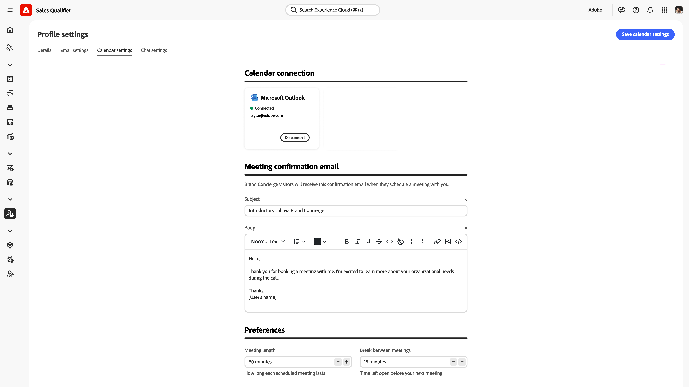

#### 行事曆連線

按一下&#x200B;**[!UICONTROL 連線]**，然後依照Microsoft登入程式來整合您的行事曆。

#### 會議確認電子郵件

當使用者端確認與您會面時，他們會收到確認電子郵件作為回覆。
使用這些設定來定義電子郵件主旨與內文。

#### 偏好設定

設定您的預設會議長度，以及您想在連續會議之間的時間。

### 聊天設定

在此索引標籤中，設定您的時區即時聊天可用性。

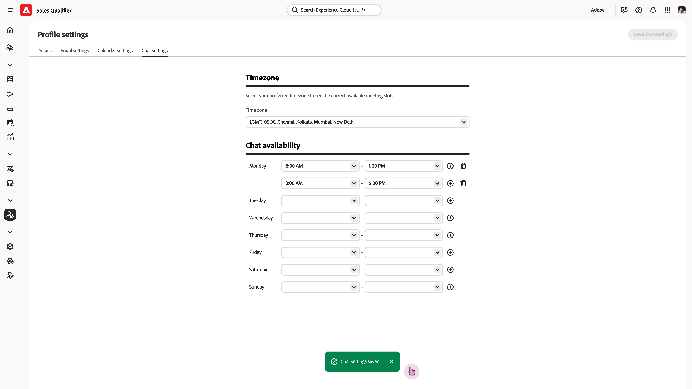

## 代表管理

此面板中會顯示一個表格，其中包含所有已定義的代表及其行事曆狀態。

## 會議績效

此面板會針對您完成的會議提供分析。

## 設定Chrome外掛程式

[Google市集](https://chromewebstore.google.com/detail/ai-assistant/hancbabllcmckehonngbdkhilocpdfji?authuser=0&hl=en)提供AI Assistant Chrome外掛程式。

在Chrome中安裝外掛程式後，當您在整合的網站上時，Adobe標誌會出現在中間右側：

* Adobe網頁應用程式
* Salesforce
* Outlook
* Microsoft Dynamics與網頁應用程式
* Google應用程式

## 編輯左側導覽列

在應用程式的左下方，按一下[編輯] **&#x200B;**&#x200B;來控制可在導覽中看到哪些圖示。 您也可以視需要拖放它們以重新排序。

## 示範影片

下列影片提供Sales Qualifier和Account Qualification Agent的簡短示範。

>[!VIDEO](https://video.tv.adobe.com/v/3476550)
