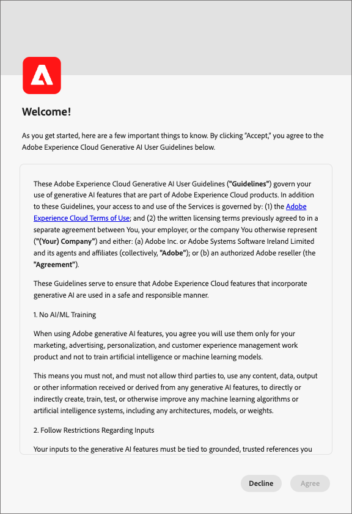
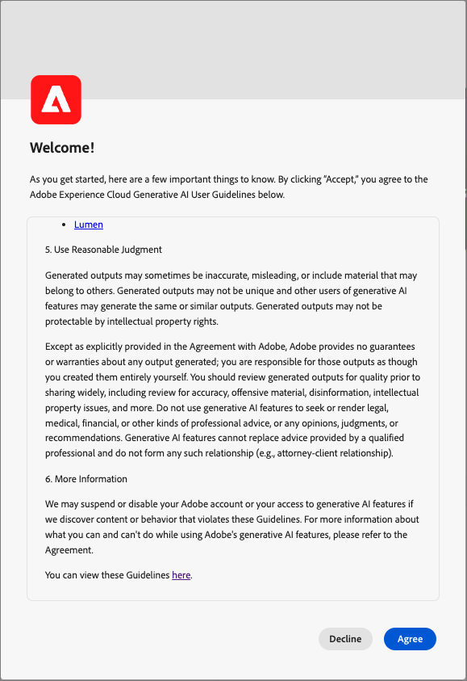

# Journey Optimizer B2B edition中的AI助理

Journey Optimizer B2B edition中的AI助理是從Adobe Experience Platform](https://experienceleague.adobe.com/zh-hant/docs/experience-platform/ai-assistant/home){target="_blank"}中[AI助理的相同技術基礎建立的。 這是一種對話式體驗，可用來加速Adobe Journey Optimizer B2B edition的工作流程。 您可以使用AI Assistant進一步瞭解產品功能、疑難排解問題，或透過資訊進行搜尋，並找到Journey Optimizer B2B edition的營運深入分析。

>[!IMPORTANT]
>
>您必須先與[使用者准則](https://www.adobe.com/tw/legal/licenses-terms/adobe-dx-gen-ai-user-guidelines.html)達成協定，才能在Journey Optimizer B2B edition中使用AI小幫手。 本合約也包含公開測試版合約，當您以測試版容量推出其他AI Assistant功能時，便可使用此功能。

+++檢視使用者合約介面

+++

## Journey Optimizer B2B edition中的AI助理功能

為了針對您提交的問題制定回應，AI Assistant會查詢資料庫，並將資料庫中的資料轉譯成人類看得懂的答案。 此回應是基礎資料的內部表示法，也稱為&#x200B;_**_知識圖表_**_，這是概念、資料及指定答案的中繼資料的完整網路。 「知識圖形」由每次提交查詢時所參考的子圖形組成：

* Experience League檔案。
* 運算成品，例如結構描述、欄位、對象和歷程。

在提交「AI助理員」查詢之前，請先考慮您需要的查詢型別：

### 產品知識

產品知識是指以Adobe Experience League上的Journey Optimizer B2B edition檔案為根據的概念和主題。 產品知識問題可進一步指定到下列子群組中：

| 產品知識 | 範例 |
| --- | --- |
| 點式學習 | <li>什麼是購買群組？ <li> 是否要顯示購買群組角色範本的範例？ |
| 開啟探索 | <li>建立購買群組的步驟為何？ <li>如何在購買群組角色範本中使用自訂欄位？ |
| 疑難排解 | <li>為什麼沒有為我的歷程建立購買群組？ <li>為什麼我在歷程中找不到要聆聽的體驗事件？ |

### 營運分析

_營運深入分析_&#x200B;參考由AI助理產生的中繼資料物件（屬性、帳戶對象、資料流、資料集、目的地、帳戶歷程、結構描述、來源、購買群組範本和解決方案興趣）相關答案。 這些見解包括計數、查閱和歷程影響。 他們不會檢視沙箱中的任何資料。

* 哪個帳戶對象的對象人數最多，該人數為何？
* 有多少帳戶對象從未在任何歷程中使用過？
* 哪些作用中歷程使用方案興趣&#x200B;_x_？

您可以在下列網域中向AI Assistant詢問有關您的營運見解的問題：

| 網域 | 支援的中繼資料 | 不支援的中繼資料 |
| --- | --- | --- |
| 屬性/欄位 | <li>屬性名稱搜尋 <li>屬性 — 結構描述關係 <li>屬性 — 資料集關係 <li>屬性 — 對象關係 <li>屬性 — 目的地關係 | <li>屬性類別 <li>稽核 <li>淘汰狀態 <li>標記 <li>儲存在屬性中的值 |
| 帳戶對象&#x200B;  **_注意：_**AJO B2B AI助理只能回答帳戶對象的對象問題，而Experience Platform AI助理只能回答個人對象的問題 | <li>客群計數 <li>對象型別（串流或批次） <li>建立/修改日期 <li>啟用狀態 <li>成員計數 <li>複製對象 <li>名稱和ID搜尋 | <li>客群重疊 <li>客群啟用 <li>稽核 <li>建立/修改 <li>標記 <li>成員資格趨勢 |
| 資料流 | <li>資料流計數 <li>資料流程狀態 <li>資料流 — 資料集關係 <li>資料流 — 來源關係 | <li>建立/修改 <li>資料流 — 批次關係 <li>擷取設定檔計數 |
| 資料集 | <li>資料集計數 <li>設定檔啟用狀態 <li>建立/修改日期 <li>資料集 — 結構描述關係 <li>資料集 — 對象關係 <li>資料集 — 屬性關係 <li>資料集 — 資料流關係 <li>名稱搜尋 <li>名稱和ID搜尋 | <li>稽核 <li>建立者 <li>資料集 — 批次關係 <li>資料集建立/修改 <li>資料集大小 <li>設定檔數 <li>列數 <li>值搜尋 |
| 目的地 | <li>設定的目的地計數 <li>目的地 — 對象關係 <li>目的地屬性關係 | <li>帳戶設定 <li>帳戶認證資訊 <li>啟用的不重複設定檔 |
| 歷程（帳戶歷程） | <li>計數 <li>名稱和ID搜尋 <li>歷程狀態 <li>建立/修改日期 | <li>屬性 — 歷程關係稽核 <li>建立/修改 <li>建立者 |
| 結構描述 | <li>結構描述計數 <li>建立/修改日期 <li>結構描述 — 屬性關係 <li>結構描述 — 資料集關係 <li>結構描述 — 對象關係 <li>設定檔啟用狀態 <li>名稱搜尋 <li>名稱和ID搜尋 | <li>稽核 <li>建立/修改 <li>建立者 <li>欄位群組 <li>身分識別 <li>身分識別命名空間 <li>標記 <li>設定檔數 |
| 來源 | <li>帳戶計數 <li>帳戶狀態 <li>每個帳戶的作用中/非作用中資料流 <li>Source聯結器 — 資料流關係 <li>Source帳戶 — 資料流關係 | <li>帳戶認證資訊 <li>帳戶設定資料擷取量度 <li>設定檔數來源 — 批次關係 |
| 購買群組範本 | <li>計數 <li>狀態 <li>角色 <li>名稱和ID搜尋 | <li>角色規則 |
| 解決方案興趣 | <li>計數 <li>狀態 <li>解決方案興趣 — 購買群組範本關係 <li>名稱和ID搜尋 | <li>解決方案興趣 — 購買群組關係 |

{style="table-layout:fixed"}

若是操作見解問題，答案可能不會反映UI的目前狀態。 支援這些問題的資料每24小時更新一次。 例如，使用者白天在Real-Time CDP中所做的變更會在夜間與資料存放區同步，然後早上就可供使用者提問。 登入沙箱以查詢與物件相關的特定資料。

### 功能範圍

目前，AI助理的範圍如下：

* **產品知識**： AI助理可以回答Real-Time Customer Data Platform和Adobe Journey Optimizer B2B edition的產品知識問題。

* **營運分析**：您可以詢問AI助理員問題，以獲得下列資料物件的營運分析：屬性、帳戶對象、資料流、資料集、目的地、帳戶歷程、結構描述、來源、購買群組範本和解決方案興趣。

### 隱私權、安全性和治理

Journey Optimizer B2B edition中的AI助理是透過隱私、安全性及控管而建置，並排在首位。 檢閱下列資訊，瞭解您可以期望從AI Assistant獲得的以客戶信任為中心的功能：

* AI助理目前未使用任何個人資料，即使用於訓練目的亦然。

* AI Assistant不知道客戶資料，例如人員、帳戶、機會和購買群組。

* 您必須有明確的許可權才能與AI助理互動。

   * 管理員可以使用[許可權UI](https://experienceleague.adobe.com/en/docs/experience-platform/access-control/abac/permissions-ui/permissions){target="_blank"}和[Admin Console](https://experienceleague.adobe.com/en/docs/experience-platform/access-control/ui/browse){target="_blank"}來設定許可權。

   * 許可權很細微，您的沙箱管理員可以設定哪些使用者可以提出不同的問題類別（使用AI Assistant的產品知識型問題或操作深入分析的問題）。

* 您可以透過30天保留原則檢視您先前與AI助理互動的記錄。

* AI助理在回應使用者提示時是以沙箱特定的資料和公共Adobe檔案為基礎。 資料不會跨沙箱共用。

* 您提供給AI助理的提示不會分享給其他客戶。

### 常見問題

以下是有關Journey Optimizer B2B edition中AI Assistant常見問題的回答清單。

**是否即時提供AI助理的資訊？**

AI助理回應中顯示的資料每天都會更新。 此週期表示回應中包含的資料可能會比使用者介面中回應時顯示的資料晚24小時。

**AI助理有哪些功能？**

AI Assistant可以解決Adobe產品知識查詢，並可回答與您的營運成品營運見解相關的問題。

**AI助理可以提供客戶資料的相關資訊嗎？**

不可以。 AI助理無法存取客戶資料，因此AI助理不會檢視或使用這些資料。

**我的個人資訊是否用於AI助理的訓練資料？**

AI助理不會將個人資訊用於訓練目的。 請勿向AI助理提供任何關於您自己（包括您的姓名或聯絡資訊）或任何其他方的個人資訊。

## 後續步驟

大致瞭解AI助理後，請繼續在工作流程中啟用並使用AI助理。 如需詳細資訊，請參閱下列檔案：

* [啟用 AI 助理存取權](./enable-ai-assistant-access.md)
* [問題指引](./question-guidance.md)
* [使用 AI 助理](./use-ai-assistant.md)
