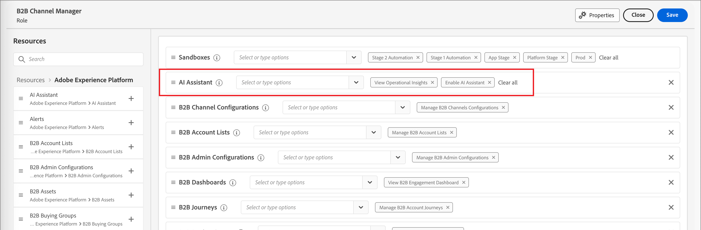
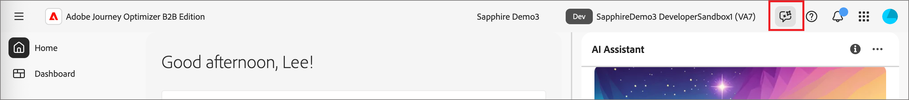

# 啟用 AI 助理存取權

>[!IMPORTANT]
>
>如果您在許可權UI中收到訊息，通知您組織必須首先同意其他法律條款才能存取AI助理，請聯絡您的Adobe帳戶團隊以取得指引。

下列引數可控管Journey Optimizer B2B edition中AI助理的存取權：

* **存取應用程式：**&#x200B;您可以在Adobe Journey Optimizer B2B edition中存取AI小幫手。

* **許可權：**&#x200B;使用[許可權UI](https://experienceleague.adobe.com/zh-hant/docs/experience-platform/access-control/abac/permissions-ui/permissions){target="_blank"}授與或撤銷您組織中AI助理的存取權。 若要使用AI小幫手，指定的使用者必須屬於設定了&#x200B;_[!UICONTROL 啟用AI小幫手]_&#x200B;和&#x200B;_[!UICONTROL 檢視作業分析]_&#x200B;許可權的角色。

身為管理員，您可以：

* 將&#x200B;**[!UICONTROL 啟用AI小幫手]**&#x200B;許可權新增至指定的角色，並將使用者新增至該角色。 此許可權為您組織中的使用者提供對AI助理的存取權。

* 將&#x200B;**[!UICONTROL 檢視作業分析]**&#x200B;許可權新增至指定的角色，並將使用者新增至該角色。 此許可權可讓使用者使用AI助理操作深入分析功能。

{width="800" zoomable="yes"}

使用許可權UI授與在Journey Optimizer B2B edition中使用AI助理的許可權。 如需有關存取Experience Platform和其他Experience Cloud應用程式中的AI助理的資訊，請參閱[Adobe Experience Platform檔案](https://experienceleague.adobe.com/zh-hant/docs/experience-platform/ai-assistant/access){target="_blank"}。

當使用者擁有必要的許可權時，他們可以存取AI助理，方法是選取您正在使用的應用程式頂端標題上的&#x200B;_AI助理_&#x200B;圖示。

應用程式標頭{width="800" zoomable="yes"}AI助理圖示

## AI助理存取總覽影片

觀看以下影片，瞭解如何為組織和使用者設定AI助理的存取權。

>[!VIDEO](https://video.tv.adobe.com/v/3475930/?captions=chi_hant&learn=on)

## 後續步驟

使用者存取AI Assistant後，即可在工作流程中使用此功能。 請參閱下列檔案：

* [問題指引](./question-guidance.md)
* [使用 AI 助理](./use-ai-assistant.md)
